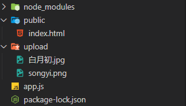

### Node 中文文档

http://nodejs.cn/api/

### Node 模块化

#### node 的模块化规范(common.js 模块化规范)

##### 规范内容

```
Node.js规定一个JavaScript文件就是一个模块，模块内部定义的变量和函数默认情况下在外部无法得到
模块内部可以使用exports对象进行成员导出， 使用require方法导入其他模块
```

##### 规范的实现

```
导入模块
    方法1: require('模块的路径及名字')
    方法2: let 变量 = require('模块的路径及名字');

导出模块
    方法1(推荐): module.exports.键 = 值
    方法2: exports.键 = 值
```

### Node 的模块化分类

#### 系统模块

定义: Node 运行环境提供的 API. 因为这些 API 都是以模块化的方式进行开发的, 所以我们又称 Node 运行环境提供的 API 为系统模块

##### fs 文件模块

可以读取、写入、创建

> 读取

```js
const fs = require("fs");
console.log(fs);
fs.readFile("./rede.js", "utf8", function (err, data) {
  // err代表错误对象,没错返回null,错了返回undefined
  console.log(err);
  // data代表数据对象,没错返回内容值
  console.log(data);
});
```

> 写入

```js
const fs = require("fs");
let content = "我写我写我写";
/* 如果没有write.txt会创建一个 */
fs.writeFile("./write.txt", content, function (err) {
  // 如果写入失败
  if (err != null) {
    console.log(err);
    return;
  }
  console.log("写入成功");
});
```

> 创建文件夹

```js
const fs = require("fs");
fs.mkdir(
  "./目录/二级目录",
  {
    recursive: true,
  },
  function (err) {
    if (err != null) {
      console.log(err);
      return;
    }
    console.log(err);
  }
);
```

##### path 路径

拼接路径、绝对路径

> 拼接路径
>
> 为啥拼接因为各个系统的文件目录表现形式不一样

```js
const path = require("path");

let finalPath = path.join("public", "upoload", "avatar");
console.log(finalPath);
```

> 绝对路径

```js
const path = require("path");

// 获取当前目录
console.log(__dirname);
let finalPath = path.join(__dirname, "read1.txt");

const fs = require("fs");
let content = "我也不知道写什么";
fs.writeFile(finalPath, content, function (err) {
  console.log("成功");
});

// 获取当前路径的上一级
console.log(path.resolve(__dirname, ".."));

fs.readFile(finalPath, "utf8", function (err, data) {
  if (err != null) {
    console.log(err);
    return;
  }
  console.log("成功");
});
```

##### http

> 创建 web 服务器
>
> 在 Node 中，并没有类似于'Apache'这样的软件来提供 Web 服务，但是我们使用 Node 中的内置模块 http，也可以实现一个 Web 服务器的功能，而且性能更高。

```js
//请求（require）Node.js自带的 http 模块，并且把它赋值给 http 变量。
const http = require("http");
const fs = require("fs");
//调用http模块提供的函数： createServer 。这个函数会返回一个对象，这个对象有一个叫做 listen 的方法
// 创建web服务器
const app = http.createServer();
app.on("request", function (req, res) {
  // req request  请求
  // res response 响应
  fs.readFile("./index.html", "utf8", function (err, data) {
    res.end(data);
  });
});
// 监听端口并启动服务
app.listen(80, function () {
  console.log("启动成功");
  console.log("http://localhost:80/");
});
```


##### querystring

>   接收POST请求的数据

~~~js
let http = require("http");

let querystring = require("querystring");
let app = http.createServer();
app.on("request", function (req, res) {
    res.writeHead(200, {
        "Content-Type": "text/html;charset=utf8"
    })

    let postDate = "";
    req.on("data", function (chunk) {
        postDate += chunk;
        console.log(postDate);
    })

    req.on("end", function () {
        let finalDate = querystring.parse(postDate);
        console.log(finalDate);
    })
    res.end();
}).listen(80, function () {
    console.log("http://localhost");
})
~~~


#### 第三方模块(自己写的)

定义: 别人写好的、具有特定功能的、我们能直接使用的模块即第三方模块，由于第三方模块通常都是由多个文件组成并且被放置在一个文件夹中，所以又名包。

查找包: https://www.npmjs.com/
安装包: npm install 包的名字
卸载包: npm unintall package 模块名称
更新包:npm update 包名

> 切换节点
>
> 需要使用 nrm 的第三方包

```
npm install nrm -g  //全局安装
nrm ls //查看节点
nrm use 节点名 //切换节点
nrm test //测试节点速度
nrm add 节点名  //添加节点
nrm del 节点名  //删除节点
```

> 保存自动运行 js nodemon

```js
nodemon js文件名
```


##### mime解析文件类型

>   解析文件的类型

~~~js
// 1.引入模块

const http = require('http');
const url = require('url');
const path = require('path');
const fs = require('fs');
const mime = require('mime');
const app = http.createServer();


app.on("request", (req, res) => {
    // 路径
    let pathname = url.parse(req.url).pathname;
    let absouleUrl = path.join(__dirname, pathname);
    fs.readFile(absouleUrl, "utf8", function (err, data) {
        if (err != null) {
            res.writeHead(404, {
                "Content-Type": "text/plain;charset=utf8"
            })
            res.end("没有找到页面");
            return;
        }
        let type = mime.getType(absouleUrl);
        console.log(type);
        res.writeHead(200, {
            "Content-Type": type
        })
        res.end(data);
    });
    // res.end()
}).listen(80, () => {
    console.log("http://localhost");
})
~~~

##### Multer文件上传中间件

>   详细文档[点我](https://blog.csdn.net/ssfz123/article/details/80255419)

Express默认并不处理HTTP请求体中的数据，对于普通请求体(JSON、二进制、字符串)数据，可以使用body-parser中间件。而文件上传(multipart/form-data请求)，可以基于请求流处理，也可以使用formidable模块或Multer中间件。

>   安装

```cmd
npm install multer --save
```


>   例子

-   服务端代码

```js
// 1.引入包
const express = require('express');
const path = require('path');
const multer = require('multer')

// 2.设置包
// 2.1 创建后台服务
const app = express();
// 2.2 设置静态资源目录
app.use(express.static(path.join(__dirname, 'public')))
// 2.3 设置文件上传的路径
let uploader = multer({
  storage: multer.diskStorage({
    // 确定上传的文件在哪里 cb: callback
    destination: (req, file, cb) => {
      cb(null, path.join(__dirname, 'upload'))
    },
    // 确定你上传之后的文件的名字
    filename: (req, file, cb) => {
      cb(null, file.originalname)
    }
  })
})
// 3.处理请求并响应
app.post('/profile', uploader.single('avatar'), function (req, res) {
  // req.file 是 `avatar` 文件的信息
  console.log(req.file)
  // req.body 将具有文本域数据，如果存在的话
})


// 4.指定端口并启动服务
app.listen(80, () => {
  console.log("服务器已启动，请访问: http://localhost");
})
```

-   前端代码

```html
<!DOCTYPE html>
<html lang="en">

<head>
  <meta charset="UTF-8">
  <meta name="viewport" content="width=device-width, initial-scale=1.0">
  <title>Document</title>
</head>

<body>
  <form action="/profile" method="POST" enctype="multipart/form-data">
    <!-- 上传头像 -->
    <input type="file" name="avatar">
    <input type="submit" value="按钮">
  </form>
</body>

</html>
```


-   文件目录




### 包的管理-package.json

> 创建 package.json

```cmd
npm init
```

> dependencies 项目依赖 就是开发中需要的包 线上也需要的包

```cmd
 npm install 包名  --save-dev
```

> package-lock.json

作用: 锁定包的版本，确保再次下载时不会因为包版本不同而产生问题
加快下载速度，因为该文件中已经记录了项目所依赖第三方包的树状结构和包的下载地址，重新安装时只需下载即可，不需要做额外的工作

### 模块的加载机制(理解)

#### 1.1 当模块拥有路径但没有后缀时

```javascript
require("./find");
```

1.require 方法根据模块路径查找模块，如果是完整路径，直接引入模块 2.如果模块后缀省略，先找同名 JS 文件再找同名 JS 文件夹 3.如果找到了同名文件夹，找文件夹中的 index.js 4.如果文件夹中没有 index.js 就会去当前文件夹中的 package.json 文件中查找 main 选项中的入口文件 5.如果找指定的入口文件不存在或者没有指定入口文件就会报错，模块没有被找到 // Cannot find module './moduleB'

#### 1.2 当模块没有路径且没有后缀时

```javascript
require("find");
```

1.Node 会假设它是系统模块
2.Node 会去 node_modules 文件夹中 3.首先看是否有该名字的 JS 文件 4.再看是否有该名字的文件夹 5.如果是文件夹看里面是否有 index.js 6.如果没有 index.js 查看该文件夹中的 package.json 中的 main 选项确定模块入口文件 7.否则找不到报错

### 服务器

#### 1.1 什么是 web 服务器

- 服务器(提供服务)指的就是一台安装特点软件的计算机，用于专门提供特定的服务
  - 按照服务类型的不同，又划分为:Web 服务器、数据库服务器、文件服务器等等
- 客户端(使用服务)指的是在一次服务过程中使用这个服务的设备(网络端点)。
  - 目前咱们最常见的客户端就是浏览器

我们手头上的这些网页，如果想要成为一个网站，首先要完成的第一件事情就是有一台公共的 Web 服务器，把这一系列的页面放到这台 Web 服务器上，让用户可以通过服务器的地址访问到这些网页。

我们手头上的电脑都可以是一台服务器，因为服务器是一个相对的概念，只要能提供服务就可以是一个服务器(提供服务的时候就是服务端，使用服务的时候就是客户端)。

#### 1.2C/S 架构与 B/S 架构(了解)

应用软件架构一般分为两类:

- B/S 架构: Browser(浏览器) <-- -->Server(服务器)，这种软件都是通过浏览器访问一个网站使用，服务器提供数据存储等服务
- C/S 架构: Client(客户端) <-- -->Server(服务器)，这种软件通过安装一个软件到电脑，然后使用，服务器提供数据存储等服务

B/S 的优点与缺点:

```txt
优点: 部署方便(不用安装)，可维护性强
缺点: 用户体验不好，不能针对每个用户的不同特点进行设置
```

C/S 的优点与缺点:

```txt
优点: 用户体验好
缺点: 部署不方便(需要安装)，可维护性弱
```

#### 1.3 请求响应的流程

```
1.用户打开浏览器
2.地址栏输入我们需要访问的网站地址(URL)
3.浏览器通过DNS服务器 获取即将访问的网站的IP地址
4.浏览器发起一个对这个IP地址的请求
5.服务端监听指定的 端口 的服务器软件接收到这个请求，进行相应的处理
6.服务端将处理完的结果返回给客户端浏览器(响应)
7.浏览器将服务端返回的结果呈现到界面上
```

```
网站地址: 花钱买的--> 域名是唯一的   阿里云
DNS服务器: 域名解析服务器
IP:  计算机在网络中的唯一地址 000.000.000.000-255.255.255.255 本机IP: 127.0.0.1 对应的域名:localhost

端口: 0-65535 总共有65536个端口号  22端口是ssh 80端口是网络  3306是数据库常用的端口 443是https的

IPv4:
IPv6:
```

### http 协议(理解记忆)

#### http 协议的概念

- 超文本传输协议（英文：HyperText Transfer Protocol，缩写：HTTP）规定了如何从网站服务器传输超文本到本地浏览器，它基于客户端服务器架构工作，是客户端（用户）和服务器端（网站）请求和应答的标准。

#### http 请求方式

- GET 请求 ---> 查
- POST 请求 ---> 增
- PUT 请求 ---> 改
- DELETE 请求 ---> 删

#### http 请求报文

请求方式 请求地址 协议/版本 --------------> 请求行

各种各样的请求头: ------------------------> 请求头
键:值

<!-- 浏览器告诉服务器 我能接受的文件格式是这些 -->

accept: 'text/html,application/xhtml+xml,application/xml;q=0.9,image/webp,image/apng,_/_;q=0.8,application/signed-exchange;v=b3;q=0.9',
请求内容: -------------------------------> 请求主体

key1=value1&keyw=value2

#### http 响应报文

协议/版本号 状态码 状态码的描述 ---------> 响应行

各种各样的响应头: -----------------------> 响应头
键:值
响应内容: ------------------------------> 响应主体

1xx 信息  
2xx 成功  
3xx 重定向
4xx 客户端错误
5xx 服务器错误

MIME 类型
格式: 大类型/具体类型
text/html
text/css
application/javascript
image/jpeg
image/png
image/gif
application/json

### http 请求与响应处理(重点) --用户登录

#### 通过 GET 方式把数据发送到后台

- 1.前端
- 1.1 创建一个页面
- 1.2 在 form 的 action 中写入要把这些数据交给哪个后台程序处理 --->地址
- 1.3 在 form 的 method 属性中声明请求方式 GET
- 1.4 在 input 中声明 name 属性
- 1.5 按钮务必是 submit

```html
<!DOCTYPE html>
<html lang="en">
  <head>
    <meta charset="UTF-8" />
    <meta name="viewport" content="width=device-width, initial-scale=1.0" />
    <title>Document</title>
  </head>
  <body>
    <!-- action 用户输入的内容让谁去处理 -->
    <!-- method 使用什么提交方式 -->
    <form action="http://localhost" method="GET">
      <input type="text" name="username" id="" />
      <input type="password" name="password" id="" />
      <input type="submit" value="登录" />
    </form>
  </body>
</html>
```

- 2.后端
- 2.1 在监听请求事件中 获取 req.url 那就是前端传过来的数据

```js
// 1.引入http模块
const http = require("http");
const url = require("url");

// 2.使用http模块创建服务
let app = http.createServer();

// 3.监听浏览器的request事件 处理请求并响应内容
// req 代表请求对象
// res 代表响应对象
app.on("request", (req, res) => {
  // 为了解决乱码
  res.writeHead(200, {
    "Content-Type": "text/html;charset=utf8",
  });
  // 打印请求地址的
  //   console.log(req.url);
  // 为了拿到对象形式的前端用户写的数据
  let params = url.parse(req.url, true);
  //   console.log(params);
  // console.log(params.query.username, params.query.password);

  if (params.query.username == "tom" && params.query.password == "123456") {
    res.write("欢迎您" + params.query.username);
  } else {
    res.write("账号或密码错误,请您去注册");
  }
  res.end();
});

// 4.监听指定的端口 启动服务
app.listen(80, () => {
  // http://127.0.0.1
  console.log("请访问: http://localhost");
});
```

#### 通过 POST 方式把数据发送到后台

- 1.前端
- 1.1 创建一个页面
- 1.2 在 form 的 action 中写入要把这些数据交给哪个后台程序处理 --->地址
- 1.3 在 form 的 method 属性中声明请求方式 POST
- 1.4 在 input 中声明 name 属性
- 1.5 按钮务必是 submit
- 2.后端
- 2.1 通过 post 方式发送的数据不用 url 的方式把数据变成对象 要用 querystring


```js
// 1.引入http模块
const http = require('http');
const querystring = require('querystring');

// 2.使用http模块创建服务
let app = http.createServer();

// 3.监听浏览器的request事件 处理请求并响应内容
// req 代表请求对象
// res 代表响应对象
app.on('request', (req, res)=>{
    // 为了解决乱码
    res.writeHead(200, {
        'Content-Type': 'text/html;charset=utf8'
    })
    let postData ='';
    // data事件-->监听数据传输事件
    req.on('data', (chunk)=>{
        // 传输一点儿 拼接一点
        // console.log(chunk);
        postData +=chunk;
    })
    // end事件
    req.on('end', ()=>{
        console.log(postData);
        let finalData = querystring.parse(postData);
        console.log(finalData);
        // body-parser 直接获取到post请求的数据
    })
})


// 4.监听指定的端口 启动服务
app.listen(3000, ()=>{
    // http://127.0.0.1
    console.log("请访问: http://localhost:3000")
})
```


#### 路由

http://localhost:3000/index
http://localhost:3000/login
路由是指客户端请求地址与服务器端程序代码的对应关系。简单的说，就是请求什么响应什么。

```js
// 1.引入http模块
const http = require('http');
const url = require('url');

// 2.使用http模块创建服务
let app = http.createServer();

// 3.监听浏览器的request事件 处理请求并响应内容
// req 代表请求对象
// res 代表响应对象
app.on('request', (req, res)=>{
       // 为了解决乱码
       res.writeHead(200, {
        'Content-Type': 'text/html;charset=utf8'
    })
    // console.log(req.url);
    // 当url中掺杂参数 的时候 必须使用pathname来做
    let pathname = url.parse(req.url).pathname;
    console.log(pathname);
    // 首页
    if (pathname == '/'||pathname== '/index') {
        res.end(`
        <!DOCTYPE html>
<html lang="en">
<head>
    <meta charset="UTF-8">
    <meta name="viewport" content="width=device-width, initial-scale=1.0">
    <title>Document</title>
</head>
<body>
    <h1>首页</h1>
    <a href="/login?username=zhansan&password=123456">登录页面</a>
</body>
</html>`); 
    }
    // 列表页
    if (pathname == '/list') {
        res.end("列表页"); 
    }
    // 文章页
    if (pathname == '/article') {
        res.end("文章页"); 
    }
    // 登录页面
    if (pathname == '/login') {

        console.log(url.parse(req.url,true).query)
        res.end("登录页面"); 
    }
})


// 4.监听指定的端口 启动服务
app.listen(80, ()=>{
    // http://127.0.0.1
    console.log("请访问: http://localhost")
})
```

### 静态目录

#### 需求:

浏览器地址栏 http://localhost:80/public/default.html?a=1&b=tom
响应的是 /public/default.html
如果输入错误 那么返回 找不到该文件

##### 思路:

1.获取地址栏里面的url
2.处理url 把url中的/public/default.html拿出来
3.通过fs模块的readFile把default.html文件读取出来 响应给浏览器


```js
// 1.引入模块

// 1.1 引入http模块
const http = require('http');
// 1.2 引入url模块
const url = require('url');
// 1.3 引入path
const path = require('path');
// 1.4 引入fs模块
const fs = require('fs');
// 1.5 引入mime模块 --作用: 识别 并分析 文件的MIME类型
const mime = require('mime');
// 2.使用http模块提供的方法创建服务
const app = http.createServer();


// 3.监听客户端的request事件 处理请求并响应内容
app.on('request', (req, res)=>{
    // 需求: 浏览器地址栏 http://localhost/public/default.html?a=1&b=tom
    // 响应的是 /public/default.html
    // 如果输入错误 那么返回 找不到该文件

    // 3.1 获取地址栏中的url
    // console.log(req.url)  /public/default.html?a=1&b=tom
    let pathname = url.parse(req.url).pathname;
    // console.log(pathname); /public/default.html

    let absolutePath = path.join(__dirname,pathname);
    // console.log(absolutePath); E:\FullStack\day80-Node基础\code\static\public\default.html

    fs.readFile(absolutePath, (err, data) =>{
        // 如果路径错误 返回Not Found
        if (err != null) {
            res.writeHead(404, {
                'Content-Type': 'text/plain;charset=utf8'
            })
            res.end("Not Found");
            return;
        }

        let type = mime.getType(absolutePath);
        // console.log(type);
        // 如果路径正确 返回内容
        res.writeHead(200, {
            'Content-Type': type
        })
        res.end(data);
    })

})

// 4.指定端口 启动服务
app.listen(80, ()=>{
    console.log("请打开 http://localhost")
})
```


### Express介绍 -- Node的服务框架


Express中文网

基于 Node.js 平台，快速、开放、极简的 Web 开发框架

Express 是一个简洁而灵活的 node.js Web应用框架, 提供了一系列强大特性帮助你创建各种 Web 应用，和丰富的 HTTP 工具。

使用 Express 可以快速地搭建一个完整功能的网站。

Express 框架核心特性：

可以设置中间件来响应 HTTP 请求。
定义了路由表用于执行不


#### Express的基本使用 --简化服务的创建

```js
// 1.引入框架模块
const express = require('express');
// 2.使用框架模块创建服务
const app = express();

// 3.请求的时候 返回数据(中间件)
app.use((req, res) =>{
    // res.write("你好");
    // res.end()
    res.send("你好");
})


// 4.指定服务端口号 并启动服务
app.listen(80, ()=>{
    console.log("服务启动: http://localhost")
})

```


#### 接收GET和POST的不同的请求 --简化前面的GET或POST请求

##### 受POST请求的参数

```js
// 1.设置中间件
app.use(express.urlencoded())
// 2.使用req.body获取POST请求的参数
app.post('/login', (req, res) =>{
    console.log(req.body); // { username: 'jerry' }
    
})
```


#### express.static托管静态页面 -- 简化静态目录


```js
// 1.引入框架模块
const express = require('express');
// 2.使用框架模块创建服务
const app = express();

// 想让哪个文件夹作为静态目录,那么就在第一个参数中写文件夹的名字 添加/  后面的写文件夹的名字

app.use('/public', express.static('public')); //这句话是重点

// 4.指定服务端口号 并启动服务
app.listen(80, ()=>{
    console.log("服务启动: http://localhost")
})

```


#### Express中间件(了解)

概念:中间件就是一堆方法，可以接收客户端发来的请求、可以对请求做出响应，也可以将请求继续交给下一个中间件继续处理。
分类: 第三方中间件、开发者自己写的
组成: 中间件主要由两部分构成，中间件方法以及请求处理函数(只指的是express)。


##### app.use()的两种使用方法


```js

// app.use的两种用法
// app.use 匹配所有的请求方式，可以直接传入请求处理函数，代表接收所有的请求。
// app.use 第一个参数也可以传入请求地址，代表不论什么请求方式，只要是这个请求地址就接收这个请求。


// 引入Express框架
const express = require('express');
// 使用框架创建web服务器
const app = express();
// 当客户端以get方式访问/路由时

app.use((req, res, next) => {
  console.log("111112323");

  next();
})

// 如果用use的话 get请求能接受 post能接受
app.use('/', (req, res) => {
  console.log("我是路由 / 的请求");
  res.send("我是路由 / 的请求")
})

// 程序监听3000端口
app.listen(3000);


// 不要用use来接受请求
// 1.有的时候 同意的路由 因为请求方式不同 结果是不同的
```


##### 应用

路由保护，客户端在访问需要登录的页面时，可以先使用中间件判断用户登录状态，用户如果未登录，则拦截请求，直接响应，禁止用户进入需要登录的页面。
网站维护公告，在所有路由的最上面定义接收所有请求的中间件，直接为客户端做出响应，网站正在维护中。
自定义404页面


```js
const express = require('express')
const app = express()
const port = 80
app.use("/admin", (req, res, next) => {
  let islogin = false;
  if (islogin) {
    next();
  } else {
    res.send("你没有登录")
  }
})
app.use((req, res, next) => {
  res.status(404).send("404错误")
})

app.get("/admin", (req, res) => {
  res.send("你已经登录")
})

app.listen(port, () => console.log(`http://localhost`))
```


##### 错误中间件

```js
// 引入Express框架
const express = require('express');
// 使用框架创建web服务器
const app = express();
const fs = require('fs');
// 当客户端以get方式访问/路由时
app.get('/index', (req, res, next) => {
  // 有一个内置对象 错误对象Error
  // 抛异常(开发时异常 尽量自己解决 运行时异常 抛)
  // throw new Error("程序发生未知错误");
  fs.readFile('./01.t0xt', 'utf8', (err, result) => {
    if (err != null) {
      // next把err错误传递给下一个中间件,下一个中间件输出错误
      next(err);
    } else {
      res.send(result);
    }
  })
})


// app.use就会拦截所有的请求
app.use((err, req, res, next) => {
  // console.log(err.message);
  res.status(500).send(err.message);
})

// 程序监听3000端口
app.listen(80);
```


### 参数获取(总结)


#### GET请求(参数都在url中)

>   例
>
>   http:// 域名||IP:端口?
>
>   key=value&key1=value1&key2=value2

```js
// 获取值的方法
req.query
```


>   http:// 域名||IP:端口/a/b/c

```js
// 路由定义
app.get("helloworld/:id/:age",(req,res)>{
    // 获取参数
    req.parms();
})
```


#### 其他请求(POST、DELETE、PUT)

```js
// 设置中间件
app.use(express.urlencoded({extended:false}))

// 获取值
req.body
```


### 后端模板引擎 express-art-Template


#### 使用流程


1.  指定该应用什么文件和什么模板引擎

    ```js
    app.engine("模板的后缀(一般为art)",requie("express-art-template"));
    ```

2.  设置模板在哪里

    ```js
    app.set("views",path.join(__dirname,"views"));
    ```

3.   设置引擎

    ```js
    app.set("view engine","art(这里要和第1的后缀一样)")
    ```

    

4.  使用

    ```js
    const express = require('express')
    const path = require('path');
    const app = express()
    const port = 80
    
    app.use(express.static("public"))
    
    
    // view engine setup
    app.engine('art', require('express-art-template'));
    app.set('views', path.join(__dirname, 'views'));
    app.set('view engine', 'art');
    
    
    app.get("/", (req, res) => {
    
      res.render("index", {
        title: "首页"
      })
    })
    
    
    app.listen(port, () => console.log(`Example app listening on port port!`))
    ```

      

    模板代码

    ```art
    <!DOCTYPE html>
    <html lang="en">
    
    <head>
      <meta charset="UTF-8">
      <meta name="viewport" content="width=device-width, initial-scale=1.0">
      <title>{{title}}</title>
    </head>
    
    <body>
    	// 如果服务端设置了静态目录直接忽略目录文件名访问就行
    	// 例 <script src="../public/01.js"></script> 写成以下的形式
      <script src="/01.js"></script>
    </body>
    
    </html>
    ```


#### 共享数据

```ks
app.locals.user = {
  name: "张三",
  age: 18
}
```

```html
<h1>我叫{{user.name}},我今年{{user.age}}岁了</h1>
```

