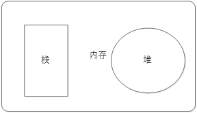

## js的组成

-   JavaScript
    -   ECMAScript语法
    -   DOM页面文档对象模型
    -   BOM浏览器对象模型

## JavaScript注释

### 单行注释

```js
// 我是一行文字，不想被 JS引擎 执行，所以 注释起来	
```

### 多行注释

```js
/*
  你看
  233
*/
```

## JavaScript输入输出语句

为了方便信息的输入输出，JS中提供了一些输入输出语句，其常用的语句如下：

| 方法             | 说明                           | 归属   |
| ---------------- | ------------------------------ | ------ |
| alert(msg)       | 浏览器弹出警示框               | 浏览器 |
| console.log(msg) | 浏览器控制台打印输出信息       | 浏览器 |
| prompt(info)     | 浏览器弹出输入框，用户可以输入 | 浏览器 |

- 注意：alert() 主要用来显示消息给用户，console.log() 用来给程序员自己看运行时的消息。

## 变量的概念

### 什么是变量

变量是用于存放数据的容器。 我们通过 变量名 获取数据，甚至数据可以修改

### 变量在内存中的存储

本质：变量是程序在内存中申请的一块用来存放数据的空间。

## 变量的使用

### 声明变量

```js
//  声明变量  
var age; //  声明一个 名称为age 的变量   
//var是关键字  age是变量名
```

### 赋值

```js
age = 10; // 给 age  这个变量赋值为 10
```

### 变量命名规范

规范：

- 由字母(A-Za-z)、数字(0-9)、下划线(_)、美元符号( $ )组成，如：usrAge, num01, _name
- 严格区分大小写。var app; 和 var App; 是两个变量
- 不能 以数字开头。  18age   是错误的
- 不能 是关键字、保留字。例如：var、for、while
- 变量名必须有意义。 MMD   BBD        nl   →     age  
- 遵守驼峰命名法。首字母小写，后面单词的首字母需要大写。myFirstName

## 关键字和保留字

### 标识符

```text
标识(zhi)符：就是指开发人员为变量、属性、函数、参数取的名字。

标识符不能是关键字或保留字。
```


### 关键字

```text
关键字：是指 JS本身已经使用了的字，不能再用它们充当变量名、方法名。

包括：break、case、catch、continue、default、delete、do、else、finally、for、function、if、in、instanceof、new、return、switch、this、throw、try、typeof、var、void、while、with 等。
```


### 保留字

```text
保留字：实际上就是预留的“关键字”，意思是现在虽然还不是关键字，但是未来可能会成为关键字，同样不能使用它们当变量名或方法名。

包括：boolean、byte、char、class、const、debugger、double、enum、export、extends、fimal、float、goto、implements、import、int、interface、long、mative、package、private、protected、public、short、static、super、synchronized、throws、transient、volatile 等。

注意：如果将保留字用作变量名或函数名，那么除非将来的浏览器实现了该保留字，否则很可能收不到任何错误消息。当浏览器将其实现后，该单词将被看做关键字，如此将出现关键字错误。
```

## js运算符

### 算术运算符

设:y=5

| 运算符 | 描述         | 例子             | x 运算结果 | y 运算结果 |
| :----- | :----------- | :--------------- | :--------- | :--------- |
| +      | 加法         | x=y+2            | 7          | 5          |
| -      | 减法         | x=y-2            | 3          | 5          |
| *      | 乘法         | x=y*2            | 10         | 5          |
| /      | 除法         | x=y/2            | 2.5        | 5          |
| %      | 取模（余数） | x=y%2            | 1          | 5          |
| ++     | 自增         | x=++y<br />x=y++ | 6<br />5   | 6<br />6   |
| --     | 自减         | x=--y<br />x=y-- | 4<br />5   | 4<br />4   |

### 赋值运算符

设**x=10** 和 **y=5**

| 运算符 | 例子 | 等同于 | 运算结果 |
| :----- | :--- | :----- | :------- |
| =      | x=y  |        | x=5      |
| +=     | x+=y | x=x+y  | x=15     |
| -=     | x-=y | x=x-y  | x=5      |
| *=     | x*=y | x=x*y  | x=50     |
| /=     | x/=y | x=x/y  | x=2      |
| %=     | x%=y | x=x%y  | x=0      |

### 逻辑运算符

| 逻辑运算符 | 说明                 | 案例          |
| ---------- | -------------------- | ------------- |
| &&         | 逻辑与,and,一假为假  | true&&false   |
| \|\|       | 逻辑或,or,一真为真   | true\|\|false |
| !          | 逻辑非,真为假,假为真 | !true         |

#### 逻辑中断(短路运算)

1.表达式1 || 表达式2
如果表达式1 为真 返回表达式1
如果表达式1 为假 返回表达式2

```js
var num = 1 || 2;
console.log(num); //1
```

2.表达式1 && 表达式2
如果表达式1为真，判断表达式2 是否为真 若为真 则返回表达式2 若为假 则返回表达式2
如果表达式1为假 直接返回表达式1

```js
var a= 1&&2;
console.log(a) //2
```

### 运算优先级

​	

| 优先级 | 运算符                                                | 说明                                                    | 结合性                     |
| ------ | ----------------------------------------------------- | ------------------------------------------------------- | -------------------------- |
| 1      | `[]`、`.`、`()`                                       | 字段访问、数组索引、函数调用和表达式分组                | 从左向右                   |
| 2      | ++ -- -~!delete new typeof void                       | 一元运算符、返回数据类型、对象创建、未定 义的值         | 从右向左                   |
| 3      | *、/、%                                               | 相乘、相除、求余数                                      | 从左向右                   |
| 4      | +、-                                                  | 相加、相减、字符串串联                                  | 从左向右                   |
| 5      | <<、>>、>>>                                           | 左位移、右位移、无符号右移                              | 从左向右                   |
| 6      | <、<=、>、>=、instanceof                              | 小于、小于或等于、大于、大于或等于、是否 为特定类的实例 | 从左向右                   |
| 7      | ==、!=、===、!==                                      | 相等、不相等、全等，不全等                              | 从左向右                   |
| 8      | &                                                     | 按位“与”                                                | 从左向右                   |
| 9      | ^                                                     | 按位“异或”                                              | 从左向右                   |
| 10     | \|                                                    | 按位“或”                                                | 从左向右                   |
| 11     | &&                                                    | 短路与（逻辑“与”）                                      | 从左向右                   |
| 12     | \|\|                                                  | 短路或（逻辑“或”）                                      | 从左向右                   |
| 13     | ?:                                                    | 条件运算符                                              | 从右向左                   |
| 14     | =、+=、-=、*=、/=、%=、&=、\|=、^=、<、<=、>、>=、>>= | 混合赋值运算符                                          | 从右向左                   |
| 15     | ,                                                     | 多个计算                                                | 按优先级计算，然后从右向左 |


## if语句

```js
// 条件成立执行代码，否则什么也不做
if (条件表达式) {
    // 条件成立执行的代码语句
}
```

```js
// 条件成立  执行 if 里面代码，否则执行else 里面的代码
if (条件表达式) {
    // [如果] 条件成立执行的代码
} else {
    // [否则] 执行的代码
}

```

```js
// 适合于检查多重条件。
if (条件表达式1) {
    语句1；
} else if (条件表达式2)  {
    语句2；
} else if (条件表达式3)  {
   语句3；
 ....
} else {
    // 上述条件都不成立执行此处代码
}

```

## 三元表达式

```js
表达式1 ? 表达式2 : 表达式3;
如果表达式1为 true ，则返回表达式2的值，如果表达式1为 false，则返回表达式3的值
```

## SWITCH语句

```js
switch( 表达式 ){ 
    case value1:
        // 表达式 等于 value1 时要执行的代码
        break;
    case value2:
        // 表达式 等于 value2 时要执行的代码
        break;
    default:
        // 表达式 不等于任何一个 value 时要执行的代码
}
注意： 执行case 里面的语句时，如果没有break，则继续执行下一个case里面的语句。
```

## for循环

```js
for(初始化变量; 条件表达式; 操作表达式 ){
    //循环体
}
//当不满足条件表达式的时候跳出循环
```

## while循环

```js
while (条件表达式) {
    // 循环体代码 
}
//当不满足条件表达式的时候跳出循环
```

## do-while循环

```js
do {
    // 循环体代码 - 条件表达式为 true 时重复执行循环体代码
} while(条件表达式);
// 无论是否满足条件表达式都会执行一次
```

##  continue、break

-   continue 关键字用于立即跳出本次循环，继续下一次循环（本次循环体中 continue 之后的代码就会少执行一次）。
-    break 关键字用于立即跳出整个循环（循环结束）。


## 数组

### 创建数组

```js
// 利用  new 创建数组  
var 数组名 = new Array() ；
var arr = new Array();   // 创建一个新的空数组

// 利用数组字面量创建数组
// 使用数组字面量方式创建空的数组
var  数组名 = []；
// 使用数组字面量方式创建带初始值的数组
var  数组名 = ['小白','小黑','大黄','瑞奇'];
```

###　数组的方法

- **arr.push()**从后面添加元素，返回值为添加完后的数组的长度

~~~js
let arr=[1,2,3,4,5];
console.log(arr.push(7));//返回的数组长度是 6
console.log(arr);//[1,2,3,4,5,7]
~~~

- **arr.pop() **从后面删除元素，只能是一个，返回值是删除的元素

~~~js
let arr=[1,2,3,4,10];
console.log(arr.pop());//返回的是删除的元素 10 
console.log(arr);// [1,2,3,4]
~~~

- **arr.shift() **从前面删除元素，只能删除一个 返回值是删除的元素

~~~js
let arr=[1,2,3,4,10];
console.log(arr.shift());//返回的是删除的元素 1
console.log(arr);//[2,3,4,10]
~~~

- **arr.unshift() **从前面添加元素, 返回值是添加完后的数组的长度

~~~js
let arr = [1,2,3,4,5]
console.log(arr.unshift(20)) // 返回值是添加后的数组长度 6 
console.log(arr)  //[20,1,2,3,4,5]
~~~

- **arr.splice(i,n) **删除从i(索引值)开始之后的那个元素。返回值是删除的元素

~~~js
let arr = [1,2,3,4,5]
console.log(arr.splice(2,2))// 返回的是剪切后的数组 [3,4]
console.log(arr) // [1,2,5]
~~~

- **arr.concat() **连接两个数组 返回值为连接后的新数组

~~~js
let arr = [1,2,3,4,5]
console.log(arr.concat([1,2])) // 返回的是合并后的数组 [1,2,3,4,5,1,2]
console.log(arr) // [1,2,3,4,5]
~~~

- **str.split()** 将字符串转化为数组

~~~js
let str = '123456'
console.log(str.split('')) // ["1", "2", "3", "4", "5", "6"]
~~~

- **arr.sort() **将数组进行排序,返回值是排好的数组，默认是按照最左边的数字进行排序，不是按照数字大小排序的，见例子。

~~~js
let arr = [2,10,6,1,4,22,3]
console.log(arr.sort())   // [1, 10, 2, 22, 3, 4, 6]
let arr1 = arr.sort((a, b) =>a - b)  
console.log(arr1)   // [1, 2, 3, 4, 6, 10, 22]
let arr2 = arr.sort((a, b) =>b-a)  
console.log(arr2)  // [22, 10, 6, 4, 3, 2, 1]

let a=arr.sort( function(a,b){return a-b})
console.log(a);
~~~

- **arr.reverse() **将数组反转,返回值是反转后的数组

~~~js
let arr = [1, 2, 3, 5, 69, 50];
console.log(arr.reverse());//[ 50, 69, 5, 3, 2, 1 ]
console.log(arr);//[ 50, 69, 5, 3, 2, 1 ]
~~~

- **arr.slice(start,end) **切去索引值start到索引值end的数组，不包含end索引的值，返回值是切出来的数组

~~~js
let arr = [1,2,50,4,5]

console.log(arr.slice(0,3));//[1,2,50]
console.log(arr);//[1,2,50,4,5]

~~~

- **arr.indexOf()** 查找某个元素的索引值，若有重复的，则返回第一个查到的索引值若不存在，则返回 -1

~~~js
let arr=[1,5,6,1,0,2]

console.log(arr.indexOf(6)); //返回索引2
~~~

- **Array.from() **将伪数组变成数组，就是只要有length的就可以转成数组。 ---es6

~~~js
let str="643431231";

console.log(Array.from(str)); //[ '6', '4', '3', '4', '3', '1', '2', '3', '1' ] 
console.log(str); //643431231
~~~

- **arr.includes() **判断数中是否包含给定的值

~~~js
let arr=[4,25,6,9,1,0];
console.log(arr.includes(4));//true
console.log(arr.includes(100));//false
~~~

## 函数

-   就是**封装了一段可被重复调用执行的代码块**。通过此代码块可以**实现大量代码的重复使用**。  

```js
// 声明函数
function 函数名() {
    //函数体代码
}
// 调用函数
函数名();
```

### arguments的使用

当不确定有多少个参数传递的时候，可以用 arguments 来获取。JavaScript 中，arguments实际上它是当前函数的一个内置对象。所有函数都内置了一个 arguments 对象，arguments 对象中存储了传递的所有实参。arguments展示形式是一个伪数组，因此可以进行遍历。伪数组具有以下特点：

- 具有 length 属性

- 按索引方式储存数据

- 不具有数组的 push , pop 等方法

    注意：在函数内部使用该对象，用此对象获取函数调用时传的实参。

### 检测是否为数组

- instanceof 运算符

    - instanceof 可以判断一个对象是否是某个构造函数的实例

        ```js
        var arr = [1, 23];
        var obj = {};
        console.log(arr instanceof Array); // true
        console.log(obj instanceof Array); // false
        ```

- Array.isArray()

    - Array.isArray()用于判断一个对象是否为数组，isArray() 是 HTML5 中提供的方法

        ```js
        var arr = [1, 23];
        var obj = {};
        console.log(Array.isArray(arr));   // true
        console.log(Array.isArray(obj));   // false
        ```

## 对象

-   为什么需要对象？

保存一个值时，可以使用变量，保存多个值（一组值）时，可以使用数组。

  	如果要保存一个人的完整信息呢？
  	
  	例如，将“张三疯”的个人的信息保存在数组中的方式为：

```js
var obj = {
    "name":"张三疯",
    "sex":"男",
    "age":128,
    "height":154
}
```


### 创建对象的三种方式

```js
// 使用对象字面量创建对象
var star = {
    name : 'pink',
    age : 18,
    sex : '男',
    sayHi : function(){
        alert('大家好啊~');
    }
};

// 利用 new Object 创建对象 
var andy = new Obect();
andy.name = 'pink';
andy.age = 18;
andy.sex = '男';
andy.sayHi = function(){
    alert('大家好啊~');
}

// 利用构造函数创建对象
function 构造函数名(形参1,形参2,形参3) {
     this.属性名1 = 参数1;
     this.属性名2 = 参数2;
     this.属性名3 = 参数3;
     this.方法名 = 函数体;
}
var obj = new 构造函数名(实参1，实参2，实参3)

```


### 遍历对象

```js
for (变量 in 对象名字) {
    // 在此执行代码
}


for (var k in obj) {
    console.log(k);      // 这里的 k 是属性名
    console.log(obj[k]); // 这里的 obj[k] 是属性值
}


```


## 作用域

### 作用域概述

```text
通常来说，一段程序代码中所用到的名字并不总是有效和可用的，而限定这个名字的可用性的代码范围就是这个名字的作用域。作用域的使用提高了程序逻辑的局部性，增强了程序的可靠性，减少了名字冲突。

JavaScript（es6前）中的作用域有两种：
```

### 全局作用域

```text
作用于所有代码执行的环境(整个 script 标签内部)或者一个独立的 js 文件。
```

### 局部作用域

```text
作用于函数内的代码环境，就是局部作用域。 因为跟函数有关系，所以也称为函数作用域。
```

### 变量的作用域

### 全局变量

```text
在全局作用域下声明的变量叫做全局变量（在函数外部定义的变量）。
```

- 全局变量在代码的任何位置都可以使用
- 在全局作用域下 var 声明的变量 是全局变量
- 特殊情况下，在函数内不使用 var 声明的变量也是全局变量（不建议使用）

### 局部变量

```text
在局部作用域下声明的变量叫做局部变量（在函数内部定义的变量）
```

- 局部变量只能在该函数内部使用
- 在函数内部 var 声明的变量是局部变量
- 函数的形参实际上就是局部变量

### 全局变量和局部变量的区别

- 全局变量：在任何一个地方都可以使用，只有在浏览器关闭时才会被销毁，因此比较占内存
- 局部变量：只在函数内部使用，当其所在的代码块被执行时，会被初始化；当代码块运行结束后，就会被销毁，因此更节省内存空间


### 作用域链

```text
只要是代码都一个作用域中，写在函数内部的局部作用域，未写在任何函数内部即在全局作用域中；如果函数中还有函数，那么在这个作用域中就又可以诞生一个作用域；根据在**[内部函数可以访问外部函数变量]**的这种机制，用链式查找决定哪些数据能被内部函数访问，就称作作用域链

案例分析1：
```


```js
function f1() {
    var num = 123;
    function f2() {
        console.log( num );
    }
    f2();
}
var num = 456;
f1(); //123
// 作用域链：采取就近原则的方式来查找变量最终的值。
```


### 预解析

```text
JavaScript 代码是由浏览器中的 JavaScript 解析器来执行的。JavaScript 解析器在运行 JavaScript 代码的时候分为两步：预解析和代码执行。
```

- 预解析：在当前作用域下, JS 代码执行之前，浏览器会默认把带有 var 和 function 声明的变量在内存中进行提前声明或者定义。

- 代码执行： 从上到下执行JS语句。

    **预解析会把变量和函数的声明在代码执行之前执行完成。**

#### 变量预解析

```text
预解析也叫做变量、函数提升。
变量提升（变量预解析）： 变量的声明会被提升到当前作用域的最上面，变量的赋值不会提升。
```

```js
console.log(num);  // 结果是多少？
var num = 10;      // undefined
// 变量提升只提升声明，不提升赋值
```

#### 函数预解析

```text
函数提升： 函数的声明会被提升到当前作用域的最上面，但是不会调用函数。
```

```js
fn();
function fn() {
    console.log('打印');
}
```

```text
结果：控制台打印字符串 --- ”打印“ 

注意：函数声明代表函数整体，所以函数提升后，函数名代表整个函数，但是函数并没有被调用！	
```

##### 函数表达式声明函数问题

```text
函数表达式创建函数，会执行变量提升，此时接收函数的变量名无法正确的调用：
```

```js
fn();
var  fn = function() {
    console.log('想不到吧');
}
```

```text
结果：报错提示 ”fn is not a function"

解释：该段代码执行之前，会做变量声明提升，fn在提升之后的值是undefined；而fn调用是在fn被赋值为函数体之前，此时fn的值是undefined，所以无法正确调用
```


## 简单数据类型和复杂数据类型

### 简单数据类型

**简单类型**（**基本数据类型**、**值类型**）：在存储时变量中存储的是值本身，包括string ，number，boolean，undefined，null

###  复杂数据类型

**复杂数据类型（引用类型）**：在存储时变量中存储的仅仅是地址（引用），通过 new 关键字创建的对象（系统对象、自定义对象），如 Object、Array、Date等；

### 堆栈


- 堆栈空间分配区别：

　　1、栈（操作系统）：由操作系统自动分配释放存放函数的参数值、局部变量的值等。其操作方式类似于数据结构中的栈；

简单数据类型存放到栈里面

　　2、堆（操作系统）：存储复杂类型(对象)，一般由程序员分配释放，若程序员不释放，由垃圾回收机制回收。



- 简单数据类型的存储方式

    ​		值类型变量的数据直接存放在变量（栈空间）中

- 复杂数据类型的存储方式

    ​		引用类型变量（栈空间）里存放的是地址，真正的对象实例存放在堆空间中

    

    .png)


### 简单类型传参

函数的形参也可以看做是一个变量，当我们把一个值类型变量作为参数传给函数的形参时，其实是把变量在栈空间里的值复制了一份给形参，那么在方法内部对形参做任何修改，都不会影响到的外部变量。

```js
function fn(a) {
    a++;
    console.log(a); 
}
var x = 10;
fn(x); // 11
console.log(x)； // 10
```

### 复杂数据类型传参

函数的形参也可以看做是一个变量，当我们把引用类型变量传给形参时，其实是把变量在栈空间里保存的堆地址复制给了形参，形参和实参其实保存的是同一个堆地址，所以操作的是同一个对象。

```js
function Person(name) {
  this.name = name;
}
function f1(x) { // x = p
  console.log(x.name); // 2. 这个输出什么 ?    刘德华
  x.name = "张学友";
  console.log(x.name); // 3. 这个输出什么 ?    张学友
}
var p = new Person("刘德华");
console.log(p.name);    // 1. 这个输出什么 ?   刘德华
f1(p);
console.log(p.name);    // 4. 这个输出什么 ?  张学友
```

