# React 终极课程

## 1. React 极速入门

### 1.1 React 概述

#### 1.1.1 React 是什么

> A JavaScript library for building user interfaces
>
> 一个用于构建用户界面的 JavaScript 库

React 是一个开源的 JavaScript 库，用于构建 web 应用中的视图层，实际上就是 web 应用中的前端用户界面。

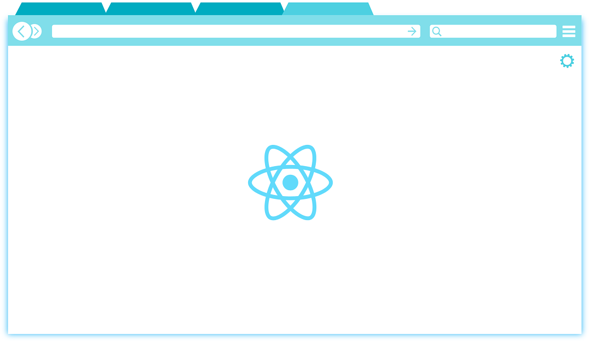

使用 React 构建的客户端 web 应用可以快速响应用户操作，使 web 应用的使用体验近乎于移动 App。

<video>
	 <source src="./assets/video/01.mp4" type="video/mp4">
</video>

React 允许开发人员将用户界面代码和逻辑代码进行完美融合，以更加灵活的方式创建用户界面。

```react
function Welcome(props) {
  return <h1>Hello, {props.name}</h1>;
}
```

了解：React 除了可以构建运行在浏览器中的 web 应用以外，还可以构建在移动端运行的原生 App 应用。

#### 1.1.2 它的背景与生态

它是由 Facebook 的软件工程师在 2012 年创建，于 2013 年 5 月开源，目前由 Facebook 以及个人开发人员和公司组成的社区维护。

React 生态圈异常活跃，在构建客户端 web 应用的过程中你遇到的问题几乎都可以在社区中找到答案。

| [Redux](https://redux.js.org/)           | [MobX](https://mobx.js.org/README.html)             | [Recoil](https://recoiljs.org/)                          | [Formik](https://formik.org/)       | [React Table](https://react-table.tanstack.com/) |
| ---------------------------------------- | --------------------------------------------------- | -------------------------------------------------------- | ----------------------------------- | ------------------------------------------------ |
| [Next.js](https://nextjs.org/)           | [Gatsby](https://www.gatsbyjs.com/)                 | [React Query](https://react-query.tanstack.com/)         | [SWR](https://swr.vercel.app/zh-CN) | [React Router](https://reactrouter.com/)         |
| [React Spring](https://react-spring.io/) | [Styled-Components](https://styled-components.com/) | [Ant Design](https://ant.design/docs/react/introduce-cn) | [Material UI](https://mui.com/zh/)  | [MSW](https://mswjs.io/)                         |

[官方文档](https://reactjs.org/)

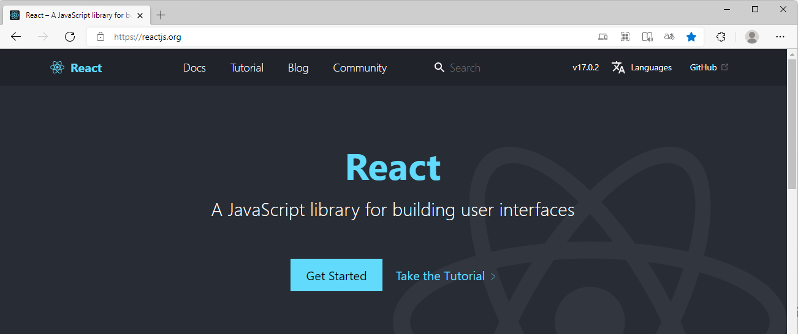

### 1.2 React 初体验

#### 1.2.1 引包(浏览器环境)

```html
<script src="https://cdn.bootcdn.net/ajax/libs/react/17.0.2/umd/react.production.min.js"></script>
<script src="https://cdn.bootcdn.net/ajax/libs/react-dom/17.0.2/umd/react-dom.production.min.js"></script>
```

React 可以构建在浏览器中运行的 web 应用，也可以构建在移动端运行的原生应用，React 在构建这两种应用时会有一些通用方法和一些非通用方法，通用方法都被放置在了 `react` 文件中，非通用方法比如实现 web 应用的方法被放置在了 `react-dom` 中，实现移动端应用的方法被放置在了 `react-native-web` 文件中。

react：核心库，包含了构建 web 应用和构建移动端应用的通用方法。

react-dom：只包含了构建 web 应用的方法。

react-native-web：只包含构建移动端应用的方法。

#### 1.2.2 createElement

引入 `react` 后，window 对象下会多出一个 `React` 的对象，对象下面的 `createElement` 方法用于创建元素。

```react
// type: 标签名称, 字符串.
// props: 元素属性, 对象, 无属性填入 null
// children: 子元素, 普通文本或 createElement 方法返回的元素对象
// 返回值: 元素对象 (虚拟 DOM 对象) 
React.createElement(type, props, children)
```

```javascript
const button = React.createElement("button", { type: "button" }, "保存")
```

#### 1.2.3 render

引入 `react-dom` 后，window 下会多出一个叫做 `ReactDOM` 的对象，对象下面的 `render` 方法用于渲染元素。

```javascript
// element: 待渲染元素对象, 就是通过 createElement 方法创建的虚拟 DOM 对象
// container: 虚拟 DOM 对象的渲染位置. 真实 DOM 对象.
ReactDOM.render(element, container)
```

```html
<div id="root"></div>
```

```react
ReactDOM.render(button, document.getElementById("root"))
```

#### 1.2.4 练习

需求：将指定的 HTML 结构使用 React 提供的方式渲染出来。

```html
<main id="main">
  <h1>My Blog</h1>
  <article>
    <h2>My first blog post</h2>
    <p class="text">This is the content of my post</p>
  </article>
</main>
```

```javascript
const paragraph = React.createElement(
  "p",
  { className: "text" },
  "This is the content of my post"
)
const articleHeader = React.createElement(
  "h2",
  null,
  "My first blog post"
)
const article = React.createElement(
  "article",
  null,
  articleHeader,
  paragraph
)
const mainHeader = React.createElement("h1", null, "My Blog")
const main = React.createElement(
  "main",
  { id: "main" },
  mainHeader,
  article
)
ReactDOM.render(main, document.getElementById("root"))
```

### 1.3 初识 JSX 语法

#### 1.3.1  已知问题

由于 React 内部的优化机制所致, 它必须使用 `createElement` 方法构建用户界面, 但对于开发者来说该方法又确实增加了编写代码的复杂度。

为了解决以上问题, React 为 `createElement` 方法创造了替代语法，这种语法和传统的 HTML 语法相似度极高, 这样开发者就可以使用熟悉的语法构建界面了。在应用构建阶段, 再使用 `balbel` 将这种替代语法转换为 `createElement` 方法, 这样 React 又可以使用它创建元素了。

```jsx
const button = <button type="button">button</button>
```

```javascript
React.createElement('button', {type: "button"}, "button")
```

#### 1.3.2 JSX 是什么

JSX 是 JavaScript 编程语言的语法扩充，是由 Facebook 创建的，用于在 React 中构建用户界面。

```react
const button = <button>保存</button>
ReactDOM.render(button, document.getElementById("root"))
```

但是这种语法浏览器是不识别的，所以我们需要借助 Babel 对其进行转换，将其转换为 `React.createElement` 方法的调用，所以说 JSX 的本质就是 JavaScript。[Babel REPL](https://babeljs.io/repl)

```html
<script src="https://cdn.jsdelivr.net/npm/@babel/standalone@7.13.17/babel.min.js"></script>
```

#### 1.3.3 JSX 语法规则

##### 1. 根标记

在使用 JSX 语法创建元素时，元素的最外层必须要有一个根标记。

```react
// 错误写法
const jsx = (
	<p>Hello</p>
  <p>world</p>
)
```

```react
// 正确写法
const jsx = (
	<div>
  	<p>Hello</p>
    <p>world</p>
  </div>
)
```

为避免因为要满足规定而出现无意义标记，React 提供了占位符标记，占位符标记在渲染后不会产生真实 DOM 对象

```react
// 使用占位符标记充当根元素
// 避免渲染结果出现无意义标记
const jsx = (
	<React.Fragment>
  	<p>Hello</p>
    <p>world</p>
  </React.Fragment>
)
```

```react
// 占位符标记的简写语法
const jsx = (
	<>
  	<p>Hello</p>
    <p>world</p>
  </>
)
```

##### 2. 单标记自闭合

```react
<input type="text"/>

```

##### 3. 属性命名规则

属性名称遵循驼峰式命名法 (小驼峰)

```html
<!-- HTML 写法 -->
<input maxlength="10" readonly autofoucs>
```

```react
// JSX 写法
<input maxLength="10" readOnly autoFocus />
```

##### 4. className 属性

添加类名使用 className 属性，因为 class 在 JavaScript 中是保留关键字

```react
<!-- HTML 写法 -->
<input class="todos">
```

```jsx
// JSX 写法
<input className="todos" />
```

##### 5. htmlFor 属性

label 标记使用 htmlFor 属性，因为 for 在 JavaScript 中是保留关键字

```html
<!-- HTML 写法 -->
<label for="demo">This is a test input</label>
```

```react
// JSX 写法
<label htmlFor="demo">This is a test input</label>
```

##### 6. JSX 格式美化

在多个 JSX 标记同时使用时避免不了一定会换行，此时最外层可以加上一组小括号，使标记格式对其避免因格式混乱产生的错误。

```react
const element = (
  <>
    <div>header</div>
    <div>footer</div>
  </>
)
```

##### 7. 注释

JSX 中的注释写法为 `{/**/}`

```react
const element = (
	<>
  	{/* 头部 */}
    <div>header</div>
		{/* 底部 */}
    <div>footer</div>
  </>
)
```

##### 8. 插值语法

在 JSX 中可以使用插值语法将动态数据插入到指定位置。

```react
// 插入文本
const someClass = "some-class"
const someText = "I am interpolating text"
const text_jsx = <p className={someClass}>{someText}</p>
```

```react
// 执行计算
const x = 10
const y = 20
const paragraph = <p>{x * y}</p>
```

```react
// 渲染函数返回值
function getValue() {
  return "some value from getValue function"
}
const text = <p>{getValue()}</p>
```

```react
// 插入对象
const obj = {name: "张三"};
const text = <p>{obj}</p>
const other = <p>{{name: "李四"}}</p>
```

### 1.4 create-react-app

`create-react-app` 是 React 官方提供的用于创建 React 应用的脚手架工具。

```bash
npm install create-react-app -g
npm init react-app react-demo
```

## 2. 组件化开发基础

### 2.1 组件概述

#### 2.1.1 什么是组件

React 中的组件就是页面中的一小块区域，组件内部会包含这块区域中的视图代码、样式代码以及逻辑代码。

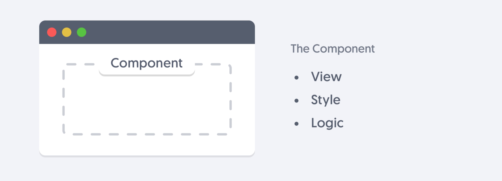

React 采用组件化开发的方式构建用户界面。

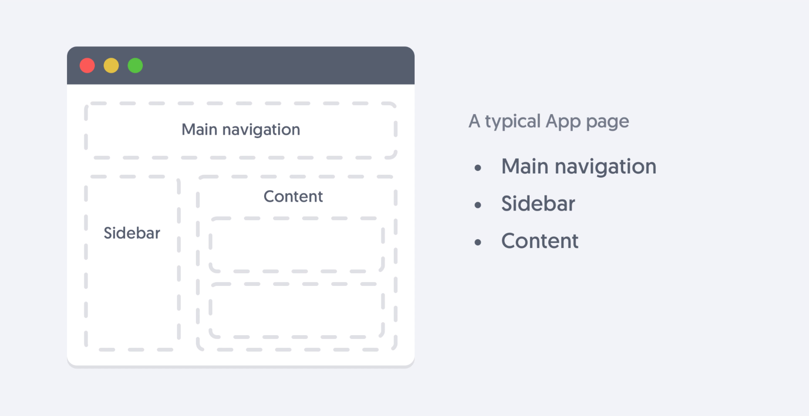

#### 2.1.2 组件的设计思想

组件的核心思想之一就是复用, 定义一次, 到处使用。组件用来封装用户界面中的重复区块，复用重复区块。

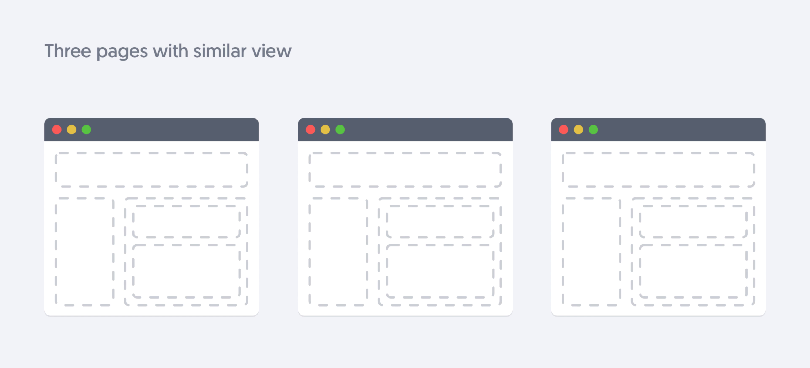

组件的另外一个核心思想是解耦, 默认情况下每个组件都有自己的作用域, 内部代码在外部不可见, 这意味着组件之间的代码不会发生冲突, 从而避免在传统开发模式中经常出现的改A坏B的问题。

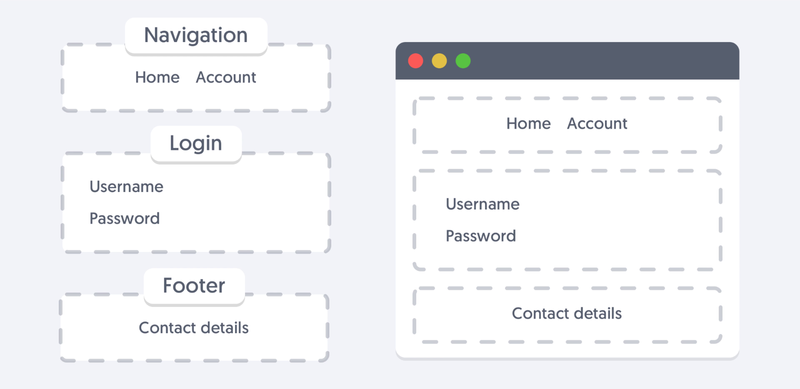

#### 2.1.3 如何创建组件

在 React 中组件以函数的形式存在，组件最基本的特征就是一个返回视图(JSX)的函数。

```react
// 注意：组件名称首字母必须大写。
function Paragraph() {
  return <p>Hello, React Component</p>
}
```

在 React 中，组件以自定义标签的形式进行调用。

```react
ReactDOM.render(<Paragraph />, document.getElementById("root"))
```

```react
const jsx = (
  <>
    <Paragraph />
    <Paragraph />
  </>
)
ReactDOM.render(jsx, document.getElementById("root"))
```

组件和 HTML 一样，都是以树状结构存在的。

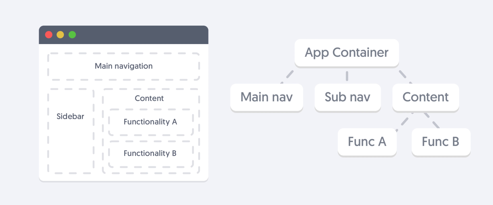

```react
function TextOne() {
  return <b>I am a TextOne Component</b>
}
function TextTwo () {
  return <b>I am a TextTwo Component</b>
}
function Paragraph() {
  return (	
    <p>
      <TextOne />
      <TextTwo />
    </p>
  )
}
```

### 2.2 复用组件

#### 2.2.1 props

在调用组件时，可以通过为组件标签添加属性的方式向组件内部传递数据，实现差异化组件复用。

```react
<Paragraph msg="I am first" />
<Paragraph msg="I am second" />
```


在组件内部，通过组件函数参数接收组件外部传递进来的数据，组件函数的第一个参数是对象类型，存储了所有外部通过属性的方式传递进来的数据。

```react
function Paragraph(props) {
  return <p>{props.msg}</p>
}
```

组件的 props 参数可以设置默认值, 这样在调用组件时就可以根据需要向组件内部传递数据, 传递了就使用传递值, 没传递就使用默认值。

```react
function Person (props) {
  return <div>{props.name}</div>
}
```

```react
Person.defaultProps = {
  name: "张三"
}
```

```react
<Person name="李四"/> // 李四
<Person /> // 张三
```

组件的 props 默认值可以防止组件内部代码执行出错。

```react
function Person (props) {
  return <div>{props.info.name}</div>
}
```

```react
<Person /> // 报错, 因为组件内部代码执行时, 通过 props 获取到的 info 为 undefined, 不能再通过 undefined 获取 name
<Person info={{name: "张三"}}/> // 张三
```

```react
Person.defaultProps = {
  info: {}
}
```

```react
<Person /> // 不会报错, 因为在 JSX 中渲染 undefined 是合法的
<Person info={{name: "张三"}}/> // 张三
```

#### 2.2.2 children

在调用组件时，可以向组件标签内部添加 JSX，实现差异化组件复用，相比 props, 使用 children 可以向组件内部传递更加复杂的数据。

```react
<Person>
  Hello, React Children
</Person>
```

```react
<Person>
  <p>single child</p>
</Person>
```

```react
<Person>
  <p>multiple childs</p>
  <p>multiple childs</p>
  <p>multiple childs</p>
</Person>
```

```react
function Person (props) {
  return <div>{props.children}</div>
}
```

children 的其中一个经典应用场景是辅助创建布局组件。布局组件可以增强组件复用能力。


```react
function HomePage() {
  return <div>HomePage</div>;
}
function AboutPage() {
  return <div>AboutPage</div>;
}
```

```react
function Header() {
  return <div>Header</div>;
}
function Footer() {
  return <div>Footer</div>;
}
```

```react
function Layout(props) {
  return (
    <>
    <Header />
    <div>{props.children}</div>
    <Footer />
    </>
  );
}
```

```react
function HomePage() {
  return <Layout>HomePage</Layout>;
}
function AboutPage() {
  return <Layout>AboutPage</Layout>;
}
```

### 2.3 组件模板

#### 2.3.1 事件程序

##### 1. 添加事件

在 JSX 中，为元素添加事件，事件名称采用驼峰使命名法，事件处理函数通过插值的方式指定。

```react
function App () {
  const onClickHandler = () => {
    console.log('Hello, Event')
  }
  return <button onClick={onClickHandler}>按钮</button>
}
```

##### 2. 事件传参

```react
function App () {
  const onClickHandler = (arg1, arg2) => {}
  return <button onClick={() => onClickHandler('a', 'b')}>按钮</button>
}
```

##### 3. 事件对象

事件处理函数在没有传递参数的情况下，第一个参数默认就是事件对象。

```react
function App () {
  const onClickHandler = (event) => {}
  return <button onClick={onClickHandler}>按钮</button>
}
```

事件处理函数在传递了参数的情况下，最后一个参数就是事件对象。

```react
function App () {
  const onClickHandler = (arg1, arg2, event) => {}
  return <button onClick={() => onClickHandler('a', 'b')}>按钮</button>
}
```

在调用事件处理函数时，可以将事件对象作为参数显式传递。

```react
function App () {
  const onClickHandler = (arg1, event, arg2) => {}
  return <button onClick={(event) => onClickHandler('a', event, 'b')}>按钮</button>
}
```

#### 2.3.2 条件渲染

在组件模板中, 根据条件的不同渲染不同的视图元素。

##### 1. if 条件判断

```react
function OnMessage() {
  return <span>The Machine is On</span>
}
function OffMessage() {
  return <span>The Machine is Off</span>
}
function OnOff() {
  if (true) {
    return <OnMessage />
  } else {
    return <OffMessage />
  }
}
```

```react
function Machine() {
  const getMessage = () => {
    if (true) {
      return <OnMessage />
    } else {
      return <OffMessage />
    }
  }
  return <p>{getMessage()}</p>
}
```

```react
function Machine() {
  let message = null
  if (true) {
    message = <OnMessage />
  } else {
    message = <OffMessage />
  }
  return <p>{message}</p>
}
```

##### 2. 三元运算符

```react
function Machine() {
  return <p>{true ? <OnMessage /> : <OffMessage />}</p>
}
```

```react
const isError = true
const errorContainer = (
  <div className={isError ? "error" : "standard"}>
    {isError ? <p>Something went wrong...</p> : <p>Everythis is ok</p>}
  </div>
)
```

##### 3. AND 运算符

```react
function ErrorMessage() {
  return <span>Something went wrong</span>
}
function Machine() {
  return <p>{true && <ErrorMessage />}</p>
}
```

#### 2.3.3 列表渲染

##### 1. 数组自动展开

在 JSX 中，可以将数组直接放入插值表达式，数组将会被自动展开，数组中的元素会被直接渲染到该位置。

```react
const data = ["The beach", "The mountains", "Vibrant cities", "Roughing it"]
const jsx = <div>{data}</div>
```


```react
const jsxArray = [
  <li>list-item-1</li>,
  <li>list-item-2</li>,
  <li>list-item-3</li>,
];
const jsx = <ul>{jsxArray}</ul>;
```

注意：不能直接将对象数组放置在插值语法中，因为当数组被展开后，JSX 不知道要如何渲染对象。

```react
const data = [
  { name: "The beach" },
  { name: "The mountains" },
  { name: "Vibrant cities" },
  { name: "Roughing it" }
]
```

##### 2. 列表渲染(map)

map 方法用于对列表中的数据进行转换，转换后的结果被存放在一个新的数组中。

```javascript
let array = [1, 2, 3, 4]
let newArray = array.map((item, index) => item * index)
console.log(newArray) // [0, 2, 6, 12]
```

map 方法内部会对原始数组进行遍历，在遍历过程中不断调用传递到 map 方法中的回调函数，并将当前遍历的值和索引传递给回调函数，回调函数的返回值会被存储到一个新的数组中，遍历结束后返回新数组。

```javascript
Array.prototype.myMap = function (callback) {
  var result = []
  for (var i = 0; i < this.length; i++) {
    result.push(callback(this[i], i))
  }
  return result
}
```

map 方法在 JSX 中的应用：将数组中的内容渲染到 ul 标签中, 内容使用 li 标签包裹。

```react
let data = ["Data1", "Data2", "Data3"]
let result = (
	<ul>
  	{data.map(item => (
      <li>{item}</li>
    ))}
  </ul>
)
```

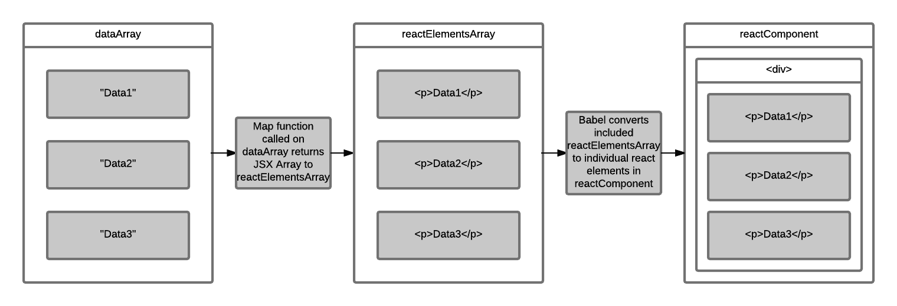

##### 3. key 属性

在列表渲染的过程中，React 建议开发者为列表项添加 key 属性，否则在控制台中输出警告。

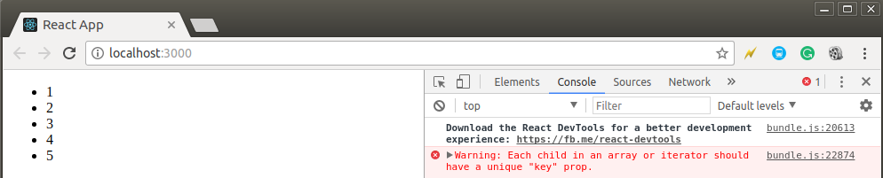

key 属性用于为列表中的元素提供标识，React 使用该标识识别列表中的哪些元素发生了变化，实现只操作发生更改的元素，以此来提升渲染性能。

下列代码在没有 key 属性的情况下，当数据发生更新以后，所有元素重新渲染。

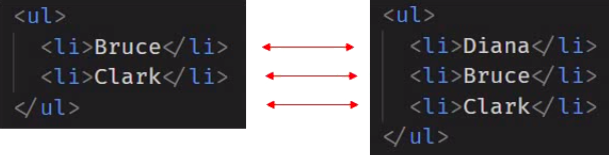

下列代码在有 key 属性的情况下，当数据发生更新以后，只有发生变化的元素被重新渲染了，其他元素被复用。

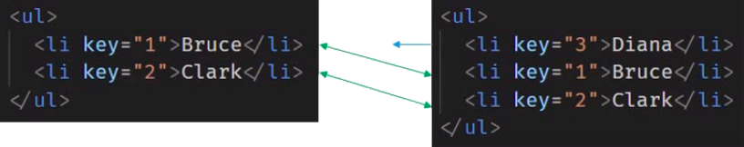

key 属性值的值必须是不重复的，一般使用数据 id 作为 key 属性的值。

如果列表只在组件初始化的时候渲染一次，后续不发生变化，也可以使用循环索引作为 key 属性的值。

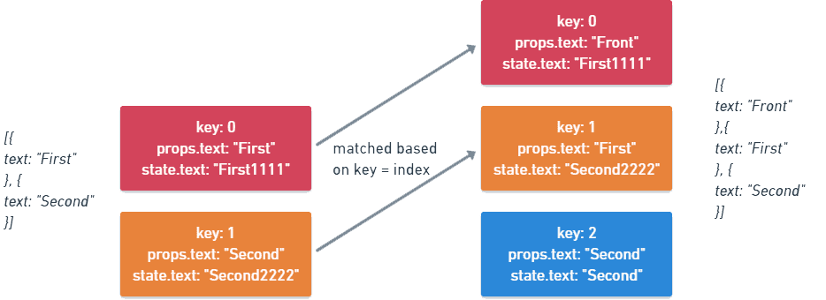

##### 4. 列表过滤(filter)

filter 方法用于对列表元素进行过滤，根据过滤条件将符合的元素存放到一个新的数组中。

```javascript
const array = [
  { id: 1, name: "The beach", topDestination: true },
  { id: 2, name: "The mountains", topDestination: false },
  { id: 3, name: "Vibrant cities", topDestination: true },
  { id: 4, name: "Roughing it", topDestination: false }
]

const newArray = array.filter(item => item.topDestination)
```

filter 方法内部会对原始数组进行遍历, 在遍历过程中会不断调用传递给 filter 方法的回调函数, 并且会将当前遍历值和索引传递给回调函数, 如果回调函数返回 true, 将当前遍历值留下, 否则排除当前遍历值。

```javascript
Array.prototype.myFilter = function (callback) {
  var result = []
  for (var i = 0; i < this.length; i++) {
    if (callback(this[i], i)) {
      result.push(this[i])
    }
  }
  return result
}

const newArray = list.myFilter(item => item.topDestination)
```

filter 方法在 JSX 中的应用: 对数据进行过滤然后再通过 map 方法对数据进行转换, 最终渲染数据。

```react
const list = [
  { id: 1, name: "The beach", topDestination: true },
  { id: 2, name: "The mountains", topDestination: false },
  { id: 3, name: "Vibrant cities", topDestination: true },
  { id: 4, name: "Roughing it", topDestination: false },
];
const result = (
  <ul>
    {list
      .filter((item) => item.topDestination)
      .map((item) => (
      	<li key={item.id}>{item.name}</li>
    	))}
  </ul>
);
ReactDOM.render(result, document.getElementById("root"));
```

### 2.4 组件状态

#### 2.4.1 组件状态概述

在现实世界中，状态通常是指人或事物表现出来的形态。

<video>
	 <source src="./assets/video/book.mp4" type="video/mp4">
</video>

由于组件执行的最终结果就是用户界面，所以组件状态指的就是用户界面的状态。

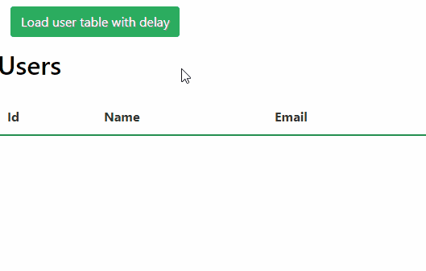

[Gallery app with Finite State Machines](https://codepen.io/davidkpiano/pen/WZYXKv)

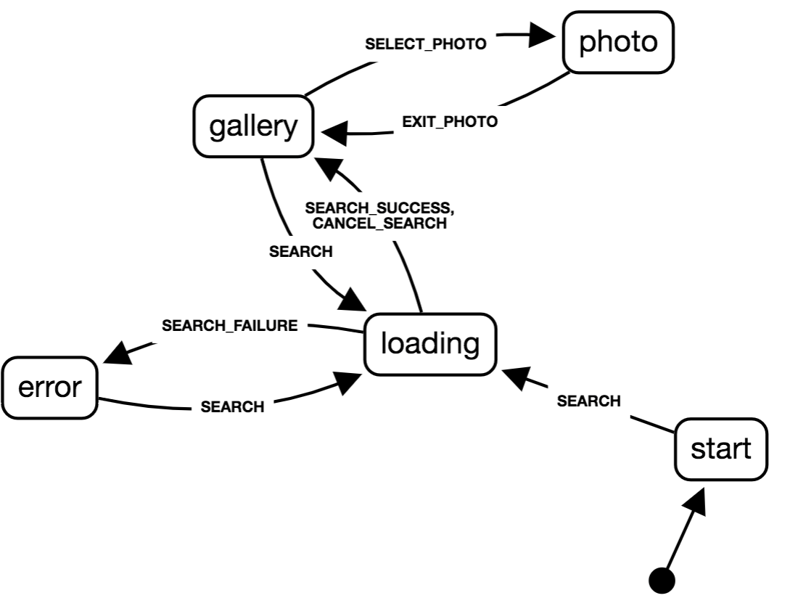

React 遵循数据驱动 DOM 的理念，数据的变化会引起视图的自动更新。

这里所说的数据其实就是组件状态数据，组件状态数据其实就是组件内部维护的能够驱动视图更新的数据。

React 将组件看成是状态机，用户与绑定了组件状态数据的视图进行交互，从而产生新的状态，React 再使用新的状态数据渲染新的视图状态。

#### 2.4.2 钩子函数概述

React 使用函数作为组件，但是函数自身有重大限制，就是不能持续保存状态，因为函数在执行完成以后内部的局部变量就被释放了。

但是作为组件，它必须具备保存状态的功能，因为只有状态被保存了，我们才可以基于现有状态计算新状态，使用新的状态更新视图。

为了对函数组件功能进行增强，React 提供了钩子函数，你想要在函数组件内部使用什么功能，就使用钩子函数将该功能"钩"进函数组件内部。

所有的钩子都是为函数引入外部功能，所以 React 约定，钩子一律使用 `use` 前缀命名，便于识别。

#### 2.4.3 useState

`React.useState` 方法用于声明组件状态数据，通过该方法声明的状态数据被更改后会触发视图更新。

```react
function App() {
  // initialState 参数是初始渲染期间使用的状态，在随后的渲染中，它被忽略。
  // 返回值是一个数组，从数组中结构出来的第一个值是状态变量，第二个值是更改状态的方法。
  const [value, setValue] = React.useState("initialState");
  return (
    <>
      <p>{value}</p>
      <button onClick={() => setValue("state is changed")}>
        更改视图状态
      </button>
    </>
  );
}
```

`React.useState` 方法可以在组件中多次被调用，用于声明多个状态数据。

```react
function App() {
  const [value, setValue] = React.useState("initial state value");
  const [count, setCount] = React.useState(0);
  return (
    <>
      <p>{value}</p>
      <button onClick={() => setValue("state is changed")}>
        更改视图状态
      </button>
      <p>{count}</p>
      <button onClick={() => setCount(count + 1)}>+1</button>
      <button onClick={() => setCount(count - 1)}>-1</button>
    </>
  );
}
```

组件状态数据发生变化后会触发视图更新，视图更新意味着组件函数被重新执行，虽然组件函数重新执行了，但是状态变量并没有被释放，组件状态在每次组件函数重新执行后被保留了下来。

组件中的普通变量就不具备此功能，普通变量被更改后不会触发视图更新，而且当真正的组件状态变化后组件函数重新执行，普通变量也被重置为初始值。

```react
function App() {
  const [count, setCount] = React.useState(0);
  let number = 0;
  console.log("rerender", number);
  return (
    <>
      <p>{count}</p>
      <button onClick={() => setCount(count + 1)}>+1</button>
      <button
        onClick={() => {
          number = number + 1;
          console.log("onClick", number);
        }}
        >
        {number}
      </button>
    </>
  );
}
```

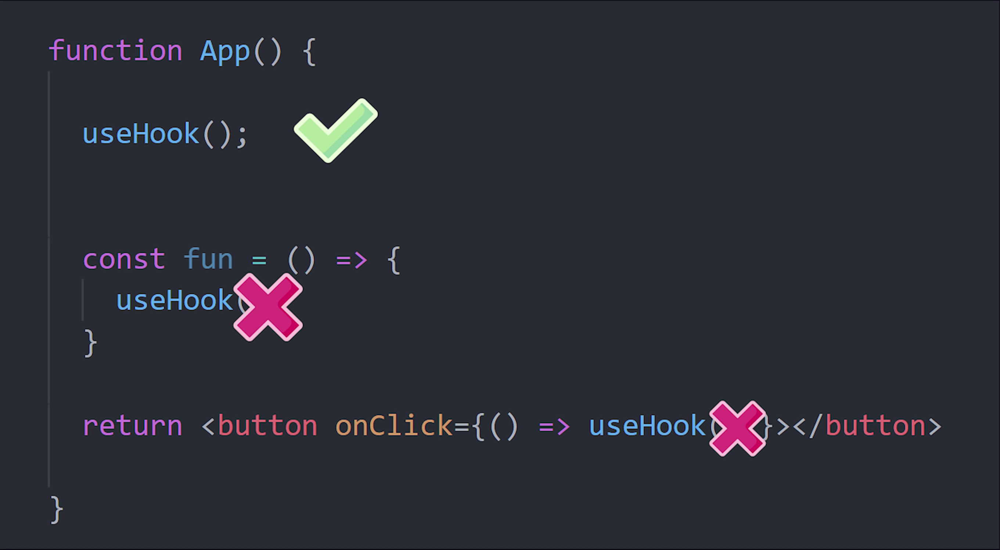

#### 2.4.4 useEffect

##### 1. 副作用概述

在现实生活中副作用指的就是不良反应，比如吃了过期食品导致的上吐下泻，吃头孢喝酒产生的心力衰竭等都属于副作用。

组件的职责就围绕 props 和 state 计算用户界面所需要的状态数据，其他的和渲染用户界面逻辑没有关系的操作都属于副作用。

比如 Ajax Request、手动修改 DOM、localStorage、console.log、setInterval 等。

副作用本身不是错误代码，但是如果副作用代码在组件中放置的不是最佳位置，可能导致组件的性能变差。

##### 2. useEffect 方法

useEffect 方法的作用就是确保将副作用代码在正确的时机被执行，消除不必要的性能消耗。

在以下代码中，设置网页标题的代码属于副作用代码，该代码放置的不是最佳位置，导致它在不需要执行的时候被执行，导致组件性能变差。同步网页标题的代码只用到了 count，只有 count 状态发生变化以后，同步网页标题的代码才需要被执行，但目前的结果是无论 count 发生变化还是 value 发生变化，同步网页标题的代码都会被执行。

```react
function App() {
  const [count, setCount] = React.useState(0);
  const [value, setValue] = React.useState(99);
  // 以下两句代码都属于副作用代码
  document.title = count;
  console.log("网页标题同步成功");
  return (
    <>
      <p>{count}</p>
      <button onClick={() => setCount(count + 1)}>+1</button>
      <button onClick={() => setValue(value - 1)}>{value}</button>
    </>
  );
}
```

使用 useEffect 方法监听特定状态的变化，从而执行和该状态相关的副作用代码。

```react
function App() {
  const [count, setCount] = React.useState(0);
  const [value, setValue] = React.useState(99);
  // 组件初始渲染后执行, 特定状态发生变化后执行
  // 第一个参数是函数类型, 监听的状态发生变化后该回调函数被执行
  // 第二个参数是数组类型, 数组中填写的是要监听的状态
  React.useEffect(() => {
    document.title = count;
    console.log("网页标题同步成功");
  }, [count]);
  return (
    <>
      <p>{count}</p>
      <button onClick={() => setCount(count + 1)}>+1</button>
      <button onClick={() => setValue(value - 1)}>{value}</button>
    </>
  );
}
```

在以下代码中，Ajax 请求代码属于副作用代码，该代码放置的不是最佳位置，导致只要组件状态变化请求就会重新发送，但是我们希望请求只发送一次。

```react
function App() {
  const [count, setCount] = React.useState(0);
  axios.get("https://api.github.com/users/defunkt").then((response) => {
    console.log(response.data);
  });
  return <button onClick={() => setCount(count + 1)}>{count}</button>;
}
```


使用 useEffect 方法设置指定的副作用代码只在组件第一次渲染完成后执行一次。

```react
function App() {
  const [count, setCount] = React.useState(0);
  React.useEffect(() => {
    axios.get("https://api.github.com/users/defunkt").then((response) => {
      console.log(response.data);
    });
  }, []);
  return <button onClick={() => setCount(count + 1)}>{count}</button>;
}
```

在以下代码中定时器属于副作用代码，虽然定时器只会被开启一次，但是在组件被卸载后定时器仍然在执行。

```react
function App() {
  React.useEffect(() => {
    setInterval(() => {
      console.log("hello");
    }, 1000);
  }, []);
  return <button onClick={() =>  ReactDOM.unmountComponentAtNode(document.getElementById("root"))}>卸载组件</button>
}
```

使用 useEffect 方法指定组件卸载前执行的清理函数，用于执行副作用清理操作。

```react
function App() {
  React.useEffect(() => {
    const timer = setInterval(() => {
      console.log("hello");
    }, 1000);
    // 该函数在组件卸载前被执行
    return () => clearInterval(timer);
  }, []);
  return (
    <>
      <button onClick={() => setCount(count + 1)}>{count}</button>
      <button onClick={() =>  ReactDOM.unmountComponentAtNode(document.getElementById("root"))}>卸载组件</button>
    </>
  );
}
```

### 2.5 组件通讯

#### 3.1.1 父子通讯

在 React 应用中，组件与组件之间传递状态数据采用的是单向数据流架构，这是构建 React 应用必须遵循的状态数据传递规范。

单向数据流指的是状态数据只能在一个方向上传递，就是从上到下，即从父组件到子组件。状态数据不能反向传递，也不能横传递。

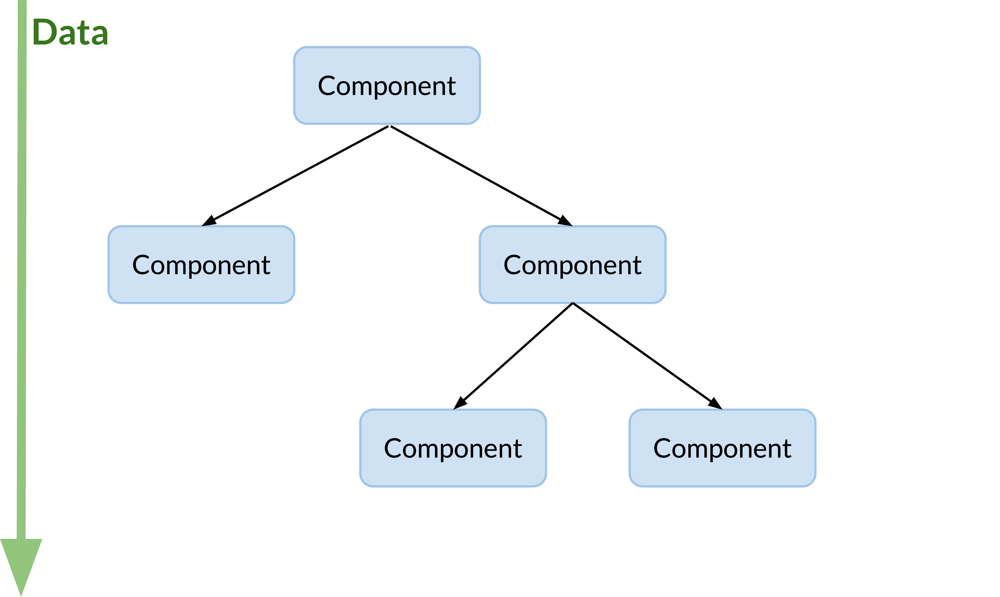

```react
function App() {
  const [msg, setMsg] = React.useState("Hello React");
  // 将 msg 状态数据传递到子组件
  return <Message msg={msg} />;
}
function Message(props) {
  // 接收来自父组件的 msg 状态数据
  return <div>{props.msg}</div>;
}
```

单向数据流意味着子组件不能直接更新父组件传递下来的状态数据以达到更新视图的目的，事实上 props 参数也是只读的不能被修改。

在子组件中若想修改父组件传递的下来的状态数据，父组件必须一并将修改状态的方法传递到子组件，子组件通过调用该方法先更新父组件状态，父组件再将状态传递到子组件以触发视图更新。

```react
function App() {
  const [msg, setMsg] = React.useState("Hello React");
  // 将 msg 状态数据传递到子组件
  return <Message msg={msg} setMsg={setMsg} />;
}
function Message(props) {
  // 接收来自父组件的 msg 状态数据
  return (
    <>
      <p>{props.msg}</p>
      <button onClick={() => props.setMsg("Hi Data Flow")}>button</button>
    </>
  );
}
```

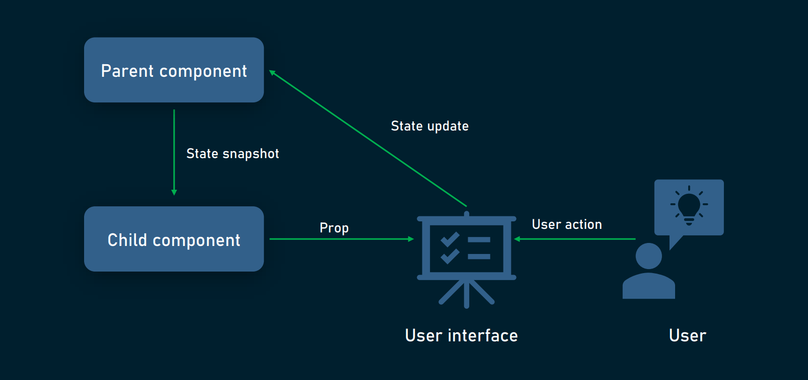

父组件将初始状态的快照传递给子组件。

子组件根据当前的 prop 值渲染用户界面。

用户与用户界面进行交互，例如点击按钮或输入文字。

用户的操作不会直接更新视图，它会先触发父组件中状态的更新。

更新之后的状态数据通过 props 向下传递到子组件。

用户界面被重新渲染以同步当前状态。

#### 3.1.2 兄弟通讯

在 React 中若要实现兄弟组件通讯需要借助组件状态提升思想。组件状态提升指的是将兄弟组件之间的共享状态提升到最近的公共父级组件中，由公共父级组件维护这个状态和修改状态的方法，父级组件再通过 props 的方式将状态数据传递到两个子组件中。

```react
function App() {
  const [person, setPerson] = React.useState({ name: "张三" });
  return (
    <>
      <Message person={person} />
      <Machine person={person} />
    </>
  );
}
function Message(props) {
  return <p>Message: {props.person.name}</p>;
}
function Machine(props) {
  return <p>Machine: {props.person.name}</p>;
}
```

#### 3.13 JSX 扩展运算符

在 JSX 中可以使用扩展运算符将对象展开，对象展开后将对象中的每个属性直接传入组件。

```react
// 以下两种写法是等价的
function App() {
  const values = { sayHello: "Hello", sayHi: "hi" };
  return <Message sayHello={values.sayHello} sayHi={values.sayHi} />;
}
function App() {
  const values = { sayHello: "Hello", sayHi: "hi" };
  return <Message {...values} />;
}
```

```react
// 放置数据在传递的过程中增加层级
function App() {
  const values = { sayHello: "Hello", sayHi: "hi" };
  return <Message {...values} />;
}

function Message(props) {
  return <Button {...props} />;
}

function Button(props) {
  return <pre>{JSON.stringify(props, null, 2)}</pre>;
}
```

```react
// JSX 扩展运算符的另一种使用场景
function Button (props) {
  const { kind, ...other } = props;
  const className = kind === "primary" ? "PrimaryButton" : "SecondaryButton";
  return <button className={className} {...other} />;
}

function App () {
  return (
    <div>
      <Button kind="primary">
        Hello World!
      </Button>
    </div>
  );
}
```

#### 3.1.4  Context

##### 1. prop drilling 概述

在 React 中，为了让兄弟组件实现状态共享，我们通常会将状态进行提升，提升至它们最近的公共父级，但是当组件层级关系比较复杂时，这种方式并不理想，因为在这个过程中有很多组件并不需要使用该状态，但是却参与了状态的传递。我们通常将这种情况称之为 prop drilling。

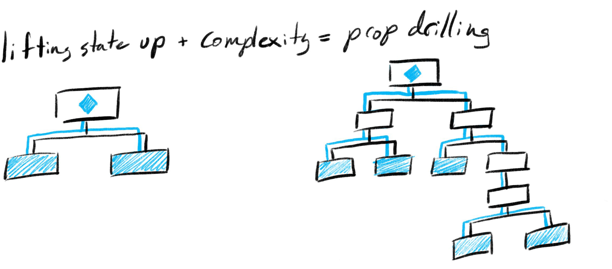

```react
// Application: 应用页面级组件
function Application() {
  const userName = "John Smith";
  return <Layout userName={userName}>Main content</Layout>;
}
// Layout: 应用布局组件
function Layout({ children, userName }) {
  return (
    <div>
      <Header userName={userName} />
      <main>{children}</main>
    </div>
  );
}
// Header 头部组件
function Header({ userName }) {
  return (
    <header>
      <UserInfo userName={userName} />
    </header>
  );
}
// UserInfo: 用户信息组件
function UserInfo({ userName }) {
  return <span>{userName}</span>;
}
// 渲染应用级页面组件 Application
ReactDOM.render(<Application />, document.getElementById("root"));
```

##### 2. Context 概述

为了解决以上问题，React 提供了 Context (上下文)，它允许组件访问全局状态并在全局状态发生更改时重新渲染组件。

无论需要数据的组件被嵌套的层级有多深，Context 都可以轻松为该组件传递状态。

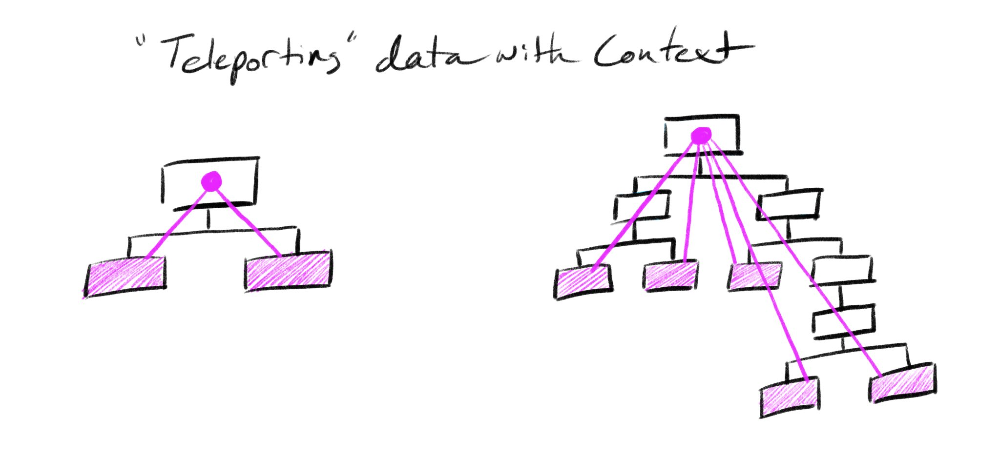

##### 3.  Context 使用教程

在 React 中使用 Context 需要三个步骤：创建 Context、通过 Context 提供状态、组件通过 Context 获取状态。

第一步：通过 `React.createContext` 方法创建 Context，并提供默认状态

```react
// 创建 Context 对象
// createContext 方法的参数就是默认的状态值
const Context = React.createContext("Default Value");
```

第二步：组件通过 `React.useContext` 方法获取默认状态

```react
function App() {
  // 组件通过 useContext 方法获取 Context 提供的默认状态
  const value = React.useContext(Context);
  return <div>{value}</div>;
}
```

第三步：通过 `Context.Provider` 组件提供全局状态，实现组件访问。

```react
// 创建 Context 对象存储默认状态值
const Context = React.createContext("Default Value");

function App() {
  const value = "My Context Value";
  // 通过 Context.Provider 组件提供状态, 该状态值会覆盖默认状态值
  return (
    <Context.Provider value={value}>
      <MyComponent />
    </Context.Provider>
  );
}

function MyComponent() {
  // 下层组件获取 Context 全局状态值
  const value = React.useContext(Context);
  return <div>{value}</div>;
}
```

##### 4.  Context 使用示例

```react
const UserContext = React.createContext({
  userName: "",
  setUserName: () => {},
});
function Application() {
  const [userName, setUserName] = React.useState("John Smith");
  return (
    <UserContext.Provider value={{ userName, setUserName }}>
      <UserInfo />
      <UserNameInput />
    </UserContext.Provider>
  );
}
function UserInfo() {
  const { userName } = React.useContext(UserContext);
  return <p>{userName}</p>;
}
function UserNameInput() {
  const { userName, setUserName } = React.useContext(UserContext);
  const changeHandler = (event) => setUserName(event.target.value);
  return <input type="text" value={userName} onChange={changeHandler} />;
}
ReactDOM.render(<Application />, document.getElementById("root"));
```

### 2.6  表单控制

#### 2.6.1 受控表单组件

在 React 组件中使用表单元素时，为了方便获取表单控件的值，通常都会将表单控件和组件状态进行绑定，通过该方式使用表单的组件叫做受控表单组件。

##### 1. text

```react
function App() {
  const [username, setUsername] = React.useState("");
  return (
    <input
      type="text"
      value={username}
      onChange={(event) => setUsername(event.target.value)}
    />
  );
}
```

##### 2. password

```react
// 优化前
function App() {
  const [formState, setFormState] = React.useState({
    username: "",
    password: "",
  });
  return (
    <>
      <input
        type="text"
        value={formState.username}
        onChange={(event) => setFormState({ ...formState, username: event.target.value })}/>
      <input
        type="password"
        value={formState.password}
        onChange={(event) => setFormState({ ...formState, password: event.target.value })}/>
    </>
  );
}
```

```react
// 优化后
function App() {
  const [formState, setFormState] = React.useState({
    username: "",
    password: "",
  });
  const onChangeHandler = (event) => {
    setFormState({
      ...formState,
      [event.target.name]: event.target.value,
    });
  };
  return (
    <>
      <input type="text" name="username" value={formState.username} onChange={onChangeHandler} />
      <input type="password" name="password" value={formState.password} onChange={onChangeHandler} />
    </>
  );
}
```

##### 3. textarea

```react
function App() {
  const [formState, setFormState] = React.useState({
    biography: "",
  });
  const onChangeHandler = (event) => {
    setFormState({
      ...formState,
      [event.target.name]: event.target.value,
    });
  };
  return <textarea name="biography" value={formState.biography} onChange={onChangeHandler}></textarea>;
}
```

##### 4. select

```react
function App() {
  const [formState, setFormState] = React.useState({
    transport: "",
  });
  const onChangeHandler = (event) => {
    setFormState({
      ...formState,
      [event.target.name]: event.target.value,
    });
  };
  return (
    <select
      name="transport"
      value={formState.transport}
      onChange={onChangeHandler}
      >
      <option value="">请选择交通方式</option>
      <option value="0">火车</option>
      <option value="1">飞机</option>
    </select>
  );
}
```

##### 5. radio

```react
function App() {
  const [formState, setFormState] = React.useState({
    size: "",
  });
  const onChangeHandler = (event) => {
    setFormState({
      ...formState,
      [event.target.name]: event.target.value,
    });
  };
  return (
    <>
    	<input type="radio" name="size" value="m"  onChange={onChangeHandler} checked={formState.size === "m"} />
    	<span>M</span>
    	<input type="radio" name="size" value="s" onChange={onChangeHandler} checked={formState.size === "s"} />
    	<span>S</span>
		</>
	);
}
```

##### 6. checkbox

checkbox 单独使用，比如是否同意协议、是否记住密码、是否保持登录状态等等，在这种情况下 checkbox 绑定布尔值。

当前的需求是查看用户是否同意了网站协议。

```react
function App() {
  const [formState, setFormState] = React.useState({
    agree: false,
  });
  const onChangeHandler = (event) => {
    // 如果表单控件是复选框, 获取 checked 属性的值作为 value
    const value =
          event.target.type === "checkbox"
    ? event.target.checked
    : event.target.value;
    setFormState({
      ...formState,
      [event.target.name]: value,
    });
  };
  return (
    <input
      type="checkbox"
      name="agree"
      checked={formState.agree}
      onChange={onChangeHandler}
      />
  );
}
```

多个复选框一起使用，比如选择兴趣爱好、多选题等。

当前的需求是使用模拟爱好数组生成用户界面，当用户选择爱好后，存储用户选择的爱好ID。

```react
// 模拟数据 爱好数组
const data = [
  { id: 1, title: "足球" },
  { id: 2, title: "篮球" },
  { id: 3, title: "橄榄球" },
];
function App() {
  // 声明表单状态
  const [formState, setFormState] = React.useState({
    hobbies: [],
  });
  // 爱好数组映射, 爱好数组中有多少爱好, 该状态数组中就有多少布尔值与之对应, 表示对应的爱好当前的选中状态是什么
  const [checkedState, setCheckedState] = React.useState(
    new Array(data.length).fill(false)
  );
  // 用于选择爱好后执行的事件处理函数
  const hobbyChangeHandler = (index) => {
    // index 为用户更改的爱好在原数组中的索引
    // 根据 index 找到爱好对应的布尔值, 取反, 返回新的爱好数组对应的是否选中的状态布尔值数组
    const updatedCheckedState = checkedState.map((checked, i) =>  i === index ? !checked : checked);
    // 更新爱好状态布尔值数组, 供下次用户选择时使用
    setCheckedState(updatedCheckedState);
    // 根据爱好布尔值状态数组, 从原数组中找到用户选中的爱好 id
    const udpatedHobbies = updatedCheckedState.reduce(
      (result, checked, index) => {
        if (checked) result.push(data[index].id);
        return result;
      },
      []
    );
    // 更新表单状态
    setFormState({ ...formState, hobbies: udpatedHobbies });
  };
  return (
    <>
      {data.map((item, index) => (
        <p key={item.id}>
          <input
            type="checkbox"
            onChange={() => hobbyChangeHandler(index)}
            />
          {item.title}
        </p>
    	))}
  	</>
  );
}
```

##### 7. submit

```react
function App() {
  const [formState, setFormState] = React.useState({
    username: "",
  });
  const onChangeHandler = (event) => {
    setFormState({
      ...formState,
      [event.target.name]: event.target.value,
    });
  };
  const onSubmitHandler = (event) => {
    event.preventDefault();
    console.log(formState);
  };
  return (
    <form onSubmit={onSubmitHandler}>
      <input
        type="text"
        name="username"
        value={formState.username}
        onChange={onChangeHandler}
        />
      <input type="submit" />
    </form>
  );
}
```

##### 8. reset

```react
const initialState = {
  username: "",
};
function App() {
  const [formState, setFormState] = React.useState(initialState);
  const onChangeHandler = (event) => {
    setFormState({
      ...formState,
      [event.target.name]: event.target.value,
    });
  };
  const onResetHandler = (event) => {
    setFormState(initialState);
  };
  return (
    <form>
      <input
        type="text"
        name="username"
        value={formState.username}
        onChange={onChangeHandler}
        />
      <button type="button" onClick={onResetHandler}>
        重置
      </button>
    </form>
  );
}
```

#### 2.6.2 非受控表单组件

##### 1. useRef

通过 useRef 方法可以实现 DOM 对象的获取。

```react
import { useRef } from 'react';

function App () {
  const username = useRef();
  const handler = () => console.log(username); // {current: input}
  return <input ref={username} onChange={handler}/>
}
```

##### 2. forwardRef

通过 forwardRef 方法可以实现子组件中 DOM 对象的获取。

```react
// src/App.js
import { useEffect, useRef } from "react";
import Message from "./Message";

function App() {
  const messageRef = useRef();
  useEffect(() => {
    console.log(messageRef.current);
  }, []);
  return <Message ref={messageRef} />;
}

export default App;
```

```react
// src/Message.js
import { forwardRef } from "react";

function Message(props, ref) {
  return <span ref={ref}>I am span</span>;
}
export default forwardRef(Message);
```


##### 3. 非受控表单组件

在 React 中受控表单组件使用起来很方便但也相对复杂，如果表单本身比较简单也可以使用非受控表单组件，非受控表单组件就是表单控件不和组件状态进行绑定，就使用原生的表单 DOM 对象存储用户输入的值。

```react
function App() {
  const usernameRef = React.useRef();
  const onSubmitHandler = (event) => {
    event.preventDefault();
    console.log(usernameRef.current.value);
  };
  return (
    <form onSubmit={onSubmitHandler}>
      <input type="text" ref={usernameRef} />
      <input type="submit" />
    </form>
  );
}
```

### 2.7 样式控制

#### 2.7.1 CSS stylesheets

在 JS 文件中可以通过 import 关键字导入 CSS 样式表，样式表的作用范围为全局。

```css
/* src/styles.css */
.button {
  color: #fff;
  background-color: #5cb85c;
  text-align: center;
  cursor: pointer;
  padding: 6px 12px;
  font-size: 14px;
  line-height: 1.42857143;
  border-radius: 4px;
  border: none;
}
```

```javascript
// src/index.js
import "./styles.css";
```

```react
// src/App.js
function App() {
  return <button class="button">button</button>;
}
```

#### 2.7.2 Inline styling

通过 style 属性为元素添加行内样式，在样式参与逻辑时行内样式具有高度优势。

```react
import { useState } from "react";

function App() {
  const [state, setState] = useState({
    colors: ["palevioletred", "yellow", "papayawhip"],
    index: 0,
  });
  const styles = {
    width: 200,
    padding: "50px 0",
    background: state.colors[state.index],
    textAlign: "center",
  };
  const onClickHandler = () => {
    setState({
      ...state,
      index: state.index + 1 > 2 ? 0 : state.index + 1,
    });
  };
  return (
    <div style={styles} onClick={onClickHandler}>
      Hello React
    </div>
  );
}

export default App;
```

#### 2.7.3 CSS Modules

通过 CSS 模块可以实现组件级样式，样式文件名称约定格式: [name].module.css

```css
/* App.module.css */
.button {
  color: #fff;
  background-color: #5cb85c;
  text-align: center;
  cursor: pointer;
  padding: 6px 12px;
  font-size: 14px;
  line-height: 1.42857143;
  border-radius: 4px;
  border: none;
}
```

```react
// App.js
import styles from "./App.module.css";

function App() {
  return <button className={styles.button}>button</button>;
}
```

#### 2.7.4 classnames

通过 [classnames](https://www.npmjs.com/package/classnames) 第三方库可以实现 `className` 属性值的动态绑定。

```bash
// 下载 classnames 第三方库
npm install classnames
```

```react
// 注意: classNames 方法的参数个数没有限制
classNames('foo', { bar: true }); // => 'foo bar'
classNames({ 'bar': true }); // => 'foo-bar'
```

```react
import classNames from "classnames";

function App() {
  return <div className={classNames("foo", { bar: true })}>App works</div>;
}
```

### 2.8 传送门组件

#### 2.8.1  已知问题

需求: 在 App 组件中点击按钮渲染弹框组件。

问题: 弹框组件被渲染到 App  组件内部，弹框组件的样式受到了 App 组件元素的影响，导致布局错乱。

<span style="color: skyblue">期望的结果如下 ↓</span>

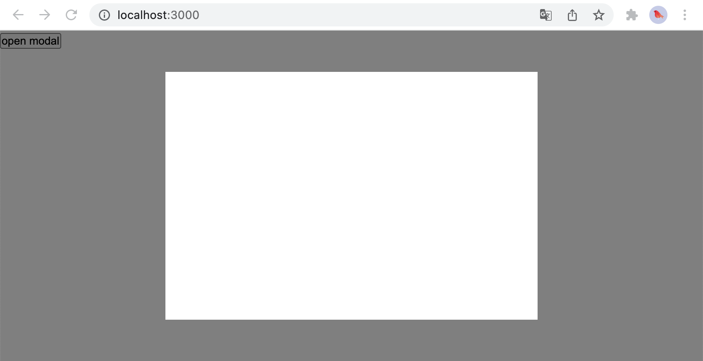

<span style="color: skyblue">实际的结果如下 ↓</span>

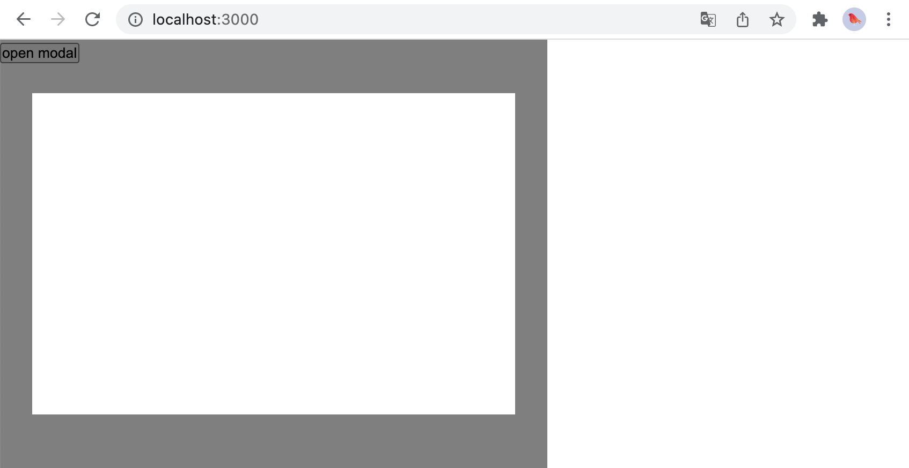

```react
// src/App.js
import { useState } from "react";
import Modal from "./Modal";

function App() {
  const [isOpen, setIsOpen] = useState(false);
  const appStyles = { width: "60%", height: 400, transform: "translate(0,0)" };
  return (
    <div style={appStyles}>
      <button onClick={() => setIsOpen(!isOpen)}>open modal</button>
      {isOpen ? <Modal /> : null}
    </div>
  );
}

export default App;
```

```react
// src/Modal.js
import styles from "./Modal.module.css";

function Modal() {
  return (
    <div className={styles.overlayer}>
      <div className={styles.content}></div>
    </div>
  );
}
export default Modal;

```

```css
/* src/Modal.module.css */ 
.overlayer {
  width: 100%;
  height: 100%;
  position: fixed;
  left: 0;
  top: 0;
  background: rgba(0, 0, 0, 0.5);
}
.content {
  width: 450px;
  height: 300px;
  background: #fff;
  position: absolute;
  left: 50%;
  top: 50%;
  transform: translate(-50%, -50%);
}
```

#### 2.8.2 传送门组件

通过 `ReactDOM.createPortal` 方法可以将指定组件渲染到指定位置。

```html
<!-- public/index.html -->
<div id="portal-root"></div>
```

```react
// src/Modal.js
import styles from "./Modal.module.css";
import ReactDOM from "react-dom";

function Modal() {
  return ReactDOM.createPortal(
    <div className={styles.overlayer}>
      <div className={styles.content}></div>
    </div>,
    document.getElementById("portal-root")
  );
}
export default Modal;
```

## 3. 组件化开发进阶

### 3.1 useState

#### 3.1.1 状态异步更新

设置状态的方法在调用后不会立即更新视图，而是要等到当前执行栈中所有代码执行完成以后再去更新视图，这是为了防止视图被频繁更新导致性能变差。

```react
import { useState } from "react";

function App() {
  const [count, setCount] = useState(0);
  const onClickHandler = () => {
    setCount(count + 1);
    console.log(count); // 此处的输出 count 值总是未更新前的
  };
  return <button onClick={onClickHandler}>{count}</button>;
}
```

题外话：如果开发者就想在 count 被更新后执行一些操作，可以通过 useEffect 方法监听状态变化。

#### 3.1.2 状态覆盖

当多次调用更新状态的方法时，如果参数类型不是函数，React 内部会进行状态的整体覆盖，即只有最后一次设置生效。

```react
function App() {
  const [obj, setObj] = useState({});
  const onClickHandler = () => {
    setObj({ a: 1 });
    setObj({ b: 1 });
    setObj({ c: 1 });
    setObj({ d: 1 });
    // 最终的状态结果就是 { d: 1 }
    // 注意这里是状态对象整体覆盖，而不是属性合并
  };
  return <button onClick={onClickHandler}>{JSON.stringify(obj)}</button>;
}
```

#### 3.1.3 状态合并

当多次调用更新状态的方法时，如果参数是函数类型，React 允许对状态进行合并操作，而不是整体无脑覆盖。

```react
function App() {
  const [obj, setObj] = useState({});
  const onClickHandler = () => {
    setObj((prev) => ({ ...prev, a: 1 }));
    setObj((prev) => ({ ...prev, b: 1 }));
    setObj((prev) => ({ ...prev, c: 1 }));
    setObj((prev) => ({ ...prev, d: 1 }));
    // 最终的状态结果就是 { a: 1, d: 1, c: 1, d: 1 }
    // 每一个 prev 参数都是上一次合并的结果
  };
  return <button onClick={onClickHandler}>{JSON.stringify(obj)}</button>;
}
```

#### 3.1.4 初始状态函数

在使用 useState 方法声明状态时，状态初始值只在组件初始渲染时用到，在以后的每次组件渲染中都不会用到，但是如果初始值中包含昂贵的计算，在每次组件重新渲染时都会被执行，导致组件性能变差。

```react
import { useState } from "react";

function App() {
  let inialState = 0;
  for (let i = 0; i < 100000000; i++) {
    inialState += i;
  }
  const [number, setNumber] = useState(inialState);
  return (
    <button onClick={() => setNumber((prev) => prev + 1)}>{number}</button>
  );
}

export default App;
```

以上代码中的问题可以使用初始状态函数解决，可以将初始状态的计算代码放入初始状态函数，因为初始状态函数只会被调用一次。

```react
import { useState } from "react";

function App() {
  const [number, setNumber] = useState(() => {
    let inialState = 0;
    for (let i = 0; i < 100000000; i++) {
      inialState += i;
    }
    return inialState;
  });
  return (
    <button onClick={() => setNumber((prev) => prev + 1)}>{number}</button>
  );
}

export default App;
```


### 3.2 useReducer

#### 3.2.1 概述

`useReducer` 是另一种在组件中声明状态管理状态的方式，它比较适合于处于复杂状态逻辑的场景，它是 useState 的增强方案。

当你在组件中使用 useState 方法来管理列表状态时，你需在状态列表中进行添加、更新、删除操作，此时你会发现管理状态的逻辑占据了组件主体的很大部分，这就是问题。因为 React 组件本身只应该包含用户界面的渲染逻辑，而状态管理不是，所以它应该被放在一个单独的地方进行管理，否则你的组件就会混合状态管理逻辑和渲染逻辑，这样的组件很难阅读和维护。

为了帮助开发者分离组件状态管理逻辑和用户界面渲染逻辑，React 提供了 `useReducer` 方法帮助开发者进行关注点分离。

#### 3.2.2 工作方式

要使用 useReducer 方法就必须遵循它的使用规则、了解它的工作流程。

action 对象：用于描述对组件状态进行怎样的操作。

dispatch 方法：用于触发对状态的操作，接收 action 对象作为参数。

reducer 方法：用于对状态进行集中操作的地方，返回操作之后的最新状态。

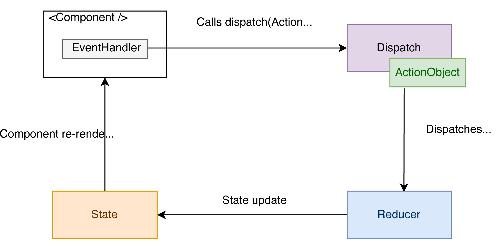

#### 3.2.3 计数器

```react
import { useReducer } from "react";

function reducer(state, action) {
  switch (action.type) {
    case "increment":
      return state + 1;
    case "decrement":
      return state - 1;
    default:
      return state;
  }
}

function Counter() {
  const [count, dispatch] = useReducer(reducer, 0);
  return (
    <>
      <button onClick={() => dispatch({ type: "increment" })}>{count}</button>
      <button onClick={() => dispatch({ type: "decrement" })}>{count}</button>
    </>
  );
}

export default Counter;
```

### 3.3 useLayoutEffect

#### 3.3.1 概述

`useLayoutEffect` 和 `useEffect` 两个方法的作用和使用方式都是一样的，都是用来处理副作用代码的，它们之间唯一的区别就是回调函数的执行时机不同。


`useEffect` 在组件视图更新完成后执行，组件状态发生变化 -> 比较状态差异 -> 视图更新 -> useEffect


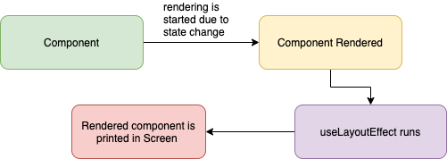


`useLayoutEffect` 在组件视图更新前执行，组件状态发生变化 -> 比较状态差异 -> useEffectLayout -> 更新视图

#### 3.3.2 基本使用

```react
import { useLayoutEffect, useRef, useState } from "react";

function App() {
  const [isShow, setIsShow] = useState(false);
  const divRef = useRef();
  // 此处如果使用 useEffect 就是出现元素闪烁问题
  // 就是元素先出现在原始位置, 再出现在目标位置
  useLayoutEffect(() => {
    if (!divRef.current) return;
    divRef.current.style.top = "100px";
  }, [isShow]);
  return (
    <>
      <button onClick={() => setIsShow(!isShow)}>button</button>
      {isShow ? (
        <div ref={divRef} style={{ position: "absolute" }}>
          div
        </div>
      ) : null}
    </>
  );
}
```

为什么在视图更新前可以获取到 `divRef.current` 并设置样式? 因为 React 内部在比较状态差异的过程中已经在内存中创建/更新了真实DOM对象。

### 3.4 useRef

#### 3.4.1 概述及示例

通过 `useRef` 方法不仅可以获取 DOM 对象，它还可以用于保存数据。

使用它保存的数据脱离组件渲染，也就是说，即使组件重新渲染值依然存在，而且值的改变不会引发视图更新。

需求：记录组件渲染次数

```react
import { useEffect, useRef, useState } from "react";

function App() {
  const [text, setText] = useState("");
  const renderCount = useRef(0);
  useEffect(() => {
    renderCount.current += 1;
  });
  return (
    <>
      <input
        type="text"
        value={text}
        onChange={(event) => setText(event.target.value)}
      />
      {renderCount.current}
    </>
  );
}
```

#### 3.4.2 疑惑

能不能不使用 useRef 方法而使用 useState 方法记录组件渲染次数 ?

答案是不能，因为通过 `useState` 方法声明的是组件状态，组件状态被改变会触发视图更新，一旦视图更新就要通过 count 记录更新次数，count 被改变又会触发视图更新，从而引发组件的无限次循环渲染。

```react
import { useEffect, useState } from "react";

function App() {
  const [text, setText] = useState("");
  const [count, setCount] = useState(0);
  useEffect(() => {
    setCount(count + 1);
  });
  return (
    <>
      <input
        type="text"
        value={text}
        onChange={(event) => setText(event.target.value)}
      />
      {count}
    </>
  );
}
```

### 3.5 memo

#### 3.5.1 问题代码示例

```react
// src/App.js
import { useEffect, useState } from "react";
import ShowName from "./ShowName";

function App() {
  const [index, setIndex] = useState(0);
  const [name] = useState("张三");
  useEffect(() => {
    const timer = setInterval(() => {
      setIndex((prev) => prev + 1);
    }, 1000);
    return () => clearInterval(timer);
  }, []);
  return (
    <>
      <p>{index}</p>
      <ShowName name={name} />
    </>
  );
}

export default App;
```

```react
// src/ShowName.js
import { useEffect } from "react";

function ShowName({ name }) {
  useEffect(() => {
    console.log("ShowName rendered");
  });
  return <div>{name}</div>;
}

export default ShowName;
```

以上代码的问题在于父组件更新引起了子组件的不必要更新，因为子组件本身是没有任何变化的是没有必要更新的。

#### 3.5.2 基本使用

memo 方法可以为组件添加输入数据 (props) 的比对逻辑，如果当前渲染时的输入数据和上一次渲染时的输入数据一致，阻止组件重新渲染。

```react
import { memo } from "react";

export default memo(ShowName);
```

memo 方法内部采用的是浅层比较，比较基本数据类型的值是否相同，比较引用类型是否为相同的引用地址。

以下代码在父组件每次重新渲染时都会生成新的 person 对象，memo 方法在内部比较时每次得到的都是不同的对象，所以每次子组件也会跟着重新渲染。

```react
<ShowName person={{ name: "张三" }} />
```

memo 方法的第二个参数即为比较函数，可以通过它解决以上问题。比较函数的第一个参数为 prevProps，比较函数的第二个参数为 nextProps, 比较函数返回 true 不进行渲染，比较函数返回 false 组件重新渲染。

```react
export default memo(ShowName, compareFunction);

function compareFunction(prevProps, nextProps) {
  if (prevProps.person.name === nextProps.person.name) {
    return true;
  }
  return false;
}
```


### 3.6 useMemo

#### 3.6.1 问题代码示例

```react
import { useState } from "react";

function App() {
  const [number, setNumber] = useState(0);
  const [dark, setDark] = useState(false);
  const styles = {
    background: dark ? "black" : "white",
    color: dark ? "white" : "black",
  };
  const double = slowFunction(number);
  return (
    <div>
      <input
        type="number"
        value={number}
        onChange={(event) => setNumber(event.target.value)}
      />
      <div style={styles} onClick={() => setDark(!dark)}>
        {double}
      </div>
    </div>
  );
}

function slowFunction(n) {
  for (let i = 0; i < 1000000000; i++) {}
  return n * 2;
}

export default App;
```

以上代码的问题之一在于每次组件重新渲染都会调用 `slowFunction` 方法导致组件渲染性能变差。

但其实只有 `number` 发生变化后才需要调用 `slowFunction`，而现在 `dark` 发生变化也会重新调用它。

以上代码的问题之二是每次组件重新渲染都会生成新的 `styles` 对象，导致不能在组件中有效监听 `styles` 对象的变化。

#### 3.6.2 基本使用

通过 `useMemo` 方法可以对组件中的值进行缓存，就是说在每次组件重新渲染时都返回相同的值，也可以指定哪些状态发生改变时重新计算该值。

`useMemo` 有助于避免在每个渲染上进行昂贵的计算，提示组件性能。

```react
import { useEffect, useMemo, useState } from "react";

function App() {
  const [number, setNumber] = useState(0);
  const [dark, setDark] = useState(false);
  const double = useMemo(() => {
    return slowFunction(number);
  }, [number]);
  const styles = useMemo(() => {
    return {
      background: dark ? "black" : "white",
      color: dark ? "white" : "black",
    };
  }, [dark]);
  useEffect(() => {
    console.log("styles");
  }, [styles]);
  return (
    <div>
      <input
        type="number"
        value={number}
        onChange={(event) => setNumber(event.target.value)}
      />
      <div style={styles} onClick={() => setDark(!dark)}>
        {double}
      </div>
    </div>
  );
}

function slowFunction(n) {
  for (let i = 0; i < 1000000000; i++) {}
  return n * 2;
}

export default App;
```

### 3.7 useCallback

#### 3.7.1 问题代码示例

```react
import { useEffect, useState } from "react";

function App() {
  const [number, setNumber] = useState(1);
  const [dark, setDark] = useState(false);
  const styles = {
    background: dark ? "black" : "white",
    color: dark ? "white" : "black",
  };
  const getItems = () => {
    return [number, number + 1, number + 2];
  };
  return (
    <div style={styles}>
      <input
        type="number"
        value={number}
        onChange={() => setNumber((prev) => prev + 1)}
      />
      <button onClick={() => setDark((dark) => !dark)}>button</button>
      <List getItems={getItems} />
    </div>
  );
}

function List({ getItems }) {
  const [items, setItems] = useState([]);
  
  useEffect(() => {
    setItems(getItems());
    console.log("update items");
  }, [getItems]);

  return (
    <div>
      {items.map((item) => (
        <p key={item}>{item}</p>
      ))}
    </div>
  );
}

export default App;
```

以上代码的问题在于每次组件重新渲染都会生成一个新的 getItems 方法，所以每次 List 组件接收的都是不一样的 getItems 方法，导致组件在不该被渲染的时候被渲染了。实际上只有 number 发生变化后 List 组件才需要被重新渲染，dark 发生变化 List 组件没必要重新渲染。

#### 3.7.2  基本使用

通过 `useCallback` 方法可以缓存函数，使用组件每次重新渲染都返回相同的函数实例，也可以指定当某个状态发生变化后返回新的函数实例。

```react
import { useCallback } from "react";

function App () {
  const getItems = useCallback(() => {
    return [number, number + 1, number + 2];
  }, [number]);
}
```

### 3.8 useImperativeHandle

#### 3.8.1 概述

虽然 React 遵循单项数据流原则，但凡事总有特殊情况，React 也提供了子组件向父组件传递数据方法。

通过 useImperativeHandle 方法可以实现父组件获取子组件的数据或者调用子组件的里声明的函数。

父组件通过 useRef 方法创建了一个钩子，用于钩取子组件的数据，子组件在获取到钩子以后，通过 useImperativeHandle 向钩子上暴露数据。

#### 3.8.2 代码示例

```react
// src/App.js
import { useRef } from "react";
import Message from "./Message";

function App() {
  const messageRef = useRef();
  const onClickHandler = () => {
    console.log(messageRef.current.getText());
  };
  return (
    <>
      <Message ref={messageRef} />
      <button onClick={onClickHandler}>button</button>
    </>
  );
}

export default App;
```

```react
// src/Message.js
import { forwardRef, useImperativeHandle, useState } from "react";

function Message(props, ref) {
  const [text, setText] = useState("");
  useImperativeHandle(ref, () => {
    return {
      getText() {
        return text;
      },
    };
  });
  return (
    <input
      type="text"
      value={text}
      onChange={(event) => setText(event.target.value)}
    />
  );
}

export default forwardRef(Message);
```

### 3.9 Custom Hooks

#### 3.9.1 概述

React 允许开发者创建自定义钩子函数用于向组件中添加功能。

自定义钩子函数其实就是应用逻辑和内置钩子函数的组合。

#### 3.9.2 useStorage

用于将组件状态实时同步到本地存储 localStorage。

```react
import { useState } from "react";

export function useLocalStorage(key, initialValue) {
  // 声明状态
  const [storedValue, setStoredValue] = useState(function () {
    // 看看本地是否存在已有状态值
    const item = window.localStorage.getItem(key);
    // 如果本地已经有了就用本地的, 否则使用 initialValue
    return item ? JSON.parse(item) : initialValue;
  });
  // 对设置状态的方法进行增强, 添加状态同步到本地存储的功能
  const setState = (value) => {
    // 获取新的状态值
    // 如果 value 是函数类型, 调用函数传递现有状态, 从返回值中获取新的状态
    // 如果 value 是其他类型, 直接作为状态值使用
    const valueToStore = value instanceof Function ? value(storedValue) : value;
    // 设置状态
    setStoredValue(valueToStore);
    // 将状态值同步到 localStorage
    localStorage.setItem(key, JSON.stringify(valueToStore));
  };
  // 返回状态及设置状态的方法
  return [storedValue, setState];
}
```

```react
function App() {
  const [name, setName] = useLocalStorage("name", "Bob");
  return (
    <div>
      <input
        type="text"
        placeholder="Enter your name"
        value={name}
        onChange={(e) => setName(e.target.value)}
      />
    </div>
  );
}
```

#### 3.9.3 useToggle

用于实现布尔值状态的切换。

```react
import { useCallback, useState } from "react";

export default function useToggle(initialValue = false) {
  const [state, setState] = useState(initialValue);
  const toggle = useCallback(() => {
    setState((state) => !state);
  }, []);
  return [state, toggle];
}
```

```react
function App() {
  const [isTextChanged, setIsTextChanged] = useToggle();
  return (
    <button onClick={setIsTextChanged}>
      {isTextChanged ? "Toggled" : "Click to Toggle"}
    </button>
  );
}
```

#### 3.9.4 useAsync

用于执行异步代码并为异步过程添加状态。

```react
import { useCallback, useEffect, useState } from "react";

export default function useAsync(asyncFunction, immediate = false) {
  const [status, setStatus] = useState("idle");
  const [value, setValue] = useState(null);
  const [error, setError] = useState(null);

  const execute = useCallback(() => {
    setStatus("pending");
    setValue(null);
    setError(null);

    return asyncFunction()
      .then((response) => {
        setValue(response);
        setStatus("success");
      })
      .catch((error) => {
        setError(error);
        setStatus("error");
      });
  }, [asyncFunction]);

  useEffect(() => {
    if (immediate) {
      execute();
    }
  }, [execute, immediate]);

  return { execute, status, value, error };
}
```

```react
import useAsync from "./useAsync";

const myFunction = () => {
  return new Promise((resolve, reject) => {
    setTimeout(() => {
      const rnd = Math.random() * 10;
      rnd <= 5 ? resolve("成功 🙌") : reject("失败 😞");
    }, 2000);
  });
};

function App() {
  const { status, value, error, execute } = useAsync(myFunction);
  return (
    <div>
      {status === "idle" && <div>Start your journey by clicking a button</div>}
      {status === "success" && <div>{value}</div>}
      {status === "error" && <div>{error}</div>}
      <button onClick={execute} disabled={status === "pending"}>
        {status !== "pending" ? "Click me" : "Loading..."}
      </button>
    </div>
  );
}

export default App;
```

#### 3.9.5 useHover

用于检测元素的鼠标移入移除操作。

```react
import { useEffect, useRef, useState } from "react";

export default function useHover() {
  const [value, setValue] = useState(false);
  const elementRef = useRef();
  const handleMouseEnter = () => setValue(true);
  const handleMouseLeave = () => setValue(false);

  useEffect(() => {
    const node = elementRef.current;
    if (!node) return;
    node.addEventListener("mouseenter", handleMouseEnter);
    node.addEventListener("mouseleave", handleMouseLeave);
    return () => {
      node.removeEventListener("mouseenter", handleMouseEnter);
      node.removeEventListener("mouseleave", handleMouseLeave);
    };
  }, []);

  return [elementRef, value];
}
```

```react
import useHover from "./useHover";

function App() {
  const [hoverRef, isHovered] = useHover();
  return <div ref={hoverRef}>{isHovered ? "😁" : "☹️"}</div>;
}

export default App;
```

#### 3.9.6 useWindowSize

用于获取浏览器的窗口大小。

```react
import { useEffect, useState } from "react";

export default function useWindowSize() {
  const [windowSize, setWindowSize] = useState({
    width: undefined,
    height: undefined,
  });
  useEffect(() => {
    const handleResize = () => {
      setWindowSize({
        width: window.innerWidth,
        height: window.innerHeight,
      });
    };
    window.addEventListener("resize", handleResize);
    handleResize();
    return () => window.removeEventListener("resize", handleResize);
  }, []);
  return windowSize;
}
```

```react
import useWindowSize from "./useWindowSize";

function App() {
  const size = useWindowSize();
  return (
    <div>
      {size.width}px / {size.height}px
    </div>
  );
}

export default App;
```

#### 3.9.7 useReducerAsync

通过 useReducerAsync 自定义钩子函数可以实现在 useReducer 的工作流程中融入副作用代码。

首先看一段没有该钩子函数的代码，需求是在点击按钮时获取id值为1的任务对象。

```react
import axios from "axios";
import { useReducer } from "react";

const initialState = [];

function reducer(state, action) {
  switch (action.type) {
    case "setTodo":
      return [...state, action.payload];
    default:
      return state;
  }
}

function App() {
  const [state, dispatch] = useReducer(reducer, initialState);
  const onClickHandler = async (id) => {
    let response = await axios.get(
      `https://jsonplaceholder.typicode.com/todos/${id}`
    );
    dispatch({ type: "setTodo", payload: response.data });
  };
  return (
    <div>
      <button onClick={() => onClickHandler(1)}>button</button>
      <div>{JSON.stringify(state, null, 2)}</div>
    </div>
  );
}

export default App;
```

以上代码的问题在于，任务状态的处理有一部分在组件内部一部分在组件外部，代码过于分散。

通过 [useReducerAsync](https://github.com/dai-shi/use-reducer-async) 自定义钩子函数可以将处理状态过程中的副作用代码抽离到组件外部。

`npm install use-reducer-async`

```react
import { useReducerAsync } from "use-reducer-async";
import axios from "axios";

const initialState = [];

function reducer(state, action) {
  switch (action.type) {
    case "setTodo":
      return [...state, action.payload];
    default:
      return state;
  }
}

const asyncHandlers = {
  loadTodo:
    ({ dispatch }) =>
    async (action) => {
      let response = await axios.get(
        `https://jsonplaceholder.typicode.com/todos/${action.payload}`
      );
      dispatch({ type: "setTodo", payload: response.data });
    },
};

function App() {
  const [state, dispatch] = useReducerAsync(
    reducer,
    initialState,
    asyncHandlers
  );
  return (
    <div>
      <button onClick={() => dispatch({ type: "loadTodo", payload: 1 })}>
        button
      </button>
      <div>{JSON.stringify(state, null, 2)}</div>
    </div>
  );
}

export default App;
```

### 3.10 Children

#### 3.10.1 only

通过 `Children.only` 方法可以限制组件标签只接收一个子元素。

```react
import Message from "./Message";

function App() {
  // 不允许 Message 组件标签传入多个子元素, 需要对这种情况进行限制
  return (
    <Message>
      <p>Hello</p>
      <p>Hello</p>
    </Message>
  );
}
```

```react
import { Children } from "react";

function Message(props) {
  try {
    Children.only(props.children);
  } catch (error) {
    // Error: React.Children.only expected to receive a single React element child.
    // 错误: React.children 只期望接收一个 React 元素
    return <div>Message 组件标签只接收一个子元素 </div>;
  }
  return <div>{props.children}</div>;
}
```

#### 3.10.2 count

通过 `Children.count` 方法可以获取组件标签传入的子元素的数量。

```react
import { Children } from "react";

function Message(props) {
  return <div>{Children.count(props.children)}</div>;
}
```

#### 3.10.3 map

通过 `Children.map` 方法可以对组件标签内部的子元素进行转换操作。

```react
function App() {
  return (
    <Message>
      
      
      
      
    </Message>
  );
}
```

```react
import { Children } from "react";

function Message(props) {
  const items = Children.map(props.children, (item) => (
    <a href="http://www.baidu.com">{item}</a>
  ));
  return <div>{items}</div>;
}
```

#### 3.10.4 toArray

`props.children` 内存储多个值时是数组类型，存储一个值时为对象类型。

通过 `Children.toArray` 方法可以将 `props.children` 转换为数组类型，以保证 `Children.map` 方法永远有用。

```react
// src/App.js
import ImageToggle from "./ImageToggle";

function App() {
  return (
    <ImageToggle>
      
      
      
      
    </ImageToggle>
  );
}
```

```react
// src/ImageToggle.js
import { useEffect, useState, Children } from "react";

function ImageToggle(props) {
  const [state, setState] = useState({
    current: 0,
    total: 0,
  });
  useEffect(() => {
    setState((prev) => ({ ...prev, total: Children.count(props.children) }));
  }, [props.children]);

  useEffect(() => {
    const timer = setInterval(showNext, 2000);
    return () => clearInterval(timer);
  }, []);

  const showNext = () => {
    setState(({ current, total }) => {
      return {
        total,
        current: current + 1 === total ? 0 : current + 1,
      };
    });
  };
  return <div>{Children.toArray(props.children)[state.current]}</div>;
}
```

### 3.11 Context

#### 3.11.1 已知问题

在 React 中虽然使用 Context 可以方便的实现组件之间的状态共享，但是如果使用不当就会产生严重的性能问题。 

当多个组件使用了 Context 中的不同的状态时，只要 Context 中的某一个状态发生改变，使用了其他状态的其他组件也会重新渲染。

```react
// src/Context.js
import { createContext, useState } from "react";

export const AppContenxt = createContext();

export function AppProvider({ children }) {
  const [state, setState] = useState({
    foo: "foo context",
    bar: "bar context",
  });
  return (
    <AppContenxt.Provider value={[state, setState]}>
      {children}
    </AppContenxt.Provider>
  );
}
```

```react
// src/App.js
import Bar from "./Bar";
import { AppProvider } from "./Context";
import Foo from "./Foo";

function App() {
  return (
    <AppProvider>
      <Foo />
      <Bar />
    </AppProvider>
  );
}

export default App;
```

```react
// src/Foo.js
import { useContext, useEffect } from "react";
import { AppContenxt } from "./Context";

function Foo() {
  const [appContext, setAppContext] = useContext(AppContenxt);
  useEffect(() => {
    console.log("Foo render");
  });
  const onClickHandler = () => {
    setAppContext((state) => ({ ...state, foo: "foo contenxt changed" }));
  };
  return (
    <div>
      {appContext.foo} <button onClick={onClickHandler}>foo button</button>
    </div>
  );
}

export default Foo;
```

```react
// src/Bar.js
import { useContext, useEffect } from "react";
import { AppContenxt } from "./Context";

function Bar() {
  const [appContext] = useContext(AppContenxt);
  useEffect(() => {
    console.log("Bar render");
  });
  return <div>{appContext.bar}</div>;
}

export default Bar;
```

#### 3.11.2 解决方案

##### 1. 拆分 Context

```react
// src/FooContext.js
import { createContext, useState } from "react";

export const FooContext = createContext();

export function FooProvider({ children }) {
  const [foo, setFoo] = useState("foo context");
  return (
    <FooContext.Provider value={[foo, setFoo]}>{children}</FooContext.Provider>
  );
}
```

```react
// src/BarContext.js
import { createContext, useState } from "react";

export const BarContext = createContext();

export function BarProvider({ children }) {
  const [bar, setBar] = useState("bar context");
  return (
    <BarContext.Provider value={[bar, setBar]}>{children}</BarContext.Provider>
  );
}
```

```react
// src/App.js
import Bar from "./Bar";
import Foo from "./Foo";
import { BarProvider } from "./BarContext";
import { FooProvider } from "./FooContext";

function App() {
  return (
    <>
      <FooProvider>
        <Foo />
      </FooProvider>
      <BarProvider>
        <Bar />
      </BarProvider>
    </>
  );
}

export default App;
```

```react
// src/Foo.js
import { useContext, useEffect } from "react";
import { FooContext } from "./FooContext";

function Foo() {
  const [foo, setFoo] = useContext(FooContext);
  useEffect(() => {
    console.log("Foo render");
  });
  return (
    <div>
      {foo}
      <button onClick={() => setFoo("foo contenxt changed")}>foo button</button>
    </div>
  );
}

export default Foo;
```

```react
// src/Bar.js
import { useContext, useEffect } from "react";
import { BarContext } from "./BarContext";

function Bar() {
  const [bar] = useContext(BarContext);
  useEffect(() => {
    console.log("Bar render");
  });
  return <div>{bar}</div>;
}

export default Bar;
```

##### 2. 拆分组件

```react
// src/Bar.js
import { memo, useContext, useEffect } from "react";
import { AppContenxt } from "./Context";

function Bar() {
  const [appContext] = useContext(AppContenxt);
  return <BarContext bar={appContext.bar} />;
}

const BarContext = memo((props) => {
  useEffect(() => {
    console.log("BarContext render");
  });
  return <div>{props.bar}</div>;
});

export default Bar;
```

##### 3. 缓存状态

```react
import { useContext, useMemo } from "react";
import { AppContenxt } from "./Context";

function Bar() {
  const [appContext] = useContext(AppContenxt);
  const bar = appContext.bar;
  return useMemo(() => {
    console.log("bar render");
    return <div>{bar}</div>;
  }, [bar]);
}

export default Bar;
```

## 4. 全局状态管理

全局状态管理是组件状态管理的另一种思路，传统的组件状态由组件管理，组件状态在组件之间通过 props 传递，传递和更改状态使组件代码变得复杂。

全局状态管理是指组件状态被状态仓库集中管理，组件从仓库中获取状态，组件通过特定方式更改仓库中的状态。

全局状态管理使组件状态共享变得简单。

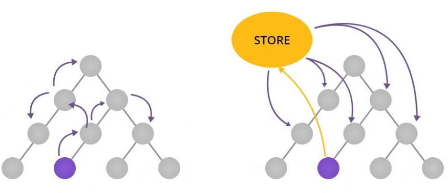

### 4.1 Redux

#### 4.1.1 概述

[Redux](https://redux.js.org/) 是最为流行的用于实现全局状态管理的第三方库，它的核心功能是提供了状态管理规则以及相应的状态管理API。

[React Redux](https://react-redux.js.org/) 是和 Redux 配合使用的，它提供了组件获取状态的方式并在状态更新后更新组件。

```bash
npm install redux@4.1.2 react-redux@7.2.6
```

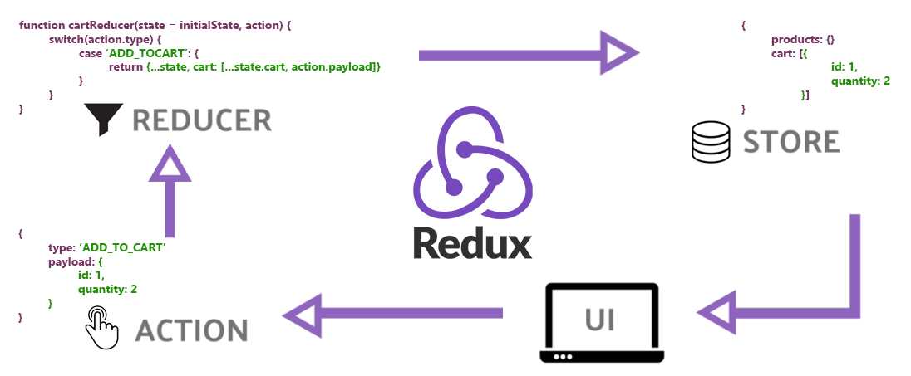

#### 4.1.2 光速入门

1. 创建用于存储状态的 Store 对象

   ```react
   // 从 redux 中导入 createStore 方法
   // createStore 方法用于创建存储状态的 Store 对象
   import { createStore } from "redux";
   // createStore 方法的第一个参数是一个函数, 函数函数返回什么, Store 中就存储什么, 我们通常将这个函数命名为 reducer
   // createStore 方法的第二个参数是状态的初始值
   // createStore 方法的返回值就是用于存储状态的 Store 对象
   const store = createStore(reducer, {count: 0});
   // 测试代码 -> 获取 store 中存储的状态
   console.log(store.getState())
   ```

2. 创建用于返回状态的 reducer 函数

   ```react
   // reducer 函数的第一个参数是状态
   // 状态的初始值就是通过 createStore 方法的第二个参数指定的
   // 目前状态的值是一个对象 对象中存储了 count 属性, 值为 0
   function reducer(state) {
     // 返回状态, reducer 函数返回什么, Store 对象中就存储什么
     return state;
   }
   ```

3. 搭建"天梯"，通过"天梯"打通组件从 Store 对象中获取状态的通道

   ```react
   // 从 react-redux 中导入 Provider 组件
   // Provider 组件就是"天梯", 有了它组件就可以从 Store 对象中获取状态了
   import { Provider } from "react-redux";
   
   // 将天梯组件作为应用的根组件, 这样做以后应用中的任何组件就都可以从 Store 中获取状态了
   // 将 store 对象挂载到"天梯"中
   ReactDOM.render(
     <Provider store={store}>
       <App />
     </Provider>,
     document.getElementById("root")
   );
   ```

4. 组件从 Store 中获取状态并渲染状态

   ```react
   // 从 react-redux 中导入 useSelector 钩子函数
   // 它是用于从 Store 中获取状态的
   import { useSelector } from "react-redux";
   
   function App() {
     // 在组件中调用 useSelector 方法从 Store 对象中获取状态
     // 我们在调用 useSelector 方法时需要传递一个回调函数
     // useSelector 方法内部在调用这个函数时通过参数的方式将状态传递给我们, 即当前代码中的 state 参数
     // 我们在拿到 state 参数以后, 可以将它作为回调函数的返回值, 或者再从参数内部找到你想要的状态, 再作为返回值进行返回
     // useSelector 方法的返回值就是回调函数的返回值, 就是我们想要获取的状态值
     const count = useSelector((state) => state.count);
     return <div>{count}</div>;
   }
   ```

5. 在组件中通过 dispatch 方法发送更改状态的指令 ( action )

   ```react
   // 从 react-redux 导入 useDispatch 钩子函数
   // 该钩子函数用于在组件中获取 dispatch 方法
   import { useDispatch } from "react-redux";
   
   function App() {
     // 在组件中通过调用 useDispatch 钩子函数获取 dispatch 方法
     // dispatch 方法用于发送更改状态的指令
     const dispatch = useDispatch();
     // 在点击 div 时调用 dispatch 方法发送用于更改状态的指令
     // 指令就是 action 对象, 通过 action 中的 type 属性描述要对状态进行怎样的操作
     // type 属性的值由开发者自定义
     return <div onClick={() => dispatch({ type: "increment" })}>{count}</div>;
   }
   ```

6. 在 reducer 中接收更改状态的指令并根据指令对状态进行更改

   ```react
   // reducer 函数的第二个参数是 action 对象
   // 其实就是在调用 dispatch 方法时传递的参数对象 (用于描述如果更改状态的指令)
   function reducer(state, action) {
     // 在 reducer 函数中对 action 对象中的 type 值进行匹配
     // 不同的 type 值表示要对状态进行不同的操作
     switch (action.type) {
       // 如果 type 属性值时 "increment", 表示要对当前状态值进行 +1 操作
       case "increment":
         // 对状态进行操作并将操作结果作为 reducer 函数的返回值
         // 返回新的状态, 表示更新 Store 对象中存储的状态值
         // Store 中的状态被更新了会触发使用了该状态的组件的自动更新
         // 注意: 不能对原有状态进行直接修改, 比如 return state.count + 1, 这样的代码不合规, 必须返回新状态对象
         return {count: state.count + 1};
       default:
         // 如果所有的 action.type 都没有匹配上就默认返回当前状态值
         // 切记 reducer 函数一定要有返回值
         return state;
     }
   }
   ```

7. 在发送更改状态的指令时传递参数，比如让状态加任意值，我传什么值它就加什么值

   ```react
   function App() {
     // 在 action 对象中除了可以有 type 属性以外, 还可以有其他的自定义属性及值
     // 当前我们就添加一个自定义的 payload 属性作为参数, 值为 5
     // 也就是说当点击 div 时, 让状态在当前值的基础上 +5
     return (
       <div onClick={() => dispatch({ type: "increment", payload: 5 })}>
         {count}
       </div>
     );
   }
   ```

   ```react
   function reducer(state, action) {
     switch (action.type) {
       case "increment":
         // 从 action 对象中获取 payload 参数,
         // 将当前状态值和参数进行相加并返回结果
         return {count: state.count + action.payload};
     }
   }
   ```

#### 4.1.3 action creator

需求：在组件中添加两个按钮，点击第一个按钮时让数值 +5，点击第二个按钮时让数值 +10。

你的代码可能会很自然的写成下面这样：

```react
function App() {
  const count = useSelector((state) => state.count);
  const dispatch = useDispatch();
  return (
    <div>
      {count}
      <button onClick={() => dispatch({ type: "increment", payload: 5 })}>
        +5
      </button>
      <button onClick={() => dispatch({ type: "increment", payload: 10 })}>
        +10
      </button>
    </div>
  );
}
```

在以上代码中存在一个问题，就是多次调用了 dispatch 方法，每次调用它的都传递了 action 对象，而这个参数对象属于冗余代码，可以被简化。

按照思路我们可以将以上代码改成下面这样，为了简化代码，我们将 action 对象提取了出来。

```react
const increment = { type: "increment", payload: 5 };

function App() {
  const count = useSelector((state) => state.count);
  const dispatch = useDispatch();
  return (
    <div>
      {count}
      <button onClick={() => dispatch(increment)}>+5</button>
      <button onClick={() => dispatch(increment)}>+10</button>
    </div>
  );
}
```

但是改成这样以后，payload 属性的值就无法动态化了，所以为了传递参数，我们对代码做出了更改。

```react
import { useDispatch, useSelector } from "react-redux";

// action creator 函数: 返回 action 对象的函数
const increment = (payload) => ({ type: "increment", payload });

function App() {
  const count = useSelector((state) => state.count);
  const dispatch = useDispatch();
  return (
    <div>
      {count}
      <button onClick={() => dispatch(increment(5))}>+5</button>
      <button onClick={() => dispatch(increment(10))}>+10</button>
    </div>
  );
}
```

在 Redux 中，返回 action 对象的函数被叫做 action creator 函数。

#### 4.1.4 combineReducers

目前在 store 中只存储了一个状态，当 store 中存储多个状态的时候会存在什么问题呢?

需求：新建 Message 组件，该组件负责发送消息，发送的消息需要被存储在 store 中。

```react
// src/Message.js
import { useRef } from "react";
import { useDispatch, useSelector } from "react-redux";

const saveMessage = (payload) => ({ type: "save_message", payload });

function Message() {
  // 和 input 进行绑定, 用于获取用户在文本框中输入的内容
  const inputRef = useRef();
  // 获取用于发送指令的 dispatch 方法
  const dispatch = useDispatch();
  // 从 store 中获取状态
  const message = useSelector((state) => state.message);
  // 用户发送 message 的方法
  const onMessageSendHandler = () => dispatch(saveMessage(inputRef.current.value));
  return (
    <>
      <input ref={inputRef} />
      <button onClick={onMessageSendHandler}>send</button>
      {message}
    </>
  );
}
```

```react
// src/index.js
// 在状态初始值中加入 message
export const store = createStore(reducer, { count: 0, message: "" });
```

```react
// src/index.js
function reducer(state, action) {
  switch (action.type) {
    case "increment":
      // 在修改状态时, 要先获取到原有状态, 在原有状态的基础上创建新状态, 返回新状态
      return { ...state, count: state.count + action.payload };
    // 在 reducer 函数中加入处理 message 状态的代码
    case "save_message":
      return { ...state, message: action.payload };
    default:
      return state;
  }
}
```

以上代码存在两个问题，第一个是当状态变得庞大时 reducer 函数一定会变得庞大，第二个是 reducer 函数在处理多个不相关的状态。

为解决上述问题，为提高代码的可维护性，Redux 允许开发者对状态进行分类，通过编写多个 reducer 函数对不同的状态进行处理。

虽然 Redux 允许存在多个 reducer 函数，但最终 createStore 方法只接收一个，就是说 reducer 函数们最终要被合并，createStore 方法只接收合并结果。

第一步：对 reducer 函数进行拆分，将一个 reducer 函数拆分为多个 reducer 函数

```react
// counter 状态的初始值
// 一个大的 reducer 函数被拆分成了多个小的 reducer 函数，每个 reducer 函数负责处理不同的状态
// 每个 reducer 函数处理的状态又都会有初始值，由于原来的一个状态的初始值变成了现在的多个状态的初始
// 所以这个初始值就不能通过 createStore 方法的第二个参数传递了
// 所以现在状态的默认值改成了通过函数参数默认值的方式进行传递
const counterInitialState = { count: 0 };

// counterReducer 函数用于处理并返回和 counter 相关的状态
function counterReducer(state = counterInitialState, action) {
  switch (action.type) {
    case "increment":
      return { count: state.count + action.payload };
    default:
      return state;
  }
}
```

```react
const messageInitialState = { value: "" };

// messageReducer 函数用于处理并返回和 message 相关的状态
function messageReducer(state = messageInitialState, action) {
  switch (action.type) {
    case "save_message":
      return { value: action.payload };
    default:
      return state;
  }
}
```

第二步：合并 reducer 函数，因为 createStore 方法要接收最终被合并之后的 reducer 函数。

```react
// combineReducers 方法的参数是一个对象, 这个对象就是 Store 对象中存储的状态对象
// 对象中的属性就是状态属性，属性值就是用于返回状态的 reducer 函数
// 所以现在用于存储状态的 store 对象长成这样: {counter: {count: 0}, message: {value: ""}}
// combineReducers 方法的返回值就是合并好的 reducer 函数, 我们可以将它传递给 createStore 方法
// reducer 函数状态拆分是为了方便代码维护，reducer 函数合并是为了将 reducer 函数作为参数传递给 createStore 方法
const reducers = combineReducers({
  counter: counterReducer,
  message: messageReducer,
});
```

```react
// 将合并之后的 rootReducer 函数作为 createStore 方法的参数
// 同时去除原本的第二个参数, 状态初始值
export const store = createStore(reducers);
```

在组件中重新获取状态，因为 store 对象中存储的数据层级发生了变化。

```react
function App() {
  const count = useSelector((state) => state.counter.count);
}
```

```react
function Message() {
  const message = useSelector((state) => state.message.value);
}
```

#### 4.1.5 代码重构

1. 在 src 目录下创建 state 文件夹，用于存放和全局状态相关的代码。

2. 在 state 目录下创建 reducers 文件夹用于存放 reducer 函数

   ```react
   // src/state/reducers/counter.js
   const initialState = { count: 0 };
   
   export default function counterReducer(state = initialState, action) {
     switch (action.type) {
       case "increment":
         return { count: state.count + action.payload };
       default:
         return state;
     }
   }
   ```

   ```react
   // src/state/reducers/message.js
   const initialState = { value: "" };
   
   export default function messageReducer(state = initialState, action) {
     switch (action.type) {
       case "save_message":
         return { value: action.payload };
       default:
         return state;
     }
   }
   ```

   ```react
   // src/state/reducers/index.js
   import { combineReducers } from "redux";
   import counterReducer from "./counter";
   import messageReducer from "./message";
   
   const rootReducer = combineReducers({
     counter: counterReducer,
     message: messageReducer,
   });
   
   export default rootReducer;
   ```

3. 在 state 目录新建 store.js 文件，用于存放创建 store 对象的代码。

   ```react
   // src/state/store.js
   import { createStore } from "redux";
   import reducers from "./reducers";
   
   export const store = createStore(reducers);
   ```

4. 在 store 目录下创建 action-creators 文件夹，用于存放 action creator 代码

   ```react
   // src/state/action-creators/counter.js
   export const increment = (payload) => ({ type: "increment", payload });
   ```

   ```react
   // src/state/action-creators/message.js
   export const saveMessage = (payload) => ({ type: "save_message", payload });
   ```

   ```react
   // src/state/action-creators/index.js
   export * from "./counter";
   export * from "./message";
   ```

5. 在 state 目录下新建 index.js 文件，作为 state 文件夹下模块的导入口

   ```react
   export * as actionCreators from "./action-creators";
   export * from "./store";
   ```

6. 在应用入口文件中导入 store

   ```react
   import { store } from "./state";
   ```

6. 在组件中导入 action creator

   ```react
   import { increment } from "./state";
   import { saveMessage } from "./state";
	```

#### 4.1.6 actionType 常量

action 对象中的 type 属性值是一个字符串，我们要将它抽象成常量值，为什么呢？

1. 防止字符串书写错误，因为这个字符串既在 action creator 函数中用到，又在 reducer 函数中用到，而字符串在代码编辑器中是没有提示的。
2. 方便修改，在后续的代码编辑中，很可能认识到之前定义的值不合适。

```react
// src/state/action-types/counter.js
export const INCREMENT = "increment";
```

```react
// src/state/action-types/message.js
export const SAVE_MESSAGE = "save_message";
```

```react
// src/state/action-creators/counter.js
import { INCREMENT } from "../action-types/counter";

export const increment = (payload) => ({ type: INCREMENT, payload });
```

```react
// src/state/action-creators/message.js
import { SAVE_MESSAGE } from "../action-types/message";

export const saveMessage = (payload) => ({ type: SAVE_MESSAGE, payload });
```

```react
// src/state/reducers/counter.js
import { INCREMENT } from "../action-types/counter";

export default function counterReducer(state = initialState, action) {
  switch (action.type) {
    case INCREMENT:
  }
}
```

```react
// src/state/reducers/message.js
import { SAVE_MESSAGE } from "../action-types/message";

export default function messageReducer(state = initialState, action) {
  switch (action.type) {
    case SAVE_MESSAGE:
  }
}
```

#### 4.1.7 bindActionCreators

组件：每个组件只要获取状态就都需要获取 dispatch，都需要导入 actionCreator 并传入 dispatch。此处代码可以通过 `bindActionCreators` 方法简化。

```react
import { useDispatch } from "react-redux";
import { bindActionCreators } from "redux";
import { actionCreators } from "../state";

export const useActions = () => {
  const dispatch = useDispatch();
  return bindActionCreators(actionCreators, dispatch);
};

/**
 * actionCreators => {searchPackages: (){}}
 * bindActionCreators => {searchPackages: dispatch(searchPackages)}
 */
```

#### 4.1.8 中间件函数

##### 1. 中间件函数概述

默认的 Redux 工作流程只能处理同步状态，但在实际的项目开发中状态的获取、更新、删除等都需要通过异步来实现，那么如何在 Redux 中实现异步呢？

Redux 提供了中间件机制供开发者处理副作用代码，中间件其实就是一堆依次执行的函数，一堆供开发者执行副作用的函数。

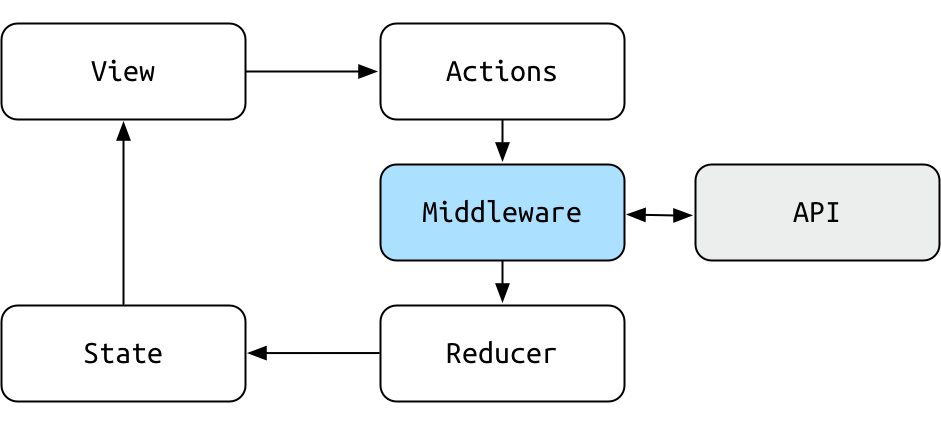

创建中间件函数要遵循中间件函数的创建规则，以下是创建中间件函数的模板代码。

```javascript
function middleware(store) {
  return function (next) {
    return function (action) {
      next(action)
    }
  }
}
// 注意: 当 Action 被触发后，执行的是最里层函数，外层函数是用来传递参数的，只有初始化时执行。
```

##### 2. 创建中间件函数

需求：创建一个用于输出 action 对象的中间件函数，当组件调用 dispatch 方法发送指令时，在控制台输出指令 action 对象。

`src/store/middlewares/logger.js`

```javascript
// logger 是中间件的名字, 它的作用是当组件发送操作状态的指令action对象时, 在控制台中输出该 action 对象
const logger = (store) => (next) => (action) => {
  // store, 对象类型, store.dispatch、store.getState
  // 中间件函数内部的自定义逻辑
  console.log(action);
  // 当前的中间件函数执行完成后必须调用 next 方法, 使 redux 流程继续向前走, 否则代码会卡在当前函数中.
  // 调用 next 方法时必须将 action 对象作为参数, 否则下一个中间件函数或者 reducer 就不知道当前要做什么事情了.
  next(action);
};

export default logger;
```

##### 3. 注册中间件函数

`src/store/index.js`

```react
import { applyMiddleware } from "redux";
import logger from "./middlewares/logger";

export const store = createStore(rootReducer, applyMiddleware(logger));
```

中间件函数是可以批量注册的，当存在多个中间件时，中间函数是按照 applyMiddleware 方法的参数顺序执行的。

```react
import logger from "./middlewares/logger";
import speak from "./middlewares/speak";

// 先执行 speak, 后执行 logger
export const store = createStore(rootReducer, applyMiddleware(speak, logger));
```

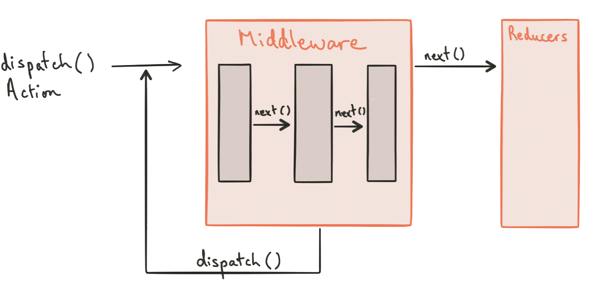

##### 4. 状态调试工具

1. 在谷歌浏览器中安装 [Redux DevTools](https://chrome.google.com/webstore/detail/redux-devtools/lmhkpmbekcpmknklioeibfkpmmfibljd?hl=zh-CN)

2. 在应用中安装 `redux-devtools-extension` 

3. 在应用中进行配置以开启调试工具

   ```javascript
   import { composeWithDevTools } from 'redux-devtools-extension';
   const store = createStore(reducer, composeWithDevTools(applyMiddleware(thunk)))
   ```

##### 5. redux-thunk

redux-thunk 是 Redux 官方提供的用于在 Redux 工作流程中加入异步代码的中间件。

需求：向 npm 发送请求加载 npm 包列表信息。

第一步：下载 redux-thunk 中间件

```bash
npm install redux-thunk axios
```

第二步：注册 redux-thunk 中间件

```react
// src/state/store.js
import { applyMiddleware } from "redux";
import thunk from "redux-thunk";

export const store = createStore(reducers, applyMiddleware(thunk));
```

第三步：设计并定义 Action Type

```react
// src/state/action-types/packages.action.type.js
export const SEARCH_PACKAGES = "search_packages";
export const SEARCH_PACKAGES_SUCCESS = "search_packages_success";
export const SEARCH_PACKAGES_ERROR = "search_packages_error";
```

第四步：在 Reducer 函数中匹配 Action Type 并返回对应的新状态

```react
// src/state/reducers/packages.reducer.js
import { 
  SEARCH_PACKAGES, 
  SEARCH_PACKAGES_SUCCESS, 
  SEARCH_PACKAGES_ERROR 
} from "../action-types/packages.action.type.js";

const initialState = {
  list: [],
  loading: false,
  error: null,
};

export default function packagesReducer(state = initialState, action) {
  switch (action.type) {
    case SEARCH_PACKAGES:
      return {
        loading: true,
        error: null,
        list: [],
      };
    case SEARCH_PACKAGES_SUCCESS:
      return {
        loading: false,
        error: null,
        list: action.payload,
      };
    case SEARCH_PACKAGES_ERROR:
      return {
        loading: false,
        error: action.error,
        list: [],
      };
    default:
      return state;
  }
}
```

第五步：创建 Action Creator 函数并在其中完成异步逻辑

在使用了 Redux Thunk 中间件以后，dispatch 方法可以接收一个函数作为参数，也就是说在 Action Creator 函数中可以再返回一个函数，我们需要在这个函数中完成异步操作，在该函数中根据异步流程更改 Store 中对应的状态。

```react
// src/state/action-creators/packages.action.creator.js
import axios from "axios";
import {
  SEARCH_PACKAGES,
  SEARCH_PACKAGES_ERROR,
  SEARCH_PACKAGES_SUCCESS,
} from "../action-types/packages.action.type";

export const searchPackages = (key) => async (dispatch) => {
  dispatch({ type: SEARCH_PACKAGES });
  try {
    const { data } = await axios.get(`https://registry.npmjs.org/-/v1/search`, {
      params: {
        text: key,
      },
    });
    dispatch({
      type: SEARCH_PACKAGES_SUCCESS,
      payload: data.objects.map((item) => item.package.name),
    });
  } catch (error) {
    dispatch({ type: SEARCH_PACKAGES_ERROR, error: error.message });
  }
};
```

第六步：在组件中实现对 npm 包的搜索

```react
import { useRef } from "react";
import { useDispatch, useSelector } from "react-redux";
import { searchPackages } from "./state/action-creators/packages.action.creator";

export default function App() {
  const dispatch = useDispatch();
  const packages = useSelector((state) => state.packages);
  const inputRef = useRef();

  const getPackages = () => {
    if (packages.loading) {
      return <div>loading...</div>;
    }
    if (packages.error) {
      return <div>{packages.error}</div>;
    }
    return (
      <div>
        <pre>{JSON.stringify(packages, null, 2)}</pre>
      </div>
    );
  };

  return (
    <>
      <input type="text" ref={inputRef} />
      <button onClick={() => dispatch(searchPackages(inputRef.current.value))}>
        search
      </button>
      {getPackages()}
    </>
  );
}
```

##### 6. redux-thunk 原理

```react
// createThunkMiddleware 方法用于返回中间件函数
function createThunkMiddleware(extraArgument) {
  // 返回中间件函数
  return ({ dispatch, getState }) => next => action => {
    // 如果 action 是函数类型
    if (typeof action === 'function') {
      // 调用函数并传递相关参数
      return action(dispatch, getState, extraArgument);
    }
    // 如果 action 是对象类型, 调用 next 执行下一个中间件函数
    return next(action);
  };
}
// 调用 createThunkMiddleware 得到中间件函数
const thunk = createThunkMiddleware();

// 暴露获取中间件函数的方法, 用于方便开发者自己传递 extraArgument 参数
thunk.withExtraArgument = createThunkMiddleware;

// 导出默认创建好的 thunk 中间件函数
export default thunk;
```

### 4.2 ReduxToolkit

#### 4.2.1 概述


ReduxTookit 是 Redux 官方推出的基于 Redux 进行高度封装的工具包，降低了 Redux 的使用难度，使开发者能够用更少的代码完成更多的工作。

ReduxTookit 提供了强大且丰富状态编辑方法，进一步增强了 Redux 对状态进行处理的能力。

ReduxTookit 简化了创建、配置 Store 的各种和应用逻辑无关的代码，比如配置调试工具的代码，配置中间件的代码等等。

ReduxTookit 集成了常用的 Redux 中间件，不需要开发者单独下载，单独配置。

#### 4.2.2 下载 ReduxToolkit

```bash
# 新项目
# Redux + Plain JS template
npx create-react-app my-app --template redux
# Redux + TypeScript template
npx create-react-app my-app --template redux-typescript
```

```bash
# 现有项目
npm install @reduxjs/toolkit react-redux
yarn add @reduxjs/toolkit react-redux
```

#### 4.2.3 createAction

createAction 方法用于创建 action creator 函数。

```javascript
import { createAction } from "@reduxjs/toolkit";

export const increment = createAction("counter/increment");
export const decrement = createAction("counter/decrement");
export const incrementByCount = createAction("counter/incrementByCount");
```

#### 4.2.4 creatReducer

createReducer 方法用于创建 reducer 函数。

```javascript
// 创建 reducer 函数的第一种写法
import { createReducer } from "@reduxjs/toolkit";
import { decrement, increment, incrementByCount } from "../actions/counter.action";

const initialState = { count: 0 };

const counterReducer = createReducer(initialState, (builder) => {
  builder
    .addCase(increment, (state) => ({ count: state.count + 1 }))
    .addCase(decrement, (state) => ({ count: state.count - 1 }))
    .addMatcher(
      (action) => {
        return (
          action.type === "counter/incrementByCount" &&
          typeof action.payload === "number"
        );
      },
      (state, action) => ({
        count: state.count + action.payload,
      })
    )
    .addDefaultCase((state) => state);
});
```

```javascript
// 创建 reducer 函数的第二种写法
import { createReducer } from "@reduxjs/toolkit";
import { decrement, increment, incrementByCount } from "../actions/counter.action";

const initialState = { count: 0 };

const counterReducer = createReducer(initialState, {
  [increment]: (state) => ({ count: state.count + 1 }),
  [decrement]: (state) => ({ count: state.count - 1 }),
  [incrementByCount]: (state, action) => ({
    count: state.count + action.payload,
  }),
});
```

```javascript
// 创建 reducer 函数的第三种写法
import { createReducer } from "@reduxjs/toolkit";
import { decrement, increment, incrementByCount } from "../actions/counter.action";

const initialState = { count: 0 };

const counterReducer = createReducer(
  initialState,
  // normal reducer
  {
    [increment]: (state) => ({ count: state.count + 1 }),
    [decrement]: (state) => ({ count: state.count - 1 }),
  },
  // matcher reducer
  [
    {
      matcher: (action) => {
        return (
          action.type === "counter/incrementByCount" &&
          typeof action.payload === "number"
        );
      },
      reducer: (state, action) => ({ count: state.count + action.payload }),
    },
  ],
  // default reducer
  (state) => state
);
```

```javascript
// 创建 reducer 函数的第四种写法
import { createReducer } from "@reduxjs/toolkit";

const initialState = { count: 0 };

const counterReducer = createReducer(initialState, {
  "counter/increment": (state) => ({ count: state.count + 1 }),
  "counter/decrement": (state) => ({ count: state.count - 1 }),
  "counter/incrementByCount": (state, action) => ({
    count: state.count + action.payload,
  }),
});
```

#### 4.2.5 configureStore

configureStore 方法用于创建 store 对象。

```javascript
// 导入 configureStore 方法, 用于创建、配置 store 对象
import { configureStore } from "@reduxjs/toolkit";
// 导入 counterReducer 函数, 用于配置 store 对象
import counterReducer from "./reducers/counter.reducer";

// 创建、配置、导出 store 对象
export default configureStore({
  // 是否开启浏览器的 redux 开发者调试工具
  devTools: process.env.NODE_ENV !== "production",
  // reducer 选项用于替换原有的 combineReducers 方法, 用于合并应用中的多个 reducer 函数, 组成最终的 Store 对象
  reducer: {
    counter: counterReducer,
  },
});
```

#### 4.2.6 createSlice

ReduxToolkit 中的状态切片指的是管理状态、处理状态的地方，就是说原本 Redux 中由 Reducer 函数做的事情现在由状态切片来做。

ReduxToolkit 中可以有很多状态切片，每个状态切片负责处理一类状态，就是说原本 Redux 中的众多小的 Reducer 函数现在变成了众多小的状态切片。

ReduxToolkit 中的状态切片是 Reducer 函数的升级，创建状态切片的 API 会返回 Action Creators 函数和 Reducer 函数，使开发者可以专注于状态的管理。

`store/todos.slice.js`

```react
// createSlice: 用于创建状态切片
import { createSlice } from "@reduxjs/toolkit";

// actions: 对象类型, 用于存储 action creator 函数, 函数名字和 reducers 配置选项中 reducer 函数的名字相对应
const { actions, reducer: TodoReducer } = createSlice({
  // createSlice 方法将会返回 action creator 函数, action creator 函数将要返回 action 对象
  // 按照约定, action 对象中的 type 属性值应该由两部分组成, 第一部分表示你要处理什么状态, 第二部分表示你要对该状态进行什么处理
  // 这样约定的目的是为了让代码看起来更加的清晰 {type: "todos/addTodo"}
  // name 属性配置的就是 action 对象中 type 属性值的一部分, 表示你要对什么状态进行处理
  name: "todos",
  // initialState 配置的是当前状态切片中状态的初始值
  initialState: [],
  // reducers 对象中配置的是对状态进行处理的 reducer 函数
  // 在原本的 reducer 函数中, 对状态进行的不同的处理是通过 switch case 语句匹配 action.type 属性实现的
  // ReduxToolkit 将原本的 switch case 抽象成了多个 reducer 函数, 每个 reducer 函数对应的就是原本 switch case 中的一种情况
  // 在 ReduxToolkit 中 reducer 函数的名字会作为 action 对象中 type 属性值的第二部分, 这样的话就形成了完整的 type 属性值了
  reducers: {
    // 添加任务
    addTodo(state, action) {
      // 在 ReduxToolkit 中的 reducer 函数里, 可以直接对状态进行处理, 不必拷贝新的状态再对其进行处理
      // 因为 ReduxToolkit 内部集成了不可变数据结构, 此处操作不会改变原有状态
      // 状态处理完成后也不必显式的在 reducer 函数中返回新的处理后的状态, 内部会帮助我们使用新状态替换旧状态
      // action.payload 是 ReduxToolkit 为 action 对象添加的属性, 属性值是调用 action creator 函数时传递的参数
      state.push(action.payload);
    },
  },
});
// 导出 action creator 函数, 供组件使用
export const { addTodo } = actions;
// 导出 reducer 函数, 因为在后续的代码中还是要合并 reducer 函数
export default TodoReducer;
```

#### 4.2.7 prepare

当 Action 指令被发出后，ReduxToolkit 允许开发者在 Reducer 函数接收 Action 之前预先对 Action 对象中的 payload 属性值进行预处理。

这样做的目的是抽离组件中和组件无关的逻辑，净化组件代码。

`store/todos.slice.js`

```react
import { nanoid } from "@reduxjs/toolkit";

createSlice({
  reducers: {
    addTodo: {
      reducer(state, action) {
        state.push(action.payload);
      },
      prepare(payload) {
        return {
          payload: { ...payload,  id: nanoid(), date: new Date },
        };
      },
    },
  },
});
```

#### 4.2.8 createAsyncThunk

通过实现 `加载服务端任务列表` 功能学习 ReduxToolkit 是如何在工作流程中加入异步功能的。

`src/store/todos.slice.js`

```react
// 导入 createAsyncThunk 方法, 用于处理异步代码
import { createAsyncThunk } from "@reduxjs/toolkit";
// 导入 axios 对象, 用于发送 Ajax 请求
import axios from "axios";

// 调用 createAsyncThunk 方法, 用于处理异步代码
// createAsyncThunk 方法的第一个参数是 action 对象中 type 属性值的前缀, 按照约定, 异步 action 的 type 属性值由三部分构成
// 第一部分表示要对什么状态进行处理, 第二部分表示对状态进行什么处理, 第三部分表示对状态处理的过程进行到哪一步了
// 等待: todos/loadTodos/pending, 成功: todos/loadTodos/fulfilled, 失败: todos/loadTodos/rejected

// createAsyncThunk 方法的第二个参数是函数类型, 用于放置步代码
// 该参数函数有一个 payload 参数, 是调用 action creator 函数时传递的参数

// createAsyncThunk 方法的返回值是 action creator 函数, 调用它并将返回值传递给 dispatch, 可以触发该异步操作的执行
export const loadTodos = createAsyncThunk("todos/loadTodos", (payload) => {
  // 异步操作成功, 返回异步操作结果, 它将会被作为 fulfilled action 的 payload
  // 异步操作失败, 抛出异常, 它将会作为 rejected action 的 error
  try {
    return axios.get(payload).then((response) => response.data);
  } catch (error) {
    throw new Error("自定义错误信息");
  }
});

const { actions, reducer: TodoReducer } = createSlice({
  // 通过 extraReducers 配置项处理异步 action 
  extraReducers: {
    // 等待
    [loadTodos.pending]() {
      console.log("loadTodos.pending");
    },
    // 成功
    [loadTodos.fulfilled](state, action) {
      // action.payload: 存储异步操作成功的结果
      action.payload.forEach((todo) => state.push(todo));
    },
    // 失败
    [loadTodos.rejected](state, action) {
      // action.error: 存储异步操作失败的原因
      console.log("loadTodos.rejected");
    },
  },
});
```

`src/components/TodoMain.js`

```react
import { useEffect } from "react";
import { useDispatch } from "react-redux";
import { loadTodos } from "../store/todos.slice";

function TodoMain() {
  const dispatch = useDispatch();
  useEffect(() => {
    dispatch(loadTodos("http://localhost:3001/todos"));
  }, [dispatch]);
}
```

#### 4.2.9 feature_key

关于状态名称字符串，在多个地方被用到，比如设置状态名称前缀时，创建异步 Action Creator 时，在创建 Store 对象时，在组件中获取状态时，为了保持应用代码的可维护性，ReduxToolkit 官方推荐我们将它抽取成一个常量，然后在每个地方都使用这个常量，当常量值发生变化时每个使用的地方都会得到同步，不会轻易导致程序报错。

`src/store/todos.slice.js`

```react
export const TODO_FEATURE_KEY = "todos";
```

```react
createSlice({
  name: TODO_FEATURE_KEY,
});
```

```react
createAsyncThunk(
  `${TODO_FEATURE_KEY}/loadTodos`
);
```

`src/store/index.js`

```react
export default configureStore({
  reducer: {
    [TODO_FEATURE_KEY]: TodoReducer,
  }
});
```

`src/components/TodoMain.js`

```react
function TodoMain() {
  const todos = useSelector((state) => state[TODO_FEATURE_KEY]);
}
```

#### 4.2.10 middleware

在 configureStore 方法的配置对象中，ReduxToolkit 提供了 middleware 选项用来配置中间件，它的值是一个函数，函数中要返回包含中间件的数组。

ReduxToolkit 默认内置了一些中间件，在 middleware 函数的返回值中要包含内置中间件，内置中间件通过函数参数获取。

`src/store/index.js`

`npm i redux-logger`

```react
import logger from "redux-logger";

export default configureStore({
  middleware: (getDefaultMiddeware) => {
    return getDefaultMiddeware().concat(logger);
  },
});
```

#### 4.2.11 实体适配器

##### 1. 概述

实体指的就是状态，可以将实体适配器理解为状态适配器。

实体适配器是对象类型，开发者必须按照要求的格式将状态存储在其中，实体适配器会提供操作状态的快捷方法，以简化 reducer 中对状态的操作代码。

```react
{
  // The unique IDs of each item. Must be strings or numbers
  ids: []
  // A lookup table mapping entity IDs to the corresponding entity objects
  entities: {}
}
```

```react
{
  ids: [1,2,3],
  entities: {
    1: { "id": 1, "title": "吃饭", "isCompleted": false },
    2: { "id": 2, "title": "睡觉", "isCompleted": false },
    3: { "id": 3, "title": "打豆豆", "isCompleted": false }
  }
}
```

##### 2. 创建实体适配器

`src/store/todos.slice.js`

```react
// createEntityAdapter: 用于创建实体适配器对象
import { createEntityAdapter } from "@reduxjs/toolkit";

// 创建用于存储 todo 任务列表的实体适配器
const todosAdapter = createEntityAdapter();
```

##### 3. 应用实体适配器

`src/store/todos.slice.js`

```react
const { actions, reducer: TodoReducer } = createSlice({
  // 将实体适配器的初始值作为状态切片的初始状态
  initialState: todosAdapter.getInitialState(),
  reducers: {
    addTodo: {
      reducer(state, action) {
        // 向实体适配器中添加一条状态
        todosAdapter.addOne(state, action);
      }
    },
  },
  extraReducers: {
    [loadTodos.fulfilled](state, action) {
      // 向实体适配器中添加多条状态
      todosAdapter.addMany(state, action);
    },
  },
});
```

`src/components/TodoMain.js`

```react
function TodoMain() {
  const todos = useSelector((state) => state[TODO_FEATURE_KEY].entities);
  return (
    <ul className="todo-list">
      {Object.values(todos).map((item) => ())}
    </ul>
  );
}
```

在实体操作方法的部它会判断如果方法接受到的第二个参数为 `action`，它会直接找到 action 对象中的 `payload`属性值，使用它和 `state` 对象进行交互，所以调用实体操作方法的代码可以简化为以下形式： 

```react
createSlice({
  reducers: {
    addTodo: {
      reducer: todosAdaptor.addOne,
    },
  },
  extraReducers: {
    [loadTodos.fulfilled]: todosAdaptor.addMany
  },
});
```

#### 4.2.12 状态选择器

状态选择器用于从 store 对象中获取状态并将状态的格式转换为开发者想要的。

`src/store/todos.slice.js`

```react
import { createSelector } from "@reduxjs/toolkit";

const { selectAll } = todosAdaptor.getSelectors();

export const selectTodos = createSelector(
  (state) => state[TODO_FEATURE_KEY],
  selectAll
);
```

`src/components/TodosMain.js`

```react
import { loadTodos, selectTodos } from "../store/todos.slice";

const todos = useSelector(selectTodos);
```

#### 4.2.13 RTK Query

##### 1. 概述

RTK Query 是一个强大的状态获取和缓存工具，它可以简化 Redux 应用程序中的状态获取与缓存逻辑。

当从服务器端同步状态时，RTK Query 会将状态作为"缓存"存储在 Redux 存储中。

当对相同的状态执行额外的请求时，RTK Query 将提供现有的缓存数据，而不是向服务器端再次发送请求。

##### 2. createApi

通过 createApi 方法可以创建 API 状态切片，它用于定义请求、返回用于在组件中使用的同步状态的钩子函数。

```javascript
// src/state/services/api.js
import { createApi, fetchBaseQuery } from "@reduxjs/toolkit/query/react";

export const apiService = createApi({
  // 设置状态存储在 store 中的名字
  reducerPath: "api",
  // baseQuery 选项用于设置请求的公共配置
  baseQuery: fetchBaseQuery({
    // 请求基准 URL
    baseUrl: "http://jsonplaceholder.typicode.com/",
  }),
  endpoints: (builder) => ({}),
});
```

##### 3. 配置 store

```javascript
// src/state/store.js
import { configureStore } from "@reduxjs/toolkit";
import { apiService } from "./services";

export const store = configureStore({
  reducer: {
    [apiService.reducerPath]: apiService.reducer,
  },
  middleware(getDefaultMiddles) {
    return getDefaultMiddles().concat(apiService.middleware);
  },
});
```

##### 4. 定义获取状态的逻辑

正常来说，请求的定义要写在 endpoints 选项中，但是为了进行代码拆分，我们要根据不同类型的状态将其对应的请求定义拆分到不同的文件中。

```javascript
// src/state/services/todo.js
import { apiService } from ".";

export const todoService = apiService.injectEndpoints({
  endpoints: (builder) => ({
    // 获取任务列表
    getTodos: builder.query({
      // 定义请求信息
      query: (params) => ({ url: "/todos", params, method: "get" }),
    }),
    // 对响应数据进行转换
    transformResponse: (response, meta, arg) => {
      // 服务器端响应数据
      // console.log(response);

      // 对象类型, 内包含请求对象 request, 响应对象 response
      // console.log(meta);

      // 请求参数对象, 即 params
      // console.log(arg);

      // 该函数中返回什么, 客户端就缓存什么
      return response;
    },
  }),
});

export const { useGetTodosQuery } = todoService;
```

##### 5. 在组件中同步状态

```react
// src/components/pages/Todo/index.js
import { useGetTodosQuery } from "@state";

export default function Todo() {
  // isLoading: 只有初次加载状态时为true, 后续的每次重新加载都为false
  // error: 请求出错时包含错误信息的对象
  // data: 服务器端返回的状态
  // 优化: 当组件中的其他不相关状态的变化引起组件重新渲染时, 并不会同步状态
  const { data, error, isLoading } = useGetTodosQuery({ _limit: 5, _page: page });
  // 初始加载过程中显示的等待状态
  if (isLoading) return <div>loading....</div>;
	// 请求出现错误后显示的错误信息
  if (error) return <div>{error.error}</div>;
  return <ul> {data && data.map((item) => <li key={item.id}>{item.title}</li>)} </ul>;
}
```

##### 6. 同步状态选项

```javascript
// isFetching: 初次加载状态时为false, 后续的每次重新加载都为true
const { isFetching } = useGetTodosQuery(
  { _limit: 5, _page: page },
  {
    // 间隔 3s 重新发送请求同步状态
    pollingInterval: 3000,
    // 当参数发生变化或者发生组件挂载行为时重新同步状态
    refetchOnMountOrArgChange: true,
    // 当浏览器窗口重新获取焦点时同步状态
    refetchOnFocus: true,
    // 当网络重新链接时同步状态
    refetchOnReconnect: true,
    // 阻止默认同步状态的行为或者根据条件忽略某次同步状态的行为
    // 如果值为 true, 将忽略同步状态的行为
    // 比如组件初次挂载时同步状态的行为, 再比如当页面为3时忽略同步状态的行为
    skip: page === 3,
  }
);
```

注意：`refetchOnFocus` 和 `refetchOnReconnect` 默认是不生效的，需要做以下配置才可以。

```react
// src/state/store.js
import { setupListeners } from "@reduxjs/toolkit/dist/query";
setupListeners(store.dispatch);
```

##### 7. 定义状态突变逻辑

```react
// src/state/services/todo.js
import { apiService } from ".";

export const todoService = apiService.injectEndpoints({
  endpoints: (builder) => ({
    // 删除任务
    removeTodoById: builder.mutation({
      query: (id) => ({
        url: `/todos/${id}`,
        method: "delete",
      })
    })
  }),
});

export const { useRemoveTodoByIdMutation } = todoService;
```

##### 8. 组件执行状态突变

```react
// src/components/pages/Todo/index.js
import { useRemoveToByIdMutation } from "@state";

export default function Todo() {
  // removeTodoById: 调用该方法执行状态突变
  // result: 突变过程中的状态跟踪及突变结果
  const [removeTodoById, result] = useRemoveToByIdMutation();
  return <button onClick={() => removeToById(item.id)}>delete</button>;
}
```

##### 9. 状态突变后更新列表

方式一：在删除操作成功以后重新同步列表状态。

```react
// src/components/pages/Todo/index.js
export default function Todo() {
  // refetch: 调用该方法, 表示重新同步状态
  // 优化: 当组件中的其他不相关状态的变化引起组件重新渲染时, 并不会同步状态
  const { refetch } = useGetTodosQuery();
  const [removeToById, result] = useRemoveToByIdMutation();
	// 监听突变操作是否成功
  useEffect(() => {
    // 重新同步状态
    refetch();
  }, [result.isSuccess, refetch]);
}
```

方式二：使列表状态无效，RTK Query 会自动重新同步状态。

```react
// src/state/services/todo.js
export const todoService = apiService.injectEndpoints({
  endpoints: (builder) => ({
    // 获取任务列表
    getTodos: builder.query({
      // 为缓存数据附加标签, 通过标签可以定位到数据从而对数据进行操作
      providesTags: ["todos"],
    }),
    // 删除任务
    removeToById: builder.mutation({
      invalidatesTags: ["todos"],
    }),
  }),
});
```

##### 10. 数据预取

```javascript
// src/state/services/todo.js
export const { usePrefetch: useTodosPrefetch } = todoService;
```

```react
import { useTodosPrefetch } from "@state";

export default function Todo() {
  const prefetchTodos = useTodosPrefetch("getTodos");

  const prefetchNext = useCallback(() => {
    prefetchTodos({ _page: page + 1, _limit: 5 });
  }, [prefetchTodos, page]);
  return <button onMouseEnter={prefetchNext} onClick={() => setPage((page) => page + 1)}>{page}</button>;
}
```


## 5. React 路由 V6

### 5.1 客户端路由概述

在 Web 应用中，客户端路由就是导航，就是 URL 地址与页面之间的对应关系，可以实现点击不同的链接跳转到不同的页面。

传统 Web 应用的中的路由是由 a 标记实现的，通过 a 标记可以实现在不同的 HTML 文件之间进行跳转。

在 React 应用中，只有一个 HTML 文件，React 应用通过不同的组件模拟不同的页面，所以 React 应用中的路由要实现的是在不同的组件之间进行跳转。

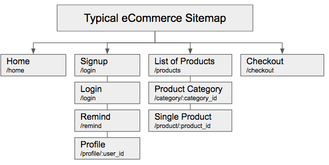

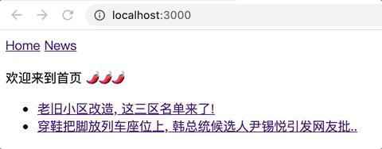

```bash
npm install react-router-dom
```

### 5.2 基本使用

需求：为应用创建首页和关于我们两个页面。

1. 创建页面级路由组件

   `src/pages/Home.js`

   ```react
   function Home() {
     return <div>欢迎来到首页 🌶🌶🌶 </div>;
   }
   export default Home;
   ```

   `src/pages/News.js`

   ```react
   function News() {
     return <div>欢迎来到关于新闻页 😁😁😁</div>;
   }
   export default News;
   ```

   `src/pages/Error.js`

   ```react
   function Error() {
     return <div>页面走丢了 😭😭😭</div>;
   }
   export default Error;
   ```

2. 配置路由规则

   `src/App.js`

   ```react
   import { BrowserRouter, Routes, Route } from "react-router-dom";
   import News from "./pages/News";
   import Home from "./pages/Home";
   
   function App() {
     // 注意: 在 v6 版本中，一旦路由规则匹配成功，则不再继续向后匹配，所以不再需要使用 exact 属性
     return (
       <BrowserRouter>
         <Routes>
           <Route path="/" element={<Home />} />
           <Route path="/news" element={<News />} />
         </Routes>
       </BrowserRouter>
     );
   }
   
   export default App;
   ```

3. 为应用添加用于跳转页面的链接地址

   ```react
   import { Link } from "react-router-dom";
   
   function App() {
     // 注意: react-router-dom 提供的组件都必须被 BrowserRouter 组件包裹, 包括 Link 组件
     return (
       <BrowserRouter>
         <Link to="/">Home</Link>
         <Link to="/news">News</Link>
       </BrowserRouter>
     );
   }
   ```

### 5.3 NavLink 组件

Link 组件是用于生成普通链接的组件，导航链接应该使用 NavLink 组件，当前链接被激活时，链接元素身上会自动添加 active 激活类名。

```react
<NavLink to="/">
  Home
</NavLink>
<NavLink to="/news">
  News
</NavLink>
```

可以通过以下方式更改默认的激活类名。

 ```react
 const activeClassName = ({ isActive }) => (isActive ? "on" : "off");
 
 <NavLink to="/" className={activeClassName}>
   Home
 </NavLink>
 <NavLink to="/about" className={activeClassName}>
   News
 </NavLink>
 ```

通过同样的方式也可以为导航链接添加行内样式。

```react
<NavLink to="/" style={({ isActive }) => ({ color: isActive ? "red" : "blue" })}>
  Home
</NavLink>
```

### 5.4 404 与 Navigate

在路由规则配置的最后，可以使用 `*` 号匹配不存在的路由规则，匹配到以后可以指定表示 404 的页面组件。

```react
import Error from "./pages/Error";

function App() {
  return (
    <BrowserRouter>
      <Routes>
        <Route path="*" element={<Error />} />
      </Routes>
    </BrowserRouter>
  );
}
```

如果不想展示 404，也可以将路由重定向到应用中已经存在的页面路由组件。

```react
import { Navigate } from "react-router-dom";

function App() {
  return (
    <BrowserRouter>
      <Routes>
        <Route path="*" element={<Navigate to="/" />} />
      </Routes>
    </BrowserRouter>
  );
}
```

### 5.5 嵌套路由

嵌套路由可以理解为二级路由乃至三级路由. 就是在路由组件中还包含路由匹配组件。

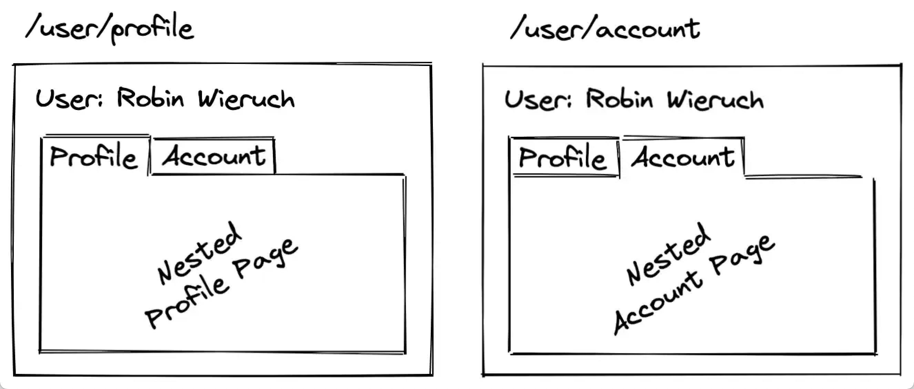

1. 配置新闻页面中的二级路由规则

   `src/App.js`

   ```react
   import News from "./pages/News";
   import InnerNews from "./pages/InnerNews";
   import OuterNews from "./pages/OuterNews";
   
   function App() {
     return (
       <BrowserRouter>
         <Routes>
           <Route path="/news" element={<News />}>
             <Route path="inner" element={<InnerNews />} />
             <Route path="outer" element={<OuterNews />} />
           </Route>
         </Routes>
       </BrowserRouter>
     );
   }
   ```

2. 在一级路由页面组件 ( 新闻页面组件 ) 中放置路由插槽、配置跳转链接

   `src/pages/News.js`

   ```react
   import { NavLink, Outlet } from "react-router-dom";
   
   function News() {
     return (
       <div>
         <p>欢迎来到关于新闻页 😁😁😁</p>
         <NavLink to="/news/inner">国内新闻</NavLink>
         <NavLink to="/news/outer">国际新闻</NavLink>
         <Outlet />
       </div>
     );
   }
   ```

### 5.6 索引路由

通过索引路由可以指定默认显示的二级路由，比如上述案例中，当进入新闻页面时二级路由组件所在区域是空白的，该缺陷就可以通过索引路由补救。

`src/App.js`

```react
function App() {
  // 注意: 索引路由不能有 path
  return (
    <BrowserRouter>
      <Routes>
        <Route path="/news" element={<News />}>
          <Route index element={<InnerNews />} />
          <Route path="inner" element={<InnerNews />} />
          <Route path="outer" element={<OuterNews />} />
        </Route>
      </Routes>
    </BrowserRouter>
  );
}
```

### 5.7 编程式导航

通过事件的方式进行跳转。

```react
import { useNavigate } from "react-router-dom";

function Home() {
  const navigate = useNavigate();
  return <button onClick={() => navigate("/news")}>News</button>;
}
```

### 5.8 路由参数

通过路由参数可以实现在不同的页面组件之间跳转时携带数据。

比如在文章列表页面中，点击某一篇文章跳转到文章详情页面，此时就需要将被点击的那篇文章的 id 传递到文章详情页面。

在应用中会有很多篇文章，但是文章详情页面组件只有一个，可以将它理解为文章详情的模板页面，在跳转到这个模板页面时，需要将文章id传进来，在模板页面中需要通过 id 获取详情，从而展示详情数据。

1. 添加路由规则并指定跳转到该路由时需要传递参数

   `src/App.js`

   ```react
   import Detail from "./pages/Detail";
   
   function App() {
     return (
       <BrowserRouter>
         <Routes>
           <Route path="/detail/:id" element={<Detail />} />
         </Routes>
       </BrowserRouter>
     );
   }
   ```

2. 在实现跳转的路由链接中传递参数

   `src/pages/Home.js`

   ```react
   import { Link } from "react-router-dom";
   
   function Home() {
     return (
       <ul>
         <li>
           <Link to="/detail/1">老旧小区改造, 这三区名单来了!</Link>
         </li>
         <li>
           <Link to="/detail/2">穿鞋把脚放列车座位上, 韩总统候选人尹锡悦引发网友批..</Link>
         </li>
       </ul>
     );
   }
   ```

3. 在目标跳转页面组件接收路由参数

   `src/pages/Detail.js`

   ```react
   import { useParams } from "react-router-dom";
   
   function Detail() {
     const { id } = useParams();
     return <div>Detail Page {id}</div>;
   }
   
   export default Detail;
   ```

### 5.9 查询参数

1. 定义路由时不需要加路由参数占位符

   `src/App.js`

   ```react
   function App() {
     return (
       <BrowserRouter>
         <Routes>
           <Route path="/detail" element={<Detail />} />
         </Routes>
       </BrowserRouter>
     );
   }
   ```

2. 在链接跳转时添加参数

   `src/pages/Home.js`

   ```react
   import { Link } from "react-router-dom";
   
   function Home() {
     return (
       <ul>
         <li>
           <Link to="/detail?id=1">老旧小区改造, 这三区名单来了!</Link>
         </li>
         <li>
           <Link to="/detail?id=2">穿鞋把脚放列车座位上, 韩总统候选人尹锡悦引发网友批..</Link>
         </li>
       </ul>
     );
   }
   ```

3. 在目标跳转页面组件接收路由参数

   `src/pages/Detail.js`

   ```react
   import { useSearchParams } from "react-router-dom";
   
   function Detail() {
     const [searchParams] = useSearchParams();
     return <div>Detail Page {searchParams.get("id")}</div>;
   }
   
   export default Detail;
   ```

### 5.10 路由组件懒加载

默认情况下应用中所有的组件都被打包到了同一个文件中，就是说应用初始加载时就加载了所有的组件，这样会导致初始加载应用时间长用户体验差。

解决办法就是在打包应用时以页面组件为单位，将不同的页面组件打包到不同的文件中，初始加载时只加载用户访问的页面组件。

1. 通过 lazy, import 异步加载组件

   `src/App.js`

   ```react
   import { lazy } from 'react';
   
   const Home = lazy(() => import(/* webpackChunkName: "Home" */ "./pages/Home"));
   ```

   通过 import 方法动态导入模块时，webpack 会将导入的模块拆分成单独的文件。

   webpackChunkName 定义拆分文件名称。

2. 在调用异步加载的组件时，组件的外面必须包裹 Suspense 组件，通过 Suspense 组件可以指定组件加载过程中的等待 UI。

   `src/App.js`

   ```react
   import { Suspense } from "react";
   
   function App() {
     return (
       <BrowserRouter>
         <Routes>
           <Route
             path="/"
             element={
               <Suspense fallback={<div>loading...</div>}>
                 <Home />
               </Suspense>
             }
           />
         </Routes>
       </BrowserRouter>
     );
   }
   ```

3. 封装 Loadable 组件以复用 Suspense 组件

   `src/common/Loadable.js`

   ```react
   import { Suspense } from "react";
   
   function Loadable(Component) {
     return function (props) {
       return (
         <Suspense fallback={<div>loading...</div>}>
           <Component {...props} />
         </Suspense>
       );
     };
   }
   
   export default Loadable;
   ```

   `src/App.js`

   ```react
   import Loadable from "./pages/Loadable";
   
   const Home = Loadable(
     lazy(() => import(/* webpackChunkName: "Home" */ "./pages/Home"))
   );
   
   function App() {
     return (
       <BrowserRouter>
         <Routes>
           <Route path="/" element={<Home />}/>
         </Routes>
       </BrowserRouter>
     );
   }
   ```


### 5.11 路由守卫 单路由守卫

当用户去访问那些需要鉴权以后才能进入的路由组件时，需要先通过路由守卫对其进行鉴权，只有通过才允许用户进入，否则进行重定向。

1. 定义执行鉴权的钩子函数供路由守卫进行使用

   `src/common/useAuth.js`

   ```react
   import { useEffect, useState } from "react";
   
   function isAuth() {
     // 模拟鉴权成功
     return Promise.resolve();
     // 模拟鉴权失败
     // return Promise.reject();
   }
   
   function useAuth() {
     // 用于存储鉴权结果
     // true 成功
     // false 失败 (默认值)
     const [auth, setAuth] = useState(false);
     // 用于存储异步状态
     // true 等待 (默认值)
     // false 结束
     const [loading, setLoading] = useState(true);
     useEffect(() => {
       // 开始鉴权
       isAuth()
         // 成功
         .then(() => setAuth(true))
         // 失败
         .catch(() => setAuth(false))
         // 不管成功还是失败, 都将异步状态更新为结束
         .finally(() => setLoading(false));
     }, []);
     // 返回异步状态和鉴权结果
     return { loading, auth };
   }
   
   export default useAuth;
   ```

2. 创建用于实现身份验证的路由守卫组件

   `src/common/AuthGuard.js`

   ```react
   import { Navigate } from "react-router-dom";
   import useAuth from "../hooks/useAuth";
   
   function AuthGuard({ children }) {
     // 调用鉴权钩子, 获取异步状态及鉴权结果
     const { auth, loading } = useAuth();
     // 如果异步状态为等待, 渲染等待过程中的UI界面
     if (loading) return <div>loading...</div>;
     // 判断鉴权结果, 如果通过, 进入目标路由组件, 如果没通过, 重定向到执行授权的页面
     return auth ? children : <Navigate to="/login" />;
   }
   
   export default AuthGuard;
   ```

3. 对 Admin 组件，即需要鉴权以后才能访问的页面路由组件进行守卫

   `src/App.js`

   ```react
   import AuthGuard from "./common/AuthGuard";
   
   function App() {
     return (
       <BrowserRouter>
         <Routes>
           <Route path="/admin" element={<AuthGuard><Admin /></AuthGuard>}/>
         </Routes>
       </BrowserRouter>
     );
   }
   ```

### 5.12 路由守卫 多路由守卫

通过 Outlet 路由插座组件可以实现多路由守卫。

`src/App.js`

```react
import Admin from "./pages/Admin";
import AuthGuardOutlet from "./common/AuthGuardOutlet";

function App() {
  return (
    <BrowserRouter>
        <Route path="/admin" element={<AuthGuardOutlet />}>
          <Route path="" element={<Admin />} />
        </Route>
      </Routes>
    </BrowserRouter>
  );
}
```

`src/common/AuthGuardOutlet.js`

```react
import { Navigate, Outlet } from "react-router-dom";
import useAuth from "../hooks/useAuth";

function AuthGuardOutlet() {
  // 调用鉴权钩子, 获取异步状态及鉴权结果
  const { auth, loading } = useAuth();
  // 如果异步状态为等待, 渲染等待过程中的UI界面
  if (loading) return <div>loading...</div>;
  // 判断鉴权结果, 如果通过, 渲染路由插座组件, 让 children 组件能够渲染到插座组件中
  // 如果没通过, 重定向到执行授权的页面
  return auth ? <Outlet /> : <Navigate to="/login" />;
}

export default AuthGuardOutlet;
```

### 5.13 滚动行为修正

问题：在 A 页面中将页面滚动到底部，切换到 B 页面，此时滚动条仍处于 A 页面的位置。

解决问题的方式就是监听路由切换行为，当路由发生切换行为时，让页面自动回到顶部。

`src/common/ScrollTop.js`

```react
import { useEffect } from "react";
import { useLocation } from "react-router-dom";

function ScrollTop() {
  const { pathname } = useLocation();
  useEffect(() => {
    window.scrollTo(0, 0);
  }, [pathname]);
  return null;
}

export default ScrollTop;
```

`src/App.js`

```react
import ScrollTop from "./common/ScrollTop";

function App() {
  return (
    <BrowserRouter>
      <ScrollTop />
    </BrowserRouter>
  );
}
```

### 5.14 useRoutes

通过 useRoutes 钩子函数可以实现通过 JavaScript 配置对象的方式定义路由规则。

`src/AppRoute.js`

```react
import { useRoutes } from "react-router-dom";
import Home from "./pages/Home";
import InnerNews from "./pages/InnerNews";
import News from "./pages/News";
import OuterNews from "./pages/OuterNews";

function AppRoute() {
  let element = useRoutes([
    { path: "/", element: <Home /> },
    {
      path: "/news",
      element: <News />,
      children: [
        { path: "inner", element: <InnerNews /> },
        { path: "outer", element: <OuterNews /> },
      ],
    },
  ]);
  return element;
}

export default AppRoute;
```

`src/App.js`

```react
import { BrowserRouter } from "react-router-dom";
import AppRoute from "./AppRoute";

function App() {
  return (
    <BrowserRouter>
      <AppRoute />
    </BrowserRouter>
  );
}

export default App;
```

## 6. 服务端渲染

### 6.1 概述

#### 6.1.1 渲染概述

##### 1. 服务端渲染 SSR

服务端渲染 ( server-side rendering ) 是指数据和 HTML 模板在服务端进行拼接，完成拼接后再发送到客户端进行解析。

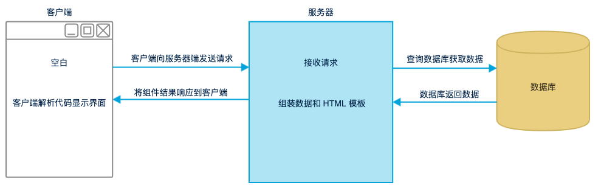

##### 2. 客户端渲染 CSR

客户端渲染 ( client-side rendering ) 是指数据和 HTML 模板在客户端浏览器中进行拼接，拼接完成后再追加到 DOM 树中供浏览器解析。

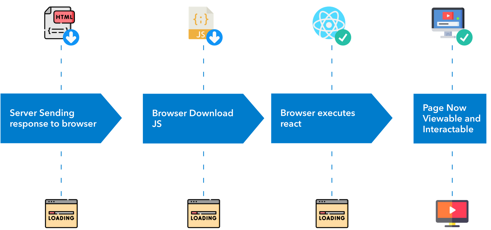

##### 3. 静态生成 SSG

静态站点生成 ( static stie generation ) 是指在站点构建阶段进行数据和HTML模板的拼接并生成对应的静态的 HTML 页面。

#### 6.1.2 渲染发展史

##### 1. 传统意义上的服务器端渲染

传统意义上的服务器端渲染存在的问题主要是用户体验差：

1. 在网速比较慢的情况下，页面长时间处于白屏状态，用于等待时易产生焦虑。
2. 每次页面跳转都会重新加载整个页面体验差。

##### 2. 基于前端框架的客端户渲染

基于前端框架的客户端渲染虽然解决了传统服务端渲染用户体验差的问题，但也随之带来了新的问题：

客户端渲染不支持 SEO，导致页面很难被搜索引擎收录。

##### 3. 基于前端框架的服务端渲染

基于前端框架的服务端渲染解决了用户体验差的问题，也解决了 SEO 支持不友好的问题。

缺点是数据和HTML模板在服务端进行，访问速度还是会受一些影响，而且服务端只能使用 JavaScript 运行时。

##### 4. 基于静态生成的服务端渲染

基于静态生成的服务端渲染在访问速度上是最具有优势的，也不存在 SEO 支持不友好的问题。

但是它只适用于页面内容不会发生频繁变化的场景，比如企宣，商城，博客，新闻等。

### 6.2 Next.js

#### 6.2.1 概述

[Next.js](https://nextjs.org/) 是集成式 React 服务端渲染应用框架，用于构建 SEO 友好的 SPA 应用。

```bash
# 全局安装 next.js 脚手架工具
npm install -g create-next-app
# 创建 next.js 应用
create-next-app next-tutorial
# 启动开发服务器
npm run dev
```

#### 6.2.2 基于文件系统的路由

##### 1. 路由匹配

在 Next.js 中，页面是存储在 pages 文件中的 React 组件，组件文件名称与路由相关联。

```react
// pages/index.js ====> http://localhost:3000/
export default function Home() {
  return <div>首页</div>;
}
```

```react
// pages/about.js ====> http://localhost:3000/about
export default function About() {
  return <div>关于我们</div>;
}
```

```react
// pages/post/index.js ====> http://localhost:3000/post
export default function Post() {
  return <div>这是博客索引目录</div>;
}
```

```react
// pages/blog/first-blog.js ====> http://localhost:3000/blog/first-post
export default function FirstPost () {
  return <div>这是我的第一篇博客文章</div>
}
```

```react
// pages/post/[pid].js ====> http://localhost:3000/post/1
import { useRouter } from "next/router";

export default function Post() {
  const router = useRouter(); // routter.query ====> {"pid": "1"}
}
```

```react
// pages/post/[pid].js ====> http://localhost:3000/post/1?name=zhangsan
import { useRouter } from "next/router";

export default function Post() {
  const router = useRouter(); // routter.query ====> {"pid": "1", "name": "张三"}
}
```

```react
// pages/order/[uid]/[status].js ====> http://localhost:3000/order/2/all
import { useRouter } from "next/router";

export default function Orders() {
  const router = useRouter(); // router.query ====> {"uid": "2", "status": "all"}
}
```

```react
// pages/404.js ====> 自定义404页面
export default function NotFound() {
  return <div>这是自定义的404页面</div>;
}
```

##### 2. 路由跳转

Link 组件默认进行客户端路由跳转，如果浏览器中 JavaScript 被禁用则使用链接进行服务端路由跳转。

Link 组件中不应添加除 href 属性以外的属性，其余属性添加到 a 标签上，比如 title、onClick。

Link 组件通过预取(在生产中)功能自动优化应用程序以获得最佳性能。

```react
import Link from "next/link";

export default function Home() {
  return (
    <Link href="/about">
      <a title="关于我们">关于我们</a>
    </Link>
  );
}
```

```react
import Link from "next/link";

const posts = [
  { id: 1, title: "这是id为1的文章" },
  { id: 2, title: "这是id为2的文章" },
];

export default function Post() {
  return (
    <ul>
      {posts.map((post) => (
        <li key={post.id}>
          <Link href={`/post/${post.id}`}>
            <a>{post.title}</a>
          </Link>
        </li>
      ))}
    </ul>
  );
}
```

```react
import Link from "next/link";

const posts = [
  { id: 1, title: "这是id为1的文章" },
  { id: 2, title: "这是id为2的文章" },
];

export default function Post() {
  return (
    <ul>
      {posts.map((post) => (
        <li key={post.id}>
          <Link href={{ pathname: "/post/[pid]", query: { pid: post.id } }}>
            <a>{post.title}</a>
          </Link>
        </li>
      ))}
    </ul>
  );
}
```

```react
import { useRouter } from "next/router";

export default function Home() {
  const router = useRouter();
  return <button onClick={() => router.push("/about")}>关于我们</button>;
}
```

```react
import Link from "next/link";

export default function Home() {
  const onClickHandler = (event) => {
    alert("clicked");
    event.preventDefault();
  };
  return (
    <Link href="/about">
      <a onClick={onClickHandler}>关于我们</a>
    </Link>
  );
}
```

#### 6.2.3 API 路由

通过 API 路由开发者可以为**客户端**应用提供 API 接口。

API 路由是服务端应用程序，代码将会被打包到服务端应用程序，它不会增加客户端打包文件的体积。

##### 1. 基本使用

```javascript
// pages/api/index.js ====> http://localhost:3000/api
export default function handler(req, res) {
  // req: 请求对象
  // res: 响应对象
  // 对客户端进行响应
  res.send({ msg: "API Route is running" });
}
```

```javascript
// pages/api/posts/index.js
// 获取文章列表: GET  http://localhost:3000/api/posts
// 添加文章:    POST  http://localhost:3000/api/posts
export default function handler(req, res) {
  switch (req.method) {
    case "GET":
      res.send({ msg: "客户端在获取文章列表" });
      break;
    case "POST":
      res.send({ msg: "客户端在添加文章", body: req.body });
      break;
    default:
      res.status(400).send({msg: "API 不存在"})
  }
}
```

```javascript
// pages/api/posts/[pid].js
// 根据pid获取文章: GET     http://localhost:3000/api/post/12
// 根据pid删除文章: DELETE  http://localhost:3000/api/post/12
export default function handler(req, res) {
  switch (req.method) {
    case "GET":
      res.send({ msg: "客户端在根据pid获取文章", pid: req.query.pid });
      break;
    case "DELETE":
      res.send({ msg: "客户端在根据pid删除文章", pid: req.query.pid });
      break;
  }
}
```

```javascript
// pages/api/posts/[...pids].js 
// 根据pid批量删除文章: DELETE http://localhost:3000/api/posts/2/3
// [pid].js 的匹配优先级高于 [...pid].js
export default function handler(req, res) {
  switch (req.method) {
    case "DELETE":
      res.send({ msg: "客户端在根据pid批量删除文章", pid: req.query.pid });
  }
}
```

##### 2. 连接数据库

```javascript
// services/dbConnection.js
import mongoose from "mongoose";

async function dbConnect() {
  // 判断数据库是否已经连接过, 如果已经连接过, 不再重复连接
  if (mongoose.connection.readyState === 1) return;
  // 如果数据库没有连接过, 链接数据库
  await mongoose.connect("mongodb://localhost:27017/test");
}
export default dbConnect;
```

```javascript
// models/Post.js
import mongoose from "mongoose";

const PostSchema = new mongoose.Schema({
  title: {
    type: String,
    required: [true, "标题不能为空"],
    unique: true,
    maxlength: [40, "标题不能超过40个字符"],
  },
  description: {
    type: String,
    required: true,
    maxlength: [200, "描述不能超过200个字符"],
  },
});

const Post = mongoose.models.Post || mongoose.model("Post", PostSchema);

export default Post;
```

```javascript
// pages/api/posts/index.js
import Post from "@/models/Post";
import dbConnect from "@/services/dbConnection";

export default async function handler(req, res) {
  await dbConnect();
  switch (req.method) {
    case "GET":
      const posts = await Post.find({});
      res.send({ success: true, posts });
      break;
    case "POST":
      const post = await Post.create(req.body);
      res.status(201).json({ success: true, post });
      break;
    default:
      res.status(400).send({ success: false, error: "api 不存在" });
  }
}
```

```json
// jsconfig.json
{
  "compilerOptions": {
    "baseUrl": ".",
    "paths": {
      "@/models/*": ["models/*"],
      "@/services/*": ["services/*"]
    }
  }
}
```

#### 6.2.4 预渲染

预渲染是指在构建阶段对应用程序进行编译，编译结果就是静态的 HTML 文件。

当客户端向服务端发送请求后，服务端直接将应用构建时编译的 HTML 文件发送到客户端。

默认情况下，如果组件不通过请求获取外部数据，Next.js 会在构建阶段将其编译为静态 HTML 文件。

预渲染适用于页面内容不会发生频繁变化的场景，比如博客、新闻、电商前台、文档、营销页面等。

```react
export default function About() {
  return <div>About</div>
}
```

##### 1. 基于页面组件的预渲染

在构建阶段如果组件需要获取外部数据，在组件中要导出名为 getStaticProps 的异步方法，通过它返回组件所需数据，它会在应用的构建阶段执行。

```react
import axios from "axios";

export default function Posts({ posts }) {
  return (
    <ul>
      {posts.map((post) => (
        <li key={post.id}>{post.title}</li>
      ))}
    </ul>
  );
}

export async function getStaticProps() {
  let { data } = await axios.get("https://jsonplaceholder.typicode.com/posts");
  return {
    props: {
      posts: data,
    },
  };
}
```

##### 2. 基于动态路由的预渲染

基于动态路由的预渲染是指根据路由动态参数编译 HTML 静态文件。

该路由拥有多少参数就会编译出多少静态 HTML 文件。

```bash
npm install -g json-server
```

```json
{
  "todos": [
    { "id": 1, "title": "吃饭" },
    { "id": 2, "title": "睡觉" },
    { "id": 3, "title": "打豆豆" }
  ]
}
```

```bash
json-server db.json -p 3001 -w
```

```react
// pages/todos/[id].js
import axios from "axios";
import { useRouter } from "next/router";

export default function Todo({ todo }) {
  const router = useRouter();
  if (router.isFallback) return <div>Loading...</div>;
  return (
    <div>
      {todo.id} {todo.title}
    </div>
  );
}

// 第一步: 在构建时先获取所有路由参数
export async function getStaticPaths() {
  return {
    paths: [
      {
        params: { id: "1" },
      },
      {
        params: { id: "2" },
      },
    ],
    // false 当访问没有被预渲染的路径时展示404页面
    // true: 当访问没有被预渲染的路径时, 先展示后备UI, Next.js 会在客户端请求时进行预渲染, 完后后显示预渲染结果
    fallback: true,
  };
}

// 第二步: 根据路由参数编译静态 HTML 文件
// 在构建时 Next 先调用 getStaticPaths 方法获取所有路由参数
// 遍历路由参数, 不断调用 getStaticProps 方法编译静态HTML文件
export async function getStaticProps({ params }) {
  let response = await axios.get(`http://localhost:3001/todos/${params.id}`);
  await delay(2000);
  return {
    props: {
      todo: response.data,
    },
    // 设置当前页面缓存的过期时间
    // 当前页面被访问时, 如果缓存时间过期, 触发当前页面的重新预渲染
    // 当次访问用户看到的仍然是缓存页面, 当重新预渲染完成后, 下次用户访问时看到的就是新页面了
    revalidate: 10,
  };
}

function delay(time) {
  return new Promise((resolve) => setTimeout(resolve, time));
}
```

#### 6.2.5 服务端渲染

服务端渲染是指在客户端发送请求时，服务器端即时编译 HTML，编译完成后将 HTML 代码发送到客户端。

服务端渲染方式适用于页面内容频繁发生变化场景且需要 SEO 的场景。

getServerSideProps 方法在服务端执行，内部可以调用 API 路由，也可以直接查询数据库。

```react
import Post from "@/models/Post";

export default function Posts({ posts }) {
  return (
    <ul>
      {posts.map((post, index) => (
        <li key={index}>
          <h1>{post.title}</h1>
          <p>{post.description}</p>
        </li>
      ))}
    </ul>
  );
}

export async function getServerSideProps() {
  const posts = await Post.find({});
  return {
    props: {
      posts: JSON.parse(JSON.stringify(posts)),
    },
  };
}
```

#### 6.2.6 混合渲染

混合渲染是指客户端渲染和服务端渲染、客户端渲染和预渲染可以混合使用。

比如文章详情页面，文章内容不会经常变化可以使用预渲染，而文章评论需要实时更新可以使用客户端渲染。

```react
// pages/api/comments/index.js
export default function comments(req, res) {
  res.send([
    { id: 1, content: "评论1" },
    { id: 2, content: "评论2" },
  ]);
}
```

```react
import axios from "axios";
import { useState, useEffect } from "react";

export default function Posts({ posts }) {
  const [comments, setComments] = useState([]);
  useEffect(() => {
    axios.get("http://localhost:3000/api/comments").then((response) => {
      setComments(response.data);
    });
  }, []);
  return (
    <>
      {/* 预渲染部分开始 */}
      <ul>
        {posts.map((post, index) => (
          <li key={index}>
            <h1>{post.title}</h1>
            <p>{post.description}</p>
          </li>
        ))}
      </ul>
      {/* 预渲染部分结束 */}
      {/* 动态渲染部分开始 */}
      <ul>
        {comments.map((comment) => (
          <li key={comment.id}>{comment.content}</li>
        ))}
      </ul>
      {/* 动态渲染部分结束 */}
    </>
  );
}

export async function getStaticProps() {
  let response = await axios.get("http://localhost:3000/api/posts");
  return {
    props: {
      posts: response.data.posts,
    },
  };
}
```

#### 6.2.7 为应用添加样式

Next.js 推荐将所有样式表文件存储在 styles 目录中。

##### 1. 全局样式

全局样式表应该在 _app.js 文件中被导入。

_app.js 文件中存储的是应用程序根组件。

```react
// pages/_app.js
import "../styles/globals.css";

function MyApp({ Component, pageProps }) {
  return <Component {...pageProps} />;
}

export default MyApp;
```

##### 2. 组件级样式

```react
import styles from '../styles/Home.module.css'

export default function Home() {
  return <div className={styles.container}></div>
}
```

#### 6.2.8 布局组件

##### 1. 情况一

应用中的每一个页面都有公共组件，且都是相同的公共组件，此时可以在根组件中使用布局组件。

```react
// components/Header.js
export default function Header() {
  return <div>Header</div>;
}
```

```react
// components/Footer.js
export default  function Footer() {
  return <div>Footer</div>;
}
```

```react
// components/Layout.js
import Footer from "./Footer";
import Header from "./Header";

export default function Layout({ children }) {
  return (
    <>
      <Header />
      {children}
      <Footer />
    </>
  );
}
```

```react
// pages/_app.js
import Layout from "../components/Layout";

export default function MyApp({ Component, pageProps }) {
  return (
    <Layout>
      <Component {...pageProps} />
    </Layout>
  );
}
```

##### 2. 情况二

应用中的页面有公共组件，但不是每一个页面都有相同的公共组件。

```react
// pages/about.js
import Layout from "../components/Layout";

export default function About() {
  return (
    <Layout>
      <div>About</div>
    </Layout>
  );
}
```

#### 6.2.9 Head 组件

通过 Head 组件可以为不同的页面设置不同的头信息，比如标题、描述、关键字等信息。

```react
// pages/about.js
import Head from "next/head";

export default function about() {
  return (
    <Head>
      <title>关于我们</title>
      <meta name="description" content="关于我们页面的描述内容" />
    </Head>
  );
}
```

每个页面中公共的头信息可以放在 _app.js 文件中。

```react
import Head from "next/head";

export default function MyApp({ Component, pageProps }) {
  return (
    <>
      <Head>
        <meta name="viewport" content="width=device-width, initial-scale=1.0" />
      </Head>
      <Component {...pageProps} />
    </>
  );
}
```

#### 6.2.10 Image 组件

使用 Image 组件加载图片可以优化图像体积、格式、图片懒加载。

```react
import Image from "next/image";

export default function about() {
  return (
    <>
      {[1, 2, 3, 4, 5].map((path) => (
        <div key={path}>
          <Image alt="" src={`/${path}.jpg`} width="280" height="420" />
        </div>
      ))}
    </>
  );
}
```

#### 6.2.11 环境变量

Next.js 内置对环境变量的支持。

| 文件名称         | 作用                                   |
| ---------------- | -------------------------------------- |
| .env             | 放置开发环境和生产环境中的公共变量     |
| .env.development | 放置开发环境变量，优先级高于 .env 文件 |
| .env.production  | 放置生产环境变量，优先级高于 .env 文件 |

```bash
# .env.development
API_URL=api.development.example.com
```

```bash
# .env.production
API_URL=api.production.example.com
```

```javascript
// 普通环境变量只在 Node.js 环境下起作用 ( API Route、getStaticProps、getServerSideProps )
process.env.API_URL
```

要在浏览器中使用环境变量，需要在环境变量的名字前面加 NEXT_PUBLIC_ 前缀

```bash
# .env.development
NEXT_PUBLIC_API_URL=api.production.example.com
```

在存储环境变量的文件中可以使用 $ 开头的变量指向系统环境变量，它用于指向系统中存储的敏感信息

```bash
# .env.development
SECRET_KEY=$SECRET
```

```bash
# ~/.zshrc
export SECRET=test
```

#### 6.2.12 构建命令

```bash
# 构建生成环境代码
next build
# 启动用于生产的支持预渲染和服务端渲染的 node.js 服务器 (基于 next build 结果)
next start
# 启动开发环境的 node.js 服务器
next dev
# 将站点导出为静态HTML (基于 next build 结果)
# 不支持图片优化、api 路由
next export
```

### 6.3 服务器端渲染原理

#### 1. 应用目录结构介绍

```bash
├── build
├── public
├── src
│   ├── client
│   ├── server
│   └── shared
├── package-lock.json
├── package.json
```

```bash
# 根据已有项目工程文件下载项目依赖
npm install
```

#### 2. 创建 web 服务器

```javascript
// src/server/http.js
import express from "express";

const app = express();

app.listen(3000, () => console.log("服务器启动成功, 监听3000端口"));

export default app;
```

#### 3. 服务器端渲染应用首页

```react
// src/shared/pages/Home.js
import React from "react";

export default function Home() {
  return <div>HomePage works</div>;
}
```

```react
// src/server/index.js
import app from "./http";
import Home from "../shared/pages/Home";
import { renderToString } from "react-dom/server";
import React from "react";

app.get("/", (req, res) => {
  // 通过 renderToString 方法将 React 组件转换为 HTML 字符串
  const content = renderToString(<Home />);
  res.send(`
    <html>
      <head>
        <title>React 服务器端渲染</title>
      </head>
      <body>
        <div id="root">${content}</div>
      </body>
    </html>
  `);
});
```

#### 4. 服务端代码打包配置

```javascript
// webpack.server.js
const path = require("path");

module.exports = {
  mode: "development",
  target: "node",
  entry: "./src/server/index.js",
  output: {
    path: path.join(__dirname, "build"),
    filename: "bundle.js",
  },
  module: {
    rules: [
      {
        test: /\.js$/,
        exclude: /node_modules/,
        use: {
          loader: "babel-loader",
          options: {
            presets: ["@babel/preset-env", "@babel/preset-react"],
          },
        },
      },
    ],
  },
};
```

```json
"scripts": {
  "dev:server-run": "nodemon --watch build --exec 'node build/bundle.js'",
  "dev:server-build": "webpack --config webpack.server.js --watch"
}
```

#### 5. 为组件附加事件

```react
// src/shared/pages/Home.js
import React from "react";

export default function Home() {
  return <div onClick={() => alert("clicked")}>HomePage works</div>;
}
```

#### 6. 创建客户端入口文件

```react
// src/client/index.js
import React from "react";
import ReactDOM from "react-dom";
import Home from "../shared/pages/Home";

// hydrate: 渲染组件, 和 render 不同, 如果组件DOM结构已经存在, 复用DOM结构, 提升性能, 仅为组件附加事件
ReactDOM.hydrate(<Home />, document.getElementById("root"));
```

#### 7. 客户端代码打包配置

打包目标：转换 JSX 语法，转换浏览器不识别的现代 JavaScript 语法

打包位置：public 文件夹，它是服务端的静态资源文件夹

```javascript
// webpack.client.js
const path = require("path");

module.exports = {
  mode: "development",
  entry: "./src/client/index.js",
  output: {
    path: path.join(__dirname, "public"),
    filename: "bundle.js",
  },
  module: {
    rules: [
      {
        test: /\.js$/,
        exclude: /node_modules/,
        use: {
          loader: "babel-loader",
          options: {
            presets: ["@babel/preset-env", "@babel/preset-react"],
          },
        },
      },
    ],
  },
};
```

#### 8. 加载客户端打包代码

```react
import express from "express";
// 将 public 目录设置为静态资源目录
app.use(express.static("public"));

app.get("/", (req, res) => {
  const content = renderToString(<Home />);
  res.send(`
    <html>
      <head>
        <title>React 服务器端渲染</title>
      </head>
      <body>
        <div id="root">${content}</div>
        <script src="/bundle.js"></script>
      </body>
    </html>
  `);
});
```

#### 9. 合并 webpack 配置

```javascript
// webpack.base.js
module.exports = {
  mode: "development",
  module: {
    rules: [
      {
        test: /\.js$/,
        exclude: /node_modules/,
        use: {
          loader: "babel-loader",
          options: {
            presets: ["@babel/preset-env", "@babel/preset-react"],
          },
        },
      },
    ],
  },
};
```

```javascript
// webpack.client.js
const path = require("path");
const { merge } = require("webpack-merge");
const baseConfig = require("./webpack.base");

const config = {
  entry: "./src/client/index.js",
  output: {
    path: path.join(__dirname, "public"),
    filename: "bundle.js",
  },
};

module.exports = merge(baseConfig, config);
```

```javascript
// webpack.server.js
const path = require("path");
const { merge } = require("webpack-merge");
const baseConfig = require("./webpack.base");

const config = {
  target: "node",
  entry: "./src/server/index.js",
  output: {
    path: path.join(__dirname, "build"),
    filename: "bundle.js",
  },
};

module.exports = merge(baseConfig, config);
```

#### 10. 合并应用启动命令

```json
"scripts": {
  "dev": "npm-run-all --parallel dev:*"
},
```

#### 11. 独立渲染方法

```react
// src/server/render.js
import { renderToString } from "react-dom/server";
import React from "react";
import Home from "../shared/pages/Home";

export default () => {
  const content = renderToString(<Home />);
  return `
    <html>
      <head>
        <title>React 服务器端渲染</title>
      </head>
      <body>
        <div id="root">${content}</div>
        <script src="/bundle.js"></script>
      </body>
    </html>
  `;
};
```

```react
// src/server/index.js
import app from "./http";
import express from "express";
import render from "./render";

app.use(express.static("public"));

app.get("/", (req, res) => {
  res.send(render());
});
```

#### 12. 实现服务端路由

```react
// 新增 List 页面
// src/shared/pages/List.js
import React from "react";

export default function List() {
  return <div>ListPage works</div>;
}
```

```react
// 创建路由规则
// src/shared/AppRoutes.js
import Home from "./pages/Home";
import List from "./pages/List";
import React from "react";
import { Route, Routes } from "react-router-dom";

export default function AppRoutes() {
  return (
    <Routes>
      <Route path="/" element={<Home />} />
      <Route path="/list" element={<List />} />
    </Routes>
  );
}
```

```react
import { StaticRouter } from "react-router-dom/server";
import AppRoute from "../shared/AppRoutes";

export default (req) => {
  const content = renderToString(
    <StaticRouter location={req.url}>
      <AppRoute />
    </StaticRouter>
  );
};
```

```react
// src/server/index.js
// 1. 服务端 express 接收任何请求, 然后将请求转发给 React 路由进行匹配
app.get("*", (req, res) => {
  res.send(render(req));
});
```

注意：查看代码运行结果时需要临时禁用客户端浏览器 JavaScript，因为此时客户端程序运行时会覆盖服务端返回的 HTML。

#### 13. 实现客户端路由

```react
// src/client/index.js
import { BrowserRouter } from "react-router-dom";
import AppRoutes from "../shared/AppRoutes";

ReactDOM.hydrate(
  <BrowserRouter>
    <AppRoutes />
  </BrowserRouter>,
  document.getElementById("root")
);
```

```react
import React from "react";
import { Link } from "react-router-dom";

export default function Home() {
  return (
    <>
      <p>当前为首页</p>
      <Link to="/list">跳转到列表页面</Link>
    </>
  );
}
```

```react
import React from "react";
import { Link } from "react-router-dom";

export default function List() {
  return (
    <>
      <p>当前为列表页</p>
      <Link to="/">跳转到首页</Link>
    </>
  );
}
```


## 7. React 与 TypeScript

### 7.1 概述

#### 7.1.1 创建应用

创建支持 TypeScript 语法的 React 应用

```bash
npx create-react-app <appname> --template typescript
```

#### 7.1.2 文件后缀

如果文件中包含 React 组件或者 JSX 代码，文件后缀使用 `tsx`

如果文件中不包含任何 JSX 代码，文件后缀使用 `ts`

### 7.2 为组件添加类型

在我们定义了组件以后，TypeScript 编译器并不知道我们定义的是组件，它会认为我们定义的就是一个普通的函数。

在类型认知出现偏差以后，TypeScript 编译器不能正确的对我们的代码进行约束。

比如在下列代码中，我们通过组件获取组件下的属性，TypeScript 编译器会报错，说组件下不存在这个属性。

当 TypeScript 编译器知道我们定义的是组件以后，当我们错误的使用了组件以后，它才能准确的为我们进行提示。

```tsx
const Child= () => {
  return <div>Child</div>;
};

// 类型 "() => Element" 上不存在属性 "displayName"。
console.log(Child.displayName);
// 类型 "() => Element" 上不存在属性 "defaultProps"。
console.log(Child.defaultProps);
```

```tsx
import { FC } from "react";

const Child: FC = () => {
  return <div>Child</div>;
};
```

### 7.3 Props

为组件 props 定义接口类型，编译器可以检查父组件在调用该组件时是否正确的传递了 props，在子组件内部是否正确的使用了 props。 

```tsx
// src/props/Child.tsx
interface Props {
  color: string;
  onClick: () => void;
}

const Child: FC<Props> = ({ color, onClick }) => {
  return <div onClick={onClick}>{color}</div>;
};
```

```tsx
// src/props/Parent.tsx
const Parent = () => {
  return <Child color="red" onClick={() => console.log("clicked")} />;
};
```

### 7.4 state

```react
// src/state/Guests.tsx
import { useState, FC } from "react";

const Guests: FC = () => {
  const [name, setName] = useState<string>("");
  // 此处如果不为 guests 指定类型, 类型将会是 never[]
  const [guests, setGuests] = useState<string[]>([]);
  const clickHandler = () => {
    setName("");
    // 如果 guests 是 never[], 那么字符串 name 将不能被存储到 guests 数组中
    setGuests([...guests, name]);
  };
  return (
    <>
      <ul> {guests.map((guest) => <li key={guest}>{guest}</li>)}</ul>
      <input type="text" value={name} onChange={(event) => setName(event.target.value)}/>
      <button onClick={clickHandler}>add</button>
    </>
  );
};
```

```react
// src/state/UserSearch.tsx
import { useState, FC } from "react";

const users = [
  { name: "张三", age: 20 },
  { name: "李四", age: 30 },
];

const UserSearch: FC = () => {
  const [name, setName] = useState<string>("");
  // 在组件初次渲染, 在没有找到 user 的情况下, user 的类型是 undefined
  // 在找到 user 以后, 它的类型是 {name: string, age: number}
  // 所以 user 的类型就应该是 {name: string, age: number} | undefined
  const [user, setUser] = useState<{ name: string; age: number } | undefined>();
	// 搜索用户
  const searchHandler = () => {
    // find 方法的返回值可能是 user, 也可能是 undefined
    setUser(
    	users.find((user) => user.name === name)
    );
  };
  return (
    <>
      <input type="text" value={name} onChange={(event) => setName(event.target.value)} />
      <button onClick={searchHandler}>search</button>
      {user && JSON.stringify(user)}
    </>
  );
};
```

### 7.5 事件对象

```react
// src/event/EventComponent.tsx
import { ChangeEvent, FC, DragEvent } from "react";

const EventComponent: FC = () => {
  // 参数"event"隐式具有"any"类型
  const changeHandler = (event: ChangeEvent<HTMLInputElement>) => {
    console.log(event.target.value);
  };
  const dragStartHandler = (event: DragEvent<HTMLDivElement>) => {
    // event.target: 返回触发事件的元素
    // event.currentTarget: 返回绑定事件的元素
    console.log(event.target);
    console.log(event.currentTarget);
  };
  return (
    <>
      <input type="text" onChange={changeHandler} />
      <div draggable onDragStart={dragStartHandler}> drag event </div>
    </>
  );
};
```

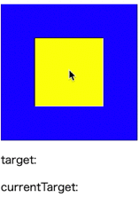

### 7.6 ref

`src/ref/RefComponent.tsx`

```tsx
import { FC, useRef, useEffect } from "React";

const RefComponent: FC = () => {
  const inputRef = useRef<HTMLInputElement | null>(null);
  useEffect(() => {
    if (!inputRef.current) return;
    inputRef.current.focus();
  }, []);
  return <input ref={inputRef} />;
};
```

### 7.7 Redux

```bash
npm install redux redux-thunk axios react-redux @types/react-redux --save-exact
# save-exact: 在 package.json 文件中记录安装包的确切版本
```

redux、redux-thunk、axios 内置 TypeScript 类型声明文件，所以不需要单独下载。

react-redux 没有内置类型声明文件，所以需要单独下载。

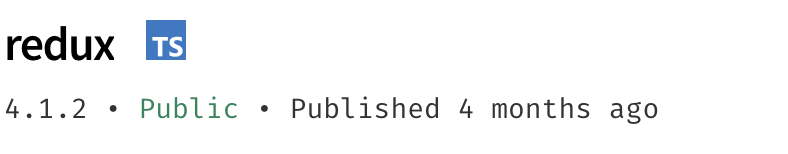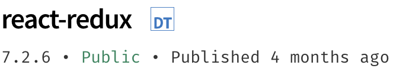


需求：向 npm 发送请求加载 npm 包列表信息。

第一步：定义 Action Type

```typescript
// src/state/action-types/package.action.types.ts
export enum searchActionType {
  // 请求中
  SEARCH_PACKAGES = "search_packages",
  // 请求成功
  SEARCH_PACKAGES_SUCCESS = "search_packages_success",
  // 请求失败
  SEARCH_PACKAGES_ERROR = "search_packages_error",
}
```

```typescript
// src/state/action-types/index.ts
export * from "./package.action.types";
```

第二步：定义 Action 对象类型、Reducer 函数的 action 参数 action 类型

```typescript
// src/state/actions/packages.action.ts
import { searchActionType } from "../action-types";

/**
 * 请求: {type: "search_packages"}
 * 成功: {type: "search_packages_success", payload: ["react", "react-dom"]}
 * 失败: {type: "search_packages_error", error: "Request Failed"}
 */

interface SearchPackagesAction {
  type: searchActionType.SEARCH_PACKAGES;
}

interface SearchPackagesSuccessAction {
  type: searchActionType.SEARCH_PACKAGES_SUCCESS;
  payload: string[];
}

interface SearchPackagesErrorAction {
  type: searchActionType.SEARCH_PACKAGES_ERROR;
  error: string;
}

export type SearchAction =
  | SearchPackagesAction
  | SearchPackagesSuccessAction
  | SearchPackagesErrorAction;
```

```typescript
// src/state/actions/index.ts
export * from "./packages.action";
```

第三步：创建 Reducer 函数，匹配 Action Type 返回对应的状态

```typescript
// src/state/reducers/packages.reducer.ts
import { searchActionType } from "../action-types";
import { SearchAction } from "../actions";

export interface PackagesState {
  loading: boolean;
  error: string | null;
  list: string[];
}

const initialState: PackagesState = {
  loading: false,
  error: null,
  list: [],
};

export default function packagesReducer(
  state: PackagesState = initialState,
  action: SearchAction
): PackagesState {
  switch (action.type) {
    case searchActionType.SEARCH_PACKAGES:
      return { loading: true, error: null, list: [] };
    case searchActionType.SEARCH_PACKAGES_SUCCESS:
      return { loading: false, error: null, list: action.payload };
    case searchActionType.SEARCH_PACKAGES_ERROR:
      return { loading: false, error: action.error, list: [] };
    default:
      return state;
  }
}
```

第四步：合并 reducer 函数

```typescript
// src/state/reducers/index.ts
import { combineReducers } from "redux";
import packagesReducer from "./packages.reducer";

export const reducers = combineReducers({
  packages: packagesReducer,
});
```

第五步：创建用于发送请求获取 npm 包的 action creator 函数

```typescript
// src/state/action-creators/packages.action.creators.ts
import axios from "axios";
import { Dispatch } from "react";
import { searchActionType } from "../action-types";
import { SearchAction } from "../actions";

export const searchPackages =
  (key: string) => async (dispatch: Dispatch<SearchAction>) => {
    dispatch({
      type: searchActionType.SEARCH_PACKAGES,
    });
    try {
      const { data } = await axios.get(
        `https://registry.npmjs.org/-/v1/search`,
        {
          params: {
            text: key,
          },
        }
      );
      dispatch({
        type: searchActionType.SEARCH_PACKAGES_SUCCESS,
        payload: data.objects.map((item: any) => item.package.name),
      });
    } catch (error) {
      if (error instanceof Error) {
        dispatch({
          type: searchActionType.SEARCH_PACKAGES_ERROR,
          error: error.message,
        });
      }
    }
  };

// unknow 是更加严格的 any 类型.
// 在对 unknown 类型的值执行大多数操作之前, 我们必须进行某种形式的检查
```

```typescript
export * from "./packages.action.creators";
```

第五步：创建 Store 对象，配置 redux-thunk 中间件函数

```typescript
import { applyMiddleware, createStore } from "redux";
import thunk from "redux-thunk";
import { reducers } from ".";

export const store = createStore(reducers, applyMiddleware(thunk));
```

第六步：创建 state 入口文件

```typescript
// src/state/index.ts
export * as actionCreators from "./action-creators";
export * from "./reducers";
export * from "./store";
```

第七步：配置 Provider 组件

```tsx
// src/components/App.tsx
import { FC } from "react";
import { Provider } from "react-redux";
import { store } from "../state";
import Packages from "./Packages";

export const App: FC = () => (
  <Provider store={store}>
    <Packages />
  </Provider>
);
```

第八步：在组件中，当点击按钮时向服务器端发送请求获取 npm 包

```tsx
// src/components/Packages.tsx
import { FC, FormEvent, useState } from "react";
import { useActions } from "../hooks/useActions";

const Packages: FC = () => {
  const [key, setKey] = useState<string>("");
  const { searchPackages } = useActions();

  const onSubmitHandler = (event: FormEvent<HTMLFormElement>) => {
    event.preventDefault();
    searchPackages(key);
  };
  return (
    <form onSubmit={onSubmitHandler}>
      <input type="text" value={key} onChange={(event) => setKey(event.target.value)} />
      <button>search</button>
    </form>
  );
};
```

```typescript
// src/hooks/useActions.ts
import { useDispatch } from "react-redux";
import { bindActionCreators } from "redux";
import { actionCreators } from "../state";

export const useActions = () => {
  const dispatch = useDispatch();
  return bindActionCreators(actionCreators, dispatch);
};
```

第九步：在组件中获取状态并根据状态渲染 UI

```tsx
import { useSelector } from "react-redux";
import { AppState } from "../state";
import { PackagesState } from "../state/reducers/packages.reducer";

const Packages: FC = () => {
  const state = useSelector<AppState, PackagesState>((state) => state.packages);

  return (
    <>
      {state.loading && <div>loading....</div>}
      {state.error && <div>{state.error}</div>}
      {state.list.map((name) => (
        <div key={name}>{name}</div>
      ))}
    </>
  );
};
```

定义应用全局状态的类型，用于传递给 useSelecter 钩子函数

```typescript
// src/state/reducers/index.ts
export type AppState = ReturnType<typeof reducers>;
```

第十步：优化为应用全局状态设置类型的代码

```react
// src/hooks/useTypedSelector.ts
import { useSelector, TypedUseSelectorHook } from "react-redux";
import { AppState } from "../state/reducers";

export const useTypedSelector: TypedUseSelectorHook<AppState> = useSelector;
```

```tsx
// src/components/Packages.tsx
import { useTypedSelector } from "../hooks/useTypedSelector";

const Packages: FC = () => {
  const state = useTypedSelector((state) => state.packages);
};
```

## 8. 流行库

### 8.1 Styled Components

#### 8.1.1 概述

[styled-components](https://styled-components.com/) 允许开发者通过创建组件的方式为元素添加样式, 创建出来的组件叫做样式化组件。

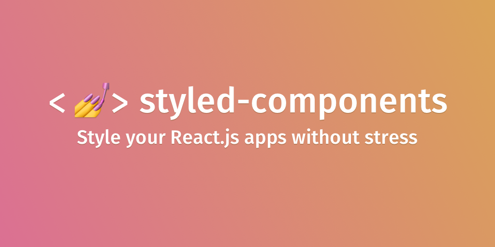

```bash
npm install --save styled-components
yarn add styled-components
```

#### 8.1.2 基本使用


```react
// 创建样式化组件
import styled from "styled-components";

export const Wrapper = styled.div`
  padding: 30px;
  background: papayawhip;
`;

export const Title = styled.h1`
  font-size: 24px;
  color: palevioletred;
  text-align: center;
  margin: 0;
`;
```

```react
// 使用样式化组件
function App() {
  return (
    <Wrapper>
      <Title>Hello, styled-components</Title>
    </Wrapper>
  );
}
```

#### 8.1.3 根据属性适配样式

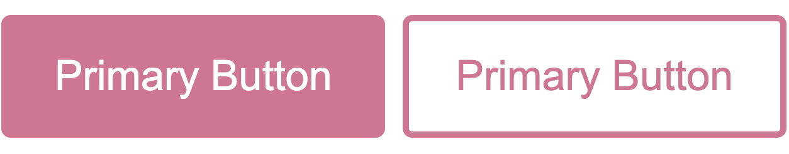

```react
export const Button = styled.button`
  border: 2px solid palevioletred;
  border-radius: 3px;
  padding: 10px 15px;
  background-color: ${(props) => (props.primary ? "palevioletred" : "white")};
  color: ${(props) => (props.primary ? "white" : "palevioletred")};
`;
```

```react
function App() {
  return (
    <>
      <Button primary>Primary Button</Button>
    	<Button>Primary Button</Button>
    </>
  );
}
```


```react
export const Input = styled.input`
  border: none;
  border-radius: 3px;
  padding: 10px;
  background-color: papayawhip;
  color: ${(props) => props.color || "palevioletred"};
`;
```

```react
function App() {
  return (
    <>
      <Input defaultValue="Hello" type="text" color="rebeccapurple" />
      <Input defaultValue="styled-components" type="text" />
    </>
  );
}
```

#### 8.1.4 扩展样式化组件

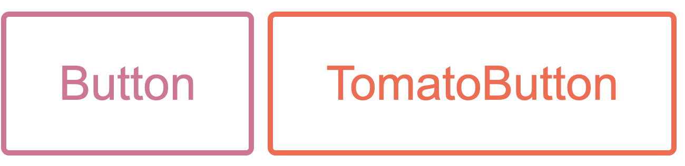

```react
export const Button = styled.button`
  color: palevioletred;
  background-color: #fff;
  font-size: 18px;
  padding: 15px 20px;
  border: 2px solid palevioletred;
  border-radius: 3px;
`;

export const TomatoButton = styled(Button)`
  color: tomato;
  border-color: tomato;
`;
```

```react
import { Button, TomatoButton } from "./components/Wrapper";

function App() {
  return (
    <>
      <Button>Button</Button> <TomatoButton>TomatoButton</TomatoButton>
    </>
  );
}
```

#### 8.1.5 为任何组件设置样式

styled 方法不仅可以创建样式化组件，它还可以为普通的 React 组件设置样式。

```react
import styled from "styled-components";

const Link = ({ className, children }) => {
  return (
    <a href="http://www.example.com" className={className}>
      {children}
    </a>
  );
};

const StyledLink = styled(Link)`
  color: palevioletred;
  font-weight: bold;
`;
```

### 8.2. React Hook Form

#### 8.2.1 概述

[React Hook Form](https://react-hook-form.com/) 是 React 生态圈中最为流行的表单构建工具，用于简化 React 表单代码复杂冗余的问题。


```bash
npm install react-hook-form
```

#### 8.2.2 基本使用

```react
import { useForm } from "react-hook-form";

function App() {
  const { register, handleSubmit, watch } = useForm({
    defaultValues: {
      username: "张三",
      isAgree: true,
      hobbies: [],
      gender: "男",
      transport: "",
    },
  });
  const onSubmit = handleSubmit((data) => {
    console.log(data);
  });
  	
  const username = watch("username");
  useEffect(() => {
    console.log(username);
  }, [username]);
  
  return (
    <form onSubmit={onSubmit}>
      <input type="text" {...register("username")} />
      <input type="checkbox" {...register("isAgree")} />
      <input type="checkbox" value="足球" {...register("hobbies")} />
      <input type="checkbox" value="篮球" {...register("hobbies")} />
      <input type="radio" value="男" {...register("gender")} />
      <input type="radio" value="女" {...register("gender")} />
      <select {...register("transport")}>
        <option value="">请选择交通工具</option>
        <option value="火车">火车</option>
        <option value="飞机">飞机</option>
        <option value="自驾">自驾</option>
      </select>
      <button type="submit">提交</button>
    </form>
  );
}

export default App;
```

#### 8.2.3 表单验证

表单验证支持以下字段：required、min、max、minLength、maxLength、pattern、validate

```react
import { useForm } from "react-hook-form";

function App() {
  const { formState: { errors } } = useForm({
     // 控制触发表单验证的时机
    // onSubmit onBlur onTouched onChange all
    mode: "onChange",
  });
  // 表单提交触发表单验证, 表单提交后触发表单实时验证
  const onSubmit = handleSubmit((data) => {
    // 在表单验证没有通过的情况下是不会调用该回调函数的
  });
  
  // 注册用户名字段
  const usernameRegister = register("username", {
    required: "用户名不能为空",
    maxLength: {
      value: 6,
      message: "用户名最大长度是6",
    },
    pattern: {
      value: /^[A-Za-z]+$/i,
      message: "用户名只能包含字母",
    },
  });
  
  return (
    <form onSubmit={onSubmit}>
      <input type="text" {...usernameRegister} />
      {errors.username && <span>{errors.username.message}</span>}
      <button type="submit">提交</button>
    </form>
  );
}
```

```react
import { useForm } from "react-hook-form";

function App() {
  const { watch } = useForm({
    // 设置表单控件的默认值
    defaultValues: {
      password: "",
      rePassword: "",
    },
  });

  return (
    <form onSubmit={onSubmit}>
      <input
        type="password"
        {...register("password", {
          pattern: {
            value: /^[A-Za-z0-9]+$/,
            message: "密码必须是数字或字母",
          },
        })}
      />
      {errors.password?.message}
      <input
        type="password"
        {...register("rePassword", {
          validate: (value) =>
            value === watch("password") || "两次密码输入不一样",
        })}
      />
      {errors.rePassword?.message}
      <button type="submit">提交</button>
    </form>
  );
}
```

#### 8.2.4  设置表单值

```react
import { useForm } from "react-hook-form";

function App() {
  const { setValue, reset } = useForm({
    // 设置表单控件的默认值
    defaultValues: {
      username: "",
      isAgree: false,
    },
  });

  const onClickHandler = () => {
    // 设置单个表单控件的值
    // setValue("username", "张三");
    // 同时设置多个表单控件的值
    reset({ username: "张三", isAgree: true });
  };

  return (
    <form onSubmit={onSubmit}>
      <input type="text" {...register("username")} />
      <input type="checkbox" {...register("isAgree")} />
      <button type="button" onClick={onClickHandler}>设置表单值</button>
    </form>
  );
}
```

#### 8.2.5 useFormContext

通过 `useFormContext` 可以获取到表单上下文。

在表单内部有嵌套结构的情况下，将表单上下文作为 props 传递非常不方便。

```react
import { FormProvider, useForm, useFormContext } from "react-hook-form";

function App() {
  const methods = useForm({
    defaultValues: {
      username: "",
      password: "",
    },
  });
  const onSubmit = methods.handleSubmit((data) => {
    console.log(data);
  });
  return (
    <FormProvider {...methods}>
      <form onSubmit={onSubmit}>
        <input type="text" {...methods.register("username")} />
        <Password />
        <button type="submit">提交</button>
      </form>
    </FormProvider>
  );
}

function Password() {
  const { register } = useFormContext();
  return <input type="password" {...register("password")} />;
}
```

### 8.3 React Spring

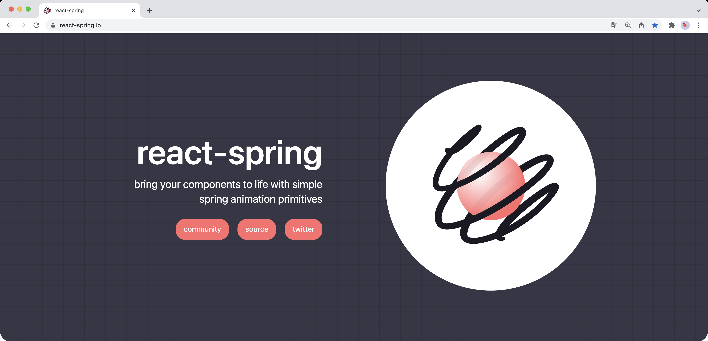

```bash
npm install react-spring@9.4.3 styled-components@5.3.3
```

```html
<link rel="stylesheet" href="https://cdn.jsdelivr.net/npm/bulma@0.9.2/css/bulma.min.css" />
```

```react
useSpring
// 创建单元素动画, 将元素从一个状态转换为另一个状态
useSprings
// 创建多元素动画, 将多个元素同时从一个状态转换为另一个状态
useTrail
// 创建多元素动画, 多个元素的动画依次执行
useTransition
// 创建入场、离场动画, 可以是单元素入场、离场动画，也可以是多元素入场离场动画
```

#### 8.3.1 useSpring


```react
import { useSpring, animated } from "react-spring";
import { useState } from "react";

function App() {
  const [toggle, setToggle] = useState(false);
  const styles = useSpring({
    backgroundSize: toggle ? "150%" : "100%",
  });
  return (
    <animated.div
      onMouseEnter={() => setToggle(true)}
      onMouseLeave={() => setToggle(false)}
      style={{
        width: 300,
        height: 300,
        backgroundImage:
          "url(https://images.pexels.com/photos/3227984/pexels-photo-3227984.jpeg?auto=compress&cs=tinysrgb&dpr=1&w=500)",
        backgroundPosition: "center center",
        ...styles,
      }}
    ></animated.div>
  );
}

export default App;
```


```react
import { useSpring, animated } from "react-spring";

function App() {
  const { count } = useSpring({
    from: {
      count: 0,
    },
    to: {
      count: 556,
    },
    config: {
      duration: 2000,
    },
  });
  console.log(count);
  return (
    <animated.div style={{ fontSize: 54 }}>
      {count.to((count) => count.toFixed(2))}
    </animated.div>
  );
}

export default App;
```


```react
import styled from "styled-components";
import { useSpring, animated } from "react-spring";
import { useRef } from "react";

const data = [
  "Cras justo odio",
  "Dapibus ac facilisis in",
  "Morbi leo risus",
  "Porta ac consectetur ac",
  "Vestibulum at eros",
  "List group item heading",
  "Something else here",
  "Separated link",
  "Another action",
  "Extra small button",
  "Signed in as Mark Otto",
  "This is a simple hero unit",
];

const Container = styled(animated.div)`
  width: 240px;
  height: 100px;
  overflow: auto;
  background-color: skyblue;
  padding: 0 10px;
  color: #fff;
  & > div {
    height: 30px;
    line-height: 30px;
  }
`;

function App() {
  const ref = useRef(null);
  const { scroll } = useSpring({
    scroll: ref?.current?.scrollTop || 0,
  });
  return (
    <>
      <Container ref={ref} scrollTop={scroll}>
        {data.map((item) => (
          <div key={item}>{item}</div>
        ))}
      </Container>
      <button
        onClick={() =>
          scroll.start({
            from: { scroll: ref.current.scrollTop },
            to: { scroll: 0 },
          })
        }
      >
        scrollToTop
      </button>
    </>
  );
}

export default App;
```

#### 8.3.2 useSprings

创建多元素动画。

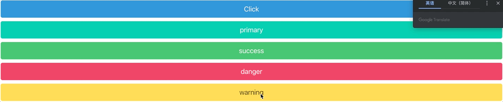

```react
import { useState } from "react"
import { animated, useSprings } from "react-spring"

const data = ["primary", "success", "danger", "warning"]

function App() {
  const [on, setOn] = useState(false)
  const animations = useSprings(
    data.length,
    data.map((item, index) => {
      return {
        from: {
          transform: `translateX(${index % 2 === 0 ? -110 : 110}%)`
        },
        to: {
          transform: "translateX(0%)"
        },
        // 控制动画执行方向
        // false: from -> to
        // true: to -> from
        // 当 on 状态发生变化后会触发动画执行
        reverse: on
      }
    })
  )
  return (
    <div className="container">
      <button onClick={() => setOn(!on)} className="button mt-2 is-fullwidth is-info"> Click </button>
      <ul>
        {data.map((item, index) => (
          <animated.li style={animations[index]} key={item}>
            <button className={`button mt-2 is-fullwidth is-${item}`}>
              {item}
            </button>
          </animated.li>
        ))}
      </ul>
    </div>
  )
}

export default App
```

#### 8.3.3 useTrail

创建交错动画，先创建动画，根据动画创建执行动画的元素。

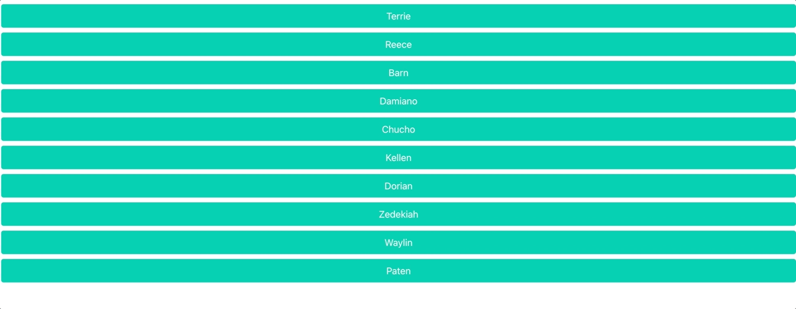

```react
import { useTrail, animated, config } from "react-spring";
import { useState } from "react";
import mock_data from "./MOCK_DATA.json";

function App() {
  const [{ dataToShow, indexStartRender }, setState] = useState({
    dataToShow: mock_data,
    indexStartRender: 0,
  });
  const animations = useTrail(dataToShow.length, {
    from: {
      transform: "translateY(100%)",
    },
    to: {
      transform: "translateY(0%)",
    },
    // 动画执行完成后重置, 以便再次执行动画
    reset: true,
    // config.wobby 为预置动画形式
    config: config.wobbly,
  });
  const onClickHandler = (index) => {
    const newData = [
      ...dataToShow.slice(0, index),
      ...dataToShow.slice(index + 1),
    ];
    setState({
      dataToShow: newData,
      indexStartRender: index,
    });
  };
  return (
    <div className="container">
      {dataToShow.map((item, index) => (
        <animated.button
          onClick={() => onClickHandler(index)}
          key={item.id}
          style={index >= indexStartRender ? animations[index] : null}
          className="button mt-2 is-fullwidth is-primary"
        >
          {item.first_name}
        </animated.button>
      ))}
    </div>
  );
}

export default App;
```

#### 8.3.4 useTransition

创建入场动画和出场动画，可以是一个元素也可以是一组元素。


```react
<div className="app">
  <button>button</button>
  <div className="container">
    <div className="item">item</div>
  </div>
</div>
```

```react
import { useState } from "react"
import { animated, useTransition } from "react-spring"
import "./App.css"

function App() {
  const [isVisible, setIsVisible] = useState(false)
  const transition = useTransition(isVisible, {
    from: {
      opacity: 0,
      x: -300,
      y: 800
    },
    enter: {
      opacity: 1,
      x: 0,
      y: 0
    },
    leave: {
      opacity: 0,
      x: 300,
      y: 800
    }
  })
  return (
    <div className="app">
      <button onClick={() => setIsVisible(!isVisible)}>
       	{isVisible ? "卸载" : "挂载"}
      </button>
      <div className="container">
        {transition((style, item) => {
          return item ? (
            <animated.button className="item" style={style}></animated.button>
          ) : null
        })}
      </div>
    </div>
  )
}

export default App
```

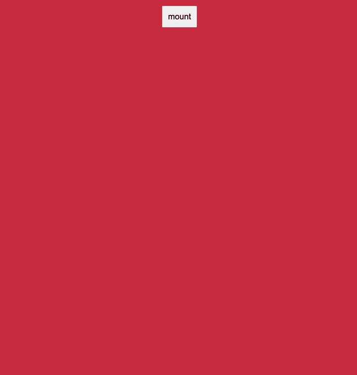

```react
import { useState } from "react"
import { animated, useTransition } from "react-spring"
import "./App.css"

function App() {
  const [items, setItems] = useState([])
  const transition = useTransition(items, {
    from: {
      opacity: 0,
      x: -300,
      y: 800
    },
    enter: item => ({ opacity: 1, x: 0, y: item.y, delay: item.delay }),
    leave: {
      opacity: 0,
      x: 300,
      y: 800,
    }
  })
  const onClickHandler = () => {
    setItems(prev =>
      prev.length
        ? []
        : [
            { y: -50, delay: 200 },
            { y: 0, delay: 400 },
            { y: 50, delay: 600 }
          ]
    )
  }
  return (
    <div className="app">
      <button onClick={onClickHandler}>{items.length ? "卸载" : "挂载"}</button>
      <div className="container">
        {transition((style, item) => {
          return item ? (
            <animated.div className="item" style={style}></animated.div>
          ) : null
        })}
      </div>
    </div>
  )
}

export default App
```

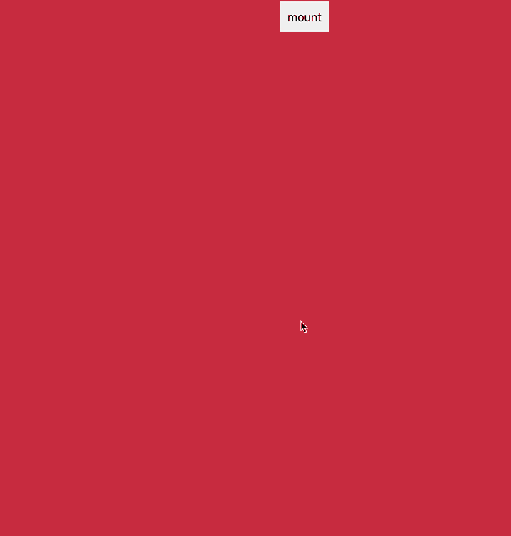

```react
import { useState } from "react"
import { animated, useTransition } from "react-spring"
import "./App.css"

function App() {
  const [items, setItems] = useState([])
  const transition = useTransition(items, {
    from: {
      opacity: 0,
      x: -300,
      y: 800,
      width: 20,
      height: 20
    },
    enter: item => async next => {
      await next({ opacity: 1, y: item.y, delay: item.delay })
      await next({
        x: 0,
        width: 100,
        height: 100
      })
    },
    leave: {
      opacity: 0,
      x: 300,
      y: 800
    }
  })
  return (
    <div className="app">
      <button
        onClick={() =>
          setItems(prev => {
            return prev.length
              ? []
              : [
                  { y: -50, delay: 200 },
                  { y: 0, delay: 400 },
                  { y: 50, delay: 600 }
                ]
          })
        }
      >
        {items.length ? "un-mount" : "mount"}
      </button>
      <div className="container">
        {transition((style, item) => {
          return item ? (
            <animated.div className="item" style={style}></animated.div>
          ) : null
        })}
      </div>
    </div>
  )
}

export default App
```

### 8.4 React Modal

[React Modal 文档](http://reactcommunity.org/react-modal/)


```bash
npm install react-modal
```

```react
import { useState } from "react";
import Modal from "react-modal";

Modal.setAppElement("#root");

function App() {
  const [modalIsOpen, setModalIsOpen] = useState(false);
  // onRequestClose: 在请求关闭弹框时执行该回调函数 (单击弹框主体区域外部或按ESC键)
  // shouldCloseOnOverlayClick: 点击弹框主体区域外部时是否关闭弹框, 配合 onRequestClose 一起使用 
  // 比如按ESC关闭弹框, 点击弹框主体区域外部不关闭弹框
  return (
    <>
      <button onClick={() => setModalIsOpen(true)}>打开弹框</button>
      <Modal
        style={{
          overlay: {
            backgroundColor: "rgba(100,100,100,0.5)",
          },
          content: {
            color: "skyblue",
          },
        }}
        isOpen={modalIsOpen}
        onRequestClose={() => setModalIsOpen(false)}
        shouldCloseOnOverlayClick={false}
      >
        sdfsd
        <button onClick={() => setModalIsOpen(false)}>关闭弹框</button>
      </Modal>
    </>
  );
}

export default App;
```

### 8.5 React Player

[React Player 文档](https://www.npmjs.com/package/react-player)


```bash
npm install react-player
```

```react
import ReactPlayer from "react-player"

function App() {
  return (
    <ReactPlayer
      onStart={() => console.log("onStart calllback")}
      onEnded={() => console.log("onEnded calllback")}
      onPause={() => console.log("onPause calllback")}
      width="auto"
      muted={true}
      controls
      url="//vjs.zencdn.net/v/oceans.mp4"
    />
  )
}

export default App
```


## 附录

### 1. 配置路径别名

1. 下载 `@craco/craco` 用于覆盖 `create-react-app` 脚手架工具自动生成的配置

   ```bash
   npm install @craco/craco
   ```

2. 在应用根目录下创建 `craco.config.js` 配置文件并加入路径别名配置

   ```javascript
   const path = require("path");
   
   module.exports = {
     webpack: {
       alias: {
         "@component": path.resolve(__dirname, "src/components/"),
         "@layouts": path.resolve(__dirname, "src/components/layouts"),
         "@pages": path.resolve(__dirname, "src/components/pages"),
         "@shared": path.resolve(__dirname, "src/components/shared"),
         "@state": path.resolve(__dirname, "src/state"),
       },
     },
   };
   ```

3. 修改 `package.json` 文件中的应用启动命令

   ```json
   {
     "scripts": {
       "start": "craco start",
       "build": "craco build",
       "test": "craco test"
     }
   }
   ```

4. 在应用根目录下创建 `jsconfig.json` 文件，加入路径别名的配置，该配置用于让编译器识别路径别名。

   ```json
   {
     "compilerOptions": {
       "paths": {
         "@component/*": ["./src/components/*"],
         "@layouts/*": ["./src/components/layouts/*"],
         "@pages/*": ["./src/components/pages/*"],
         "@shared/*": ["./src/components/shared/*"],
         "@state/*": ["./src/state/*"]
       }
     },
     "include": ["src"]
   }
   ```


props.children 的类型已经在 FC 中事先被定义好，类型为 ReactNode


一般建议把不依赖props和state的函数提到你的组件外面，把那些仅被useEffect使用的函数放到useEffect里面。

如果在 useEffect 里面用到了组件内的函数或者通过 props 传递过来的函数，建议在创建函数的地方使用 useCallback 包裹函数并指定依赖项。

每次组件重新渲染，所有的东西都属于这次特定渲染，包括 props、state、事件处理函数、effect 等等。

