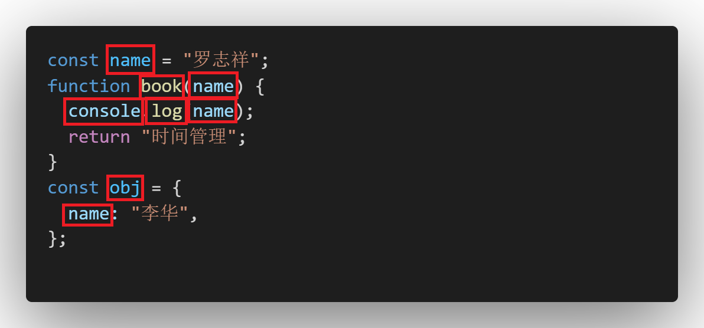
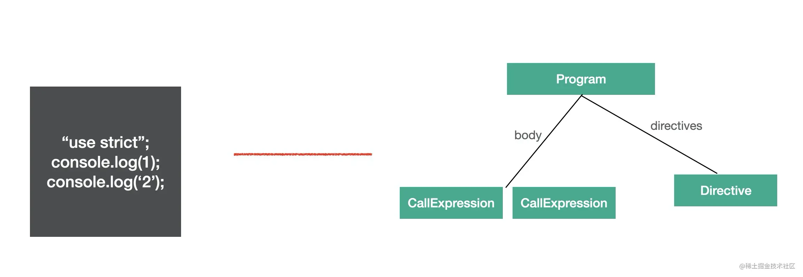
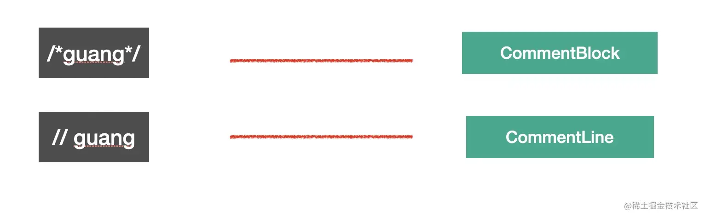

## Babel 是什么？

### Babel 是一个 JavaScript 编译器

Babel 是一个工具链，主要用于将采用 ECMAScript 2015+ 语法编写的代码转换为向后兼容的 JavaScript 语法，以便能够运行在当前和旧版本的浏览器或其他环境中。下面列出的是 Babel 能为你做的事情：

- 语法转换
- 通过 Polyfill 方式在目标环境中添加缺失的特性 (通过引入第三方 polyfill 模块，例如 core-js)
- 源码转换（codemods）

### 编译器和转译器

编译器(compiler)它会将某种编程语言写成的源代码（原始语言）转换成另一种编程语言（目标语言）
转译器(transpiler)它会将高级语言的源代码转换成高级语言,又叫转换编译器
babel 就是一个 Javascript Transpiler。

### bebel 的编译流程

babel 是源代码到源代码(source to source)的转换，整体编译流程分为三步：

- 解析(parse) ：通过 parser 把源码转成抽象语法树(AST)
- 翻译(transform) ：遍历 AST，调用各种 transform 插件对 AST 进行增删改
- 生成(generate) ：把转换后的 AST 打印成目标代码，并生成 sourcemap

#### 为什么会分为这三步

为什么 babel 的编译流程会分 parse、transform、generate 这 3 步?

源码是一串按照语法格式来组织的字符串,人能认识,但是计算机不认识,想要计算机认识就需要转换成一种数据结构通过不同的对象来保存数据,并且按照依赖关系组织起来，这种数据结构就是抽象语法树(abstract syntax tree)之所以叫抽象语法树是因为数据结构中省略掉了一些无具体意义的分隔符比如 ; { } 等。有了 AST，计算机就能理解源码字符串的意思，而理解是能够转换的前提，所以编译的第一步需要把源码 parse 成 AST

babel 将源码转换成抽象语法树(abstract syntax tree)，然后再通过 transform 插件对 AST 进行增删改，最后再通过 generate 插件生成目标代码。

#### 这三步都干啥了

##### parse

parse 阶段的目的是把源码字符串转换成机器能够理解的 AST，这个过程分为词法分析、语法分析。

比如 let name = '芜湖'; 这样一段源码，我们要先把它分成一个个不能细分的单词（token），也就是 let, name, =, '芜湖'，这个过程是词法分析，按照单词的构成规则来拆分字符串成单词。

之后要把 token 进行递归的组装，生成 AST，这个过程是语法分析，按照不同的语法结构，来把一组单词组合成对象。

##### transform

transform 阶段是对 parse 生成的 AST 的处理，会进行 AST 的遍历，遍历的过程中处理到不同的 AST 节点会调用注册的相应的 visitor 函数，visitor 函数里可以对 AST 节点进行增删改，返回新的 AST（可以指定是否继续遍历新生成的 AST）。这样遍历完一遍 AST 之后就完成了对代码的修改。

##### generate

generate 阶段会把 AST 打印成目标代码字符串，并且会生成 sourcemap。不同的 AST 对应的不同结构的字符串。比如 IfStatement 就可以打印成 if(test) {} 格式的代码。这样从 AST 根节点进行递归打印，就可以生成目标代码的字符串。

sourcemap 记录了源码到目标代码的转换关系，通过它我们可以找到目标代码中每一个节点对应的源码位置。

### Babel 的 AST

babel 编译的第一步是把源码 parse 成抽象语法树 AST （Abstract Syntax Tree），后续对这个 AST 进行转换。（之所以叫抽象语法树是因为省略掉了源码中的分隔符、注释等内容）

AST 也是有标准的，JS parser 的 AST 大多是 [estree 标准](https://github.com/estree/estree)，从 SpiderMonkey 的 AST 标准扩展而来。babel 的整个编译流程都是围绕 AST 来的，这一节我们来学一下 AST。

熟悉了 AST，也就是知道转译器和 JS 引擎是怎么理解代码的，对深入掌握 Javascript 也有很大的好处。

#### 常见的 AST 节点

AST 是对源码的抽象，字面量、标识符、表达式、语句、模块语法、class 语法都有各自的 AST。我们分别来了解一下：

##### Literal 标识符字面量

Literal 是字面量的意思，比如 `let name = '芜湖'`中，`'芜湖'`就是一个字符串字面量 StringLiteral，相应的还有

数字字面量 NumericLiteral，布尔字面量 BooleanLiteral，字符串字面量 StringLiteral，正则表达式字面量 RegExpLiteral 等。

##### Identifier 标识符

Identifier 是标识符的意思，变量名、属性名、参数名等各种声明和引用的名字，都是 Identifer。我们知道，JS 中的标识符只能包含字母或数字或下划线（“\_”）或美元符号（“$”），且不能以数字开头。这是 Identifier 的词法特点。

我们来一段代码来判断哪些是 Identifier 以便深入理解 Identifier

```js
const name = "罗志祥";
function book(name) {
  console.log(name);
  return "时间管理";
}
const obj = {
  name: "李华",
};
```

答案如下



##### Statement 语句

Statement 是语句的意思，它是可以独立执行的单位，比如 break、continue、debugger、return 或者 if 语句、while 语句、for 语句，还有声明语句，表达式语句等。`我们写的每一条可以独立执行的代码都是语句。`

以下是一些语句的例子

```js
break;
continue;
return;
debugger;
throw Error();
{}
try {} catch(e) {} finally{}
for (let key in obj) {}
for (let i = 0;i < 10;i ++) {}
while (true) {}
do {} while (true)
switch (v){case 1: break;default:;}
label: console.log();
with (a){}
```

它们对应的 AST 节点

```js
break; // BreakStatement
continue; // ContinueStatement
return; // ReturnStatement
debugger; // DebuggerStatement
throw Error(); // ThrowStatement
{} // BlockStatement
try {} catch(e) {} finally{} // TryStatement
for (let key in obj) {} // ForInStatement
for (let i = 0;i < 10;i ++) {} // ForStatement
while (true) {} // WhileStatement
do {} while (true) // DoWhileStatement
switch (v){case 1: break;default:;} // SwitchStatement
label: console.log(); // LabeledStatement
with (a){} // WithStatement
```

语句是代码执行的最小单位，可以说，代码是由语句（Statement）构成的。

##### Declaration 声明

Declaration 是声明的意思，声明语句是一种特殊的语句，它执行的逻辑是在作用域内声明一个变量、函数、class、import、export 等。

例如下面的例子

```js
const a = 1; // VariableDeclaration
function b() {} // FunctionDeclaration
class C {} // ClassDeclaration

import d from "e"; // ImportDeclaration

export default e = 1; // ExportDefaultDeclaration
export { e }; // ExportNamedDeclaration
export * from "e"; // ExportAllDeclaration
```

##### Expression 表达式

Expression 是表达式的意思，特点是执行完以后有返回值，这是和语句 (statement) 的区别。

```js
[1,2,3]         // ArrayExpression 数组表达式
a = 1           // AssignmentExpression 赋值表达式
1 + 2;          // BinaryExpression 二元表达式
-1;             // UnaryExpression 一元表达式
function(){};   // FunctionExpression 函数表达式
() => {};       // ArrowFunctionExpression 箭头函数表达式
class{};        // ClassExpression class 表达式
a;              // Identifier 表达式
this;           // ThisExpression this 表达式
super;          // Super super
a::b;           // BindExpression 绑定表达式
```

为什么 identifier 和 super 怎么也是表达式呢？

其实有的节点可能会是多种类型，identifier、super 有返回值，符合表达式的特点，所以也是 expression。

我们判断 AST 节点是不是某种类型要看它是不是符合该种类型的特点，比如`语句的特点是能够单独执行`，`表达式的特点是有返回值`。

有的表达式可以单独执行，符合语句的特点，所以也是语句，比如赋值表达式、数组表达式等，但有的表达式不能单独执行，需要和其他类型的节点组合在一起构成语句。比如匿名函数表达式和匿名 class 表达式单独执行会报错。

```js
function(){};
class{}
```

需要和其他部分一起构成一条语句，比如组成赋值语句

```js
a = function() {}
b = class{}
```

表达式语句解析成 AST 的时候会包裹一层 ExpressionStatement 节点，代表这个表达式是被当成语句执行的。

**小结**：表达式的特点是有返回值，有的表达式可以独立作为语句执行，会包裹一层 ExpressionStatement。

##### Class

class 的语法也有专门的 AST 节点来表示。

整个 class 的内容是 ClassBody，属性是 ClassProperty，方法是ClassMethod（通过 kind 属性来区分是 constructor 还是 method）。

比如下面的代码

```js
class Person {
  constructor(name) {
    this.name = name;
  }
  sayName() {
    console.log(this.name);
  }
}
```

对应的 AST

::: details 点击展开

```json
  "body": [
    {
      "type": "ClassDeclaration",
      "start": 0,
      "end": 110,
      "range": [
        0,
        110
      ],
      "id": {
        "type": "Identifier",
        "start": 6,
        "end": 12,
        "range": [
          6,
          12
        ],
        "name": "Person"
      },
      "superClass": null,
      "body": {
        "type": "ClassBody",
        "start": 13,
        "end": 110,
        "range": [
          13,
          110
        ],
        "body": [
          {
            "type": "MethodDefinition",
            "start": 17,
            "end": 62,
            "range": [
              17,
              62
            ],
            "kind": "constructor",
            "static": false,
            "computed": false,
            "key": {
              "type": "Identifier",
              "start": 17,
              "end": 28,
              "range": [
                17,
                28
              ],
              "name": "constructor"
            },
            "value": {
              "type": "FunctionExpression",
              "start": 28,
              "end": 62,
              "range": [
                28,
                62
              ],
              "id": null,
              "expression": false,
              "generator": false,
              "async": false,
              "params": [
                {
                  "type": "Identifier",
                  "start": 29,
                  "end": 33,
                  "range": [
                    29,
                    33
                  ],
                  "name": "name"
                }
              ],
              "body": {
                "type": "BlockStatement",
                "start": 35,
                "end": 62,
                "range": [
                  35,
                  62
                ],
                "body": [
                  {
                    "type": "ExpressionStatement",
                    "start": 41,
                    "end": 58,
                    "range": [
                      41,
                      58
                    ],
                    "expression": {
                      "type": "AssignmentExpression",
                      "start": 41,
                      "end": 57,
                      "range": [
                        41,
                        57
                      ],
                      "operator": "=",
                      "left": {
                        "type": "MemberExpression",
                        "start": 41,
                        "end": 50,
                        "range": [
                          41,
                          50
                        ],
                        "object": {
                          "type": "ThisExpression",
                          "start": 41,
                          "end": 45,
                          "range": [
                            41,
                            45
                          ]
                        },
                        "property": {
                          "type": "Identifier",
                          "start": 46,
                          "end": 50,
                          "range": [
                            46,
                            50
                          ],
                          "name": "name"
                        },
                        "computed": false
                      },
                      "right": {
                        "type": "Identifier",
                        "start": 53,
                        "end": 57,
                        "range": [
                          53,
                          57
                        ],
                        "name": "name"
                      }
                    }
                  }
                ]
              }
            }
          },
          {
            "type": "MethodDefinition",
            "start": 65,
            "end": 108,
            "range": [
              65,
              108
            ],
            "kind": "method",
            "static": false,
            "computed": false,
            "key": {
              "type": "Identifier",
              "start": 65,
              "end": 72,
              "range": [
                65,
                72
              ],
              "name": "sayName"
            },
            "value": {
              "type": "FunctionExpression",
              "start": 72,
              "end": 108,
              "range": [
                72,
                108
              ],
              "id": null,
              "expression": false,
              "generator": false,
              "async": false,
              "params": [],
              "body": {
                "type": "BlockStatement",
                "start": 75,
                "end": 108,
                "range": [
                  75,
                  108
                ],
                "body": [
                  {
                    "type": "ExpressionStatement",
                    "start": 81,
                    "end": 104,
                    "range": [
                      81,
                      104
                    ],
                    "expression": {
                      "type": "CallExpression",
                      "start": 81,
                      "end": 103,
                      "range": [
                        81,
                        103
                      ],
                      "callee": {
                        "type": "MemberExpression",
                        "start": 81,
                        "end": 92,
                        "range": [
                          81,
                          92
                        ],
                        "object": {
                          "type": "Identifier",
                          "start": 81,
                          "end": 88,
                          "range": [
                            81,
                            88
                          ],
                          "name": "console"
                        },
                        "property": {
                          "type": "Identifier",
                          "start": 89,
                          "end": 92,
                          "range": [
                            89,
                            92
                          ],
                          "name": "log"
                        },
                        "computed": false
                      },
                      "arguments": [
                        {
                          "type": "MemberExpression",
                          "start": 93,
                          "end": 102,
                          "range": [
                            93,
                            102
                          ],
                          "object": {
                            "type": "ThisExpression",
                            "start": 93,
                            "end": 97,
                            "range": [
                              93,
                              97
                            ]
                          },
                          "property": {
                            "type": "Identifier",
                            "start": 98,
                            "end": 102,
                            "range": [
                              98,
                              102
                            ],
                            "name": "name"
                          },
                          "computed": false
                        }
                      ]
                    }
                  }
                ]
              }
            }
          }
        ]
      }
    }
  ],
```

:::


##### Modules

es module 是语法级别的模块规范，所以也有专门的 AST 节点。

##### import

import 有 3 种语法：

named import：

```javascript
import {c, d} from 'c';
```

default import：

```javascript
import a from 'a';
```

namespaced import:

```javascript
import * as b from 'b';
```

这 3 种语法都对应 ImportDeclaration 节点，但是 specifiers 属性不同，分别对应 ImportSpicifier、ImportDefaultSpecifier、ImportNamespaceSpcifier。

##### export

export 也有3种语法：

named export：

```javascript
export { b, d};
```

default export：

```javascript
export default a;
```

all export：

```javascript
export * from 'c';
```

分别对应 ExportNamedDeclaration、ExportDefaultDeclaration、ExportAllDeclaration 的节点

其中 ExportNamedDeclaration 才有 specifiers 属性，其余两种都没有这部分（也比较好理解，export 不像 import 那样结构类似，这三种 export 语法结构是不一样的，所以不是都包含 specifier）。

比如这三种 export

```javascript
export { b, d};
export default a;
export * from 'c';
```

##### Program & Directive

program 是代表整个程序的节点，它有 body 属性代表程序体，存放 statement 数组，就是具体执行的语句的集合。还有 directives 属性，存放Directive 节点，比如`"use strict"` 这种指令会使用 Directive 节点表示。



##### File & Comment

babel 的 AST 最外层节点是 File，它有 program、comments、tokens 等属性，分别存放 Program 程序体、注释、token 等，是最外层节点。

注释分为块注释和行内注释，对应 CommentBlock 和 CommentLine 节点。



## 参考

[Babel 通关秘籍]](https://juejin.cn/book/6946117847848321055)

[QuarkGluonPlasma (github.com)](https://github.com/QuarkGluonPlasma)

[AST explorer](https://astexplorer.net/)

[Babel 中文网 · Babel - 下一代 JavaScript 语法的编译器 (babeljs.cn)](https://www.babeljs.cn/)