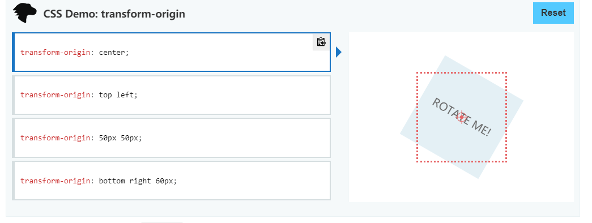

# 					什么是CSS

层叠样式表(英文全称：Cascading Style Sheets)是一种用来表现[HTML](https://baike.baidu.com/item/HTML)（[标准通用标记语言](https://baike.baidu.com/item/标准通用标记语言/6805073)的一个应用）或[XML](https://baike.baidu.com/item/XML)（标准通用标记语言的一个子集）等文件样式的计算机语言。CSS不仅可以静态地修饰网页，还可以配合各种脚本语言动态地对网页各元素进行格式化。 

CSS 能够对网页中元素位置的排版进行像素级精确控制，支持几乎所有的字体字号样式，拥有对网页对象和模型样式编辑的能力。 


# CSS的三种使用方式

##  行内样式 

-  就是代码写在具体网页中的一个元素内；比如：`<div style="color:#f00"></div> `

##  内嵌式 

-  就是在`</head>`前面写；比如：`<style type="text/css">.div{color:#F00}</style> `

## 外部式

-  就是引用外部css文件；比如：`<link href="css.css" type="text/css" rel="stylesheet" /> `

# CSS基础选择器

## 标签选择器

- 标签选择器（元素选择器）是指用**HTML**标签名称作为选择器，按标签名称分类，为页面中某一类标签指定统一的CSS样式。  
- 标签选择器 可以把某一类标签**全部**选择出来 比如所有的div标签 和 所有的 span标签

```html
		标签名{
	属性:属性值;
...
}

```

## 类选择器

- 类选择器使用“.”（英文点号）进行标识，后面紧跟类名
- 可以为元素对象定义单独或相同的样式。 可以选择一个或者多个标签  

```html
.class name{
	属性:属性值;
...
}
```


## id选择器

- id选择器使用`#`进行标识，后面紧跟id名

```html
#id name {
	属性:属性值;
...
}
```

## 通配符选择器

- 通配符选择器用`*`号表示， * 就是 选择所有的标签 他是所有选择器中作用范围最广的，能匹配页面中所有的元素。

```html
* {
	属性:属性值;
...
}
```


# CSS3复合选择题

## 后代选择器  descendant selector 

- 又成为包含选择器，可以选择父元素里面的子元素，其写法就是把外层标签写在前面，内层标签写在后面，中间用空格分隔。当标签发生嵌套时，内层标签就成为外层标签的后代。

~~~html
li a{
//li里面的a
}
~~~

## 子代选择器  Child selector 

- 只能选择作为某元素的最近一级子元素。简单理解就是选亲儿子元素。

- 语法:元素1>元素2{声明样式}

## 并集选择器

- 可以选择多组标签，同时为他们定义相同的样式。通常用于集体声明。并集选择器是各选择器通过英文逗号(,)连接而成，任何形式的选择器都可以作为并集选择器的一部分。

~~~html
a,p,span{
	color:red;
}
~~~

## 后代选择器和子代选择器的区别

> CSS中`nav ul li ul` 与 `nav>ul>li` 这两种写法的区别是什么，>的作用是什么？
> 　　　　1、nav>ul只选择nav下一级里面的ul元素，例如上面dom结构里id为a的ul。
> 　　　　2、nav ul选择nav内所包含的所有ul元素，例如上面dom结构里面id为a、b、c的全部ul。
> 　　　　3、nav>ul比nav ul限定更严格，必须后面的元素只比前面的低一个级别。 

~~~html

<style>
        *{
            margin:0;
            padding:0;
            list-style:none;
        }nav ul li ul{
            display:none;
        }nav>ul>li{
            float:left;
            padding:10px;
            border:1px solid blue;
        }nav>ul>li>ul>li{
            padding:10px;
            border-bottom:1px solid #ccc;
        }
</style>
<!--
    >是指只能一代接一代，比如： nav>ul>li>ul>li，必须是下面这样的
-->
<nav>
    <ul>
        <li>
            <ul>
                <li></li>
            </ul>
        </li>
    </ul>
</nav>
<!--
  然后nav ul li ul只要求后面的元素是在nav标签下的顺序即可，对中间隔了几层不敏感，比如：
-->
<nav>
     <div>
         <ul>
             <div>
                 <a>
                     <li>
                         <div>
                             <ul>
                                 <li></li>
                             </ul>
                         </div>
                     </li>
                 </a>
             </div>
         </ul>
     </div>
</nav>
~~~


# 盒子模型

## 内容content

## 内边距padding

- 内容与边框之间的距离  

## 外边距margin

- 元素与元素之间的距离 以边框为界

## 边框border

- 就是快递盒子的最外面一圈


| 属性         | 作用         |
| ------------ | ------------ |
| border-width | 定义边框粗细 |
| border-style | 边框的样式   |
| border-color | 边框颜色     |

- 边框的样式

| 属性   | 作用         |
| ------ | ------------ |
| none   | 没有边框     |
| solid  | 边框为单实线 |
| dashed | 边框为虚线   |
| dotted | 边框为点线   |


## 外边距塌陷(重点)

- 外边距塌陷又叫做`嵌套块元素垂直外边距的塌陷`
- 对于两个嵌套关系的`块级元素`，父元素有上外边距(margin-top)的同时子元素也有上外边距(margin-top)，此时父元素会塌陷较大的外边距值。
- 解决方案：
  - 给父元素定义上边框
  - 给父元素定义内边距
  - 给父元素添加overflow : hidden

~~~html
<!DOCTYPE html>
<html lang="en">

<head>
    <meta charset="UTF-8">
    <meta name="viewport" content="width=device-width, initial-scale=1.0">
    <meta http-equiv="X-UA-Compatible" content="ie=edge">
    <title>Document</title>


    <style>
        .one {
            width: 200px;
            height: 200px;
            background-color: hotpink;
            /* 给父元素边框和溢出隐藏可以避免塌陷 */
            /* border: 1px solid; */
            /* overflow: hidden; */
        }

        .two {
            width: 100px;
            height: 100px;
            background-color: purple;
            /* margin-top: 100px; */
            /* 子元素浮动可以避免塌陷 */
            /* float: left; */
        }
    </style>
</head>

<body>
    <div class="one">
        <div class="two">12</div>
    </div>
</body>

</html>
~~~


## 外边距合并(重点)

- 外边距合并的现象又称为`相邻块元素垂直外边距的合并`

~~~html
<!DOCTYPE html>
<html lang="en">

<head>
    <style>
        .one {
            width: 200px;
            height: 200px;
            background: skyblue;
            margin-bottom: 100px;
        }

        .two {
            width: 200px;
            height: 200px;
            background: skyblue;
            margin-top: 200px;
        }
        /* 当我给one一个margin-bottom:100px的时候，one盒子就会距离two盒子100px的距离。，但是当我给two盒子一个margin-top:200px的时候并没有出现one盒子和two盒子的距离是300px，反而是200px的距离，这些现象就是外边距合并的问题，解决的办法就是我们只需要给一个盒子设定margin值就行了。 */
    </style>
</head>

<body>
    <div class="one">我是第一个</div>
    <div class="two">我是第二个</div>
</body>

</html>
~~~


# 伪类选择器

## 


~~~html
<style type="text/css">
a:link {color: #FF0000}
a:visited {color: #00FF00}
a:hover {color: #FF00FF}
a:active {color: #0000FF}
</style>

</head>

<body>

<p><b><a href="/index.html" target="_blank">这是一个链接。</a></b></p>
<p><b>注释：</b>在 CSS 定义中，a:hover 必须位于 a:link 和 a:visited 之后，这样才能生效！</p>
<p><b>注释：</b>在 CSS 定义中，a:active 必须位于 a:hover 之后，这样才能生效！</p>

~~~


##  :focus

- 只能给input使用

~~~html
<!DOCTYPE html>
<html lang="en">

<head>
    <title>Document</title>
    <style>
        input:focus {
            background: pink;
            border: 1px solid red;
            /* 去掉input的轮廓线就是蓝色那部分 */
            outline: none;
        }
    </style>
</head>

<body>
    <input type="text">
</body>

</html>

~~~


# 结构伪类选择器

## 元素:first-child

- 选中第一个修改样式

## 元素:last-child

- 选中最后一个修改样式

## 元素:nth-child()

- 括号里面写的是几就选中第几个修改样式
- nth-child(2n)偶数个修改样式
- nth-child(2n-1)偶数个修改样式
- nth-child(-n+10)选择前10个

> n是从0到正无穷大开始

## 元素:nth-last-child()

- nth-last-child(-n+3)选择后面3个修改样式

# CSS伪元素

| 属性          | 描述                             |
| ------------- | -------------------------------- |
| :first-letter | 向文本的第一个字母添加特殊样式。 |
| :first-line   | 向文本的首行添加特殊样式。       |
| :before       | 在元素之前添加内容。             |
| :after        | 在元素之后添加内容。             |

- 伪元素内必写属性 content:" "；

~~~html
<!DOCTYPE html>
<html lang="en">
<head>
    <style>
        div{
            width: 2000px;
            height: 200px;
            background-color: pink;
        }
        div::after{
            content: "我在内容之后显示";
        }
        div::before{
            content: "我在内容之前显示";
        }
    </style>
</head>
<body>
    <div>=====是我内容=====</div>
</body>
</html>

~~~


# 元素透明opacity

- 让字和背景整体透明 用opacity 让整个元素中的所有都透明 opacity 取值0-1 0是完全透明 1是完全不透明 

~~~html
<!DOCTYPE html>
<html lang="en">

<head>
  <meta charset="UTF-8">
  <meta name="viewport" content="width=device-width, initial-scale=1.0">
  <meta http-equiv="X-UA-Compatible" content="ie=edge">
  <title>Document</title>
  <style>
    div {
      width: 200px;
      height: 200px;
      /* 让字和背景整体透明 用opacity 让整个元素中的所有都透明 opacity 取值0-1 0是完全透明 1是完全不透明 */
      opacity: 0.1;
    }
  </style>
</head>

<body>
  <div>
    6666666
  </div>
</body>

</html>
~~~


# CSS元素的显示模式

- 就是元素（标签）以书面方式进行显示，比如`<div>`会自己独占一行,一个行可以放多个`<span>`

## 块元素 block

- 例子：div h1-h6 p ul ol lo table

- 特点
  - 独占一行
  - height、width、padding、border、margin
  - 默认宽度是父元素宽度是100%
- 注意
  - 文字类的元素内不能使用块级元素,比如p标签用于存放房子，不能放div等块级元素
  - h1~h6等是文字类的块级标签，里面也不能放其他块级元素。

## 行内元素 inline

- 例子：span a strong i b small

- 特点
  - 相邻行内元素在一行上，一行可以显示多个。
  - 无法直接设置height、width
  - 没有padding、margin
  - 默认宽度等于内容(content)宽度
  - inline元素只能容纳文本或者其他inline元素
  - `行内之间有默认的间距`
- 注意
  - 链接里面不能再放链接
  - 特殊情况链接a标签可以放块级元素,但是把a转换成块元素更安全。

## 行内块元素 inline-block

- 例子：input td textarea

- 同时具有块元素和行内元素的特点
- 特点
  - 和相邻行内元素（行内块元素）在一行上显示，他们之间会有空白的缝隙，一行可以显示多个。
  - 默认宽度就是它本身内容的宽度（行内元素特点）
  - 高度、行高、外边距以及内边距都可以控制（块元素特点）

## 显示模式的转换

- display: inline;//转换行内元素
-  display: block; //转块元素
 - display: inline-block; //转行内块元素


# CSS背景

## 背景颜色background-color

~~~html
background-color:rbga(0,0,255,0.2)
//1是完全不透明，0是完全透明
~~~

## 背景图片background-image

~~~html
background-image:url("路径");
~~~

## 背景平铺 background-repeat

| 参数      | 含义                                |
| --------- | ----------------------------------- |
| repeat    | 背景图像在纵向和横向上平铺 （默认） |
| no-repeat | 背景图像不平铺                      |
| repeat-x  | 背景图片横向平铺                    |
| repeat-y  | 背景图片纵向平铺                    |

## 背景位置background-position

| **参数值** | **含义**                                           |
| ---------- | -------------------------------------------------- |
| length     | 百分数 \| 由浮点数字和单位标识符组成的长度值       |
| position   | top \| center \| bottom \| left \|  right 方位名词 |


## 背景附着 background-attachment

- 描述：设置背景图像是否固定或者随着页面的其余部分滚动。后期可以制作视差滚动效果。

| 参数值         | 含义                 |
| :------------- | -------------------- |
| scroll(默认值) | 背景图像随着内容滚动 |
| fixed          | 背景图像固定         |

## 背景图片大小 background-size

- 描述：用来设置背景图片大小的玩意

- 语法: 
          background-size:宽度 高度; //具体的数字
  
  ​		  background-size: 10px 20px;
  ​          background-size: cover contain;
​      
  
  | 参数            | 含义                             |
  | --------------- | -------------------------------- |
  | cover（遮盖）   | 填满盒子，不管图片是否完全       |
| contain（包含） | 是把图片显示全，不管是否填满盒子 |
  
     


# 文本样式

## 文本颜色 text color

- color设置文本颜色

```html
<style>
    标签{
        color:颜色;
    }
</style>
```

## 文本水平对齐方式 text-align

- text-align属性用于设置`文本内容`的水平对齐，相当于html中的align对齐属性

| 属性    | 作用           |
| ------- | -------------- |
| left    | 左对齐(默认值) |
| right   | 右对齐         |
| center  | 居中对齐       |
| Justify | 两端对齐       |


## 首行缩进

- text-indent用于设置首行文本的缩进
- **属性值**：其属性值可为不同单位的数值、em字符宽度的倍数、或相对于浏览器窗口宽度的百分比%，允许使用负值,建议使用em作为设置单位。
- `1em就是一个字的宽度，如果是汉字的段落，1em就是一个汉字的宽度`
- 1em相对的是自身的font-size,如果设置font-size是30px，那么1em就是30px

```html
<!DOCTYPE html>
<html lang="en">

<head>
    <style>
        p {
            margin: 0;
            padding: 0;
            text-indent: 2em;
        }
    </style>
</head>

<body>
    <span>萧炎天下第一</span>
    <p>萧炎天下第一</p>
</body>

</html>
```

## 文本修饰 text-decoration  

| 属性         | 作用                                                  |
| ------------ | ----------------------------------------------------- |
| none         | 默认。定义标准的文本。 取消下划线（最常用）           |
| underline    | 定义文本下的一条线。下划线 也是我们链接自带的（常用） |
| overline     | 定义文本上的一条线。（不用）                          |
| line-through | 定义穿过文本下的一条线。删除线（不常用）              |

## 行高 line-height

- ling-height代表的是基线与基线之间的高度

-  基线: 拼音格 有四线三格 从上往下数 第三条线就是基线

-  测量: 从第一行的文字的底部到第二行文字的底部 可以测出 行高

- 因为 顶线间的距离=中线间的距离 = 基线间的距离 = 底线间的距离

- 行高越大 行与行之间的距离越大

- `如果想让文字垂直居中只要让文字的行高包含它的标签的高度`

# 字体样式

## 字体大小 font-size

-  font-size属性用于设置字号  

```html
<style>
    p{
        font-size:50px;
    }
</style>
```


## 字体种类 font-family

- font-family属性用于设置哪一种字体。
- 只能设置电脑中存在的字体

```html
<style>
    p{
        font-family:"楷体";
    }
</style>
```


## 字体粗细 font-weight

| 属性值  | 作用                                                         |
| ------- | ------------------------------------------------------------ |
| normal  | 默认值（不加粗的）                                           |
| bold    | 定义粗体（加粗的）                                           |
| 100~900 | **400** **等同于** **normal**，而**700** **等同于** **bold** 我们重点记住这句话 |

**提倡**：

我们平时更喜欢用数字来表示加粗和不加粗。

## 字体风格 font-style

- font-style属性用于定义字体风格，如设置斜体、倾斜或正常字体，其可用属性  

| 属性   | 作用                                                   |
| ------ | ------------------------------------------------------ |
| normal | 默认值，浏览器会显示标准的字体样式 font-style: normal; |
| italic | 浏览器会显示斜体的字体样式。                           |


## 伪元素after和before

- 用途
  - 清除浮动
  - 鼠标移入有一个遮罩

## 伪元素的用法

   1.给真实元素添加
   2.真实元素:before 和 真实元素:after
   3.before和after能不能加上全看content有没有写
   4.给某一个标签添加before和after只能给该标签添加一个before 或一个after  不能给一个标签添加多个before 或after


# 圆角边框(重点)

- 可以让盒子变成圆角

- 语法:border-radius : length;  // radius半径

# 盒子阴影(重点)box-shadow

- 语法: box-shadow: h-shadow v-shadow blur spread color inset

| 值       | 描述                                   |
| -------- | -------------------------------------- |
| h-shadow | 必需。水平阴影的位置。允许负值。       |
| v-shadow | 必需。垂直阴影的位置。允许负值。       |
| blur     | 可选。模糊距离。                       |
| spread   | 可选。阴影的尺寸。从什么值后开始模糊   |
| color    | 可选。阴影的颜色。                     |
| inset    | 可选。将外部阴影(outset)改为内部阴影。 |

~~~css
div {
	width: 200px;
	height: 300px;
	border: 1px solid red;
	box-shadow: 0px 0px 20px red;
}
~~~


# 盒子尺寸box-sizing

- 我们知道盒模型=content(内容)+padding(内边距)+border(边框)
  但是我们通过width和height设置盒子的宽高之后就不想让padding就border把盒子变大了。
  为了解决这个问题，CSS中提供了box-sizing来为我们解决这个问题。
- 作用：当给盒子重新添加padding border的时候 重新计算盒子的宽和高

| 属性        | 作用                                                         |
| ----------- | ------------------------------------------------------------ |
| content-box | (默认值)按盒模型计算                                         |
| border-box  | 为元素设定的宽度和高度决定了元素的边框盒。就是说，为元素指定的任何内边距和边框都将在已设定的宽度和高度内进行绘制。通过从已设定的宽度和高度分别减去边框和内边距才能得到内容的宽度和高度。 |

~~~html
<!DOCTYPE html>
<html lang="en">

<head>
    <title>Document</title>
    <style>
        .one {
            /* 没有加box-sizing */
            width: 200px;
            height: 200px;
            padding: 20px;
            border: 10px solid red;
            background-color: pink;
        }

        .two {
            width: 200px;
            height: 200px;
            padding: 20px;
            box-sizing: border-box;
            border: 10px solid red;
            background-color: purple;
        }
    </style>
</head>

<body>
    <div class="one"></div>
    <div class="two"></div>
</body>

~~~


# 文字阴影text-shadow

- 语法:text-shadow: h-shadow v-shadow blur color;

| 值       | 描述                             |
| -------- | -------------------------------- |
| h-shadow | 必需。水平阴影的位置。允许负值。 |
| v-shadow | 必需。垂直阴影的位置。允许负值。 |
| blur     | 可选。模糊的距离。               |
| color    | 可选。阴影的颜色                 |


# CSS三大特性（重点）

## 层叠性

- 描述：相同选择器给设置相同的样式，此时一个样式就会覆盖（层叠）另一个冲突的样式，层叠性主要解决样式冲突的问题。层叠性简单来说：后面的样式会覆盖前面的样式。

- 例子

~~~html
<html>
   <head>
       <style>
       div{
	width:90px;
	height:50px;
	background-color:red;
}
div{
	background-color:yellow;
}
/*此时第二个div里面的background-colo:yellow就会覆盖掉第一个div里面的background-color:red,但是只会覆盖相同的属性
所以执行的会是	
           width:90px;
			height:50px;
           background-color:yellow;
           这三行代码
*/

       </style>
    </head>
    <body>
        <div>
            
        </div>
    </body>
</html>
~~~


## 继承性

- 描述：子元素继承了父元素的某些样式，如文本颜色和自豪。简单理解就是子承父业。

- 子元素可以继承父元素的样式(text-,font-,line-这些元素开头的可以继承)color也可以

~~~html
<!DOCTYPE html>
<html lang="en">
<head>
    <style>
        div {
            color: red;
        }
    </style>
</head>

<body>
    <div>
        <p>你好</p>
    </div>
</body>

</html>
<!-- 这里是p就继承了div的属性color-->
~~~


## 优先级

- 描述：当多个选择器把样式应用到同一个元素上，优先应用哪个样式，就是有优先级。（优先级与顺序无关）

> 选择器相同，则执行层叠性
>
> 选择器不用，则根据选择器权重执行

~~~html
<!DOCTYPE html>
<html lang="en">

<head>
    <style>
        div {
            width: 200px;
            height: 200px;
            background: mediumvioletred;
            border: 1px solid lawngreen;
            color: red;
        }

        .div {
            background: midnightblue;
        }

        #s {
            background: navajowhite;
        }
    </style>
</head>

<body>
    <div class="div" id="s">
    </div>
</body>

</html>
这里因为ID选择器的权重是1大于标签选择器和类选择器的权重所以执行ID选择器里面的属性
~~~


### 权重

!important写在属性值后面分号前面，一般用在框架中，作为开发者禁止使用。

当使用了!important属性之后那么js都无法操作样式
用js写的样式是行内样式

| 选择器              | 选择器权重 |
| ------------------- | ---------- |
| 继承或*             | 0,0,0,0    |
| 标签选择器          | 0,0,0,1    |
| 类选择器 伪类选择器 | 0,0,1,0    |
| ID选择器            | 0,1,0,0    |
| 行内样式 style=""   | 1,0,0,0    |

`权重计算没有进制，所以也不用进位`

标1，类10，ID百，行千

# CSS常用的布局方式(要点)

## 网页布局准则

1.`多个块级元素纵向排列找标准流，多个块级元素横向排列找浮动`。

2.`先设置盒子大小，之后设置盒子的位置。`

网页布局的本质就是用CSS来摆放盒子。把盒子摆放到相应的位置。

## 普通流（标准流）

- 描述：所谓标准流就是标签按照规定好的默认的方式排列。
- 块级元素会独占一行，从上向下顺序排列。
- 行内元素会按照顺序，从左到右顺序排列，碰到父元素边缘会自动换行。

## 浮动(重点)

- 描述：浮动是网页布局方式之一，它是让网页元素脱离标准流的方式值一，利用浮动，我们可以改变元素默认的排列方式
- 浮动最典型的应用：可以让多个块级元素在一行内排列显示，并且没有空隙。
- `语法:选择器{ float:属性值;}`

| 参数  | 含义         |
| ----- | ------------ |
| none  | 元素不浮动   |
| left  | 元素向左浮动 |
| right | 元素向右浮动 |

### 浮动元素使用经验

浮动元素经常和标准流父级搭配使用。

为了约束浮动元素位置，我们网页布局一般采取的策略是: 先用标准流的父元素排列上下位置，然后内部子元素如果再一行采取浮动排列左右位置，符合网页布局第一准则 。`简单来说就是标准流父级里面放浮动元素`

### 浮动的重要特性(重难点)

`1.脱离标准普通流的控制(浮)移动到指定位置(动)，俗称浮动。`

`2.浮动的盒子不再保留原先的位置`

3.如果多个盒子都设置了浮动，则他们会按照属性值一行内显示并且`顶端对齐排列`

4.浮动的元素是互相贴合的，没有缝隙，如果父元素装不下这些浮动的元素，会换行

5.任何元素都可以浮动。不管原先是什么模式的元素，添加浮动之后具有`行内块元素相似的特性` 

6.如果块级盒子没设置宽度，默认宽度和父级一样，但添加浮动后，宽度由内容决定

7.浮动的盒子中间是没有缝隙的，是紧挨着一起的

### 清除浮动(重要)

- 为什么要清除浮动
  - 由于父级盒子很多情况下，不方便给高度，但是子盒子浮动又不在占有位置，最后父级盒子高度为0的时候，就会影响下面的标准流盒子。
  - 由于浮动元素不再占用原文档流的位置没所以它会对后面的元素排版产生影响
  - 理想的状态应该是让子盒子撑开父盒子，有多少孩子，我父盒子就有多高。
    - 简单来说就是：1.父级没有高度。
      												   2.子盒子浮动了。
                    						   3.影响下面布局了，我们就应该清除浮动了。
  - 满足以上条件之一就需要清除浮动
  
- 语法:
  - 选择器:{clear:属性值;}

| 属性值 | 描述                                               |
| ------ | -------------------------------------------------- |
| left   | 不允许左侧有浮动元素(清除左侧浮动的影响)           |
| right  | 不允许右侧有浮动元素(清除右侧浮动的影响)           |
| both   | 同时清除左右两侧浮动的影响。`实际工作中几乎只有它` |

> 清除浮动的策略是：闭合浮动

### 清除浮动的方法

#### 1.额外标签发也称为隔墙法，是W3C推荐的做法。

- 额外标签法会在浮动元素末尾添加一个空的标签。例如`<div style="clear:both"></div>  `或者其他标签。
  - 优点：通俗易懂，书写方便。
  - 缺点：添加许多无意义的标签，结构化较差。
  - 注意：添加的元素必须是块级元素block。

~~~html
<!DOCTYPE html>
<html lang="en">

<head>
    <style>
        .box {
            margin: 0 auto;
            width: 500px;
            border: 1px solid red;
        }

        .one {
            float: left;
            width: 200px;
            height: 200px;
            background-color: pink;
        }

        .two {
            float: left;
            width: 200px;
            height: 200px;
            background-color: blueviolet;
        }

        .xiaosan {
            height: 200px;
            background-color: black;
        }

        /* 额外标签法 */
        .clear {
            clear: both
        }
    </style>
</head>

<body>
    <div class="box">
        <div class="one">11</div>
        <div class="two">22</div>
        <div class="two">22</div>
        <div class="two">22</div>
        <div class="two">22</div>
        <div class="two">22</div>
        <!-- 额外标签法 -->
        <div class="clear"></div>
    </div>
    <div class="xiaosan"></div>
</body>

</html>
~~~


#### 2.父级添加overflow属性

- 给父级添加overflow属性，将其属性值设置为hidden、auto或scroll都可以清除浮动。
  - 优点：代码简洁。
  - 缺点：无法显示溢出部分。

~~~html
<!DOCTYPE html>
<html lang="en">

<head>
    <style>
        .box {
            margin: 0 auto;
            width: 500px;
            border: 1px solid red;
            /* 清除浮动 */
            overflow: hidden;
        }

        .one {
            float: left;
            width: 200px;
            height: 200px;
            background-color: pink;
        }

        .two {
            float: left;
            width: 200px;
            height: 200px;
            background-color: blueviolet;
        }

        .xiaosan {
            height: 200px;
            background-color: black;
        }
    </style>
</head>

<body>
    <div class="box">
        <div class="one">11</div>
        <div class="two">22</div>
        <div class="two">22</div>
        <div class="two">22</div>
        <div class="two">22</div>
        <div class="two">22</div>
    </div>
    <div class="xiaosan"></div>
</body>

</html>
~~~


#### 3.父级添加after伪元素

- 额外标签法的升级版，也是给父级元素添加
  - 优点：没有增加标签，结构更简单。
  - 缺点：照顾低版本浏览器。
  - 代码网址：百度、淘宝、网易等

~~~html
<!DOCTYPE html>
<html lang="en">

<head>
    <style>
        .clearfix::after {
            content: "";
            display: block;
            height: 0;
            clear: both;
            visibility: hidden;
        }

        .clearfix {
            /* IE6、7专有 */
            *zoom: 1;
        }

        .box {
            margin: 0 auto;
            width: 500px;
            border: 1px solid red;
        }

        .one {
            float: left;
            width: 200px;
            height: 200px;
            background-color: pink;
        }

        .two {
            float: left;
            width: 200px;
            height: 200px;
            background-color: blueviolet;
        }

        .xiaosan {
            height: 200px;
            background-color: black;
        }
    </style>
</head>


<body>
    <!-- 给父元素添加clearfix清除浮动 -->
    <div class="box clearfix">
        <div class="one">11</div>
        <div class="two">22</div>
        <div class="two">22</div>
        <div class="two">22</div>
        <div class="two">22</div>
        <div class="two">22</div>
    </div>
    <div class="xiaosan"></div>
</body>

</html>
~~~


#### 4.父级添加双伪元素

- 给父级元素添加
  - 优点：代码更简洁。
  - 缺点：照顾低版本浏览器。

~~~html
<!DOCTYPE html>
<html lang="en">

<head>
    <style>
        /* 双伪元素清除浮动 */
        .clearfix:before,
        .clearfix:after {
            content: "";
            display: table;
        }

        .clearfix::after {
            clear: both;
        }

        .clearfix {
            /* IE6、7专有 */
            *zoom: 1;
        }

        .box {
            margin: 0 auto;
            width: 500px;
            border: 1px solid red;
        }

        .one {
            float: left;
            width: 200px;
            height: 200px;
            background-color: pink;
        }

        .two {
            float: left;
            width: 200px;
            height: 200px;
            background-color: blueviolet;
        }

        .xiaosan {
            height: 200px;
            background-color: black;
        }
    </style>
</head>


<body>
    <!-- 给父元素添加clearfix清除浮动 -->
    <div class="box clearfix">
        <div class="one">11</div>
        <div class="two">22</div>
        <div class="two">22</div>
        <div class="two">22</div>
        <div class="two">22</div>
        <div class="two">22</div>
    </div>
    <div class="xiaosan"></div>
</body>

</html>
~~~


## 定位

### 为什么要使用定位？

- 提问：以下情况使用标准流或者浮动能实现吗？
  - 1.某个元素可以自由的在一个盒子内移动位置，并且压住其他盒子。
  - 2.当我们滚动窗口的时候，盒子是固定屏幕某个位置的。
- 以上效果，标准流或浮动都无法快速实现，此时需要`定位`来实现。
- 所以：
  - 1.浮动可以让多个块级盒子一行没有缝隙显示，经常用于横向排泄盒子。
  - 2.定位则是可以让盒子自由的在某个盒子内移动位置或者固定屏幕中某个位置，并且可以压住其他盒子。

### 定位组成

- 定位：将盒子定在某一个位置，所以定位也是摆放盒子，按照定位的方式移动盒子。
- `定位`=`定位模式`+`边偏移`
- `定位模式`用于指定一个元素在文档中的定位方式。`边偏移`则决定了改元素的最终位置。

#### 定位模式

- 定位模式决定元素的定位方式，它通过CSS的`position`属性来设置,其值可以分为4个。

| 值         | 语义               |
| ---------- | ------------------ |
| `static`   | `静态`定位(默认的) |
| `relative` | `相对`定位         |
| `absolute` | `绝对`定位         |
| `fixed`    | `固定`定位         |

##### 静态定位static(了解)

- 静态定位是元素的默认定位方式，无定位的意思
- 语法:
  - 选择器{ position : static;}
- 静态定位按照标准流特性摆放位置，它没有边偏移。


##### 相对定位relative(重要)

- 相对定位是元素在移动位置的时候，是相对于它`原来的位置`来说的
- 原来在标准流的位置继续占有，后面的盒子仍然以标准的方式对待它。(不脱标，继续占有原来的位置)
- 它是给绝对定位当`爹`用的

#####  绝对定位absolute(重要)

- 绝对定位在元素移动位置的时候，是相对于它`祖先元素`来说的。(拼爹型)。(就是看父元素的脸色来移动位置)
- 特点 ：
  - 1.如果没有祖先元素或者祖先元素`没有定位`，则以浏览器为准定位(Document文档)
  - 2.如果祖先元素有定位(相对、绝对、固定定位)，则以`最近一级`的`有定位祖先元素`为参考点移动位置。
  - `绝对定位不再占有原先的位置`(脱标)

> 绝对定位垂直居中

##### 固定定位fixed(重要)
- 固定定位是元素固定于浏览器可视区的位置。主要使用场景：可以在浏览器页面滚动时元素的位置不会改变。
- 特点：
  - 1.以浏览器的可视窗口为参照点移动元素。
    - 跟父元素没有任何关系
    - 不随滚动条滚动。
  - 2.固定定位不在占有原先的位置。
- 固定定位也是脱标的，其实固定定位也可以看做是一种特殊的绝对定位。

> 固定定位的小技巧：固定在版心右侧位置。
>
> 小算法：


##### 粘性对位sticky(了解)

- 粘性定位可以被认为是相对定位和固定定位的混合。Sticky粘性的
- 特点：
  - 以浏览器的可视窗口为参照点移动元素(固定定位特点)
  - 粘性定位占有原先的位置(相对定位特点)
  - 必须添加边偏移中的一个才有效果。


##### 定位叠放次序 z-index

- 在使用定位布局时，可能会出现盒子重叠的情况。此时，可以使用z-index来控制盒子的前后次序(z轴)
- 语法：
  - 选择器：{ z-index : 1 }
- 数值可以是正整数、负整数或者0，默认是auto，数值越大，盒子约靠上。
- `数字后面不能加单位`
- 只有`定位`的盒子才有z-index属性

#### 边偏移

- 边偏移就是定位的盒子移动到最终位置。有top、bottom、left和right4个属性。

| 边偏移属性 | 例子        | 描述                                                 |
| ---------- | ----------- | ---------------------------------------------------- |
| top        | top:80px    | `顶端`偏移量，定义元素相对于其父元素`上边线的距离`。 |
| bottom     | bottom:80px | `底部`偏移量，定义元素相对于其父元素`下边线的距离`。 |
| left       | left:80px   | `左侧`偏移量，定义元素相对于其父元素`左边线的距离`。 |
| right      | right:80px  | `右侧`偏移量，定义元素相对于其父元素`右边线的距离`。 |


## 子绝父相的由来

- 子级绝对定位，不会占有位置，可以放到父盒子里面的任何一个地方，不会影响其他的兄弟盒子。
- 父盒子加定位限制子盒子在父盒子内显示。
- 父盒子布局时，需要占有位置，因此父亲只能是相对定位。

> 总结： 因为父级需要占有位置，因此是相对定位，子盒子不需要占有位置，则是绝对定位。

- 其他：
  - 开发之中还有子绝父绝、子绝父固。

# 元素的显示和隐藏

- 所谓的元素显示和隐藏就是利用CSS属性来控制元素在页面中隐藏或显示出来。共有三种方法：
  - display显示隐藏
  - visibility显示隐藏
  - overflow溢出显示隐藏

## display属性

- display vi. （计算机屏幕上）显示;

- 用于设置一个元素如何显示，隐藏元素后，不再占有原来的位置。
  后面应用非常广泛，搭配JS可以做很多网页特效
- display : none隐藏元素
- display : block 除了转换为块级元素外，同时还有显示元素的意思。当然inline、inline-block、table也都可以显示。

## visibility属性 

-  visibility n. 能见度; 可见性; 可见距离; 清晰度;  visible  adj. 看得见的; 明显的，显然的; 手头的，可得到的; 可察觉到的; hidden v. 隐藏
- 用于指定一个元素可见还是隐藏。visibility隐藏元素后，继续占有原来的位置。
- visibility : visible 元素可看见   
- visibility : hidden 隐藏元素保留原来位置

~~~html
<!DOCTYPE html>
<html lang="en">
<head>
    <title>Document</title>
    <style>
        a{
            display: inline-block;
            width: 200px;
            height: 200px;
            visibility: hidden;
            background-color: pink;
        }
        div{
            display: inline-block;
            width: 200px;
            height: 200px;
            background-color: hotpink;
        }
    </style>
</head>
<body>
    <a href="">666</a>
    <div></div>
</body>
</html>
~~~


## overflow属性

- overflow adj. 溢出的，满出的; scroll vi. （似卷轴般）卷起; （像展开卷轴般地）将文字显示于屏幕; 

- overflow : visible 不剪切内容也不添加滚动条
- overflow : hidden 不显示超过对象尺寸的内容，超出的部分隐藏掉。
- overflow : scroll 不管是否超出内容都显示滚动条
- overflow : auto 超出自动显示滚动条，不超出不显示滚动条。

# 精灵图

- 精灵图技术主要针对背景图片使用。
- 移动背景图片位置，此时可以使用background-position
- 移动的距离就是这个目标图片的X和Y轴
- 因为一般情况下都是往上往左移动，所以数值是负值。
- 使用精灵图需要测试，非常麻烦

# 字体图标

- 精灵图的优点是可以减少请求，降低服务器的压力。但是精灵图的缺点也同样显著。首先图片文件还是比较大的，另外图片本身放大或缩小会失真，最主要的是图片制作完毕想要更换特别麻烦。为了解决以上问题，怎么办呢？
- 字体图标: 字体图标是一种方便高效的图片使用方式，展示的是图标，本质属于字体。也称为图标字体。
- 轻量级: 一个字体图标要比一系列的图像小。一旦字体加载，图片就会立即渲染。
- 灵活性: 本质其实是文字，可以很随意的改变颜色、加阴影、透明等效果
- 兼容性: 几乎支持所有的浏览器，可以放心使用
- 减少了服务器的请求次数


# CSS过渡transition

- transition-property 过渡属性  指定哪个属性要过渡 如果要让所有变化的属性都过渡 那就加all

- transition-timing-function 过渡速度 linear ease  ease-in ease-out ease-in-out

- transition-duration 过渡总时间 从开始到结束总共多长时间 s ms

- transition-delay 过渡延迟 等多长时间后才开始变化 s ms

~~~html
<!DOCTYPE html>
<html lang="en">

<head>
  <meta charset="UTF-8">
  <meta name="viewport" content="width=device-width, initial-scale=1.0">
  <meta http-equiv="X-UA-Compatible" content="ie=edge">
  <title>Document</title>
  <style>
    a {
      position: relative;
      top: 0;
      left: 0;
      display: block;
      width: 200px;
      height: 200px;
      /* 初始状态 */
      background-color: red;
      /* 过渡 transition */
      /* 让有初始状态 和结束状态的属性产生一个过渡 */

      /* all代表所有变化了的属性  1s代表从开始到结束状态整个变化用了1s来完成 */
      transition: all 1s;
    }

    a:hover {
      top: -4px;
      /* 结束状态 */
      background-color: teal;
      box-shadow: 0 10px 15px rgba(0, 0, 0, 0.5);
    }
  </style>
</head>

<body>
  <a href=""></a>
</body>

</html>
~~~


#  vertical-align 属性设置元素的垂直对齐方式。 

-  用来指定行内元素（inline）或表格单元格（table-cell）元素的垂直对齐方式。 


# transform   2D转换

##  **`transform-origin`** CSS属性让你更改一个元素变形的原点。

##   


转换(tranform)是CSS3中具有颠覆性的特征之一，可以实现元素的位移、旋转、缩放等效果。

## 移动：translate

- 重点:
- 定义2D转换中的移动，沿着X和Y轴移动元素
- translate最大的优点：不会影响到其他元素的位置
- translate中的百分比单位是相对于自身元素的translate
- 对inline标签没有效果

```html
<!DOCTYPE html>
<html lang="en">

<head>
    <meta charset="UTF-8">
    <style>
        div {
            width: 200px;
            height: 200px;
            background-color: pink;
            /* x,y */
            transform: translate(20px, 10px);
            /* 移动X轴 */
            /* transform: translateX(20px); */
            /* 移动Y轴 */
            /* transform: translateY(10px); */
        }
    </style>
</head>

<body>
    <div></div>
    <p>121</p>
</body>

</html>
```

## 旋转：rotate

- rotate(数字+单位deg)

~~~html
<!DOCTYPE html>
<html lang="en">

<head>
    <meta charset="UTF-8">
    <style>
        div {
            width: 200px;
            height: 200px;
            background-color: pink;
            /* x,y */
            transform: translate(20px, 10px);
            /* 移动X轴 */
            /* transform: translateX(20px); */
            /* 移动Y轴 */
            /* transform: translateY(10px); */
        }

        div:hover {
            transition: all .4s;
            transform: rotate(45deg)
        }
    </style>
</head>

<body>
    <div></div>
    <p>1212</p>
</body>

</html>
~~~


## 缩放：scale

~~~html
<!DOCTYPE html>
<html lang="en">

<head>
    <meta charset="UTF-8">
    <title>Document</title>
    <style>
        li {
            float: left;
            width: 50px;
            height: 50px;
            border: 1px solid wheat;
            border-radius: 50%;
            list-style-type: none;
            line-height: 50px;
            text-align: center;
            margin: 0 20px;
        }

        li:hover {
            transform: scale(1.5);
            transition: all .4s;
        }
    </style>
</head>

<body>
    <ul>
        <li>1</li>
        <li>2</li>
        <li>3</li>
        <li>4</li>
        <li>5</li>
        <li>6</li>
        <li>7</li>
    </ul>
</body>

</html>
~~~


## 2D转换综合写法

- 格式:transform:translate() rotate() scale() 
- 其顺序会影响转换的效果(先旋转会改变坐标轴方向)
- 当我们同时有位移和其他属性的时候，记得要讲位移放到最前面


# 线性渐变linear-gradient

- 就是沿着某个方向进行颜色的渐变，可以左右上下以及对角线。

- 线性渐变的语法: background-image: linear-gradient(方向,起始色 颜色距离,终止色 颜色距离, 颜色 距离, 颜色 距离) 
-  to top, to bottom, to left 和 to right这些值会被转换成角度0度、180度、270度和90度。其余值会被转换为一个以向顶部中央方向为起点顺时针旋转的角度。渐变线的结束点与其起点中心对称。 

~~~html
<!DOCTYPE html>
<html>

<head>
    <style>
        .one {
            width: 300px;
            height: 300px;
            border: 1px solid;
            background-image: linear-gradient(0deg, white 25%, black 25%);
        }

        .two {
            width: 300px;
            height: 300px;
            background: linear-gradient(217deg, rgba(255, 0, 0, .8), rgba(255, 0, 0, 0) 70.71%),
                linear-gradient(127deg, rgba(0, 255, 0, .8), rgba(0, 255, 0, 0) 70.71%),
                linear-gradient(336deg, rgba(0, 0, 255, .8), rgba(0, 0, 255, 0) 70.71%);
        }
    </style>
</head>

<body>
    <div class="one"></div>
    <div class="two"></div>
</body>

</html>
~~~


~~~html

<!DOCTYPE html>
<html lang="en">

<head>
    <meta charset="UTF-8">
    <meta name="viewport" content="width=device-width, initial-scale=1.0">
    <meta http-equiv="X-UA-Compatible" content="ie=edge">
    <title>Document</title>
    <style>
        div {
            width: 100px;
            height: 100px;
            /* border: 1px solid green; */
            margin: 100px auto;

            /* 有的时候 需要出现间隔明显的渐变  */
            /* 线性渐变的语法: background-image: linear-gradient(方向,起始色 颜色距离,终止色 颜色距离, 颜色 距离, 颜色 距离) */
            background: linear-gradient(to right, black 25%, white 25%, #333 50%, white 50%);
            background-size: 50px;

        }
    </style>
</head>

<body>
    <div></div>
</body>

</html>
~~~


# 径向渐变radial-gradient

- 语法:background-image : radial-gradient(主轴 次轴 at 圆心X 圆心 Y，颜色 距离,颜色 距离...)

- ```css
  background-image: radial-gradient(shape size at position, start-color, ..., last-color);
  ```

| 值                             | 描述                                                         |
| ------------------------------ | ------------------------------------------------------------ |
| *shape*                        | 确定圆的类型:<br />ellipse (默认): 指定椭圆形的径向渐变。<br />circle ：指定圆形的径向渐变 |
| *size*                         | 定义渐变的大小，可能值：<br />farthest-corner (默认) : 指定径向渐变的半径长度为从圆心到离圆心最远的角closest-side ：指定径向渐变的半径长度为从圆心到离圆心最近的边<br />closest-corner ： 指定径向渐变的半径长度为从圆心到离圆心最近的角<br />farthest-side ：指定径向渐变的半径长度为从圆心到离圆心最远的边 |
| *position*                     | 定义渐变的位置。可能值：<br />**center**（默认）：设置中间为径向渐变圆心的纵坐标值。<br />**top**：设置顶部为径向渐变圆心的纵坐标值。<br /> **bottom**：设置底部为径向渐变圆心的纵坐标值。 |
| *start-color, ..., last-color* | 用于指定渐变的起止颜色。                                     |


# 浏览器私有前缀

-  由于CSS3很多属性尚未成为W3C标准的一部分，因此每种内核的浏览器都只能识别带有自身私有前缀的CSS3属性。我们在书写CSS3代码时，需要在属性前加上浏览器的私有前缀，然后该种内核的浏览器才能识别相应的CSS3属性。 
- -ms- 微软
- -moz- 或火狐
- -webkit- chrome和苹果
- 查看CSS的支持情况 https://caniuse.com/ 

# sass中的@import和css中的@import 有什么区别
sass是开发时使用先编译 后上线使用压根儿就不存在多个css引用的问题只是在编译过程中需要点时间
css是上线之后网页加载需要样式的时候下载如果在css中使用@import会让css 下载两次以上会让网页渲染变慢所以是无用功不用

# 常见问题解决办法

## 1.去除行内块元素之间的距离 

- 因为空格也算字符，所以我们只需要给父元素设置font-size:0;就行了

## 2.为什么a标签无法继承父元素的属性

- 因为 浏览器会有一个基本的样式表来给任何网页设置默认样式。这些样式统称**用户代理样式** (user agent  *stylesheet* )
- 所以浏览器对a元素有默认的样式(user agent  stylesheet )，再由于CSS的优先级，继承的优先级是最低的，所以无法通过继承修改a标签的属性

## 3.内边距padding没有撑开盒子的大小

- 原因很简单因为没有给盒子指定width和height属性。此时padding就不会撑开盒子大小

## 4.margin : 0 auto无法居中的解决办法

- 想要居中需要给盒子`宽度`才能居中

## 5.为何img、input等内联元素可设置宽高

### 简答：

因为``、`<input>`属于替换元素，替换元素一般有内在尺寸和宽高比(auto时起作用)，所以具有width和height，可以设定。

### 细答：

元素是文档结构的基础，在CSS中，每个元素生成了一个包含了元素内容的框（box，也译为“盒子”）。但是不同的元素显示的方式会有所不同，例如` <div>`和`<span>`  就不同，而`<strong>`和 `<p>`也不一样。

#### 1. 替换和不可替换元素

从元素本身的特点来讲，可以分为替换和不可替换元素。

##### a) 替换元素

```
替换元素 : 浏览器根据元素的标签和属性，来决定元素的具体显示内容。复制代码
```

例如浏览器会根据``标签的src属性的值来读取图片信息并显示出来;根据`<input>`标签的type属性来决定是显示输入框，还是单选按钮等。HTML中的` 、<input>、<textarea>、<select> ` 都是替换元素。这些元素往往没有实际的内容，即是一个空元素,浏览器会根据元素的标签类型和属性来显示这些元素。

##### b) 不可替换元素

```
HTML 的大多数元素是不可替换元素，即其内容直接表现给用户端（例如浏览器）。复制代码
```

例如`<p>段落的内容</p>`，段落`<p>`是一个不可替换元素，文字“段落的内容”全被显示。

#### 2. 块级和行内元素

除了可替换元素和不可替换元素的分类方式外，CSS2.1中元素还有另外的分类方式：块级元素（block-level）和行内元素（inline-level，也译作“内联”元素）。

##### a) 块级元素

```
在视觉上被格式化为块的元素，最明显的特征就是默认在横向充满其父元素的内容区域，而且在其左右两边没有其他元素，即独占一行。复制代码
```

典型的块级元素有`：<div>、<p>、<h1>到<h6>`，等等；通过CSS设定了浮动（float属性）以及设定显示（display）属性为“block”或“list-item”的元素都是块级元素。但是浮动元素比较特殊，由于浮动，其旁边可能会有其他元素的存在。而“list-item”（列表项`<li>`），会在其前面生成圆点符号，或者数字序号。

##### b) 行内元素

```
行内元素不形成新内容块，即在其左右可以有其他元素。复制代码
```

例如`<a>、<span>、<strong>`等，都是典型的行内级元素。display属性等于“inline”的元素都是行内元素。

### 结语

1. 几乎所有的**替换元素**都是**行内元素**，例如`、<input>`等等。不过元素的类型也不是固定的，通过设定CSS 的display属性，可以使行内元素变为块级元素，也可以让块级元素变为行内元素。
2. 替换元素一般有内在尺寸，所以具有width和height，可以设定。例如你不指定img的width和height时，就按其内在尺寸显示，也就是图片被保存的时候的宽度和高度。对于表单元素，浏览器也有默认的样式，包括宽度和高度。

### 补充知识点

inline元素默认是基线对齐的 vertical-align=baseline                 


## 6.强制出现省略号

~~~css
            /* 超出隐藏 */
            overflow: hidden;
            /* 强制一行显示 */
            white-space: nowrap;
            /* ellipsis省略 */
            text-overflow: ellipsis;


//多行省略号
overflow:hidden;
text-overflow:ellipsis;
display:-webkit-box;
-webkit-line-clamp:2; (两行文字)
-webkit-box-orient:vertical;
~~~

## 7.去掉移动端的蓝色点击块

~~~css
body {
    -webkit-tap-highlight-color: rgba(0, 0, 0, 0);
}
~~~


## 8.link和@import有什么区别

- link属于HTML标签，而@import是CSS提供的，且只能加载CSS
- 页面被加载时，link会同时被加载，而@import引用的CSS会等到页面被加载完后再加载。
- @import只能在IE5以上才能识别，而link是HTML标签，无兼容问题
- link引入方式的权重高于@import的权重。

## 9.rgba()和opacity的透明效果有什么不同？

-  opacity作用域元素，以及元素内的所有内容的透明度，rgba()只能作用域元素的颜色或者背景颜色。
- 设置rgba透明的元素的子元素不会继承透明效果。