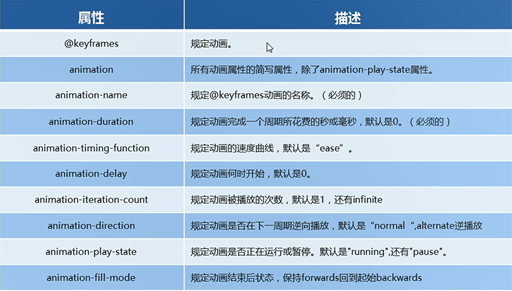
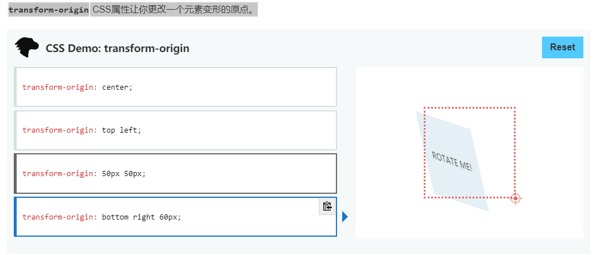
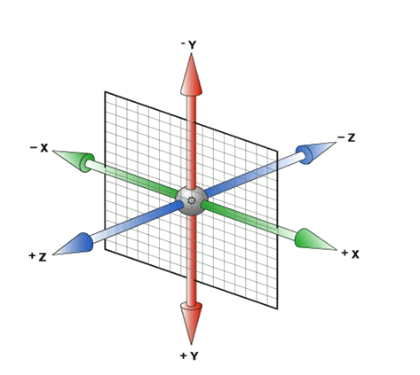

# 动画

##　动画的基本使用

`动画常用属性` 



| 属性                      | 值                                                           |
| ------------------------- | ------------------------------------------------------------ |
| animation-timing-function | linear(匀速)<br />ease(默认值,低俗开始，然后加快，在结束前变慢)<br /><br />cubic-bezier(*n*,*n*,*n*,*n*) [在 cubic-bezier 函数中自己的值。可能的值是从 0 到 1 的数值。] |
| animation-delay           | 延迟时间 s,ms                                                |
| animation-iteration-count | 数字,infinite(无限的)                                        |
| animation-direction       | normal(默认值，正播放),alternate(逆播放)                     |
| animation-fill-mode       | forwards(当动画完成后，保持最后一个属性值),backwards(回到起始) |
| animation-play-state      | running(默认值),pause(暂停)                                  |


~~~html
<!DOCTYPE html>
<html lang="en">

<head>
    <meta charset="UTF-8">
    <meta name="viewport" content="width=device-width, initial-scale=1.0">
    <meta http-equiv="X-UA-Compatible" content="ie=edge">
    <title>Document</title>
    <style>
        /* 定义动画 */
        /*  move是动画名字 */
        @keyframes move {

            /* 动画序列开始 */
            /* 开始状态 forme==0%*/
            0% {
                transform: translate(0px, 0px) rotate(0);
            }

            /* 结束状态 to==100%*/
            100% {
                transform: translate(1920px, 500px) rotate(360deg);
            }

            /* 动画序列结束 */
        }


        div {
            width: 500px;
            height: 500px;
            background-color: pink;
            /* 2.调用动画 */
            animation-name: move;
            /* 调用的时间 */
            animation-duration: 2s;
        }
    </style>
</head>

<body>
    <div></div>
</body>

</html>
~~~


### 制作动画分为两步:

#### 1.先定义动画

- 用keyframes定义动画(类似于定义类选择器)


#### 2.再使用(调用)动画

- animation-name:动画名称
  animation-duration:持续时间

##  动画简写属性

animation:动画名称 持续时间 运动曲线 何时开始 播放次数 是否反方向 动画起始或者结束的状态；

animation: animation-name animation-duration animation-timing-function animation-delay animation-iteration-count animation-direction animation-fill-mode

animation: animation-name(动画名称) `animation-duration(持续时间)` animation-timing-function(运动曲线) `animation-delay(何时开始)` animation-iteration-count(播放次数) `animation-direction(是否反方向)` animation-fill-mode(动画起始或者结束的状态)


# transform   2D转换

##  **`transform-origin`** CSS属性让你更改一个元素变形的原点。

##   




转换(tranform)是CSS3中具有颠覆性的特征之一，可以实现元素的位移、旋转、缩放等效果。

## 移动：translate

- 重点:
- 定义2D转换中的移动，沿着X和Y轴移动元素
- translate最大的优点：不会影响到其他元素的位置
- translate中的百分比单位是相对于自身元素的translate
- 对inline标签没有效果

```html
<!DOCTYPE html>
<html lang="en">

<head>
    <meta charset="UTF-8">
    <style>
        div {
            width: 200px;
            height: 200px;
            background-color: pink;
            /* x,y */
            transform: translate(20px, 10px);
            /* 移动X轴 */
            /* transform: translateX(20px); */
            /* 移动Y轴 */
            /* transform: translateY(10px); */
        }
    </style>
</head>

<body>
    <div></div>
    <p>121</p>
</body>

</html>
```

## 旋转：rotate

- rotate(数字+单位deg)

~~~html
<!DOCTYPE html>
<html lang="en">

<head>
    <meta charset="UTF-8">
    <style>
        div {
            width: 200px;
            height: 200px;
            background-color: pink;
            /* x,y */
            transform: translate(20px, 10px);
            /* 移动X轴 */
            /* transform: translateX(20px); */
            /* 移动Y轴 */
            /* transform: translateY(10px); */
        }

        div:hover {
            transition: all .4s;
            transform: rotate(45deg)
        }
    </style>
</head>

<body>
    <div></div>
    <p>1212</p>
</body>

</html>
~~~


## 缩放：scale

~~~html
<!DOCTYPE html>
<html lang="en">

<head>
    <meta charset="UTF-8">
    <title>Document</title>
    <style>
        li {
            float: left;
            width: 50px;
            height: 50px;
            border: 1px solid wheat;
            border-radius: 50%;
            list-style-type: none;
            line-height: 50px;
            text-align: center;
            margin: 0 20px;
        }

        li:hover {
            transform: scale(1.5);
            transition: all .4s;
        }
    </style>
</head>

<body>
    <ul>
        <li>1</li>
        <li>2</li>
        <li>3</li>
        <li>4</li>
        <li>5</li>
        <li>6</li>
        <li>7</li>
    </ul>
</body>

</html>
~~~


## 2D转换综合写法

- 格式:transform:translate() rotate() scale() 
- 其顺序会影响转换的效果(先旋转会改变坐标轴方向)
- 当我们同时有位移和其他属性的时候，记得要讲位移放到最前面


# transform 3D转换

在html里面三维坐标系

- x轴：水平向右，右正
- y轴垂直向下，下正
- z轴垂直屏幕，往外面正


****


## perspective透视

- 如果想要在网页产生3D效果需要透视，模拟人的眼睛
- 透视也可以理解为视距：视距就是人的眼睛到屏幕的距离
- **透视的单位是**`像素`

> 透视写在被观察元素的父盒子上面

## tanlate3d(x,y,z) 3D位移

- z轴与电脑屏幕垂直

## transform-style 3D呈现

- 控制子元素是否开启三维立体环境
- transform-style : flat子元素不开启3d立体空间，默认的
- transform-style : preserve-3d子元素开启立体空间
- `代码写个父级，但是影响的是子盒子`

## tanlate3d(x,y,z) 3D旋转

z轴与电脑屏幕垂直


# 转换原点

- transform-origin: 方位词 | 具体像素 | 百分比

# 线性渐变linear-gradient

- 就是沿着某个方向进行颜色的渐变，可以左右上下以及对角线。

- 线性渐变的语法: background-image: linear-gradient(方向,起始色 颜色距离,终止色 颜色距离, 颜色 距离, 颜色 距离) 
-  to top, to bottom, to left 和 to right这些值会被转换成角度0度、180度、270度和90度。其余值会被转换为一个以向顶部中央方向为起点顺时针旋转的角度。渐变线的结束点与其起点中心对称。 

~~~html
<!DOCTYPE html>
<html>

<head>
    <style>
        .one {
            width: 300px;
            height: 300px;
            border: 1px solid;
            background-image: linear-gradient(0deg, white 25%, black 25%);
        }

        .two {
            width: 300px;
            height: 300px;
            background: linear-gradient(217deg, rgba(255, 0, 0, .8), rgba(255, 0, 0, 0) 70.71%),
                linear-gradient(127deg, rgba(0, 255, 0, .8), rgba(0, 255, 0, 0) 70.71%),
                linear-gradient(336deg, rgba(0, 0, 255, .8), rgba(0, 0, 255, 0) 70.71%);
        }
    </style>
</head>

<body>
    <div class="one"></div>
    <div class="two"></div>
</body>

</html>
~~~


~~~html

<!DOCTYPE html>
<html lang="en">

<head>
    <meta charset="UTF-8">
    <meta name="viewport" content="width=device-width, initial-scale=1.0">
    <meta http-equiv="X-UA-Compatible" content="ie=edge">
    <title>Document</title>
    <style>
        div {
            width: 100px;
            height: 100px;
            /* border: 1px solid green; */
            margin: 100px auto;

            /* 有的时候 需要出现间隔明显的渐变  */
            /* 线性渐变的语法: background-image: linear-gradient(方向,起始色 颜色距离,终止色 颜色距离, 颜色 距离, 颜色 距离) */
            background: linear-gradient(to right, black 25%, white 25%, #333 50%, white 50%);
            background-size: 50px;

        }
    </style>
</head>

<body>
    <div></div>
</body>

</html>
~~~


# 径向渐变radial-gradient

- 语法:background-image : radial-gradient(主轴 次轴 at 圆心X 圆心 Y，颜色 距离,颜色 距离...)

- ```css
  background-image: radial-gradient(shape size at position, start-color, ..., last-color);
  ```

| 值                             | 描述                                                         |
| ------------------------------ | ------------------------------------------------------------ |
| *shape*                        | 确定圆的类型:<br />ellipse (默认): 指定椭圆形的径向渐变。<br />circle ：指定圆形的径向渐变 |
| *size*                         | 定义渐变的大小，可能值：<br />farthest-corner (默认) : 指定径向渐变的半径长度为从圆心到离圆心最远的角closest-side ：指定径向渐变的半径长度为从圆心到离圆心最近的边<br />closest-corner ： 指定径向渐变的半径长度为从圆心到离圆心最近的角<br />farthest-side ：指定径向渐变的半径长度为从圆心到离圆心最远的边 |
| *position*                     | 定义渐变的位置。可能值：<br />**center**（默认）：设置中间为径向渐变圆心的纵坐标值。<br />**top**：设置顶部为径向渐变圆心的纵坐标值。<br /> **bottom**：设置底部为径向渐变圆心的纵坐标值。 |
| *start-color, ..., last-color* | 用于指定渐变的起止颜色。                                     |

# transform属性

| 值                                                           | 描述                                    |
| ------------------------------------------------------------ | --------------------------------------- |
| none                                                         | 定义不进行转换。                        |
| matrix(*n*,*n*,*n*,*n*,*n*,*n*)                              | 定义 2D 转换，使用六个值的矩阵。        |
| matrix3d(*n*,*n*,*n*,*n*,*n*,*n*,*n*,*n*,*n*,*n*,*n*,*n*,*n*,*n*,*n*,*n*) | 定义 3D 转换，使用 16 个值的 4x4 矩阵。 |
| translate(*x*,*y*)                                           | 定义 2D 转换。                          |
| translate3d(*x*,*y*,*z*)                                     | 定义 3D 转换。                          |
| translateX(*x*)                                              | 定义转换，只是用 X 轴的值。             |
| translateY(*y*)                                              | 定义转换，只是用 Y 轴的值。             |
| translateZ(*z*)                                              | 定义 3D 转换，只是用 Z 轴的值。         |
| scale(*x*[,*y*]?)                                            | 定义 2D 缩放转换。                      |
| scale3d(*x*,*y*,*z*)                                         | 定义 3D 缩放转换。                      |
| scaleX(*x*)                                                  | 通过设置 X 轴的值来定义缩放转换。       |
| scaleY(*y*)                                                  | 通过设置 Y 轴的值来定义缩放转换。       |
| scaleZ(*z*)                                                  | 通过设置 Z 轴的值来定义 3D 缩放转换。   |
| rotate(*angle*)                                              | 定义 2D 旋转，在参数中规定角度。        |
| rotate3d(*x*,*y*,*z*,*angle*)                                | 定义 3D 旋转。                          |
| rotateX(*angle*)                                             | 定义沿着 X 轴的 3D 旋转。               |
| rotateY(*angle*)                                             | 定义沿着 Y 轴的 3D 旋转。               |
| rotateZ(*angle*)                                             | 定义沿着 Z 轴的 3D 旋转。               |
| skew(*x-angle*,*y-angle*)                                    | 定义沿着 X 和 Y 轴的 2D 倾斜转换。      |
| skewX(*angle*)                                               | 定义沿着 X 轴的 2D 倾斜转换。           |
| skewY(*angle*)                                               | 定义沿着 Y 轴的 2D 倾斜转换。           |
| perspective(*n*)                                             | 为 3D 转换元素定义透视视图。            |


