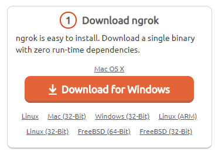
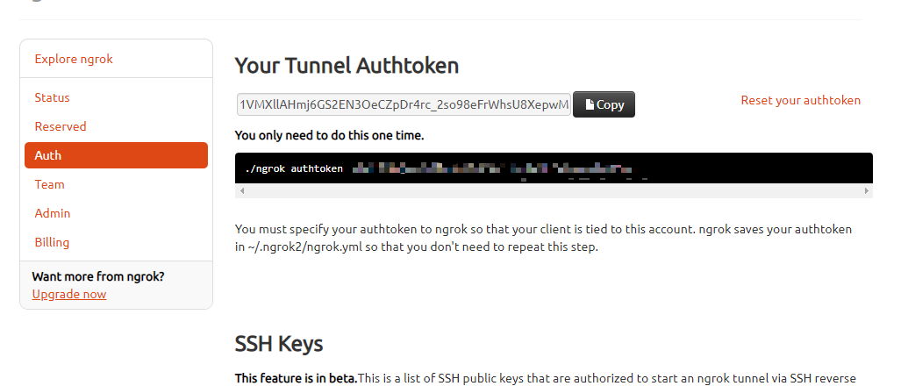
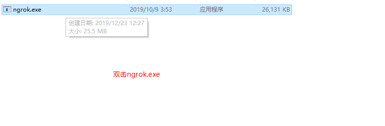
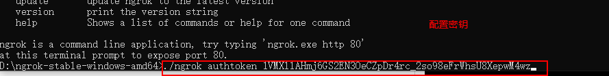
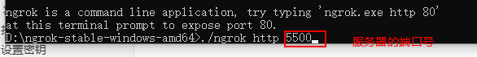
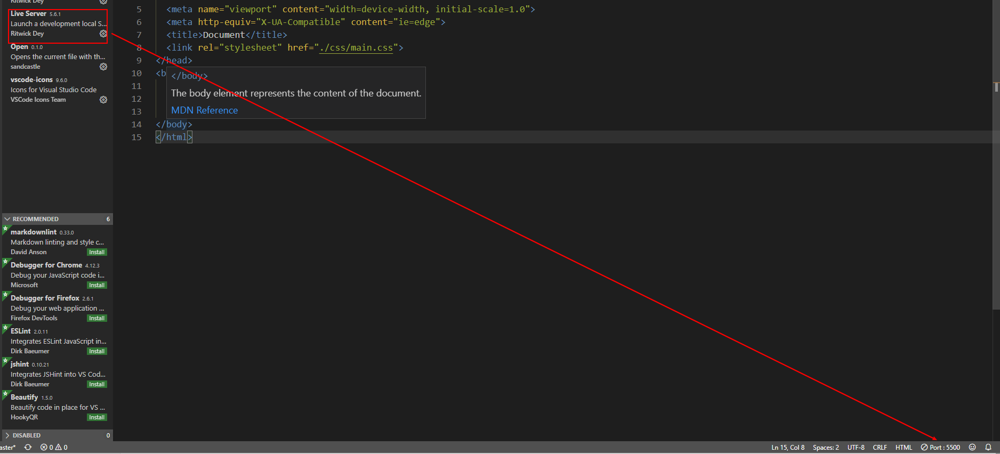

# 伸缩布局 flex

flexible box 弹性布局

## 概念

- 伸缩容器：含有display : flex 的属性的元素是伸缩容器
- 伸缩项目：在伸缩容器中的所有`子`元素都是伸缩项目,孙元素不是
- 主轴：在伸缩容器内有一条默认的虚拟县 自左向右(默认的)
- 侧轴：垂直于主轴的是侧轴

## 属性

### 伸缩容器(flex container)

- display : flex 把一个普通容器变成伸缩容器
- display : flex 之后子元素的`float`、`clear`、`vertical-align`都会失效
- 伸缩容器flex container里面的子元素是flex(flex item)flex项目

#### 主轴的属性

- 主轴方向 flex-direction: row(行,默认值) | row-reverse | column(列) | column-reverse
- 伸缩项目在主轴上的对齐方式 justify-content : flex-start | flex-end | center | space-between(两端对齐，元素贴边再平分剩余空间) | space-around(空间环绕,平分剩余空间)

#### 侧轴的属性

- 是否换行 flex-wrap: nowrap(不换行) wrap(换行)
- align-items : 设置伸缩项目`单行`后的对齐方式
  - align-items: stretch;flex item有不能高度，不然会失效
- align-content: 设置伸缩项目`换行`的对齐方式 flex


| 值            | 描述                             |
| ------------- | -------------------------------- |
| stretch       | 默认值。元素被拉伸以适应容器     |
| center        | 元素位于容器的中心。             |
| flex-start    | 元素位于容器的开头。             |
| flex-end      | 元素位于容器的结尾。             |
| baseline      | 元素位于容器的基线上。           |
| space-between | 两端对齐，元素贴边再平分剩余空间 |
| space-around  | 空间环绕,平分剩余空间            |


### 伸缩项目(flex item)的属性

- flex: 设置的伸缩项目在伸缩容器中所占的剩余空间的比例
- order: 设置伸缩项目排序顺序 默认顺序是html标签的顺序 值越小 越靠前
  - 用于单独给flex-item设置排序顺序
- align-self: 自我对齐 关于某一个伸缩项目的对齐方式 和 `align-items`的属性值完全一样
  - 用于给flex-item单独设置align-items属性

###　简写

- flex-direction和flex-warp的简写
  - flex-flow : row  warp;

 # 流式布局(百分比布局)

- 比较适合电商网站 京东移动端
- width 和 height 是父元素的宽高
- padding 和 margin 是width 的宽

- 通过盒子的宽度设置成百分比来根据屏幕的宽度来进行伸缩，不受 固定像素的限制，内容向两侧填充。
-  为了保护内容在合理的范围内 

# rem布局+sass

- rem布 局是现在用的最多的移动端布局方式可以适配各个不同的手机psd切图

- rem的布局文字可以随着屏幕变大而变大
- `rem的优势：父元素文字大小可能不一致， 但是整个页面只有一个html，可以很好来控制整个页面的元素大小。`

## 1.rem单位

rem (root em)是一个相对单位，类似于em，em是父元素字体大小。

不同的是rem的基准是相对于html元素的字体大小。

比如，根元素（html）设置font-size=12px; 非根元素设置width:2rem; 则换成px表示就是24px。

## rem适配方案


- 1.让一些不能等比自适应的元素,达到当设备尺寸发生改变
  的时候,等比例适配当前设备。

- 2.使用媒体查询根据不同设备按比例设置html的字体大小，
  然后页面元素使用rem做尺寸单位,当html字体大小变化
  元素尺寸也会发生变化,从而达到等比缩放的适配。

- #### rem实际开发适配方案

  ①假设设计稿是750px

  ②假设我们把整个屏幕划分为15等份（划分标准不一可以是20份也可以是10等份）

  ③每一份作为html字体大小，这里就是50px

  ④那么在320px设备的时候，字体大小为320/15就是  21.33px

  ⑤用我们页面元素的大小除以不同的 html字体大小会发现他们比例还是相同的

  ⑥比如我们以750为标准设计稿

  ⑦一个100*100像素的页面元素在  750屏幕下，  就是 100/ 50  转换为rem  是  2rem*2rem  比例是1比1

  ⑧320屏幕下，  html字体大小为21.33   则 2rem=  42.66px  此时宽和高都是 42.66  但是宽和高的比例还是 1比1

  ⑨但是已经能实现不同屏幕下  页面元素盒子等比例缩放的效果

  总结：

  ①最后的公式：页面元素的rem值 =  页面元素值（px） /  （屏幕宽度  /  划分的份数）

  ②屏幕宽度/划分的份数就是 htmlfont-size 的大小

  ③或者：页面元素的rem值 =  页面元素值（px） /  html font-size 字体大小
  
  
  
  
  
## rem布局的插件(插件)  

> https://www.w3cplus.com/   

> https://github.com/huainanhai/flexible

  flexible的作用是为了不写媒体查询 通过js自动检测 自动计算

  - 1. 引入flexible_css.debug.js
  - 2. 引入flexible.debug.js
  - 3. 引入css

  `公式: 属性: calc(设计图量出来的尺寸rem / 设计图的宽度/10)` 

# 响应式布局

- 特别特别简单的网站才能用响应式一套html页面多个终端的css样式在哪个终端应用哪个终端的样式


## 1.1响应式开发原理

就是使用媒体查询针对不同宽度的设备进行布局和样式的设置，从而适配不同设备的目的。

设备的划分情况：

+ 小于768的为超小屏幕（手机）
+ 768~992之间的为小屏设备（平板）
+ 992~1200的中等屏幕（桌面显示器）
+ 大于1200的宽屏设备（大桌面显示器）

## 1.2响应式布局容器

响应式需要一个父级(container)做为布局容器，来配合子级元素来实现变化效果。

原理就是在不同屏幕下，通过媒体查询来改变这个布局容器的大小，再改变里面子元素的排列方式和大小，从而实现不同屏幕下，看到不同的页面布局和样式变化。

父容器版心的尺寸划分

+ 超小屏幕（手机，小于 768px）：设置宽度为 100%
+ 小屏幕（平板，大于等于 768px）：设置宽度为 750px
+ 中等屏幕（桌面显示器，大于等于 992px）：宽度设置为 970px
+ 大屏幕（大桌面显示器，大于等于 1200px）：宽度设置为 1170px 

但是我们也可以根据实际情况自己定义划分

~~~html
<!DOCTYPE html>
<html lang="en">

<head>
    <meta charset="UTF-8">
    <meta name="viewport" content="width=device-width, initial-scale=1.0">
    <meta http-equiv="X-UA-Compatible" content="ie=edge">
    <title>Document</title>
    <style>
        html,
        body {
            width: 100%;
            margin: 0;
            padding: 0;
        }

        .container {
            height: 100px;
            margin-left: auto;
            margin-right: auto;
            background-color: hotpink;
        }

        /* 1.超小屏幕(手机)宽度小于768 版心的宽度100% */
        @media screen and (max-width: 767px) {
            .container {
                width: 100%;
            }
        }

        /* 2.小屏幕(平板) 宽度大于768版心的宽度750px */
        @media screen and (min-width: 768px) {
            .container {
                width: 750px;
            }
        }

        /* 3.中屏幕(平板) 宽度大于等于992 版心的宽度970px */
        @media screen and (min-width: 992px) {
            .container {
                width: 970px;
            }
        }

        /* 4.大屏幕(平板) 宽度大于等于1200版心的宽度1170px */
        @media screen and (min-width: 1200px) {
            .container {
                width: 1170px;
            }
        }

        /* 5.超大屏幕 宽度大于等于1600版心的宽度1440px */
        @media screen and (min-width: 1600px) {
            .container {
                width: 1440px;
            }
        }
    </style>
</head>

<body>
    <div class="container"></div>
</body>

</html>
~~~


# 媒体查询

## 什么是媒体查询

媒体查询（Media Query）是CSS3新语法。

+ 使用 @media查询，可以针对不同的媒体类型定义不同的样式
+ @media 可以针对不同的屏幕尺寸设置不同的样式
+ 当你重置浏览器大小的过程中，页面也会根据浏览器的宽度和高度重新渲染页面 
+ 目前针对很多苹果手机、Android手机，平板等设备都用得到多媒体查询

## 媒体查询语法规范

+ 用 @media开头 注意@符号
+ mediatype  媒体类型
+ 关键字 and  not  only
+ media feature 媒体特性必须有小括号包含

~~~
@media mediatype and|not|only (media feature) {
    CSS-Code;
}
~~~

### 1.mediatype查询类型

将不同的终端设备划分成不同的类型，称为媒体类型

| 值    | 描述                 |
| ----- | -------------------- |
| all   | 用于所有设备         |
| print | 用于打印机和打印预览 |
| scree | 用于电脑屏幕         |

### 2.关键字

​       关键字将媒体类型或多个媒体特性连接到一起做为媒体查询的条件。

+ and：可以将多个媒体特性连接到一起，相当于“且”的意思。
+ not：排除某个媒体类型，相当于“非”的意思，可以省略。
+ only：指定某个特定的媒体类型，可以省略。    

### 3.媒体特性

每种媒体类型都具体各自不同的特性，根据不同媒体类型的媒体特性设置不同的展示风格。我们暂且了解4个。

注意他们要加小括号包含

| 值          | 描述                                                 |
| ----------- | ---------------------------------------------------- |
| width       | 定义输出设备中页面可见区域的宽度                     |
| min-width   | 定义输出设备中页面最小可见区域宽度（大于等于：宽度） |
| max-width   | 定义输出设备中页面最大可见区域宽度（小于等于：宽度） |
| orientation | portrait竖屏 \|  landscape横屏                       |

~~~html
<!DOCTYPE html>
<html lang="en">

<head>
    <meta charset="UTF-8">
    <meta name="viewport" content="width=device-width, initial-scale=1.0">
    <meta http-equiv="X-UA-Compatible" content="ie=edge">
    <title>Document</title>
    <style>
        /* 1000-1200红色   1200-1300蓝色  1300-无穷大px紫色 */
        /* 宽度>=1000px body显示粉色 */
        /* 小于等于1200px 红色 */
        @media screen and (max-width: 1200px) {
            body {
                background: red
            }
        }

        /* 大于1200px 蓝色 */
        @media screen and (min-width:1200px) {
            body {
                background: blue;
            }
        }

        /* 大于1300px紫色 */
        @media screen and (min-width:1300px) {
            body {
                background: purple;
            }
        }
    </style>
</head>

<body>

</body>

</html>
~~~

~~~html
<!DOCTYPE html>
<html lang="en">

<head>
    <meta charset="UTF-8">
    <meta name="viewport" content="width=device-width, initial-scale=1.0">
    <meta http-equiv="X-UA-Compatible" content="ie=edge">
    <title>Document</title>
    <style>
        @media screen and (min-width: 320px) {
            html {
                font-size: 100px;
            }
        }

        @media screen and (min-width: 540px) {
            html {
                font-size: 200px;
            }
        }

        div {
            width: 2rem;
            height: 2rem;
            line-height: 2rem;
            font-size: 0.5rem;
            margin: 0 auto;
            background-color: hotpink;
            text-align: center;
        }
    </style>
</head>

<body>
    <div>牛逼</div>
</body>

</html>
~~~

## 引入资源(理解)

- 当样式比较繁多的时候,我们可以针对不同的媒体使用不同stylesheets (样式表)。
  原理,就是直接在link中判断设备的尺寸,然后引用不同的css文件。

~~~html
<!DOCTYPE html>
<html lang="en">

<head>
    <meta charset="UTF-8">
    <meta name="viewport" content="width=device-width, initial-scale=1.0">
    <meta http-equiv="X-UA-Compatible" content="ie=edge">
    <title>Document</title>
    <!-- 屏幕小于 320 div 垂直 -->
    <link rel="stylesheet" href="./css/03-320px.css" media="screen and (min-width:320px)">
    <!-- 屏幕小于640 div 一行 -->
    <link rel="stylesheet" href="./css/03-640px.css" media="screen and (min-width:640px)">
</head>

<body>
    <div></div>
    <div></div>
</body>

</html>
~~~

- 320px

~~~css
div {
    width: 100px;
    height: 100px;
}

div:nth-child(1) {
    background-color: red;
}

div:nth-child(2) {
    background-color: black;
}
~~~


- 640px

~~~css
div {
    float: left;
    width: 100px;
    height: 100px;
}

div:nth-child(1) {
    background-color: red;
}

div:nth-child(2) {
    background-color: black;
}
~~~

# 移动端调试js

- vconsole  https://github.com/Tencent/vConsole
- 引入vconsole.js

~~~html
<script src="path/to/vconsole.min.js"></script>
<script>
  // init vConsole
  var vConsole = new VConsole();
  console.log('Hello world');
</script> 
~~~

# 真机调试(内网穿透)

### 让手机和电脑在同一个网中(链接同一个wifi)

### ghostlab   https://www.vanamco.com/ghostlab/

### ngrok

#### 第一步: 注册ngrok

用github账号登陆就可以

#### 第二步: 下载ngrok



#### 第三步: 复制密钥



#### 第四步 找到ngrok的目录



####  第五步 设置密钥



####  第六步:执行ngrok

 


#### 第七步: 在本地启动服务



# bootstrap的介绍

## 1.bootstrap简介

Bootstrap 来自 Twitter`爸爸`（推特），是目前最受欢迎的前端框架。Bootstrap 是基于HTML、CSS 和 JAVASCRIPT 的，它简洁灵活，使得 Web 开发更加快捷。

[中文网](lhttp://www.bootcss.com/)  [官网](http://getbootstrap.com/)  [推荐网站](http://bootstrap.css88.com/)

框架：顾名思义就是一套架构，它有一套比较完整的网页功能解决方案，而且控制权在框架本身，有预制样式库、组件和插件。使用者要按照框架所规定的某种规范进行开发。

## 2.bootstrap优点

+ 标准化的html+css编码规范
+ 提供了一套简洁、直观、强悍的组件
+ 有自己的生态圈，不断的更新迭代
+ 让开发更简单，提高了开发的效率


## 3.版本介绍

- 2.x.x：停止维护,兼容性好,代码不够简洁，功能不够完善。

- 3.x.x：目前使用最多,稳定,但是放弃了IE6-IE7。对 IE8 支持但是界面效果不好,偏向用于开发响应式布局、移动设备优先的WEB 项目。

- 4.x.x：最新版，目前还不是很流行

## 4.栅格系统

Bootstrap提供了一套响应式、移动设备优先的流式栅格系统，随着屏幕或视口（viewport）尺寸的增加，系统会自动分为最多12列。

栅格系统用于通过一系列的行（row）与列（column）的组合来创建页面布局，你的内容就可以放入这些创建好的布局中。

+ 按照不同屏幕划分为1~12 等份
+ 行（row） 可以去除父容器作用15px的边距
+ xs-extra small：超小； sm-small：小；  md-medium：中等； lg-large：大；
+ 列（column）大于 12，多余的“列（column）”所在的元素将被作为一个整体另起一行排列
+ 每一列默认有左右15像素的 padding
+ 可以同时为一列指定多个设备的类名，以便划分不同份数  例如 class="col-md-4 col-sm-6"

栅格嵌套

栅格系统内置的栅格系统将内容再次嵌套。简单理解就是一个列内再分成若干份小列。我们可以通过添加一个新的 .row 元素和一系列 .col-sm-* 元素到已经存在的 .col-sm-*
元素内。

```
<!-- 列嵌套 -->
 <div class="col-sm-4">
    <div class="row">
         <div class="col-sm-6">小列</div>
         <div class="col-sm-6">小列</div>
    </div>
</div>

```

列偏移

使用 .col-md-offset-* 类可以将列向右侧偏移。这些类实际是通过使用 * 选择器为当前元素增加了左侧的边距（margin）。

```
 <!-- 列偏移 -->
  <div class="row">
      <div class="col-lg-4">1</div>
      <div class="col-lg-4 col-lg-offset-4">2</div>
  </div>

```

列排序

通过使用 .col-md-push-* 和 .col-md-pull-* 类就可以很容易的改变列（column）的顺序。

```
 <!-- 列排序 -->
  <div class="row">
      <div class="col-lg-4 col-lg-push-8">左侧</div>
      <div class="col-lg-8 col-lg-pull-4">右侧</div>
  </div>

```

响应式工具

为了加快对移动设备友好的页面开发工作，利用媒体查询功能，并使用这些工具类可以方便的针对不同设备展示或隐藏页面内容。


# 其他框架

- 妹子UI
- elementUl
- ant.design  https://ant.design/index-cn 
-  https://youzan.github.io/vant/#/zh-CN/ 
-  http://framework7.taobao.org/ 