# HTML 语法规范

- HTM标签由尖括号包围关键词，例如<html>
- HTML标签通常成对出现，例如<html>和</html>我们称为双标签

- 有些特殊的标签必须是单标签,例如<br/>

## 属性 

- 所谓属性：简单理解就是属于这个图像标签的特性。

## 标签关系

- 标签挂你分为两大类:

  - 包含关系

    - ```html
      <head>
          <title></title>
      </head>
      
      ```

  - 并列关系

    - ```html
      <head>
          
      </head>
      <body>
          <div></div>
          <p></p>
      </body>
      <!-- 
      	head和body 是并列关系
      	div和p是	并列关系
      -->
      ```

## 文档类型声明标签

```html
<!DOCTYPE html>
采用的是HTML5版本显示网页
```

## lang语言种类

```html
//告诉浏览器我这个网页是什么语言种类的网址
<html lang="en">
</html>
```

## 字符集

~~~html
<meta charset="UTF-8">
~~~


# HTML5语义化标签

- `<header>`头部标签
- `<nav>`导航标签
- `article`内容标签
- `<section>`块级标签
- `<aside>`侧边栏标签
- `<footer>`尾部标签

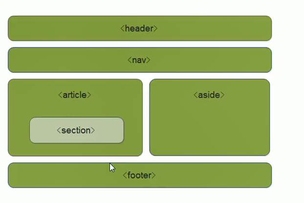

# HTML5多媒体标签

- 音频：`<audio>`

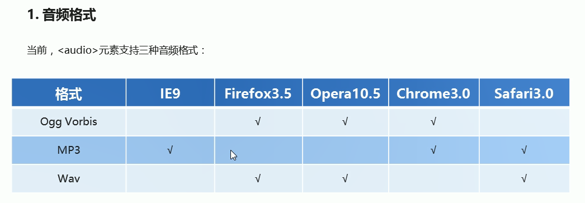

因为不同的浏览器支持不同的格式，我们采取的解决方案是为这个音频准备多个格式

~~~html
    <audio controls autoplay="autoplay">
        <source src="./呦猫UNEKO - 逆天.mp3" type="audio/mpeg">
        <source src="./呦猫UNEKO - 逆天.ogg" type="audio/ogg">
        你的浏览器版本过低请更新浏览器
    </audio>
~~~


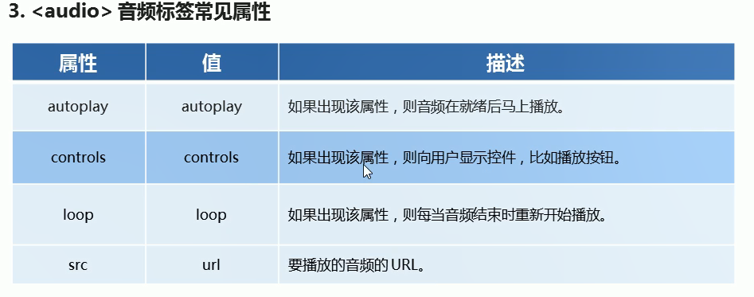

> 谷歌浏览器禁用了autoplay属性，火狐也禁用了

- 视频:`<video>`

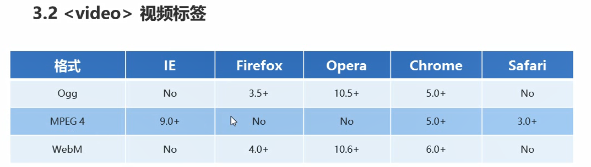

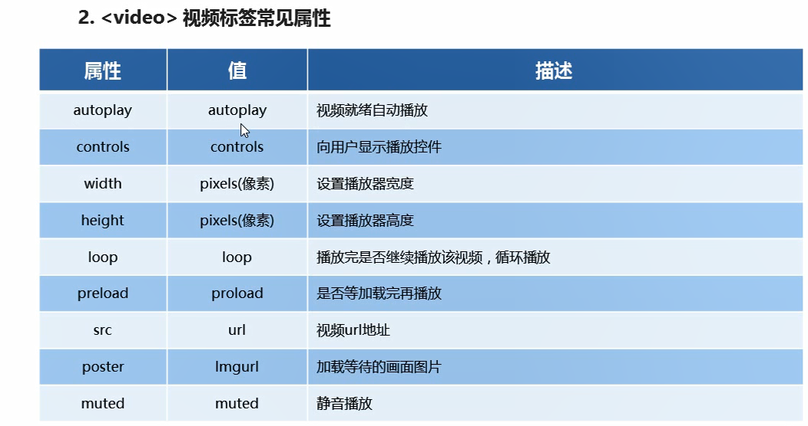

兼容写法

```html
    <video controls="controls">
        <source src="./1.00HTML5导读.ogg" type="video/ogg">
        <source src="./1.00HTML5导读.mp4" type="video/mp4">
        你的浏览器版本过低,请更新浏览器
    </video>
```


# HTML常用标签

## 段落和换行标签(重要)

~~~html
<!DOCTYPE html>
<html lang="en">

<head>
    <title>段落换行标签</title>
</head>

<body>
    <p>1</p>//我的段落标签
    <p>2</p>
    123<br>3 //是我换行标签
</body>

</html>
~~~


## 标题标签`<h1>`---`<h6>`

```html
<!DOCTYPE html>
<html lang="en">

<head>
    <title>标题标签</title>
</head>

<body>
    <h1>1</h1>
    <h2>2</h2>
    <h3>3</h3>
    <h4>4</h4>
    <h5>5</h5>
    <h6>6</h6>
</body>

</html>
```

## div和span标签(当盒子用)

- 这两个标签是没有语义的，它们就是一个盒子，用来装内容

- 它们两个是双标签

- div是division的缩写，表示分割、分区，span意为跨度、跨距。

- div和span 的区别

- div独占一行，span可以在一行上显示

- ```html
      <div>这里是div</div>
      <div>这里是div</div>
      <div>这里是div</div>
      <span>哟哟哟</span>
      <span>123</span>
      <span>abc</span>
  ```

- 

## ``图像标签

```html

```

- img是image的缩写，src是img标签的`必须属性`

| 属性   | 属性值   | 说明                                     |
| ------ | -------- | ---------------------------------------- |
| src    | 图片路径 | 必须属性                                 |
| alt    | 文本     | 替换文本。<br />图片不显示时就显示这里   |
| title  | 文本     | 提示文本。<br />鼠标放在图片上显示的文字 |
| width  | 像素px   | 设置图片宽度                             |
| height | 像素px   | 设置图片高度                             |
| border | 像素     | 设置图像边框粗细                         |


## `<a></a>`超链接标签

- a是anchor的缩写

- 作用是从一个页面链接到另一个页面

| 属性   | 作用                                                         |
| ------ | ------------------------------------------------------------ |
| herf   | 用于指定链接目标的url地址（必须属性）当标签应用href属性时，它就具有了超链接属性 |
| target | 用于指定链接页面的打开方式，其中`_`self为默认值,`_`blank为在新窗口中打开方式 |

### 锚点链接

- 语法`<a herf="`#` two "> </a>` 必须有# 号

- ```html
  <a href="#1">点击我跳转到id是1的标签上</a>
  <div id="1"></div>
  ```

## 表格标签

- 用于显示和展示数据
- tr是 table row（表格行） 的缩写
- td是table date（表格数据）的缩写
- th是table head （表格头部）的缩写

 ```html
<table>
	<tr><!-- 第一行 -->
              <!-- 表头单元格 -->
        	  <!-- 第一列 -->
              <th>姓名</th>
              <th>性别</th>
              <th>年龄</th>
	</tr>
	<tr><!-- 第二行 -->
              <td>张三</td>
        	 <!-- 第二列 -->
              <td>男</td>
              <td>18</td>
	</tr>
	<tr><!-- 第三行 -->
              <td>李四</td>
              <td>男</td>
              <td>185</td>
	</tr>
          
</table>
 ```

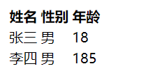


### 表格标题标签 caption

```html
<caption>个人简历</caption>
```

### 合并单元格

- 可以在td标签上使用rowspan属性跨行合并，使用colspan属性跨列合并。
- row行、column列、span 横跨 

```html
    <table class="table" border="1" cellspacing="100" cellpadding="20px">
        <caption>滑稽联盟</caption>
        <tr>
            <th rowspan="2">天</th>
            <th>地</th>
            <th>人</th>
        </tr>
        <tr>
            <td>灵</td>
            <td>灭</td>
            <td>生</td>
        </tr>
        <tr>
            <td>云</td>
            <td>云</td>
            <td>云</td>
        </tr>
        <tr>
            <td>云</td>
            <td>云</td>
            <td>云</td>
        </tr>
    </table>
```


- 属性

| 属性名      | 属性值              | 描述                                   |
| ----------- | ------------------- | -------------------------------------- |
| align       | left、center、right | 规定表格相对周围元素的对齐方式         |
| border      | 1或""               | 规定是否有边框，默认值为""表示没有边框 |
| cellpadding | 像素                | 规定单元格内边距，默认1px              |
| cellspacing | 像素                | 规定单元格之间的空白,默认2px           |
| width       | 像素或者百分比      | 规定表格的宽度                         |


## 列表

- `<ol></ol>`中只能嵌套`<li></li>`，直接在ol标签中输入其他标签或者文字是非法的。
- `<li></li>`之间相当于一个容器，可以容纳所有元素。
- 有序列表会带有自己的样式属性，但在实际使用时，我们会使用CSS来设置。

### 有序列表 ol li(了解)

```html
<!DOCTYPE html>
<html lang="en">

<head>
    <title>有序列表标签</title>
</head>

<body>
    <h4>排行榜</h4>
    <ol>
        <li>张三</li>
        <li>张四</li>
        <li>张五</li>
    </ol>
</body>

</html>
```

### 无序列表 ul 

```html
    <ul>
        <li>12</li>
        <li>12</li>
        <li>12</li>
        <li>12</li>
    </ul>
```

### 自定义列表dl>dt>dd

```html
<!DOCTYPE html>
<html lang="en">

<head>
    <title>自定义标签</title>
</head>

<body>
    <h4>排行榜</h4>
    <dl>
        <dt></dt>
        <dl></dl>
        <dl></dl>
        <dl></dl>
    </dl>
</body>

</html>
```


## 文本格式化标签

### 加粗：`  <strong></strong>或<b></b>`

### 倾斜：`<em></em>或<i></i>`

### 删除线：`  <del></del>或<s></s>`

### 下划线：`<ins></ins>或<u></u>`


## 表单

- 表单是用来在网页中收集用户信息的元素

### form标签

| 属性   | 作用                                            |
| ------ | ----------------------------------------------- |
| action | 就是url地址代表了你将要把数据送往哪个地方来处理 |
| method | 代表了表单使用哪种提交方法到服务器(GET POST)    |
|        |                                                 |
|        |                                                 |

```html
<form action="">
    <!-- 表单线框 -->
    <fieldset>
        <!-- 线框标题 -->
        <legend>
            我是线框标题
        </legend>
    </fieldset>
</form>
```


### label标签

- label标签中的for值等于input中的id值的时候，点击label标签中的内容就可以选中input

~~~html
<label for="id1">文本: </label> <input type="text" name="" id="id1">

~~~


### 表单-input控件

- 语法：
  - `<input type="text">`
  - `<input type="表单输入类型">`

| 表单输入类型                  | 作用           |
| ----------------------------- | -------------- |
| `text`                        | 单行文本输入框 |
| `password`                    | 密码输入框     |
| `file`                        | 文件上传       |
| week time date datetime-local | 时间选择       |
| color                         | 颜色选取       |
| number                        | 数字输入       |
| `radio`                       | 单选框         |
| `checkbox`                    | 复选框         |

~~~html
    <form action="">
        <label for="id1">文本: </label> <input type="text" name="" id="id1"><br>
        <label for="id2">密码: </label> <input type="password" name="" id="id2"><br>
        <label for="id3">上传: </label> <input type="file" name="" id="id3"><br>
        <label for="id4">时间: </label> <input type="datetime-local" name="" id="id4"><br>
        <label for="id5">颜色: </label> <input type="color" name="" id="id5"><br>
        <label for="id6">数字: </label> <input type="number" name="" id="id6"><br>
        <label for="man">男</label><input type="radio" name="sex" id="man" value="男">
        <label for="woman">女</label><input type="radio" checked name="sex" id="woman" value="女">
        <label for="screct">保密</label><input type="radio" name="sex" id="screct" value="保密">
        <br>
        <label for="smoking">抽烟</label><input type="checkbox" name="hobby1" id="smoking" value="抽烟">
        <label for="drinkbeer">喝酒</label><input type="checkbox" name="hobby2" id="drinkbeer" value="喝酒">
        <label for="hothair">烫头</label><input type="checkbox" name="hobby3" id="hothair" value="烫头">
    </form>
~~~

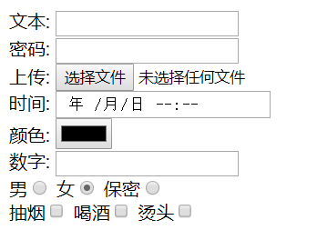


### 表单属性

| 属性        | 说明                                                      |
| ----------- | --------------------------------------------------------- |
| maxlength   | 设置控件中最多能输入多少个字符 maximum 最大值 length 长度 |
| readonly    | 设置控件为只读模式 不能输入 read(阅读) only(只有)         |
| disabled    | 设置控件为未激活(不能输入)                                |
| name        | 为控件设置名称                                            |
| id          | 设置控件唯一标识 identify                                 |
| value       | 设置控件默认值                                            |
| placeholder | 设置控件的提示信息 placeholder 占位符                     |

~~~html
<label for="">属性：<input type="text" placeholder="请输入用户名" name="username" value=""></label>
~~~

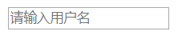

~~~html
    <label for="">属性：
        <!--maxlength="5" 最多只能输入5个字符 -->
        <input type="text" maxlength="5" name="num">
    </label>
~~~


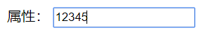

~~~html
    <label for="">
        <!--readonly 只能看不能修改数值,可以点击 -->
        <input type="text" readonly placeholder="readonly">
    </label>
~~~

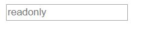


~~~html
<!-- disabled 不能点击可以复制 -->
<label for="">属性：<input type="text" disabled placeholder="disabled"></label>

~~~

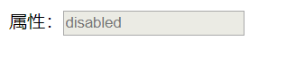

~~~html
<!-- value 设置控件默认值 -->
<label for="">属性：<input type="text" name="user" placeholder="" id="" value="china"></label>
~~~

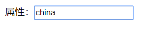

~~~html
<!-- id 设置控件唯一标识 -->
<label for="">属性：<input type="text" placeholder="id" id="1"></label>

~~~


### 表单-多行文本域

- ​     textarea 没有value，如果需要输入大量的信息，就需要用到`<textarea></textarea>`标签  

~~~html
<textarea cols="每行中的字符数" rows="显示的行数" name="name">
       文本内容
</textarea>
<!--     name属性: 数据会按照 这样的格式 name属性的值=用户在多行文本中的内容 -->


~~~


# 下拉菜单

- 下拉菜单，用来提供一系列菜单选项的控件

- `<select></select>`中至少应包含一对`<option></option>`。

  在option中定义selected =" selected "时，当前项即为默认选中项

~~~html
<select>
    <option>北京</option>
    <option>上海</option>
    <option>广州</option> 
</select>

~~~

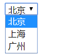

# 路径

## 相对路径

- 以引用文件的所在位置为参考的基础，而建立出来的目录路径`移植性好`

## 绝对路径

- 目录下的绝对位置，直接打到目标位置，通常从盘符开始的路径，`移植性差`


# 盒子模型

## 内容content

## 内边距padding

- 内容与边框之间的距离  

## 外边距margin

- 元素与元素之间的距离 以边框为界

## 边框border

- 就是快递盒子的最外面一圈


| 属性         | 作用         |
| ------------ | ------------ |
| border-width | 定义边框粗细 |
| border-style | 边框的样式   |
| border-color | 边框颜色     |

- 边框的样式

| 属性   | 作用         |
| ------ | ------------ |
| none   | 没有边框     |
| solid  | 边框为单实线 |
| dashed | 边框为虚线   |
| dotted | 边框为点线   |


## 外边距塌陷(重点)

## 外边距合并(重点)