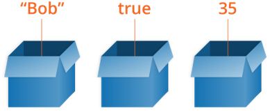
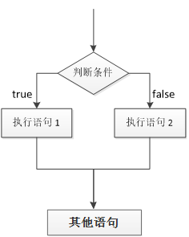
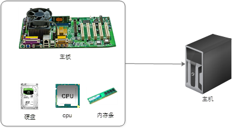
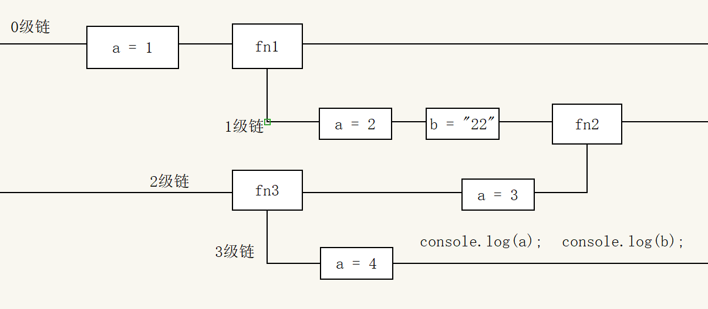
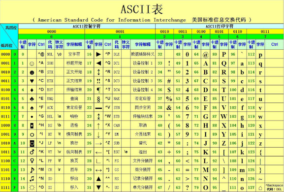

# 1 - 初识JavaScript

### 1.1 JavaScript 是什么


- JavaScript 是世界上最流行的语言之一，是一种运行在客户端的脚本语言 （Script 是脚本的意思）

- 脚本语言：不需要编译，运行过程中由 js 解释器( js 引擎）逐行来进行解释并执行

- 现在也可以基于 Node.js 技术进行服务器端编程

  

### 1.2 JavaScript的作用

-  表单动态校验（密码强度检测）  （ JS 产生最初的目的 ）
-  网页特效
-  服务端开发(Node.js)
-  桌面程序(Electron)
-  App(Cordova) 
-  控制硬件-物联网(Ruff)
-  游戏开发(cocos2d-js)

### 1.3 HTML/CSS/JS 的关系


### 1.4 浏览器执行 JS 简介

**浏览器分成两部分：渲染引擎和 JS 引擎**


		浏览器本身并不会执行JS代码，而是通过内置 JavaScript 引擎(解释器) 来执行 JS 代码 。JS 引擎执行代码时逐行解释每一句源码（转换为机器语言），然后由计算机去执行，所以 JavaScript 语言归为脚本语言，会逐行解释执行。


### 1.5 JS 的组成


1. #### **ECMAScript**

   ​		ECMAScript 是由ECMA 国际（ 原欧洲计算机制造商协会）进行标准化的一门编程语言，这种语言在万维网上应用广泛，它往往被称为 JavaScript或 JScript，但实际上后两者是 ECMAScript 语言的实现和扩展。

   

   ​		ECMAScript：规定了JS的编程语法和基础核心知识，是所有浏览器厂商共同遵守的一套JS语法工业标准。

   更多参看MDN: [MDN手册](https://developer.mozilla.org/zh-CN/docs/Web/JavaScript/JavaScript_technologies_overview)

2. #### **DOM——文档对象模型**

   ​		**文档对象模型**（DocumentObject Model，简称DOM），是W3C组织推荐的处理可扩展标记语言的标准编程接口。通过 DOM 提供的接口可以对页面上的各种元素进行操作（大小、位置、颜色等）

3. #### **BOM——浏览器对象模型**

   ​		**浏览器对象模型**(Browser Object Model，简称BOM) 是指浏览器对象模型，它提供了独立于内容的、可以与浏览器窗口进行互动的对象结构。通过BOM可以操作浏览器窗口，比如弹出框、控制浏览器跳转、获取分辨率等。

### 1.6 JS 初体验

	JS 有3种书写位置，分别为行内、内嵌和外部。

1. 行内式

   ```html
   <input type="button" value="点我试试" onclick="alert('Hello World')" />
   ```

   - 可以将单行或少量 JS 代码写在HTML标签的事件属性中（以 on 开头的属性），如：onclick
   - 注意单双引号的使用：在HTML中我们推荐使用双引号, JS 中我们推荐使用单引号
   - 可读性差， 在html中编写JS大量代码时，不方便阅读；
   - 引号易错，引号多层嵌套匹配时，非常容易弄混；
   - 特殊情况下使用

2. 内嵌式

   ```html
   <script>
       alert('Hello  World~!');
   </script>
   ```

   - 可以将多行JS代码写到 script 标签中
   - 内嵌 JS 是学习时常用的方式

3. 外部JS文件

   ```html
   <script src="my.js"></script>
   ```

   - 利于HTML页面代码结构化，把大段 JS代码独立到 HTML 页面之外，既美观，也方便文件级别的复用
   - 引用外部 JS文件的 script 标签中间不可以写代码
   - 适合于JS 代码量比较大的情况

## 2 - JavaScript注释

### 1.1  单行注释

	为了提高代码的可读性，JS与CSS一样，也提供了注释功能。
	JS中的注释主要有两种，分别是 单行注释 和 多行注释。

单行注释的注释方式如下：

```html
// 我是一行文字，不想被 JS引擎 执行，所以 注释起来	
```

	// 用来注释单行文字（  快捷键   ctrl  +  /   ）

### 1.2 多行注释

多行注释的注释方式如下：

```html
/*
  获取用户年龄和姓名
  并通过提示框显示出来
*/
```

```
/* */  用来注释多行文字（ 默认快捷键  alt +  shift  + a ） 
```


快捷键修改为：   ctrl + shift  +  /

vscode → 首选项按钮 → 键盘快捷方式 → 查找 原来的快捷键 → 修改为新的快捷键 → 回车确认

## 3 - JavaScript输入输出语句

为了方便信息的输入输出，JS中提供了一些输入输出语句，其常用的语句如下：

| 方法             | 说明                           | 归属   |
| ---------------- | ------------------------------ | ------ |
| alert(msg)       | 浏览器弹出警示框               | 浏览器 |
| console.log(msg) | 浏览器控制台打印输出信息       | 浏览器 |
| prompt(info)     | 浏览器弹出输入框，用户可以输入 | 浏览器 |

- 注意：alert() 主要用来显示消息给用户，console.log() 用来给程序员自己看运行时的消息。

## 4 - 变量的概念

### 4.1 什么是变量(variable)

白话：变量就是一个装东西的盒子。

通俗：变量是用于存放数据的容器。 我们通过 变量名 获取数据，甚至数据可以修改。


### 4.2 变量在内存中的存储

		本质：变量是程序在内存中申请的一块用来存放数据的空间。类似我们酒店的房间，一个房间就可以看做是一个变量。  


## 5 - 变量的使用

- 变量的声明   
- 变量的赋值 

### 5.1 声明变量

```javascript
//  声明变量  
var age; //  声明一个 名称为age 的变量     
```

- var 是一个 JS关键字，用来声明变量( variable 变量的意思 )。使用该关键字声明变量后，计算机会自动为变量分配内存空间，不需要程序员管

- age 是程序员定义的变量名，我们要通过变量名来访问内存中分配的空间

### 5.2 赋值

```javascript
age = 10; // 给 age  这个变量赋值为 10          
```

- = 用来把右边的值赋给左边的变量空间中   此处代表赋值的意思
- 变量值是程序员保存到变量空间里的值

### 5.3 变量的初始化

```js
var age  = 18;  // 声明变量同时赋值为 18
// 声明一个变量并赋值， 我们称之为变量的初始化。
```

### 5.4 变量语法扩展

- 更新变量

  ​		一个变量被重新复赋值后，它原有的值就会被覆盖，变量值将以最后一次赋的值为准。

  ```js
  var age = 18;
  
  age = 81;   // 最后的结果就是81因为18 被覆盖掉了          
  ```

- 同时声明多个变量

  ​		同时声明多个变量时，只需要写一个 var， 多个变量名之间使用英文逗号隔开。

  ```js
  var age = 10,  name = 'zs', sex = 2;       
  ```

- 声明变量特殊情况

  | 情况                           | 说明                    | 结果      |
  | ------------------------------ | ----------------------- | --------- |
  | var  age ; console.log (age);  | 只声明 不赋值           | undefined |
  | console.log(age)               | 不声明 不赋值  直接使用 | 报错      |
  | age   = 10; console.log (age); | 不声明   只赋值         | 10        |

### 5.5 变量命名规范

规则：

- 由字母(A-Za-z)、数字(0-9)、下划线(_)、美元符号( $ )组成，如：usrAge, num01, _name
- 严格区分大小写。var app; 和 var App; 是两个变量
- 不能 以数字开头。  18age   是错误的
- 不能 是关键字、保留字。例如：var、for、while
- 变量名必须有意义。 MMD   BBD        nl   →     age  
- 遵守驼峰命名法。首字母小写，后面单词的首字母需要大写。myFirstName

推荐翻译网站： 有道    爱词霸

## 6 - 数据类型

### 6.1 数据类型简介

- 为什么需要数据类型

  ​		在计算机中，不同的数据所需占用的存储空间是不同的，为了便于把数据分成所需内存大小不同的数据，充分利用存储空间，于是定义了不同的数据类型。
   		简单来说，数据类型就是数据的类别型号。比如姓名“张三”，年龄18，这些数据的类型是不一样的。

- 变量的数据类型

  ​		变量是用来存储值的所在处，它们有名字和数据类型。变量的数据类型决定了如何将代表这些值的位存储到计算机的内存中。JavaScript 是一种弱类型或者说动态语言。这意味着不用提前声明变量的类型，在程序运行过程中，类型会被自动确定：

  ```js
  var age = 10;        // 这是一个数字型
  var areYouOk = '是的';   // 这是一个字符串     
  ```

  ​		在代码运行时，变量的数据类型是由 JS引擎 根据 = 右边变量值的数据类型来判断 的，运行完毕之后， 变量就确定了数据类型。JavaScript 拥有`动态类型`，同时也意味着相同的变量可用作不同的类型：

  ```js
  var x = 6;           // x 为数字
  var x = "Bill";      // x 为字符串    
  ```

- 数据类型的分类

  JS 把数据类型分为两类：

  - 简单数据类型 （Number,String,Boolean,Undefined,Null）

  - 复杂数据类型 （object)	

### 6.2 简单数据类型

简单数据类型（基本数据类型）

JavaScript 中的简单数据类型及其说明如下：


- 数字型 Number

  ​		JavaScript 数字类型既可以保存整数，也可以保存小数(浮点数）。  

  ```js
  var age = 21;       // 整数
  var Age = 21.3747;  // 小数     
  ```

  1. 数字型进制

     最常见的进制有二进制、八进制、十进制、十六进制。

     ```js
       // 1.八进制数字序列范围：0~7
      var num1 = 07;   // 对应十进制的7
      var num2 = 019;  // 对应十进制的19
      var num3 = 08;   // 对应十进制的8
       // 2.十六进制数字序列范围：0~9以及A~F
      var num = 0xA;   
     ```

     现阶段我们只需要记住，在JS中八进制前面加0，十六进制前面加 0x  

  2. 数字型范围

     JavaScript中数值的最大和最小值

     - 最大值：Number.MAX_VALUE，这个值为： 1.7976931348623157e+308

     - 最小值：Number.MIN_VALUE，这个值为：5e-32

3. 数字型三个特殊值

   - Infinity ，代表无穷大，大于任何数值

   - -Infinity ，代表无穷小，小于任何数值

   - NaN ，Not a number，代表一个非数值

  4. isNaN (is Not a Numbmer)

     用来判断一个变量是否为非数字的类型，返回 true 或者 false

   

   ```js
     var usrAge = 21;
   var isOk = isNaN(userAge);
     console.log(isNum);          // false ，21 不是一个非数字
   var usrName = "andy";
     console.log(isNaN(userName));// true ，"andy"是一个非数字
   ```

- 字符串型 String

  ​		字符串型可以是引号中的任意文本，其语法为 双引号 "" 和 单引号''

  ```js
  var strMsg = "我爱北京天安门~";  // 使用双引号表示字符串
  var strMsg2 = '我爱吃猪蹄~';    // 使用单引号表示字符串
  // 常见错误
  var strMsg3 = 我爱大肘子;       // 报错，没使用引号，会被认为是js代码，但js没有这些语法
  ```

  ​		因为 HTML 标签里面的属性使用的是双引号，JS 这里我们更推荐使用单引号。

  1. 字符串引号嵌套

     ​		JS 可以用单引号嵌套双引号 ，或者用双引号嵌套单引号 (外双内单，外单内双)

     ```js
     var strMsg = '我是"高帅富"程序猿';   // 可以用''包含""
     var strMsg2 = "我是'高帅富'程序猿";  // 也可以用"" 包含''
     //  常见错误
     var badQuotes = 'What on earth?"; // 报错，不能 单双引号搭配
     ```

  2. 字符串转义符

     ​		类似HTML里面的特殊字符，字符串中也有特殊字符，我们称之为转义符。

     ​		转义符都是 \ 开头的，常用的转义符及其说明如下：

     | 转义符 | 解释说明                          |
     | ------ | --------------------------------- |
     | \n     | 换行符，n   是   newline   的意思 |
     | \ \    | 斜杠   \                          |
     | \'     | '   单引号                        |
     | \"     | ”双引号                           |
     | \t     | tab  缩进                         |
     | \b     | 空格 ，b   是   blank  的意思     |

  3. 字符串长度

     ​		字符串是由若干字符组成的，这些字符的数量就是字符串的长度。通过字符串的 length 属性可以获取整个字符串的长度。

     ```js
     var strMsg = "我是帅气多金的程序猿！";
     alert(strMsg.length); // 显示 11
     ```

  4. 字符串拼接

     - 多个字符串之间可以使用 + 进行拼接，其拼接方式为 字符串 + 任何类型 = 拼接之后的新字符串

     - 拼接前会把与字符串相加的任何类型转成字符串，再拼接成一个新的字符串

       ```js
       //1.1 字符串 "相加"
       alert('hello' + ' ' + 'world'); // hello world
       //1.2 数值字符串 "相加"
       alert('100' + '100'); // 100100
       //1.3 数值字符串 + 数值
       alert('11' + 12);     // 1112 
       ```

       - ***+ 号总结口诀：数值相加 ，字符相连***

  5. 字符串拼接加强

     ```js
     console.log('pink老师' + 18);        // 只要有字符就会相连 
     var age = 18;
     console.log('pink老师age岁啦');      // 这样不行哦
     console.log('pink老师' + age);         // pink老师18
     console.log('pink老师' + age + '岁啦'); // pink老师18岁啦
     ```

     - 经常会将字符串和变量来拼接，变量可以很方便地修改里面的值
     - 变量是不能添加引号的，因为加引号的变量会变成字符串
     - 如果变量两侧都有字符串拼接，口诀“引引加加 ”，删掉数字，变量写加中间

- 布尔型Boolean

  ​		布尔类型有两个值：true 和 false ，其中 true 表示真（对），而 false 表示假（错）。

  ​		布尔型和数字型相加的时候， true 的值为 1 ，false 的值为 0。

  ```js
  console.log(true + 1);  // 2
  console.log(false + 1); // 1
  ```

- Undefined和 Null

  ​		一个声明后没有被赋值的变量会有一个默认值undefined ( 如果进行相连或者相加时，注意结果）

  ```js
  var variable;
  console.log(variable);           // undefined
  console.log('你好' + variable);  // 你好undefined
  console.log(11 + variable);     // NaN
  console.log(true + variable);   //  NaN
  ```

  ​		一个声明变量给 null 值，里面存的值为空（学习对象时，我们继续研究null)

  ```js
  var vari = null;
  console.log('你好' + vari);  // 你好null
  console.log(11 + vari);     // 11
  console.log(true + vari);   //  1
  ```

### 6.3 获取变量数据类型

- 获取检测变量的数据类型

  ​		typeof 可用来获取检测变量的数据类型

  ```js
  var num = 18;
  console.log(typeof num) // 结果 number      
  ```

  ​		不同类型的返回值

  

- 字面量

  ​		字面量是在源代码中一个固定值的表示法，通俗来说，就是字面量表示如何表达这个值。

  - 数字字面量：8, 9, 10
  - 字符串字面量：'黑马程序员', "大前端"
  - 布尔字面量：true，false

### 6.4 数据类型转换

​		什么是数据类型转换？

​		使用表单、prompt 获取过来的数据默认是字符串类型的，此时就不能直接简单的进行加法运算，而需要转换变量的数据类型。通俗来说，就是把一种数据类型的变量转换成另一种数据类型，通常会实现3种方式的转换：

```
转换为字符串类型
转换为数字型
转换为布尔型
```

- 转换为字符串

  

  - toString() 和 String()  使用方式不一样。
  - 三种转换方式，更多第三种加号拼接字符串转换方式， 这一种方式也称之为隐式转换。

- 转换为数字型（重点）

  

  - 注意 parseInt 和 parseFloat 单词的大小写，这2个是重点
  - 隐式转换是我们在进行算数运算的时候，JS 自动转换了数据类型

- 转换为布尔型

  

  - 代表空、否定的值会被转换为 false  ，如 ''、0、NaN、null、undefined  

  - 其余值都会被转换为 true

    ```js
    console.log(Boolean('')); // false
    console.log(Boolean(0)); // false
    console.log(Boolean(NaN)); // false
    console.log(Boolean(null)); // false
    console.log(Boolean(undefined)); // false
    console.log(Boolean('小白')); // true
    console.log(Boolean(12)); // true
    ```


## 7 - 解释型语言和编译型语言

### 7.1 概述

	计算机不能直接理解任何除机器语言以外的语言，所以必须要把程序员所写的程序语言翻译成机器语言才能执行程序。程序语言翻译成机器语言的工具，被称为翻译器。


-  翻译器翻译的方式有两种：一个是编译，另外一个是解释。两种方式之间的区别在于翻译的时间点不同
-  编译器是在代码执行之前进行编译，生成中间代码文件
-  解释器是在运行时进行及时解释，并立即执行(当编译器以解释方式运行的时候，也称之为解释器)

### 7.2 执行过程


	类似于请客吃饭：
	
		编译语言：首先把所有菜做好，才能上桌吃饭
	
		解释语言：好比吃火锅，边吃边涮，同时进行

## 8 - 关键字和保留字

### 8.1 标识符

	标识(zhi)符：就是指开发人员为变量、属性、函数、参数取的名字。
	
	标识符不能是关键字或保留字。

### 8.2 关键字

	关键字：是指 JS本身已经使用了的字，不能再用它们充当变量名、方法名。
	
	包括：break、case、catch、continue、default、delete、do、else、finally、for、function、if、in、instanceof、new、return、switch、this、throw、try、typeof、var、void、while、with 等。

### 8.3 保留字

	保留字：实际上就是预留的“关键字”，意思是现在虽然还不是关键字，但是未来可能会成为关键字，同样不能使用它们当变量名或方法名。
	
	包括：boolean、byte、char、class、const、debugger、double、enum、export、extends、fimal、float、goto、implements、import、int、interface、long、mative、package、private、protected、public、short、static、super、synchronized、throws、transient、volatile 等。
	
	注意：如果将保留字用作变量名或函数名，那么除非将来的浏览器实现了该保留字，否则很可能收不到任何错误消息。当浏览器将其实现后，该单词将被看做关键字，如此将出现关键字错误。


# 运算符和流程控制

## 1 - 运算符（操作符）

### 1.1 运算符的分类

**运算符**（operator）也被称为操作符，是用于实现赋值、比较和执行算数运算等功能的符号。

	JavaScript中常用的运算符有：

-  算数运算符
-  递增和递减运算符
-  比较运算符
-  逻辑运算符
-  赋值运算符

### 1.2 算数运算符

- 算术运算符概述

  概念：算术运算使用的符号，用于执行两个变量或值的算术运算。

  

- 浮点数的精度问题

  浮点数值的最高精度是 17 位小数，但在进行算术计算时其精确度远远不如整数。

  ```js
  var result = 0.1 + 0.2;    // 结果不是 0.3，而是：0.30000000000000004
  console.log(0.07 * 100);   // 结果不是 7，  而是：7.000000000000001
  ```

  所以：不要直接判断两个浮点数是否相等 ! 

- 表达式和返回值

  表达式：是由数字、运算符、变量等以能求得数值的有意义排列方法所得的组合

  简单理解：是由数字、运算符、变量等组成的式子

  表达式最终都会有一个结果，返回给开发者，称为返回值

### 1.3 递增和递减运算符

- 递增和递减运算符概述

  如果需要反复给数字变量添加或减去1，可以使用递增（++）和递减（ -- ）运算符来完成。

    	在 JavaScript 中，递增（++）和递减（ -- ）既可以放在变量前面，也可以放在变量后面。放在变量前面时，我们可以称为前置递增（递减）运算符，放在变量后面时，我们可以称为后置递增（递减）运算符。

    	注意：递增和递减运算符必须和变量配合使用。 

- 递增运算符

  - 前置递增运算符

  	++num 前置递增，就是自加1，类似于 num =  num + 1，但是 ++num 写起来更简单。
  	
  	使用口诀：先自加，后返回值

  ```js
  var  num = 10;
  alert(++num + 10);   // 21
  ```

  - 后置递增运算符

    num++ 后置递增，就是自加1，类似于 num =  num + 1 ，但是 num++ 写起来更简单。

    使用口诀：先返回原值，后自加 

  ```js
  var  num = 10;
  alert(10 + num++);  // 20
  ```

### 1.4 比较运算符

- 比较运算符概述

  概念：比较运算符（关系运算符）是两个数据进行比较时所使用的运算符，比较运算后，会返回一个布尔值（true / false）作为比较运算的结果。

  

- 等号比较

  

  ```js
  console.log(18 == '18');
  console.log(18 === '18'); 
  ```

### 1.5 逻辑运算符

- 逻辑运算符概述

  概念：逻辑运算符是用来进行布尔值运算的运算符，其返回值也是布尔值。后面开发中经常用于多个条件的判断

  

- 逻辑与&&

  两边都是 true才返回 true，否则返回 false


  ​                

  ​                

- 逻辑或 ||

  两边都是 true才返回 true，否则返回 false


  ​                

  ​                

- 逻辑非 ！

  逻辑非（!）也叫作取反符，用来取一个布尔值相反的值，如 true 的相反值是 false

  ```js
  var isOk = !true;
  console.log(isOk);  // false
  ```

- `短路运算（逻辑中断）`

  短路运算的原理：当有多个表达式（值）时,左边的表达式值可以确定结果时,就不再继续运算右边的表达式的值;

  - 逻辑与

    语法： 表达式1 && 表达式2

        - 如果第一个表达式的值为真，则返回表达式2
        
        - 如果第一个表达式的值为假，则返回表达式1

    ```js
    console.log( 123 && 456 );        // 456
    console.log( 0 && 456 );          // 0
    console.log( 123 && 456&& 789 );  // 789
    ```

  - 逻辑或

    语法： 表达式1 || 表达式2

        - 如果第一个表达式的值为真，则返回表达式1
        
        - 如果第一个表达式的值为假，则返回表达式2

     ```js
     console.log( 123 || 456 );         //  123
     console.log( 0 ||  456 );          //  456
     console.log( 123 || 456 || 789 );  //  123
     ```

### 1.6 赋值运算符

	概念：用来把数据赋值给变量的运算符。


```js
var age = 10;
age += 5;  // 相当于 age = age + 5;
age -= 5;  // 相当于 age = age - 5;
age *= 10; // 相当于 age = age * 10;
```

### 1.7 运算符优先级


- 一元运算符里面的逻辑非优先级很高
- 逻辑与比逻辑或优先级高
- `typeof`运算 符，会产生一个字符串的值，内容是给定值的具体类型。

> 使用两个值的运算符称为二元运算符，而使用一个值的则称为一元运算符。减号运算符即可用作一元运算符，也可作用二元运算符。

## 2 - 流程控制

### 2.1 流程控制概念

	在一个程序执行的过程中，各条代码的执行顺序对程序的结果是有直接影响的。很多时候我们要通过控制代码的执行顺序来实现我们要完成的功能。
	
	简单理解：**流程控制就是来控制代码按照一定结构顺序来执行**
	
	流程控制主要有三种结构，分别是**顺序结构**、**分支结构**和**循环结构**，代表三种代码执行的顺序。


### 2.2 顺序流程控制

​	

​	顺序结构是程序中最简单、最基本的流程控制，它没有特定的语法结构，程序会按照代码的先后顺序，依次执行，程序中大多数的代码都是这样执行的。
​                

### 2.3 分支流程控制

- 分支结构

  由上到下执行代码的过程中，根据不同的条件，执行不同的路径代码（执行代码多选一的过程），从而得到不同的结果
                  

	JS 语言提供了两种分支结构语句：if 语句、switch 语句

- if 语句

  - 语法结构

  ```js
  // 条件成立执行代码，否则什么也不做
  if (条件表达式) {
      // 条件成立执行的代码语句
  }
  ```

  	语句可以理解为一个行为，循环语句和分支语句就是典型的语句。一个程序由很多个语句组成，一般情况下，会分割成一个一个的语句。

  - 执行流程

    

- if else语句（双分支语句）

  - 语法结构

    ```js
    // 条件成立  执行 if 里面代码，否则执行else 里面的代码
    if (条件表达式) {
        // [如果] 条件成立执行的代码
    } else {
        // [否则] 执行的代码
    }
    
    ```

  - 执行流程

    

- if else if 语句(多分支语句)

  - 语法结构

    ```js
    // 适合于检查多重条件。
    if (条件表达式1) {
        语句1；
    } else if (条件表达式2)  {
        语句2；
    } else if (条件表达式3)  {
       语句3；
     ....
    } else {
        // 上述条件都不成立执行此处代码
    }
    
    ```

  - 执行逻辑

    

### 2.4 三元表达式

- 语法结构

  ```js
  表达式1 ? 表达式2 : 表达式3;
  ```

- 执行思路

  - 如果表达式1为 true ，则返回表达式2的值，如果表达式1为 false，则返回表达式3的值
  - 简单理解： 就类似于  if  else （双分支） 的简写

### 2.5 switch分支流程控制

- 语法结构

  switch 语句也是多分支语句，它用于基于不同的条件来执行不同的代码。当要针对变量设置一系列的特定值的选项时，就可以使用 switch。

  ```js
  switch( 表达式 ){ 
      case value1:
          // 表达式 等于 value1 时要执行的代码
          break;
      case value2:
          // 表达式 等于 value2 时要执行的代码
          break;
      default:
          // 表达式 不等于任何一个 value 时要执行的代码
  }
  ```

  - switch ：开关 转换  ， case ：小例子   选项

  - 关键字 switch 后面括号内可以是表达式或值， 通常是一个变量

  - 关键字 case , 后跟一个选项的表达式或值，后面跟一个冒号

  - switch 表达式的值会与结构中的 case 的值做比较 

  - 如果存在匹配全等(===) ，则与该 case 关联的代码块会被执行，并在遇到 break 时停止，整个 switch 语句代码执行结束

  - 如果所有的 case 的值都和表达式的值不匹配，则执行 default 里的代码

    **注意： 执行case 里面的语句时，如果没有break，则继续执行下一个case里面的语句。**

- switch 语句和 if else if 语句的区别

  - 一般情况下，它们两个语句可以相互替换
  - switch...case 语句通常处理 case为比较确定值的情况， 而 if…else…语句更加灵活，常用于范围判断(大于、等于某个范围)
  - switch 语句进行条件判断后直接执行到程序的条件语句，效率更高。而if…else 语句有几种条件，就得判断多少次。
  - 当分支比较少时，if… else语句的执行效率比 switch语句高。
  - 当分支比较多时，switch语句的执行效率比较高，而且结构更清晰。 


# 循环和代码规范

## 1 - 循环

### 1.1 for循环

- 语法结构

  ```js
  for(初始化变量; 条件表达式; 操作表达式 ){
      //循环体
  }
  ```

  | 名称       | 作用                                                         |
  | ---------- | ------------------------------------------------------------ |
  | 初始化变量 | 通常被用于初始化一个计数器，该表达式可以使用 var 关键字声明新的变量，这个变量帮我们来记录次数。 |
  | 条件表达式 | 用于确定每一次循环是否能被执行。如果结果是 true 就继续循环，否则退出循环。 |
  | 操作表达式 | 用于确定每一次循环是否能被执行。如果结果是 true 就继续循环，否则退出循环。 |

  执行过程：

  1. 初始化变量，初始化操作在整个 for 循环只会执行一次。

- 执行条件表达式，如果为true，则执行循环体语句，否则退出循环，循环结束。

1. 执行操作表达式，此时第一轮结束。
2. 第二轮开始，直接去执行条件表达式（不再初始化变量），如果为 true ，则去执行循环体语句，否则退出循环。
3. 继续执行操作表达式，第二轮结束。
4. 后续跟第二轮一致，直至条件表达式为假，结束整个 for 循环。

断点调试：

```
	断点调试是指自己在程序的某一行设置一个断点，调试时，程序运行到这一行就会停住，然后你可以一步一步往下调试，调试过程中可以看各个变量当前的值，出错的话，调试到出错的代码行即显示错误，停下。断点调试可以帮助观察程序的运行过程
```

```html
断点调试的流程：
1、浏览器中按 F12--> sources -->找到需要调试的文件-->在程序的某一行设置断点
2、Watch: 监视，通过watch可以监视变量的值的变化，非常的常用。
3、摁下F11，程序单步执行，让程序一行一行的执行，这个时候，观察watch中变量的值的变化。
```

- for 循环重复相同的代码

  比如输出10句“媳妇我错了”

  ```js
  //  基本写法
  for(var i = 1; i <= 10; i++){
      console.log('媳妇我错了~');
  }
  // 用户输入次数
  var num = prompt('请输入次数:')；
  for ( var i = 1 ; i <= num; i++) {
      console.log('媳妇我错了~');
  } 
  ```

- for 循环重复不相同的代码

  例如，求输出1到100岁：

  ```js
  //  基本写法
  for (var i = 1; i <= 100; i++) {
        console.log('这个人今年' + i + '岁了');
  }
  ```

  例如，求输出1到100岁，并提示出生、死亡

  ```js
  // for 里面是可以添加其他语句的 
  for (var i = 1; i <= 100; i++) {
   if (i == 1) {
      console.log('这个人今年1岁了， 它出生了');
   } else if (i == 100) {
      console.log('这个人今年100岁了，它死了');
    } else {
         console.log('这个人今年' + i + '岁了');
    }
  }
  ```

  for循环因为有了计数器的存在，还可以重复的执行某些操作，比如做一些算术运算。

### 1.2 双重for循环

- 双重 for 循环概述

  	   循环嵌套是指在一个循环语句中再定义一个循环语句的语法结构，例如在for循环语句中，可以再嵌套一个for 循环，这样的 for 循环语句我们称之为双重for循环。

- 双重 for 循环语法

  ```js
  for (外循环的初始; 外循环的条件; 外循环的操作表达式) {
      for (内循环的初始; 内循环的条件; 内循环的操作表达式) {  
         需执行的代码;
     }
  }
  ```

  - 内层循环可以看做外层循环的循环体语句
  - 内层循环执行的顺序也要遵循 for 循环的执行顺序 
  - 外层循环执行一次，内层循环要执行全部次数

- 打印五行五列星星

  ```js
  var star = '';
  for (var j = 1; j <= 3; j++) {
      for (var i = 1; i <= 3; i++) {
        star += '☆'
      }
      // 每次满 5个星星 就 加一次换行
      star += '\n'
  }
  console.log(star);
  ```

  核心逻辑：

  1.内层循环负责一行打印五个星星

  2.外层循环负责打印五行

- for 循环小结

  - for 循环可以重复执行某些相同代码
  - for 循环可以重复执行些许不同的代码，因为我们有计数器
  - for 循环可以重复执行某些操作，比如算术运算符加法操作
  - 随着需求增加，双重for循环可以做更多、更好看的效果
  - 双重 for 循环，外层循环一次，内层 for 循环全部执行
  - for 循环是循环条件和数字直接相关的循环

### 1.3 while循环

while语句的语法结构如下：

```js
while (条件表达式) {
    // 循环体代码 
}
```

执行思路：

- 1 先执行条件表达式，如果结果为 true，则执行循环体代码；如果为 false，则退出循环，执行后面代码
- 2 执行循环体代码
- 3 循环体代码执行完毕后，程序会继续判断执行条件表达式，如条件仍为true，则会继续执行循环体，直到循环条件为 false 时，整个循环过程才会结束

注意：

- 使用 while 循环时一定要注意，它必须要有退出条件，否则会成为死循环

### 1.4 do-while循环

do... while 语句的语法结构如下：

```js
do {
    // 循环体代码 - 条件表达式为 true 时重复执行循环体代码
} while(条件表达式);
```

执行思路

- 1 先执行一次循环体代码 

- 2 再执行条件表达式，如果结果为 true，则继续执行循环体代码，如果为 false，则退出循环，继续执行后面代码	

  注意：先再执行循环体，再判断，do…while循环语句至少会执行一次循环体代码

### 1.5 continue、break

continue 关键字用于立即跳出本次循环，继续下一次循环（本次循环体中 continue 之后的代码就会少执行一次）。

例如，吃5个包子，第3个有虫子，就扔掉第3个，继续吃第4个第5个包子，其代码实现如下：

```js
 for (var i = 1; i <= 5; i++) {
     if (i == 3) {
         console.log('这个包子有虫子，扔掉');
         continue; // 跳出本次循环，跳出的是第3次循环 
      }
      console.log('我正在吃第' + i + '个包子呢');
 }
```

运行结果：


  break 关键字用于立即跳出整个循环（循环结束）。

  例如，吃5个包子，吃到第3个发现里面有半个虫子，其余的不吃了，其代码实现如下：

  ```js
  for (var i = 1; i <= 5; i++) {
     if (i == 3) {
         break; // 直接退出整个for 循环，跳到整个for下面的语句
     }
     console.log('我正在吃第' + i + '个包子呢');
   }
  ```

  运行结果：

  

## 2 - 代码规范

### 2.1 标识符命名规范

-  变量、函数的命名必须要有意义
-  变量的名称一般用名词  
-  函数的名称一般用动词  

### 2.2 操作符规范

```js
// 操作符的左右两侧各保留一个空格
for (var i = 1; i <= 5; i++) {
   if (i == 3) {
       break; // 直接退出整个 for 循环，跳到整个for循环下面的语句
   }
   console.log('我正在吃第' + i + '个包子呢');
}
```

### 2.3 单行注释规范

```js
for (var i = 1; i <= 5; i++) {
   if (i == 3) {
       break; // 单行注释前面注意有个空格
   }
   console.log('我正在吃第' + i + '个包子呢');
}
```

### 2.4 其他规范	

	关键词、操作符之间后加空格


# 数组和函数

## 1 - 数组

### 1.1 数组的概念

- 数组可以把一组相关的数据一起存放，并提供方便的访问(获取）方式。
- 数组是指**一组数据的集合**，其中的每个数据被称作**元素**，在数组中可以**存放任意类型的元素**。数组是一种将一组数据存储在单个变量名下的优雅方式。

### 1.2 创建数组

JS 中创建数组有两种方式：

- 利用  new 创建数组  

  ```js
  var 数组名 = new Array() ；
  var arr = new Array();   // 创建一个新的空数组
  ```

  注意 Array () ，A 要大写    

- 利用数组字面量创建数组

  ```js
  //1. 使用数组字面量方式创建空的数组
  var  数组名 = []；
  //2. 使用数组字面量方式创建带初始值的数组
  var  数组名 = ['小白','小黑','大黄','瑞奇'];
  ```

  - 数组的字面量是方括号 [ ] 
  - 声明数组并赋值称为数组的初始化
  - 这种字面量方式也是我们以后最多使用的方式

- 数组元素的类型

  数组中可以存放任意类型的数据，例如字符串，数字，布尔值等。

  ```js
  var arrStus = ['小白',12,true,28.9];
  ```

### 1.3 获取数组中的元素

​		索引 (下标) ：用来访问数组元素的序号（数组下标从 0 开始）。


​		数组可以通过索引来访问、设置、修改对应的数组元素，可以通过“数组名[索引]”的形式来获取数组中的元素。

```js
// 定义数组
var arrStus = [1,2,3];
// 获取数组中的第2个元素
alert(arrStus[1]);    
```

注意：如果访问时数组没有和索引值对应的元素，则得到的值是undefined

### 1.4 遍历数组

- 数组遍历

  ​		把数组中的每个元素从头到尾都访问一次（类似学生的点名），可以通过 for 循环索引遍历数组中的每一项


```js
var arr = ['red','green', 'blue'];
for(var i = 0; i < arr.length; i++){
    console.log(arrStus[i]);
}
```

- 数组的长度

  数组的长度：默认情况下表示数组中元素的个数

  使用“数组名.length”可以访问数组元素的数量（数组长度）。

  ```js
  var arrStus = [1,2,3];
  alert(arrStus.length);  // 3
  ```

    **注意**：

  - 此处数组的长度是数组元素的个数 ，不要和数组的索引号混淆。

- 当我们数组里面的元素个数发生了变化，这个 length 属性跟着一起变化

  - 数组的length属性可以被修改：

- 如果设置的length属性值大于数组的元素个数，则会在数组末尾出现空白元素；

  - 如果设置的length属性值小于数组的元素个数，则会把超过该值的数组元素删除

### 1.5 数组中新增元素

​		数组中可以通过以下方式在数组的末尾插入新元素：

```js
  数组[ 数组.length ] = 新数据;
```

###　1.6**数组的方法**

- **arr.push()**从后门添加元素，返回值为添加完后的数组的长度

~~~js
let arr=[1,2,3,4,5];
console.log(arr.push(7));//返回的数组长度是 6
console.log(arr);//[1,2,3,4,5,7]
~~~

- **arr.pop() **从后面删除元素，只能是一个，返回值是删除的元素

~~~js
let arr=[1,2,3,4,10];
console.log(arr.pop());//返回的是删除的元素 10 
console.log(arr);// [1,2,3,4]
~~~

- **arr.shift() **从前面删除元素，只能删除一个 返回值是删除的元素

~~~js
let arr=[1,2,3,4,10];
console.log(arr.shift());//返回的是删除的元素 1
console.log(arr);//[2,3,4,10]
~~~

- **arr.unshift() **从前面添加元素, 返回值是添加完后的数组的长度

~~~js
let arr = [1,2,3,4,5]
console.log(arr.unshift(20)) // 返回值是添加后的数组长度 6 
console.log(arr)  //[20,1,2,3,4,5]
~~~

- **arr.splice(i,n) **删除从i(索引值)开始之后的那个元素。返回值是删除的元素

~~~js
let arr = [1,2,3,4,5]
console.log(arr.splice(2,2))// 返回的是剪切后的数组 [3,4]
console.log(arr) // [1,2,5]
~~~

- **arr.concat() **连接两个数组 返回值为连接后的新数组

~~~js
let arr = [1,2,3,4,5]
console.log(arr.concat([1,2])) // 返回的是合并后的数组 [1,2,3,4,5,1,2]
console.log(arr) // [1,2,3,4,5]
~~~

- **str.split()** 将字符串转化为数组

~~~js
let str = '123456'
console.log(str.split('')) // ["1", "2", "3", "4", "5", "6"]
~~~

- **arr.sort() **将数组进行排序,返回值是排好的数组，默认是按照最左边的数字进行排序，不是按照数字大小排序的，见例子。

~~~js
let arr = [2,10,6,1,4,22,3]
console.log(arr.sort())   // [1, 10, 2, 22, 3, 4, 6]
let arr1 = arr.sort((a, b) =>a - b)  
console.log(arr1)   // [1, 2, 3, 4, 6, 10, 22]
let arr2 = arr.sort((a, b) =>b-a)  
console.log(arr2)  // [22, 10, 6, 4, 3, 2, 1]

let a=arr.sort( function(a,b){return a-b})
console.log(a);
~~~

- **arr.reverse() **将数组反转,返回值是反转后的数组

~~~js
let arr = [1, 2, 3, 5, 69, 50];
console.log(arr.reverse());//[ 50, 69, 5, 3, 2, 1 ]
console.log(arr);//[ 50, 69, 5, 3, 2, 1 ]
~~~

- **arr.slice(start,end) **切去索引值start到索引值end的数组，不包含end索引的值，返回值是切出来的数组

~~~js
let arr = [1,2,50,4,5]

console.log(arr.slice(0,3));//[1,2,50]
console.log(arr);//[1,2,50,4,5]

~~~

- **arr.indexOf()** 查找某个元素的索引值，若有重复的，则返回第一个查到的索引值若不存在，则返回 -1

~~~js
let arr=[1,5,6,1,0,2]

console.log(arr.indexOf(6)); //返回索引2
~~~

- **Array.from() **将伪数组变成数组，就是只要有length的就可以转成数组。 ---es6

~~~js
let str="643431231";

console.log(Array.from(str)); //[ '6', '4', '3', '4', '3', '1', '2', '3', '1' ] 
console.log(str); //643431231
~~~

- **arr.includes() **判断数中是否包含给定的值

~~~js
let arr=[4,25,6,9,1,0];
console.log(arr.includes(4));//true
console.log(arr.includes(100));//false
~~~


[数组方法资料参考](https://www.cnblogs.com/sqh17/p/8529401.html)

## 2 - 函数

### 2.1 函数的概念

​		在 JS 里面，可能会定义非常多的相同代码或者功能相似的代码，这些代码可能需要大量重复使用。虽然 for循环语句也能实现一些简单的重复操作，但是比较具有局限性，此时我们就可以使用 JS 中的函数。

​		函数：就是**封装了一段可被重复调用执行的代码块**。通过此代码块可以**实现大量代码的重复使用**。  

### 2.2 函数的使用

#### 声明函数

```js
// 声明函数
function 函数名() {
    //函数体代码
}
```

- function 是声明函数的关键字,必须小写

- 由于函数一般是为了实现某个功能才定义的， 所以通常我们将函数名命名为动词，比如 getSum

#### 调用函数

```js
// 调用函数
函数名();  // 通过调用函数名来执行函数体代码
```

- 调用的时候千万不要忘记添加小括号

- 口诀：函数不调用，自己不执行

  注意：声明函数本身并不会执行代码，只有调用函数时才会执行函数体代码。

#### 函数的封装

- 函数的封装是把一个或者多个功能通过函数的方式封装起来，对外只提供一个简单的函数接口

- 简单理解：封装类似于将电脑配件整合组装到机箱中 ( 类似快递打包）  

  

  例子：封装计算1-100累加和

  ```js
  /* 
     计算1-100之间值的函数
  */
  // 声明函数
  function getSum(){
    var sumNum = 0;// 准备一个变量，保存数字和
    for (var i = 1; i <= 100; i++) {
      sumNum += i;// 把每个数值 都累加 到变量中
    }
    alert(sumNum);
  }
  // 调用函数
  getSum();
  ```

### 2.3 函数的参数

#### 函数参数语法

- 形参：函数定义时设置接收调用时传入

- 实参：函数调用时传入小括号内的真实数据

  

  ​	参数的作用 : 在函数内部某些值不能固定，我们可以通过参数在调用函数时传递不同的值进去。

  函数参数的运用：

  ```js
  // 带参数的函数声明
  function 函数名(形参1, 形参2 , 形参3...) { // 可以定义任意多的参数，用逗号分隔
    // 函数体
  }
  // 带参数的函数调用
  函数名(实参1, 实参2, 实参3...); 
  ```

  1. 调用的时候实参值是传递给形参的
  2. 形参简单理解为：不用声明的变量
  3. 实参和形参的多个参数之间用逗号（,）分隔

#### 函数形参和实参数量不匹配时


	注意：在JavaScript中，形参的默认值是undefined。

小结：

-  函数可以带参数也可以不带参数
-  声明函数的时候，函数名括号里面的是形参，形参的默认值为 undefined
-  调用函数的时候，函数名括号里面的是实参
-  多个参数中间用逗号分隔
-  形参的个数可以和实参个数不匹配，但是结果不可预计，我们尽量要匹配

### 2.4 函数的返回值

#### return 语句

	返回值：函数调用整体代表的数据；函数执行完成后可以通过return语句将指定数据返回 。

```js
// 声明函数
function 函数名（）{
    ...
    return  需要返回的值；
}
// 调用函数
函数名();    // 此时调用函数就可以得到函数体内return 后面的值
```

-  在使用 return 语句时，函数会停止执行，并返回指定的值
-  如果函数没有 return ，返回的值是 undefined

#### break ,continue ,return 的区别

- break ：结束当前的循环体（如 for、while）
- continue ：跳出本次循环，继续执行下次循环（如 for、while）
- return ：不仅可以退出循环，还能够返回 return 语句中的值，同时还可以结束当前的函数体内的代码

### 2.5 arguments的使用

​		当不确定有多少个参数传递的时候，可以用 arguments 来获取。JavaScript 中，arguments实际上它是当前函数的一个内置对象。所有函数都内置了一个 arguments 对象，arguments 对象中存储了传递的所有实参。arguments展示形式是一个伪数组，因此可以进行遍历。伪数组具有以下特点：

- 具有 length 属性

- 按索引方式储存数据

- 不具有数组的 push , pop 等方法

  注意：在函数内部使用该对象，用此对象获取函数调用时传的实参。

### 2.6 函数案例

		函数内部可以调用另一个函数，在同一作用域代码中，函数名即代表封装的操作，使用函数名加括号即可以将封装的操作执行。

### 2.7 函数的两种声明方式

- 自定义函数方式(命名函数)

  利用函数关键字 function 自定义函数方式

  ```js
  // 声明定义方式
  function fn() {...}
  // 调用  
  fn();  
  ```

  - 因为有名字，所以也被称为命名函数
  - 调用函数的代码既可以放到声明函数的前面，也可以放在声明函数的后面

- 函数表达式方式(匿名函数）

  利用函数表达式方式的写法如下： 

  ```js
  // 这是函数表达式写法，匿名函数后面跟分号结束
  var fn = function(){...}；
  // 调用的方式，函数调用必须写到函数体下面
  fn();
  ```

  - 因为函数没有名字，所以也被称为匿名函数
  - 这个fn 里面存储的是一个函数  
  - 函数表达式方式原理跟声明变量方式是一致的
  - 函数调用的代码必须写到函数体后面


# 作用域和对象

## 1 - 作用域

### 1.1 作用域概述

	通常来说，一段程序代码中所用到的名字并不总是有效和可用的，而限定这个名字的可用性的代码范围就是这个名字的作用域。作用域的使用提高了程序逻辑的局部性，增强了程序的可靠性，减少了名字冲突。
	
	JavaScript（es6前）中的作用域有两种：

- 全局作用域
- 局部作用域（函数作用域）	

### 1.2 全局作用域

	作用于所有代码执行的环境(整个 script 标签内部)或者一个独立的 js 文件。

### 1.3 局部作用域

	作用于函数内的代码环境，就是局部作用域。 因为跟函数有关系，所以也称为函数作用域。

### 1.4 JS没有块级作用域

- 块作用域由 { } 包括。

- 在其他编程语言中（如 java、c#等），在 if 语句、循环语句中创建的变量，仅仅只能在本 if 语句、本循环语句中使用，如下面的Java代码：	

  java有块级作用域：

  ```java
  if(true){
    int num = 123;
    system.out.print(num);  // 123
  }
  system.out.print(num);    // 报错
  ```

  以上java代码会报错，是因为代码中 { } 即一块作用域，其中声明的变量 num，在 “{ }” 之外不能使用；

  而与之类似的JavaScript代码，则不会报错：


  Js中没有块级作用域（在ES6之前）

  ```js
  if(true){
    var num = 123;
    console.log(123); //123
  }
  console.log(123);   //123
  ```

## 2 - 变量的作用域

	在JavaScript中，根据作用域的不同，变量可以分为两种：

- 全局变量
- 局部变量

2.1 全局变量

	在全局作用域下声明的变量叫做全局变量（在函数外部定义的变量）。

- 全局变量在代码的任何位置都可以使用
- 在全局作用域下 var 声明的变量 是全局变量
- 特殊情况下，在函数内不使用 var 声明的变量也是全局变量（不建议使用）

2.2 局部变量

	在局部作用域下声明的变量叫做局部变量（在函数内部定义的变量）

- 局部变量只能在该函数内部使用
- 在函数内部 var 声明的变量是局部变量
- 函数的形参实际上就是局部变量

2.3 全局变量和局部变量的区别

- 全局变量：在任何一个地方都可以使用，只有在浏览器关闭时才会被销毁，因此比较占内存
- 局部变量：只在函数内部使用，当其所在的代码块被执行时，会被初始化；当代码块运行结束后，就会被销毁，因此更节省内存空间

## 3 - 作用域链

	只要是代码都一个作用域中，写在函数内部的局部作用域，未写在任何函数内部即在全局作用域中；如果函数中还有函数，那么在这个作用域中就又可以诞生一个作用域；根据在**[内部函数可以访问外部函数变量]**的这种机制，用链式查找决定哪些数据能被内部函数访问，就称作作用域链
	
	案例分析1：

```js
function f1() {
    var num = 123;
    function f2() {
        console.log( num );
    }
    f2();
}
var num = 456;
f1();
```

.png)

	作用域链：采取就近原则的方式来查找变量最终的值。

```js
var a = 1;
function fn1() {
    var a = 2;
    var b = '22';
    fn2();
    function fn2() {
        var a = 3;
        fn3();
        function fn3() {
            var a = 4;
            console.log(a); //a的值 4
            console.log(b); //b的值 22
        }
    }
}
fn1();
```



## 4 - 预解析

4.1 预解析的相关概念

	JavaScript 代码是由浏览器中的 JavaScript 解析器来执行的。JavaScript 解析器在运行 JavaScript 代码的时候分为两步：预解析和代码执行。

- 预解析：在当前作用域下, JS 代码执行之前，浏览器会默认把带有 var 和 function 声明的变量在内存中进行提前声明或者定义。

- 代码执行： 从上到下执行JS语句。

  **预解析会把变量和函数的声明在代码执行之前执行完成。**

4.2 变量预解析

	预解析也叫做变量、函数提升。
	变量提升（变量预解析）： 变量的声明会被提升到当前作用域的最上面，变量的赋值不会提升。

```js
console.log(num);  // 结果是多少？
var num = 10;      // undefined
```

	结果：undefined
	
	注意：**变量提升只提升声明，不提升赋值**

4.3 函数预解析

	函数提升： 函数的声明会被提升到当前作用域的最上面，但是不会调用函数。

```js
fn();
function fn() {
    console.log('打印');
}
```

	结果：控制台打印字符串 --- ”打印“ 
	
	注意：函数声明代表函数整体，所以函数提升后，函数名代表整个函数，但是函数并没有被调用！	

4.4 函数表达式声明函数问题

	函数表达式创建函数，会执行变量提升，此时接收函数的变量名无法正确的调用：

```js
fn();
var  fn = function() {
    console.log('想不到吧');
}
```

	结果：报错提示 ”fn is not a function"
	
	解释：该段代码执行之前，会做变量声明提升，fn在提升之后的值是undefined；而fn调用是在fn被赋值为函数体之前，此时fn的值是undefined，所以无法正确调用

## 5 - 对象

### 5.1 对象的相关概念

- 什么是对象？

  在 JavaScript 中，对象是一组无序的相关属性和方法的集合，所有的事物都是对象，例如字符串、数值、数组、函数等。
   	对象是由属性和方法组成的。

  - 属性：事物的特征，在对象中用属性来表示（常用名词）

  - 方法：事物的行为，在对象中用方法来表示（常用动词）

    

- 为什么需要对象？

  保存一个值时，可以使用变量，保存多个值（一组值）时，可以使用数组。

    	如果要保存一个人的完整信息呢？

    	例如，将“张三疯”的个人的信息保存在数组中的方式为：

  ```
  var arr = [‘张三疯’, ‘男', 128,154];
  ```

  	上述例子中用数组保存数据的缺点是：数据只能通过索引值访问，开发者需要清晰的清除所有的数据的排行才能准确地获取数据，而当数据量庞大时，不可能做到记忆所有数据的索引值。
  	
  	为了让更好地存储一组数据，对象应运而生：对象中为每项数据设置了属性名称，可以访问数据更语义化，数据结构清晰，表意明显，方便开发者使用。
  	
  	使用对象记录上组数据为：

  ```js
  var obj = {
      "name":"张三疯",
      "sex":"男",
      "age":128,
      "height":154
  }
  ```

  	JS中的对象表达结构更清晰，更强大。

### 5.2 创建对象的三种方式

- 利用字面量创建对象 

  #####     **使用对象字面量创建对象**：

  		就是花括号 { } 里面包含了表达这个具体事物（对象）的属性和方法；{ } 里面采取键值对的形式表示 

  - 键：相当于属性名

  - 值：相当于属性值，可以是任意类型的值（数字类型、字符串类型、布尔类型，函数类型等）

    代码如下：

    ```js
    var star = {
        name : 'pink',
        age : 18,
        sex : '男',
        sayHi : function(){
            alert('大家好啊~');
        }
    };
    ```

    上述代码中 star即是创建的对象。

- 对象的使用

  - 对象的属性

    - 对象中存储**具体数据**的 "键值对"中的 "键"称为对象的属性，即对象中存储具体数据的项

  - 对象的方法

    - 对象中存储**函数**的 "键值对"中的 "键"称为对象的方法，即对象中存储函数的项

  - 访问对象的属性

    - 对象里面的属性调用 : 对象.属性名 ，这个小点 . 就理解为“ 的 ”  

    - 对象里面属性的另一种调用方式 : 对象[‘属性名’]，注意方括号里面的属性必须加引号      

      示例代码如下：

      ```js
      console.log(star.name)     // 调用名字属性
      console.log(star['name'])  // 调用名字属性
      ```

  - 调用对象的方法

    - 对象里面的方法调用：对象.方法名() ，注意这个方法名字后面一定加括号 

      示例代码如下：

      ```js
      star.sayHi();              // 调用 sayHi 方法,注意，一定不要忘记带后面的括号
      ```

  - 变量、属性、函数、方法总结

    属性是对象的一部分，而变量不是对象的一部分，变量是单独存储数据的容器

    - 变量：单独声明赋值，单独存在
    - 属性：对象里面的变量称为属性，不需要声明，用来描述该对象的特征


    	方法是对象的一部分，函数不是对象的一部分，函数是单独封装操作的容器
    
    - 函数：单独存在的，通过“函数名()”的方式就可以调用
    - 方法：对象里面的函数称为方法，方法不需要声明，使用“对象.方法名()”的方式就可以调用，方法用来描述该对象的行为和功能。 

- 利用 new Object 创建对象 

  - 创建空对象

    ```js
    var andy = new Obect();
    ```

    通过内置构造函数Object创建对象，此时andy变量已经保存了创建出来的空对象

  - 给空对象添加属性和方法

    - 通过对象操作属性和方法的方式，来为对象增加属性和方法

      示例代码如下：

    ```js
    andy.name = 'pink';
    andy.age = 18;
    andy.sex = '男';
    andy.sayHi = function(){
        alert('大家好啊~');
    }
    ```

    注意：

    - Object() ：第一个字母大写   
    - new Object() ：需要 new 关键字
    - 使用的格式：对象.属性 =  值;     

- 利用构造函数创建对象

  - 构造函数

    - 构造函数：是一种特殊的函数，主要用来初始化对象，即为对象成员变量赋初始值，它总与 new 运算符一起使用。我们可以把对象中一些公共的属性和方法抽取出来，然后封装到这个函数里面。

    - 构造函数的封装格式：

      ```js
      function 构造函数名(形参1,形参2,形参3) {
           this.属性名1 = 参数1;
           this.属性名2 = 参数2;
           this.属性名3 = 参数3;
           this.方法名 = 函数体;
      }
      ```

    - 构造函数的调用格式

      ```
      var obj = new 构造函数名(实参1，实参2，实参3)
      ```

      以上代码中，obj即接收到构造函数创建出来的对象。

    - 注意事项

      1.   构造函数约定**首字母大写**。
      2.   函数内的属性和方法前面需要添加 **this** ，表示当前对象的属性和方法。
      3.   构造函数中**不需要 return 返回结果**。
      4.   当我们创建对象的时候，**必须用 new 来调用构造函数**。

    - 其他

      构造函数，如 Stars()，抽象了对象的公共部分，封装到了函数里面，它泛指某一大类（class）  
      创建对象，如 new Stars()，特指某一个，通过 new 关键字创建对象的过程我们也称为对象实例化

- new关键字的作用

  1. 在构造函数代码开始执行之前，创建一个空对象；
  2. 修改this的指向，把this指向创建出来的空对象；
  3. 执行函数的代码
  4. 在函数完成之后，返回this---即创建出来的对象

  ### 5.3 遍历对象

  	for...in 语句用于对数组或者对象的属性进行循环操作。
  	
  	其语法如下：

  ```js
  for (变量 in 对象名字) {
      // 在此执行代码
  }
  ```

  	语法中的变量是自定义的，它需要符合命名规范，通常我们会将这个变量写为 k 或者 key。

  ```js
  for (var k in obj) {
      console.log(k);      // 这里的 k 是属性名
      console.log(obj[k]); // 这里的 obj[k] 是属性值
  }
  ```


# 内置对象和数据类型


## 1 - 内置对象

### 1.1 内置对象

​		 JavaScript 中的对象分为3种：**自定义对象 、内置对象、 浏览器对象**
​		前面两种对象是JS 基础 内容，属于 ECMAScript；  第三个浏览器对象属于 JS 独有的， JS API 讲解内置对象就是指 JS 语言自带的一些对象，这些对象供开发者使用，并提供了一些常用的或是**最基本而必要的功能**（属性和方法），内置对象最大的优点就是帮助我们快速开发

​	 	JavaScript 提供了多个内置对象：Math、 Date 、Array、String等	

### 1.2 查文档

​		查找文档：学习一个内置对象的使用，只要学会其常用成员的使用即可，我们可以通过查文档学习，可以通过MDN/W3C来查询。
​		Mozilla 开发者网络（MDN）提供了有关开放网络技术（Open Web）的信息，包括 HTML、CSS 和万维网及 HTML5 应用的 API。
​		MDN:https://developer.mozilla.org/zh-CN/

### 1.3 Math对象

​		Math 对象不是构造函数，它具有数学常数和函数的属性和方法。跟数学相关的运算（求绝对值，取整、最大值等）可以使用 Math 中的成员。

| 属性、方法名          | 功能                                         |
| --------------------- | -------------------------------------------- |
| Math.PI               | 圆周率                                       |
| Math.floor()          | 向下取整                                     |
| Math.ceil()           | 向上取整，例如:3.1=4                         |
| Math.round()          | 四舍五入版 就近取整   注意 -3.5   结果是  -3 |
| Math.abs()            | 绝对值                                       |
| Math.max()/Math.min() | 求最大和最小值                               |
| Math.random()         | 获取范围在[0,1)内的随机值                    |

​	注意：上面的方法使用时必须带括号

​	**获取指定范围内的随机整数**：

```js
function getRandom(min, max) {
  return Math.floor(Math.random() * (max - min + 1)) + min; 
}
```

### 1.4 日期对象

​	 	Date 对象和 Math 对象不一样，Date是一个构造函数，所以使用时需要实例化后才能使用其中具体方法和属性。Date 实例用来处理日期和时间

- 使用Date实例化日期对象

  - 获取当前时间必须实例化：

  ```js
  var now = new Date();
  ```

  - 获取指定时间的日期对象

  ```js
  var future = new Date('2019/5/1');
  ```

  注意：如果创建实例时并未传入参数，则得到的日期对象是当前时间对应的日期对象

- 使用Date实例的方法和属性	

  

- 通过Date实例获取总毫米数

  - 总毫秒数的含义

    ​	基于1970年1月1日（世界标准时间）起的毫秒数

  - 获取总毫秒数

    ```js
    // 实例化Date对象
    var now = new Date();
    // 1. 用于获取对象的原始值
    console.log(date.valueOf())	
    console.log(date.getTime())	
    // 2. 简单写可以这么做
    var now = + new Date();			
    // 3. HTML5中提供的方法，有兼容性问题
    var now = Date.now();
    ```

### 1.5 数组对象

#### 创建数组的两种方式

- 字面量方式

  - 示例代码如下：

    ```js
    var arr = [1,"test",true];
    ```

- new Array()

  - 示例代码如下：

    ```
    var arr = new Array();
    ```

    ​	注意：上面代码中arr创建出的是一个空数组，如果需要使用构造函数Array创建非空数组，可以在创建数组时传入参数

    ​	参数传递规则如下：

    - 如果只传入一个参数，则参数规定了数组的长度

    - 如果传入了多个参数，则参数称为数组的元素

#### 检测是否为数组

- instanceof 运算符

  - instanceof 可以判断一个对象是否是某个构造函数的实例

    ```js
    var arr = [1, 23];
    var obj = {};
    console.log(arr instanceof Array); // true
    console.log(obj instanceof Array); // false
    ```

- Array.isArray()

  - Array.isArray()用于判断一个对象是否为数组，isArray() 是 HTML5 中提供的方法

    ```js
    var arr = [1, 23];
    var obj = {};
    console.log(Array.isArray(arr));   // true
    console.log(Array.isArray(obj));   // false
    ```

#### 添加删除数组元素的方法

- 数组中有进行增加、删除元素的方法，部分方法如下表

  

  注意：push、unshift为增加元素方法；pop、shift为删除元素的方法

#### 数组排序

- 数组中有对数组本身排序的方法，部分方法如下表

  

  注意：sort方法需要传入参数来设置升序、降序排序

  - 如果传入“function(a,b){ return a-b;}”，则为升序
  - 如果传入“function(a,b){ return b-a;}”，则为降序

#### 数组索引方法

- 数组中有获取数组指定元素索引值的方法，部分方法如下表

  

#### 数组转换为字符串

- 数组中有把数组转化为字符串的方法，部分方法如下表

  

  注意：join方法如果不传入参数，则按照 “ , ”拼接元素

#### 其他方法

- 数组中还有其他操作方法，同学们可以在课下自行查阅学习

  

### 1.6 字符串对象

#### 基本包装类型

​		为了方便操作基本数据类型，JavaScript 还提供了三个特殊的引用类型：String、Number和 Boolean。

​		基本包装类型就是把简单数据类型包装成为复杂数据类型，这样基本数据类型就有了属性和方法。

```js
// 下面代码有什么问题？
var str = 'andy';
console.log(str.length);
```

​		按道理基本数据类型是没有属性和方法的，而对象才有属性和方法，但上面代码却可以执行，这是因为

​		js 会把基本数据类型包装为复杂数据类型，其执行过程如下 ：

```js
// 1. 生成临时变量，把简单类型包装为复杂数据类型
var temp = new String('andy');
// 2. 赋值给我们声明的字符变量
str = temp;
// 3. 销毁临时变量
temp = null;
```

#### 字符串的不可变

​		指的是里面的值不可变，虽然看上去可以改变内容，但其实是地址变了，内存中新开辟了一个内存空间。

​		当重新给字符串变量赋值的时候，变量之前保存的字符串不会被修改，依然在内存中重新给字符串赋值，会重新在内存中开辟空间，这个特点就是字符串的不可变。
​		由于字符串的不可变，在**大量拼接字符串**的时候会有效率问题

#### 根据字符返回位置

​		字符串通过基本包装类型可以调用部分方法来操作字符串，以下是返回指定字符的位置的方法：


​		案例：查找字符串"abcoefoxyozzopp"中所有o出现的位置以及次数

1. 先查找第一个o出现的位置
2. 然后 只要indexOf 返回的结果不是 -1 就继续往后查找
3. 因为indexOf 只能查找到第一个，所以后面的查找，利用第二个参数，当前索引加1，从而继续查找 	

#### 根据位置返回字符

​		字符串通过基本包装类型可以调用部分方法来操作字符串，以下是根据位置返回指定位置上的字符：


​		在上述方法中，charCodeAt方法返回的是指定位置上字符对应的ASCII码，ASCII码对照表如下：



​		案例：判断一个字符串 'abcoefoxyozzopp' 中出现次数最多的字符，并统计其次数

1. 核心算法：利用 charAt(） 遍历这个字符串

2. 把每个字符都存储给对象， 如果对象没有该属性，就为1，如果存在了就 +1

3. 遍历对象，得到最大值和该字符 	

   ​	注意：在遍历的过程中，把字符串中的每个字符作为对象的属性存储在对象总，对应的属性值是该字符出现的次数

#### 字符串操作方法

​		字符串通过基本包装类型可以调用部分方法来操作字符串，以下是部分操作方法：


#### replace()方法

​		replace() 方法用于在字符串中用一些字符替换另一些字符，其使用格式如下：  

```
字符串.replace(被替换的字符串， 要替换为的字符串)；
```

#### split()方法

​		split()方法用于切分字符串，它可以将字符串切分为数组。在切分完毕之后，返回的是一个新数组。

​		其使用格式如下：

```
字符串.split("分割字符")
```

## 2 - 简单数据类型和复杂数据类型

### 2.1 简单数据类型

​		**简单类型**（**基本数据类型**、**值类型**）：在存储时变量中存储的是值本身，包括string ，number，boolean，undefined，null

### 2.2 复杂数据类型

​		**复杂数据类型（引用类型）**：在存储时变量中存储的仅仅是地址（引用），通过 new 关键字创建的对象（系统对象、自定义对象），如 Object、Array、Date等；

### 2.3 堆栈

- 堆栈空间分配区别：

　　1、栈（操作系统）：由操作系统自动分配释放存放函数的参数值、局部变量的值等。其操作方式类似于数据结构中的栈；

简单数据类型存放到栈里面

　　2、堆（操作系统）：存储复杂类型(对象)，一般由程序员分配释放，若程序员不释放，由垃圾回收机制回收。


- 简单数据类型的存储方式

  ​		值类型变量的数据直接存放在变量（栈空间）中


- 复杂数据类型的存储方式

  ​		引用类型变量（栈空间）里存放的是地址，真正的对象实例存放在堆空间中

  .png)

### 2.4 简单类型传参

​		函数的形参也可以看做是一个变量，当我们把一个值类型变量作为参数传给函数的形参时，其实是把变量在栈空间里的值复制了一份给形参，那么在方法内部对形参做任何修改，都不会影响到的外部变量。

```js
function fn(a) {
    a++;
    console.log(a); 
}
var x = 10;
fn(x);
console.log(x)；
```

​		运行结果如下：


### 2.5 复杂数据类型传参

​		函数的形参也可以看做是一个变量，当我们把引用类型变量传给形参时，其实是把变量在栈空间里保存的堆地址复制给了形参，形参和实参其实保存的是同一个堆地址，所以操作的是同一个对象。

```JavaScript
function Person(name) {
    this.name = name;
}
function f1(x) { // x = p
    console.log(x.name); // 2. 这个输出什么 ?    
    x.name = "张学友";
    console.log(x.name); // 3. 这个输出什么 ?    
}
var p = new Person("刘德华");
console.log(p.name);    // 1. 这个输出什么 ?   
f1(p);
console.log(p.name);    // 4. 这个输出什么 ?  
```

​		运行结果如下：


