# 1.1. Web API介绍

### 1.1.1 API的概念

API（Application Programming Interface，应用程序编程接口）是一些预先定义的函数，目的是提供应用程序与开发人员基于某软件或硬件得以访问一组例程的能力，而又无需访问源码，无需理解其内部工作机制细节，只需直接调用使用即可。

> 举例解释什么是API。
>
> 例如，
>
> ​	C语言中有一个函数 fopen()可以打开硬盘上的文件，这个函数对于我们来说，就是一个C语言提供的打开文件的工具。
>
> ​	javascript中有一个函数alert()可以在页面弹一个提示框，这个函数就是js提供的一个弹框工具。
>
> 这些工具（函数）由编程语言提供，内部的实现已经封装好了，我们只要学会灵活的使用这些工具即可。

### 1.1.2 Web  API的概念

​	Web API 是浏览器提供的一套操作浏览器功能和页面元素的 API ( BOM 和 DOM )。

​	现阶段我们主要针对于浏览器讲解常用的 API , 主要针对浏览器做交互效果。比如我们想要浏览器弹出一个警示框， 直接使用 alert(‘弹出’)

​	MDN 详细 API : https://developer.mozilla.org/zh-CN/docs/Web/API

​	因为 Web API 很多，所以我们将这个阶段称为 Web APIs。

​	此处的 Web API 特指浏览器提供的一系列API(很多函数或对象方法)，即操作网页的一系列工具。例如：操作html标签、操作页面地址的方法。

### 1.1.3 API 和 Web  API 总结

1. API 是为我们程序员提供的一个接口，帮助我们实现某种功能，我们会使用就可以了，不必纠结内部如何实现

2. Web API 主要是针对于浏览器提供的接口，主要针对于浏览器做交互效果。

3. Web API 一般都有输入和输出（函数的传参和返回值），Web API 很多都是方法（函数）

4. 学习 Web API 可以结合前面学习内置对象方法的思路学习

## 1.2. DOM 介绍

### 1.2.1 什么是DOM

​	文档对象模型（Document Object Model，简称DOM），是 [W3C](https://baike.baidu.com/item/W3C) 组织推荐的处理[可扩展标记语言](https://baike.baidu.com/item/%E5%8F%AF%E6%89%A9%E5%B1%95%E7%BD%AE%E6%A0%87%E8%AF%AD%E8%A8%80)（html或者xhtml）的标准[编程接口](https://baike.baidu.com/item/%E7%BC%96%E7%A8%8B%E6%8E%A5%E5%8F%A3)。

​	W3C 已经定义了一系列的 DOM 接口，通过这些 DOM 接口可以改变网页的内容、结构和样式。

> DOM是W3C组织制定的一套处理 html和xml文档的规范，所有的浏览器都遵循了这套标准。

### 1.2.2. DOM树


DOM树 又称为文档树模型，把文档映射成树形结构，通过节点对象对其处理，处理的结果可以加入到当前的页面。

- 文档：一个页面就是一个文档，DOM中使用document表示
- 节点：网页中的所有内容，在文档树中都是节点（标签、属性、文本、注释等），使用node表示
- 标签节点：网页中的所有标签，通常称为元素节点，又简称为“元素”，使用element表示


# 1.3. 获取元素

为什么要获取页面元素？

例如：我们想要操作页面上的某部分(显示/隐藏，动画)，需要先获取到该部分对应的元素，再对其进行操作。

### 1.3.1. 根据ID获取

```js
语法：document.getElementById(id)
作用：根据ID获取元素对象
参数：id值，区分大小写的字符串
返回值：元素对象 或 null
```

**案例代码**

```js
<body>
    <p id="time">2019-12-28</p>
    <script>
        // 获取元素的id
        var timer = document.getElementById("time")
        console.log(timer);
        console.log(typeof timer);//object
        console.dir(timer);
    </script>
</body>
```

### 1.3.2. 根据标签名获取元素

```
语法：document.getElementsByTagName('标签名') 或者 element.getElementsByTagName('标签名') 
作用：根据标签名获取元素对象
参数：标签名
返回值：元素对象集合（伪数组，数组元素是元素对象）
```

**案例代码**

```javascript
<body>
    <ul>
        <li>全栈牛逼1</li>
        <li>全栈牛逼2</li>
        <li>全栈牛逼3</li>
        <li>全栈牛逼4</li>
        <li>全栈牛逼5</li>
    </ul>
    <ul id="nav">
        <li>全栈是真的牛逼</li>
        <li>全栈是真的牛逼</li>
        <li>全栈是真的牛逼</li>
        <li>全栈是真的牛逼</li>
        <li>全栈是真的牛逼</li>
    </ul>
    <script>
        // TagName = 标签
        // 获取document里面的所有的li TagName
        let lis = document.getElementsByTagName("li");
        console.log(lis);
        console.log(typeof lis)
        for (let i = 0; i < lis.length; i++) {
            console.log(lis[i]);
        }
        // 先获取id
        let nav = document.getElementById("nav");
        // 再通过id获得里面的id为nav里面的所有li的值
        let navlis = nav.getElementsByTagName('li')
        console.log(navlis)
        console.log(navlis[0])
    </script>
</body>
```


注意：getElementsByTagName()获取到是动态集合，即：当页面增加了标签，这个集合中也就增加了元素。

### 1.3.3. H5新增获取元素方式


**案例代码**

```js
    <script>
        // 获得页面中类名是box的标签
        let boxs = document.getElementsByClassName("box");
        console.log(boxs);
        console.log(boxs[0]);
        console.log(`===============================================================`)
        // 获取页面中id是nav的标签
        let nav = document.getElementById("nav");
        // 获取id是nav里面的li标签
        let lis = nav.getElementsByTagName("li");
        console.log(lis);
        console.log(lis[0]);

        console.log(`===============================================================`)
        // 获取页面中第一个类名是box 的标签
        let boxOne = document.querySelector(".box");
        console.log(boxOne);
        // 获得页面中类名是box的全部标签
        let boxAll = document.querySelectorAll(".box");
        console.log(boxAll);
        console.log(boxAll[0]);

        console.log(`===============================================================`)
        // 获取页面中第一个id是nav的标签
        let navs = document.querySelector("#nav");
        // 获取页面中id为nav中的所有li标签
        let liAll = navs.querySelectorAll("li");
        // 获取页面中的所有li标签
        let liAll2 = document.querySelectorAll("li");
        console.log(navs);
        console.log(liAll);
        console.log(liAll[0]);
        console.log(liAll2);
    </script>
</body>
```

### 1.3.4 获取特殊元素（body，html）


# 1.4. 事件基础

### 1.4.1. 事件概述

JavaScript 使我们有能力创建动态页面，而事件是可以被 JavaScript 侦测到的行为。

简单理解： **触发--- 响应机制**。

​	网页中的每个元素都可以产生某些可以触发 JavaScript 的事件，例如，我们可以在用户点击某按钮时产生一个 事件，然后去执行某些操作。

### 1.4.2. 事件三要素

- 事件源（谁）：触发事件的元素
- 事件类型（什么事件）： 例如 click 点击事件
- 事件处理程序（做啥）：事件触发后要执行的代码(函数形式)，事件处理函数

**案例代码**

```js
<body style="text-align: center;">
    <input type="button" value="点我啊" id="btn">
    <script>
        // 点击一个按钮，弹出对话框
        // 1. 事件是有三部分组成  事件源  事件类型  事件处理程序   我们也称为事件三要素
        //(1) 事件源 事件被触发的对象   谁  按钮
        let btn = document.getElementById("btn");
        //(2) 事件类型  如何触发 什么事件 比如鼠标点击(onclick) 还是鼠标经过 还是键盘按下
        //(3) 事件处理程序  通过一个函数赋值的方式 完成
        btn.onclick = function () {
            alert("你还真敢点");
        }
    </script>
</body>
```

### 1.4.3. 执行事件的步骤


**案例代码**

```js
<body>
    <p id="p">点我</p>

    <script>
        // 执行事件步骤
        // 点击P 控制台输出 1
        // 1. 获取事件源
        let p = document.getElementById("p");
        // 或者
        // let p = document.querySelector("p");
        console.log(p);
        console.log(typeof p);
        // 2.绑定事件 注册事件
        // div.onclick 
        // 3.添加事件处理程序 
        p.onclick = function () {
            console.log("1");
        }
    </script>
</body>
```

### 1.4.4. 常见的鼠标事件


### 1.4.5. 分析事件三要素

- 下拉菜单三要素

- 关闭广告三要素


# 1.5. 操作元素

​	JavaScript的 DOM 操作可以改变网页内容、结构和样式，我们可以利用 DOM 操作元素来改变元素里面的内容、属性等。（注意：这些操作都是通过元素对象的属性实现的）

### 1.5.1. 改变元素内容（获取或设置）


**innerText改变元素内容**

```js
<body>
    <button>显示当前系统时间</button>
    <div>某个时间</div>
    <p>1123</p>
    <script>
        // 当我们点击了按钮，  div里面的文字会发生变化
        // 1. 获取元素 
        var btn = document.querySelector('button');
        var div = document.querySelector('div');
        // 2.注册事件
        btn.onclick = function() {
            // div.innerText = '2019-6-6';
            div.innerHTML = getDate();
        }
        function getDate() {
            var date = new Date();
            // 我们写一个 2019年 5月 1日 星期三
            var year = date.getFullYear();
            var month = date.getMonth() + 1;
            var dates = date.getDate();
            var arr = ['星期日', '星期一', '星期二', '星期三', '星期四', '星期五', '星期六'];
            var day = date.getDay();
            return '今天是：' + year + '年' + month + '月' + dates + '日 ' + arr[day];
        }
    </script>
</body>
```

**innerText和innerHTML的区别**

- 获取内容时的区别：

​	innerText会去除空格和换行，而innerHTML会保留空格和换行	

- 设置内容时的区别：

​	innerText不会识别html，而innerHTML会识别

**案例代码**

```js
<body>
    <div></div>
    <p>
        我是文字
        <span>123</span>
    </p>
    <script>
        // innerText 和 innerHTML的区别 
        // 1. innerText 不识别html标签 非标准  去除空格和换行
        var div = document.querySelector('div');
        // div.innerText = '<strong>今天是：</strong> 2019';
        // 2. innerHTML 识别html标签 W3C标准 保留空格和换行的
        div.innerHTML = '<strong>今天是：</strong> 2019';
        // 这两个属性是可读写的  可以获取元素里面的内容
        var p = document.querySelector('p');
        console.log(p.innerText);
        console.log(p.innerHTML);
    </script>
</body>
```

### 1.5.2. 常用元素的属性操作

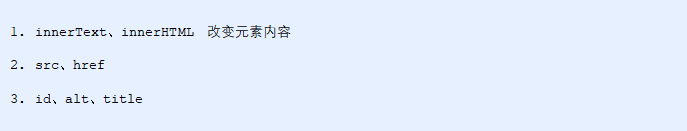

**获取属性的值**

> 元素对象.属性名

**设置属性的值**

> 元素对象.属性名 = 值

**案例代码**

```js
<body>
    <button id="ldh">刘德华</button>
    <button id="zxy">张学友</button> <br>
    
    <script>
        // 修改元素属性  src
        // 1. 获取元素
        var ldh = document.getElementById('ldh');
        var zxy = document.getElementById('zxy');
        var img = document.querySelector('img');
        // 2. 注册事件  处理程序
        zxy.onclick = function() {
            img.src = 'images/zxy.jpg';
            img.title = '张学友思密达';
        }
        ldh.onclick = function() {
            img.src = 'images/ldh.jpg';
            img.title = '刘德华';
        }
    </script>
</body>
```


### 1.5.3. 案例：分时问候

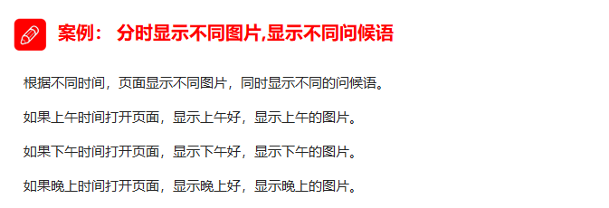


### 1.5.4. 表单元素的属性操作


**获取属性的值**

> 元素对象.属性名

**设置属性的值**

> 元素对象.属性名 = 值
>
> 表单元素中有一些属性如：disabled、checked、selected，元素对象的这些属性的值是布尔型。

**案例代码**

```js
<body>
    <button>按钮</button>
    <input type="text" value="输入内容">
    <script>
        // 1. 获取元素
        var btn = document.querySelector('button');
        var input = document.querySelector('input');
        // 2. 注册事件 处理程序
        btn.onclick = function() {
            // 表单里面的值 文字内容是通过 value 来修改的
            input.value = '被点击了';
            // 如果想要某个表单被禁用 不能再点击 disabled  我们想要这个按钮 button禁用
            // btn.disabled = true;
            this.disabled = true;
            // this 指向的是事件函数的调用者 btn
        }
    </script>
</body>
```

### 1.5.5. 案例：仿京东显示密码


### 1.5.6. 样式属性操作

我们可以通过 JS 修改元素的大小、颜色、位置等样式。

**常用方式**


#### 方式1：通过操作style属性

> 元素对象的style属性也是一个对象！
>
> 元素对象.style.样式属性 = 值;


**案例代码**

```js
<body>
    <div></div>
    <script>
        // 1. 获取元素
        var div = document.querySelector('div');
        // 2. 注册事件 处理程序
        div.onclick = function() {
            // div.style里面的属性 采取驼峰命名法 
            this.style.backgroundColor = 'purple';
            this.style.width = '250px';
        }
    </script>
</body>
```

#### 案例：淘宝点击关闭二维码


# 自定义元素

## 获取属性值

~~~html
<script>
    //element.属性:获取属性值   // element.属性只能获取内置属性值(元素本身自带的属性)
	//element.getAttribute("属性"); //// element.getAttribute("属性") 可以获取程序员自定义的属性(标准)
</script>
~~~

案例

~~~html
<!DOCTYPE html>
<html lang="en">

<head>
    <meta charset="UTF-8">
    <meta name="viewport" content="width=device-width, initial-scale=1.0">
    <meta http-equiv="X-UA-Compatible" content="ie=edge">
    <title>Document</title>
</head>

<body>
    <!-- long是自定义属性 -->
    <div id="demo" index="1" class="nav" long="66"></div>
    <script>
        let div = document.querySelector("#demo")
        // 获取元素的属性值
        //element.属性
        console.log(div.id) //demo
        // element.属性只能获取内置属性值(元素本身自带的属性)
        console.log(div.long) //undefined
        // element.getAttribute("属性")
        console.log(div.getAttribute("id"))
        // element.getAttribute("属性") 可以获取程序员自定义的属性(标准)
        console.log(div.getAttribute("long"))
    </script>
</body>

</html>
~~~

## 设置属性

~~~html
<script>
    //element.属性=”值"
	//element.className = "值"  //用于设置class比较特殊
	//element.setAttribute("属性","值");
</script>
~~~

案例

~~~html
<!DOCTYPE html>
<html lang="en">

<head>
    <meta charset="UTF-8">
    <meta name="viewport" content="width=device-width, initial-scale=1.0">
    <meta http-equiv="X-UA-Compatible" content="ie=edge">
    <title>Document</title>
</head>

<body>
    <!-- long是自定义属性 -->
    <div id="demo" index="1" class="nav" long="66"></div>
    <script>
        let div = document.querySelector("#demo")
        // 设置属性值
        // element.属性="值"
        div.id = "test";
        div.className = "name" //比较特殊
        console.log(div.id) //test
        // element.setAttribute("属性","值")
        div.setAttribute("long", 55);
        console.log(div.getAttribute("long")) //100

    </script>
</body>

</html>
~~~

## 移除属性

~~~html
<script>
    //element.removeAttribute("属性")
</script>
~~~

案例

~~~html
<!DOCTYPE html>
<html lang="en">

<head>
    <meta charset="UTF-8">
    <meta name="viewport" content="width=device-width, initial-scale=1.0">
    <meta http-equiv="X-UA-Compatible" content="ie=edge">
    <title>Document</title>
</head>

<body>
    <!-- long是自定义属性 -->
    <div id="demo" index="1" class="nav" long="66"></div>
    <script>
        let div = document.querySelector("#demo")
        // 移除属性
        //removeAttribute("属性");
        div.removeAttribute("long");
    </script>
</body>

</html>
~~~


# H5自定义属性

- 自定义属性目的:是为了保存并使用数据。有些数据可以保存到页面中而不用保存到数据库中。
- 自定义属性获取是通过getAttribute( \属性')获取。
- 但是有些自定义属性很容易引起歧义,不容易判断是元素的内置属性还是自定义属性。
- H5给我们新增了自定义属性:
  - `H5规定自定义属性data-开头做为属性名并且赋值`
    比如：`<div data-index="1"></div>`

## 获取自定义属性

语法:

~~~html
<script>
    element.attribute; //是无法使用的，这个只能获取内置属性
    element.getAttribute("attribute")//兼容性获取，可以获取自定义属性
    element.dataset;//获取data开头的属性集合
    element.dataset.-后的name;//获取date开头中某一个具体的值
</script>
~~~

案例:

~~~html
<!DOCTYPE html>
<html lang="en">

<head>
    <meta charset="UTF-8">
    <meta name="viewport" content="width=device-width, initial-scale=1.0">
    <meta http-equiv="X-UA-Compatible" content="ie=edge">
    <title>Document</title>
</head>

<body>
    <div getime="20" data-index="100" data-100-200="300" data-name-lida="500"></div>
    <script>
        let div = document.getElementsByTagName("div")[0];
        console.log(div.getAttribute("getime"));
        console.log(div.dataset.index);
        // 获取data开头的集合
        console.log(div.dataset);
        console.log(div.dataset["100-200"]);
        // 如果自定义属性里面有多个链接单词，获取的时候使用驼峰秘命名法
        console.log(div.dataset.nameLida);
    </script>
</body>

</html>
~~~


# 节点操作

## 概述

​	网页中的所有内容都是节点（标签、属性、文本、注释等），在DOM 中，节点使用 node 来表示。

​	HTML DOM 树中的所有节点均可通过 JavaScript 进行访问，所有 HTML 元素（节点）均可被修改，也可以创建或删除。

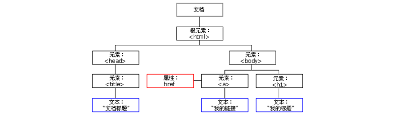

​	一般地，节点至少拥有nodeType（节点类型）、nodeName（节点名称）和nodeValue（节点值）这三个基本属性。


### 节点类型

- 元素节点 nodeType 1
- 属性节点 nodeType 2
- 文本节点 nodeType 3  (文本节点包含文字、空格、换行等)


## 节点层级

​	利用 DOM 树可以把节点划分为不同的层级关系，常见的是**父子兄层级关系**。


## 父级节点

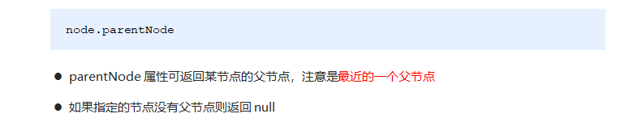

~~~html
<!DOCTYPE html>
<html lang="en">

<head>
    <meta charset="UTF-8">
    <meta name="viewport" content="width=device-width, initial-scale=1.0">
    <meta http-equiv="X-UA-Compatible" content="ie=edge">
    <title>Document</title>
</head>

<body>
    <!-- 节点的优点 -->
    <div>我是div</div>
    <span>我是span</span>
    <ul>
        <li>我是li</li>
        <li>我是li</li>
        <li>我是li</li>
        <li>我是li</li>
    </ul>
    <div class="demo">
        <div class="box">
            <span class="erweima">×</span>
        </div>
    </div>

    <script>
        // 1. 父节点 parentNode
        var erweima = document.querySelector('.erweima');
        // var box = document.querySelector('.box');
        // 得到的是离元素最近的父级节点(亲爸爸) 如果找不到父节点就返回为 null
        console.log(erweima.parentNode); //返回的是html里面类名为box的节点
    </script>
</body>

</html>
~~~


## 子节点

**所有子节点**

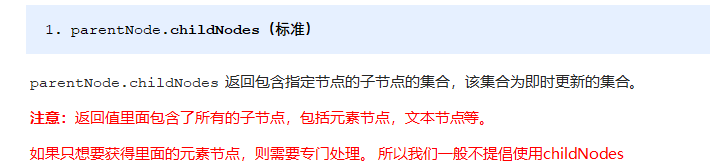

**子元素节点**

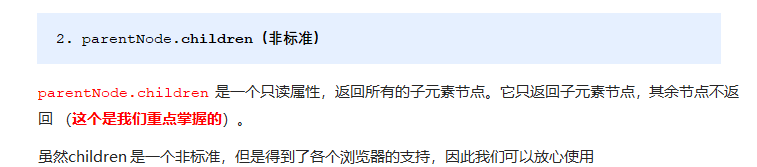


~~~html
<!DOCTYPE html>
<html lang="en">

<head>
    <meta charset="UTF-8">
    <meta name="viewport" content="width=device-width, initial-scale=1.0">
    <meta http-equiv="X-UA-Compatible" content="ie=edge">
    <title>Document</title>
</head>

<body>
    <!-- 节点的优点 -->
    <div>我是div</div>
    <span>我是span</span>
    <ul>
        <li>我是li</li>
        <li>我是li</li>
        <li>我是li</li>
        <li>我是li</li>

    </ul>
    <ol>
        <li>我是li</li>
        <li>我是li</li>
        <li>我是li</li>
        <li>我是li</li>
    </ol>

    <div class="demo">
        <div class="box">
            <span class="erweima">×</span>
        </div>
    </div>

    <script>
        // DOM 提供的方法（API）获取
        var ul = document.querySelector('ul');
        var lis = ul.querySelectorAll('li');
        // 1. 子节点  childNodes 所有的子节点 包含 元素节点 文本节点等等
        console.log(ul.childNodes);
        console.log(ul.childNodes[0].nodeType); // 3
        console.log(ul.childNodes[1].nodeType); // 2
        // 2. children 获取所有的子元素节点 也是我们实际开发常用的
        console.log(ul.children);
    </script>
</body>

</html>
~~~

### 获取第一个和最后一个子节点

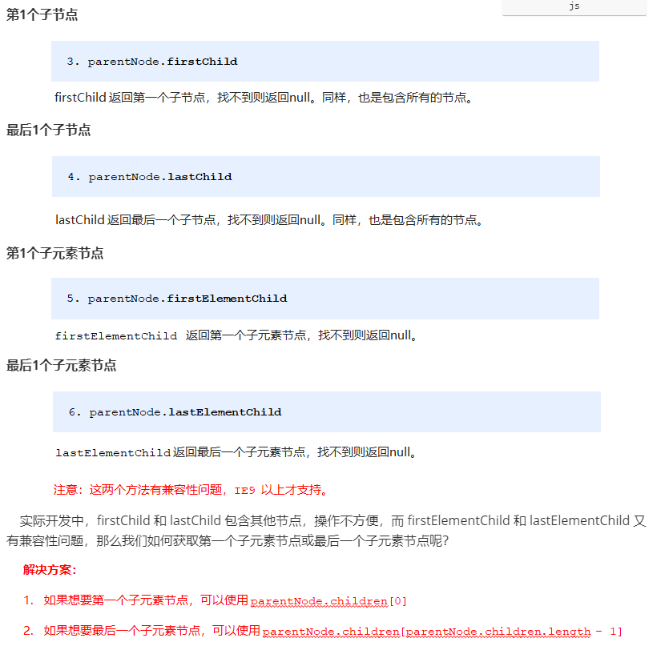

~~~html
<!DOCTYPE html>
<html lang="en">

<head>
    <meta charset="UTF-8">
    <meta name="viewport" content="width=device-width, initial-scale=1.0">
    <meta http-equiv="X-UA-Compatible" content="ie=edge">
    <title>Document</title>
</head>

<body>
    <ol>
        <li>我是li1</li>
        <li>我是li2</li>
        <li>我是li3</li>
        <li>我是li4</li>
        <li>我是li5</li>
    </ol>
    <script>
        var ol = document.querySelector('ol');
        // 1. firstChild 第一个子节点 不管是文本节点还是元素节点
        console.log(ol.firstChild);
        console.log(ol.lastChild);
        // 2. firstElementChild 返回第一个子元素节点 ie9才支持
        console.log(ol.firstElementChild);
        console.log(ol.lastElementChild);
        // 3. 实际开发的写法  既没有兼容性问题又返回第一个子元素
        console.log(ol.children[0]);
        console.log(ol.children[ol.children.length - 1]);
    </script>
</body>

</html>
~~~


## 兄弟节点

~~~html
<!DOCTYPE html>
<html lang="en">

<head>
    <meta charset="UTF-8">
    <meta name="viewport" content="width=device-width, initial-scale=1.0">
    <meta http-equiv="X-UA-Compatible" content="ie=edge">
    <title>Document</title>
</head>

<body>
    <div>我是div</div>
    <span>我是span</span>
    <script>
        var div = document.querySelector('div');
        // 1.nextSibling 下一个兄弟 节点 包含元素节点或者 文本节点等等
        console.log(div.nextSibling);
        /* 得到上一个兄弟节点 */
        console.log(div.previousSibling);
        // 2. nextElementSibling 得到下一个兄弟  元素  节点   (有兼容性问题)
        console.log(div.nextElementSibling);
        console.log(div.previousElementSibling);
    </script>
</body>

</html>
~~~


## 创建节点

**`Document.createElement()`** 方法用于创建一个由标签名称 tagName 指定的 HTML 元素

```js
var element = document.createElement(tagName[, options]);
var li = document.createElement('li');
```

## 添加节点


语法

```js
var insertedNode = parentNode.insertBefore(newNode, referenceNode);
node.insertBefore(你所创建的元素, 创建在谁的前面);
```

- `insertedNode` 已经经过插入`newNode`的新的节点
- `parentNode` 新插入节点的父节点
- `newNode` 用于插入的节点
- `referenceNode` `newNode` 将要插在这个节点之前

如果 `referenceNode` 为 `null` 则 `newNode` 将被插入到子节点的末尾*。*

~~~html
<!DOCTYPE html>
<html lang="en">

<head>
    <meta charset="UTF-8">
    <meta name="viewport" content="width=device-width, initial-scale=1.0">
    <meta http-equiv="X-UA-Compatible" content="ie=edge">
    <title>Document</title>
</head>

<body>
    <ul>
        <li>123</li>
    </ul>
    <script>
        // 1. 创建节点元素节点
        var li = document.createElement('li');
        var a = document.createElement('a');
        // 2. 添加节点 node.appendChild(child)  node 父级  child 是子级 后面追加元素  类似于数组中的push
        var ul = document.querySelector('ul');
        ul.appendChild(li);
        // 3. 添加节点 node.insertBefore(你所创建的元素, 创建在谁的前面);
        ul.insertBefore(a, ul.children[0]);
        // 4. 我们想要页面添加一个新的元素 ： 1. 创建元素 2. 添加元素
    </script>
</body>

</html>
~~~


## 删除节点

语法

​	

```js
let oldChild = node.removeChild(child);

//OR

element.removeChild(child);
```

- `child` 是要移除的那个子节点.
- `node` 是`child`的父节点.
- oldChild保存对删除的子节点的引用. `oldChild` === `child`.

例子

~~~html
<!DOCTYPE html>
<html lang="en">

<head>
    <meta charset="UTF-8">
    <meta name="viewport" content="width=device-width, initial-scale=1.0">
    <meta http-equiv="X-UA-Compatible" content="ie=edge">
    <title>Document</title>
</head>

<body>
    <button>删除</button>
    <ul>
        <li>熊大</li>
        <li>熊二</li>
        <li>光头强</li>
    </ul>
    <script>
        /* 获取元素 */
        let ul = document.querySelector("ul");
        let btn = document.querySelector("button");
        /* 点击删除按钮 */
        btn.onclick = function () {
            // 如果ul里面没有子元素了就把按钮禁用掉
            if (ul.children.length == 0) {
                this.disabled = true;
            } else {
                /* 移除ul里面的第一个子元素节点 */
                ul.removeChild(ul.children[0]);
            }
        }
    </script>
</body>

</html>
~~~


## 复制（克隆）节点

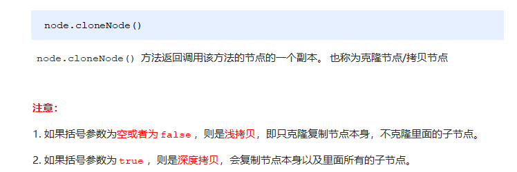


 语法

```
var dupNode = node.cloneNode(deep);
```

- `node`

  将要被克隆的节点

- `dupNode`

  克隆生成的副本节点

- `deep` 可选

  是否采用深度克隆`,如果为true,`则该节点的所有后代节点也都会被克隆,如果为`false,则只克隆该节点本身.`


~~~html
<!DOCTYPE html>
<html lang="en">

<head>
    <meta charset="UTF-8">
    <meta name="viewport" content="width=device-width, initial-scale=1.0">
    <meta http-equiv="X-UA-Compatible" content="ie=edge">
    <title>Document</title>
</head>

<body>
    <ul>
        <li>1111</li>
        <li>2</li>
        <li>3</li>
    </ul>
    <script>
        var ul = document.querySelector('ul');
        // node.cloneNode(deep);   deep=true复制ul里面的所有子元素    deep=false只复制标签本身
        let clone = ul.cloneNode(true);
        ul.appendChild(clone);
    </script>
</body>

</html>
~~~


## 创建元素的三种方式

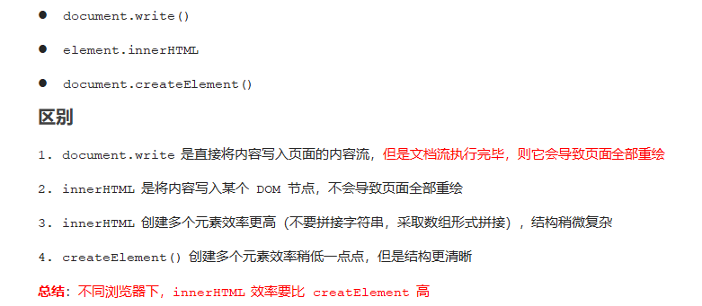


~~~html
<!DOCTYPE html>
<html lang="en">

<head>
    <meta charset="UTF-8">
    <meta name="viewport" content="width=device-width, initial-scale=1.0">
    <meta http-equiv="X-UA-Compatible" content="ie=edge">
    <title>Document</title>
</head>

<body>
    <button>点击</button>
    <p>abc</p>
    <div class="inner"></div>
    <div class="create"></div>
    <script>
        // window.onload = function() {
        //         document.write('<div>123</div>');

        //     }
        // 三种创建元素方式区别 


        // 1. document.write() 创建元素  如果页面文档流加载完毕，再调用这句话会导致页面重绘
        var btn = document.querySelector('button');
        btn.onclick = function () {
            document.write('<div>123</div>');
        }

        // 2. innerHTML 创建元素
        var inner = document.querySelector('.inner');
        // for (var i = 0; i <= 100; i++) {
        //     inner.innerHTML += '<a href="#">百度</a>'
        // }
        var arr = [];
        for (var i = 0; i <= 100; i++) {
            arr.push('<a href="#">百度</a>');
        }
        inner.innerHTML = arr.join('');
        // 3. document.createElement() 创建元素
        var create = document.querySelector('.create');
        for (var i = 0; i <= 100; i++) {
            var a = document.createElement('a');
            a.innerHTML = "6"
            a.href = "javascript:;"
            create.appendChild(a);
        }
    </script>
</body>

</html>
~~~


### 效率的对比

**innerHTML字符串拼接方式（效率低）**

```js
<script>
    function fn() {
        var d1 = +new Date();
        var str = '';
        for (var i = 0; i < 1000; i++) {
            document.body.innerHTML += '<div style="width:100px; height:2px; border:1px solid blue;"></div>';
        }
        var d2 = +new Date();
        console.log(d2 - d1);
    }
    fn();
</script>
```

**createElement方式（效率一般）**

```js
<script>
    function fn() {
        var d1 = +new Date();

        for (var i = 0; i < 1000; i++) {
            var div = document.createElement('div');
            div.style.width = '100px';
            div.style.height = '2px';
            div.style.border = '1px solid red';
            document.body.appendChild(div);
        }
        var d2 = +new Date();
        console.log(d2 - d1);
    }
    fn();
</script>
```

**innerHTML数组方式（效率高）**

```js
<script>
    function fn() {
        var d1 = +new Date();
        var array = [];
        for (var i = 0; i < 1000; i++) {
            array.push('<div style="width:100px; height:2px; border:1px solid blue;"></div>');
        }
        document.body.innerHTML = array.join('');
        var d2 = +new Date();
        console.log(d2 - d1);
    }
    fn();
</script>
```


# DOM重点核心（总结）


关于dom操作，我们主要针对于元素的操作。主要有创建、增、删、改、查、属性操作、事件操作。

### 1.2.1. 创建

1. document.write
2. innerHTML
3. createElement

### 1.2.2. 增加

1. appendChild
2. insertBefore

### 1.2.3. 删

1. removeChild

### 1.2.4. 改

主要修改dom的元素属性，dom元素的内容、属性,表单的值等
1.修改元素属性: src、 href、 title等
2.修改普通元素内容: innerHTML、 innerText
3.修改表单元素: value、 type、 disabled等
4.修改元素样式: style、 className

### 1.2.5. 查

主要获取查询dom的元素

1. DOM提供的API 方法: getElementByld、 getElementsByTagName 古老用法不太推荐
2. H5提供的新方法: querySelector、 querySelectorAll 提倡
   3.利用节点操作获取元素: 父(parentNode) 子(children)、 兄(previousElementSibling、
   nextElementSibling)提倡

### 1.2.6. 属性操作

主要针对于自定义属性。

1. setAttribute:设置dom的属性值
2. getAttribute:得到dom的属性值
3. removeAttribute移除属性


# 常见案例

## 排他算法


如果有同一组元素，我们想要某一个元素实现某种样式， 需要用到循环的排他思想算法：

1. 所有元素全部清除样式（干掉其他人）

2. 给当前元素设置样式 （留下我自己）

3. 注意顺序不能颠倒，首先干掉其他人，再设置自己

~~~html
<!DOCTYPE html>
<html lang="en">

<head>
    <meta charset="UTF-8">
    <meta name="viewport" content="width=device-width, initial-scale=1.0">
    <meta http-equiv="X-UA-Compatible" content="ie=edge">
    <title>Document</title>
</head>

<body>
    <div class="div">
        <button>按钮1</button>
        <button>按钮2</button>
        <button>按钮3</button>
        <button>按钮4</button>
        <button>按钮5</button>
        <button>按钮6</button>
        <button>按钮7</button>
    </div>
    <script>
        // 获取元素
        let btns = document.getElementsByTagName("button");
        // 批量注册事件
        for (let i = 0; i < btns.length; i++) {
            // 注册为鼠标点击事件
            btns[i].onclick = function () {
                /* 每一次点击设置全部按钮没有颜色，然后再给点击的按钮一个颜色 */
                // 循环设置全部按钮为默认值，即没有颜色
                for (let j = 0; j < btns.length; j++) {
                    btns[j].style.backgroundColor = ""
                }
                // 点击按钮中的任意一个设置背景颜色为pink
                this.style.backgroundColor = "pink";
            }
        }
    </script>
</body>

</html>
~~~

## 百度换肤


- 案例分析
  - 这个案例练习给一组元素注册事件
  - 给4个小图片利用循环注册点击事件
  - 当我们点击了这个图片，让我们页面背景改为当前的图片
  - `核心算法:把当前图片的src路径去过来，给body做背景图片`

~~~html
<!DOCTYPE html>
<html lang="en">

<head>
    <meta charset="UTF-8">
    <meta name="viewport" content="width=device-width, initial-scale=1.0">
    <meta http-equiv="X-UA-Compatible" content="ie=edge">
    <title>Document</title>
    <style>
        * {
            margin: 0;
            padding: 0;
        }

        body {
            background: url(./images/1.jpg) no-repeat center top;
        }

        li {
            list-style: none;
        }

        .baidu {
            overflow: hidden;
            margin: 100px auto;
            background-color: #fff;
            width: 410px;
            padding-top: 3px;
        }

        .baidu li {
            float: left;
            margin: 0 1px;
            cursor: pointer;
        }

        .baidu img {
            width: 100px;
        }
    </style>
</head>

<body>
    <ul class="baidu">
        <li></li>
        <li></li>
        <li></li>
        <li></li>
    </ul>
    <script>
        // 获取class是baidi的第一个元素，里面的标签名字是img的标签
        let imgs = document.getElementsByClassName('baidu')[0].getElementsByTagName("img");
        /* 批量注册 */
        for (let i = 0; i < imgs.length; i++) {
            // 鼠标点击img
            imgs[i].onclick = () => {
                // 设置页面的body的style里面的backgroundImage的路径为点击的图片的路径
                document.body.style.backgroundImage = "url(" + imgs[i].src + ") ";
            }
        }
    </script>
</body>

</html>
~~~

## 表格隔行变色

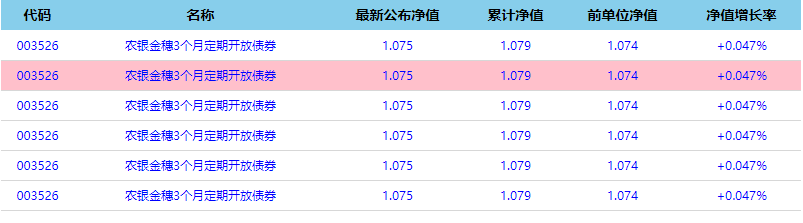

- 案例分析
  - `核心思路:鼠标进过tr，当前的行变背景颜色，鼠标离开去掉当前的背景颜色`
  - 鼠标移入(onmouseover)、鼠标移出(onmouseout)

~~~html
<!DOCTYPE html>
<html lang="en">

<head>
    <meta charset="UTF-8">
    <meta name="viewport" content="width=device-width, initial-scale=1.0">
    <meta http-equiv="X-UA-Compatible" content="ie=edge">
    <title>Document</title>
    <style>
        table {
            width: 800px;
            margin: 100px auto;
            text-align: center;
            border-collapse: collapse;
            font-size: 14px;
        }

        thead tr {
            height: 30px;
            background-color: skyblue;
        }

        tbody tr {
            height: 30px;
        }

        tbody td {
            border-bottom: 1px solid #d7d7d7;
            font-size: 12px;
            color: blue;
        }

        .bg {
            background-color: pink;
        }
    </style>
</head>

<body>
    <table>
        <thead>
            <tr>
                <th>代码</th>
                <th>名称</th>
                <th>最新公布净值</th>
                <th>累计净值</th>
                <th>前单位净值</th>
                <th>净值增长率</th>
            </tr>
        </thead>
        <tbody>
            <tr>
                <td>003526</td>
                <td>农银金穗3个月定期开放债券</td>
                <td>1.075</td>
                <td>1.079</td>
                <td>1.074</td>
                <td>+0.047%</td>
            </tr>
            <tr>
                <td>003526</td>
                <td>农银金穗3个月定期开放债券</td>
                <td>1.075</td>
                <td>1.079</td>
                <td>1.074</td>
                <td>+0.047%</td>
            </tr>
            <tr>
                <td>003526</td>
                <td>农银金穗3个月定期开放债券</td>
                <td>1.075</td>
                <td>1.079</td>
                <td>1.074</td>
                <td>+0.047%</td>
            </tr>
            <tr>
                <td>003526</td>
                <td>农银金穗3个月定期开放债券</td>
                <td>1.075</td>
                <td>1.079</td>
                <td>1.074</td>
                <td>+0.047%</td>
            </tr>
            <tr>
                <td>003526</td>
                <td>农银金穗3个月定期开放债券</td>
                <td>1.075</td>
                <td>1.079</td>
                <td>1.074</td>
                <td>+0.047%</td>
            </tr>
            <tr>
                <td>003526</td>
                <td>农银金穗3个月定期开放债券</td>
                <td>1.075</td>
                <td>1.079</td>
                <td>1.074</td>
                <td>+0.047%</td>
            </tr>
        </tbody>
    </table>
    <script>
        let tr = document.querySelector("tbody").querySelectorAll("tr");
        //批量注册事件
        for (let i = 0; i < tr.length; i++) {
            // 鼠标移入让 tr 的样式修改成.bg里面的样式
            tr[i].onmouseover = function () {
                this.className = 'bg';
            }
            // 鼠标移出 tr 的样式修改成没有
            tr[i].onmouseout = function () {
                this.className = ""
            }
        }
    </script>
</body>

</html>
~~~

## 全选和反选


- 案例分析
  - 全选和反选：让下面所有复选框的checked属性（选中状态）跟随全选按钮。
  - 下面复选框需要全部选中，上面全选才能选中：给下面所有复选框绑定点击事件，每次点击，都要循环查看下面所有的复选框是否有没选中的，如果有一个没选中的，上面全选就不选中。
    设置一个变量来控制全选是否选中。

~~~html
<!DOCTYPE html>
<html>

<head lang="en">
    <meta charset="UTF-8">
    <title></title>
    <style>
        * {
            padding: 0;
            margin: 0;
        }

        .wrap {
            width: 300px;
            margin: 100px auto 0;
        }

        table {
            border-collapse: collapse;
            border-spacing: 0;
            border: 1px solid #c0c0c0;
            width: 300px;
        }

        th,
        td {
            border: 1px solid #d0d0d0;
            color: #404060;
            padding: 10px;
        }

        th {
            background-color: #09c;
            font: bold 16px "微软雅黑";
            color: #fff;
        }

        td {
            font: 14px "微软雅黑";
        }

        tbody tr {
            background-color: #f0f0f0;
        }

        tbody tr:hover {
            cursor: pointer;
            background-color: #fafafa;
        }
    </style>

</head>

<body>
    <div class="wrap">
        <table>
            <thead>
                <tr>
                    <th>
                        <input type="checkbox" id="j_cbAll" />
                    </th>
                    <th>商品</th>
                    <th>价钱</th>
                </tr>
            </thead>
            <tbody id="j_tb">
                <tr>
                    <td>
                        <input type="checkbox" />
                    </td>
                    <td>iPhone8</td>
                    <td>8000</td>
                </tr>
                <tr>
                    <td>
                        <input type="checkbox" />
                    </td>
                    <td>iPad Pro</td>
                    <td>5000</td>
                </tr>
                <tr>
                    <td>
                        <input type="checkbox" />
                    </td>
                    <td>iPad Air</td>
                    <td>2000</td>
                </tr>
                <tr>
                    <td>
                        <input type="checkbox" />
                    </td>
                    <td>Apple Watch</td>
                    <td>2000</td>
                </tr>

            </tbody>
        </table>
    </div>
    <script>
        // 全选按钮
        let j_cbAll = document.querySelector("#j_cbAll");
        // 单个按钮
        let j_tbs = document.querySelector("#j_tb").querySelectorAll("input");
        j_cbAll.onclick = function () {
            for (let i = 0; i < j_tbs.length; i++) {
                j_tbs[i].checked = this.checked;
                console.log(this.checked);

            }
        }
        // 已知选中是true，未选中是flase
        for (let i = 0; i < j_tbs.length; i++) {
            j_tbs[i].onclick = function () {
                let flag = true;
                // 每一次点击按钮都会检查一遍所有的按钮是否被勾选上，如果都勾选上了，就让flag等于true就行了；
                for (let i = 0; i < j_tbs.length; i++) {
                    if (j_tbs[i].checked == false) {
                        flag = false;
                        break;
                    }
                }
                j_cbAll.checked = flag;
            }
        }
    </script>
</body>

</html>
~~~

## Tab切换

- 业务需求

  每一次点击标签下面的内容跟着变化

  

- 案例分析

Tab栏切换有2个大的模块
上的模块选项卡，点击某-个，当前这一 个底色会是红色，其余不变(排他思想) 修改类
名的方式
下面的模块内容，会跟随上面的选项卡变化。所以下面模块变化写到点击事件里面。
规律:下面的模块显示内容和上面的选项卡一 对应，相匹配。
核心思路:给上面的tab_ list里面的所有小i添加自定义属性，属性值从0开始编号。
当我们点击tab_ list 里面的某个小i，让tab_ con里面对应序号的内容显示，其余隐藏(排他
思想)


方法一

~~~js
<!DOCTYPE html>
<html lang="en">

<head>
    <meta charset="UTF-8">
    <meta name="viewport" content="width=device-width, initial-scale=1.0">
    <meta http-equiv="X-UA-Compatible" content="ie=edge">
    <title>Document</title>
    <style>
        * {
            margin: 0;
            padding: 0;
        }

        li {
            list-style-type: none;
        }

        .tab {
            width: 978px;
            margin: 100px auto;
        }

        .tab_list {
            height: 39px;
            border: 1px solid #ccc;
            background-color: #f1f1f1;
        }

        .tab_list li {
            float: left;
            height: 39px;
            line-height: 39px;
            padding: 0 20px;
            text-align: center;
            cursor: pointer;
        }

        .tab_list .current {
            background-color: #c81623;
            color: #fff;
        }

        .item_info {
            padding: 20px 0 0 20px;
        }

        .item {
            display: none;
        }
    </style>
</head>

<body>
    <div class="tab">
        <div class="tab_list">
            <ul>
                <li class="current">商品介绍</li>
                <li>规格与包装</li>
                <li>售后保障</li>
                <li>商品评价（50000）</li>
                <li>手机社区</li>
            </ul>
        </div>
        <div class="tab_con">
            <div class="item" style="display: block;">
                商品介绍模块内容
            </div>
            <div class="item">
                规格与包装模块内容
            </div>
            <div class="item">
                售后保障模块内容
            </div>
            <div class="item">
                商品评价（50000）模块内容
            </div>
            <div class="item">
                手机社区模块内容
            </div>

        </div>
    </div>
    <script>
        // 获取切换栏
        let tab_lists = document.querySelector(".tab_list").querySelectorAll("li");

        // 获取切换内容
        let tab_cons = document.getElementsByClassName("tab_con")[0].getElementsByTagName("div");
        // 批量注册事件
        for (let i = 0; i < tab_lists.length; i++) {
            tab_lists[i].onclick = function () {
                // 排他算法开始
                for (let j = 0; j < tab_lists.length; j++) {
                    // 1 每一次点击都移除掉  li标签的 class属性
                    tab_lists[j].removeAttribute("class");
                }
                // 2 然后再添加css属性上去
                tab_lists[i].className = "current";
                // 排他算法结束

                // 内容显示模块开始,核心排他算法
                for (let p = 0; p < tab_cons.length; p++) {
                    // 1 每一次点击都清空div里面的style属性
                    tab_cons[p].removeAttribute("style");
                    // tab_cons[p].style.display = '';

                }
                // 2 然后再添加行内式上去
                tab_cons[i].style.display = 'block';
                // 内容显示模块结束

            }
        }
    </script>
</body>

</html>
~~~

方法二

~~~html
<!DOCTYPE html>
<html lang="en">

<head>
    <meta charset="UTF-8">
    <meta name="viewport" content="width=device-width, initial-scale=1.0">
    <meta http-equiv="X-UA-Compatible" content="ie=edge">
    <title>Document</title>
    <style>
        * {
            margin: 0;
            padding: 0;
        }

        li {
            list-style-type: none;
        }

        .tab {
            width: 978px;
            margin: 100px auto;
        }

        .tab_list {
            height: 39px;
            border: 1px solid #ccc;
            background-color: #f1f1f1;
        }

        .tab_list li {
            float: left;
            height: 39px;
            line-height: 39px;
            padding: 0 20px;
            text-align: center;
            cursor: pointer;
        }

        .tab_list .current {
            background-color: #c81623;
            color: #fff;
        }

        .item_info {
            padding: 20px 0 0 20px;
        }

        .item {
            display: none;
        }
    </style>
</head>

<body>
    <div class="tab">
        <div class="tab_list">
            <ul>
                <li class="current">商品介绍</li>
                <li>规格与包装</li>
                <li>售后保障</li>
                <li>商品评价（50000）</li>
                <li>手机社区</li>
            </ul>
        </div>
        <div class="tab_con">
            <div class="item" style="display: block;">
                商品介绍模块内容
            </div>
            <div class="item">
                规格与包装模块内容
            </div>
            <div class="item">
                售后保障模块内容
            </div>
            <div class="item">
                商品评价（50000）模块内容
            </div>
            <div class="item">
                手机社区模块内容
            </div>

        </div>
    </div>
    <script>
        // 获取切换栏
        let tab_lists = document.querySelector(".tab_list").querySelectorAll("li");

        // 获取切换内容
        let tab_cons = document.getElementsByClassName("tab_con")[0].getElementsByTagName("div");
        // 批量注册事件
        for (let i = 0; i < tab_lists.length; i++) {
            // 给5个li设置自定义属性
            tab_lists[i].setAttribute("index", i);
            tab_lists[i].onclick = function () {
                // 排他算法开始
                for (let j = 0; j < tab_lists.length; j++) {
                    // 1 每一次点击都移除掉  li标签的 class属性
                    tab_lists[j].removeAttribute("class");
                }
                // 2 然后再添加css属性上去
                tab_lists[i].className = "current";
                // 排他算法结束

                // 内容显示模块开始,核心排他算法
                let index = tab_lists[i].getAttribute("index");
                console.log(index);
                for (let i = 0; i < tab_cons.length; i++) {
                    // tab_cons[i].style.display = "";
                    tab_cons[i].removeAttribute("style");
                }
                tab_cons[index].style.display = "block";
                // 内容显示模块结束

            }
        }
    </script>
</body>

</html>
~~~

## 新浪下拉菜单

案例分析


核心代码

~~~html
    <script>
        // 1. 获取元素
        var nav = document.querySelector('.nav');
        var lis = nav.children; // 得到4个小li
        // 2.循环注册事件
        for (var i = 0; i < lis.length; i++) {
            lis[i].onmouseover = function() {
                this.children[1].style.display = 'block';
            }
            lis[i].onmouseout = function() {
                this.children[1].style.display = 'none';
            }
        }
    </script>
~~~

完整代码

~~~html
<!DOCTYPE html>
<html lang="en">

<head>
    <meta charset="UTF-8">
    <meta name="viewport" content="width=device-width, initial-scale=1.0">
    <meta http-equiv="X-UA-Compatible" content="ie=edge">
    <title>Document</title>
    <style>
        * {
            margin: 0;
            padding: 0;
        }

        li {
            list-style-type: none;
        }

        a {
            text-decoration: none;
            font-size: 14px;
        }

        .nav {
            margin: 100px;
        }

        .nav>li {
            position: relative;
            float: left;
            width: 80px;
            height: 41px;
            text-align: center;
        }

        .nav li a {
            display: block;
            width: 100%;
            height: 100%;
            line-height: 41px;
            color: #333;
        }

        .nav>li>a:hover {
            background-color: #eee;
        }

        .nav ul {
            display: none;
            position: absolute;
            top: 41px;
            left: 0;
            width: 100%;
            border-left: 1px solid #FECC5B;
            border-right: 1px solid #FECC5B;
        }

        .nav ul li {
            border-bottom: 1px solid #FECC5B;
        }

        .nav ul li a:hover {
            background-color: #FFF5DA;
        }
    </style>
</head>

<body>
    <ul class="nav">
        <li>
            <a href="#">微博</a>
            <ul>
                <li>
                    <a href="">私信</a>
                </li>
                <li>
                    <a href="">评论</a>
                </li>
                <li>
                    <a href="">@我</a>
                </li>
            </ul>
        </li>
        <li>
            <a href="#">微博</a>
            <ul>
                <li>
                    <a href="">私信</a>
                </li>
                <li>
                    <a href="">评论</a>
                </li>
                <li>
                    <a href="">@我</a>
                </li>
            </ul>
        </li>
        <li>
            <a href="#">微博</a>
            <ul>
                <li>
                    <a href="">私信</a>
                </li>
                <li>
                    <a href="">评论</a>
                </li>
                <li>
                    <a href="">@我</a>
                </li>
            </ul>
        </li>
        <li>
            <a href="#">微博</a>
            <ul>
                <li>
                    <a href="">私信</a>
                </li>
                <li>
                    <a href="">评论</a>
                </li>
                <li>
                    <a href="">@我</a>
                </li>
            </ul>
        </li>
    </ul>
    <script>
        /* 获取nav */
        let navs = document.getElementsByClassName('nav')[0];
        /* 获取nav里面所有的li */
        let lis = navs.children;

        for (let i = 0; i < lis.length; i++) {
            lis[i].onmouseover = function () {
                /* 获取li里面的所有子元素 a  和 ul   选择下标为1的ul进行显示 */
                this.children[1].style.display = "block";
            }
            lis[i].onmouseout = function () {
                this.children[1].style.display = "none";
            }
        }
    </script>
</body>

</html>
~~~

## 简单版留言发布

案例分析


~~~html
<!DOCTYPE html>
<html lang="en">

<head>
    <meta charset="UTF-8">
    <meta name="viewport" content="width=device-width, initial-scale=1.0">
    <meta http-equiv="X-UA-Compatible" content="ie=edge">
    <title>Document</title>
    <style>
        * {
            margin: 0;
            padding: 0;
        }

        body {
            padding: 100px;
        }

        textarea {
            width: 200px;
            height: 100px;
            border: 1px solid pink;
            outline: none;
            resize: none;
        }

        ul {
            margin-top: 50px;
        }

        li {
            width: 300px;
            padding: 5px;
            background-color: rgb(245, 209, 243);
            color: red;
            font-size: 14px;
            margin: 15px 0;
        }
    </style>
</head>

<body>
    <textarea name="" id=""></textarea>
    <button>发布</button>
    <ul>

    </ul>
    <script>
        /* 获取元素 */
        let btn = document.querySelector("button");
        let text = document.querySelector("textarea");
        let ul = document.querySelector("ul");
        /* 注册事件 */
        btn.onclick = function () {
            if (text.value == "") {
                alert("你没有输入内容");
                return false;
            } else {
                /* 创建元素 */
                let li = document.createElement("li");
                /* 添加textarer里面的内容到li里面 */
                li.innerHTML = text.value;
                /* 添加元素 */
                // ul.appendChild(li);
                ul.insertBefore(li, ul.children[0]);
            }
        }
    </script>
</body>

</html>
~~~


## 删除留言

案例分析

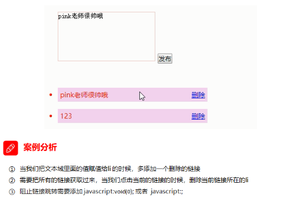

~~~html
    <textarea name="" id=""></textarea>
    <button>发布</button>
    <ul>

    </ul>
    <script>
        // 1. 获取元素
        var btn = document.querySelector('button');
        var text = document.querySelector('textarea');
        var ul = document.querySelector('ul');
        // 2. 注册事件
        btn.onclick = function() {
            if (text.value == '') {
                alert('您没有输入内容');
                return false;
            } else {
                // console.log(text.value);
                // (1) 创建元素
                var li = document.createElement('li');
                // 先有li 才能赋值
                li.innerHTML = text.value + "<a href='javascript:;'>删除</a>";
                // (2) 添加元素
                // ul.appendChild(li);
                ul.insertBefore(li, ul.children[0]);
                // (3) 删除元素 删除的是当前链接的li  它的父亲
                var as = document.querySelectorAll('a');
                for (var i = 0; i < as.length; i++) {
                    as[i].onclick = function() {
                        // 删除的是 li 当前a所在的li  this.parentNode;
                        ul.removeChild(this.parentNode);
                    }
                }
            }
        }
    </script>
~~~

## 动态生成表格创建学生数据

案例分析

​	

~~~html
<!DOCTYPE html>
<html lang="en">

<head>
    <meta charset="UTF-8">
    <meta name="viewport" content="width=device-width, initial-scale=1.0">
    <meta http-equiv="X-UA-Compatible" content="ie=edge">
    <title>Document</title>
    <style>
        table {
            width: 500px;
            margin: 100px auto;
            border-collapse: collapse;
            text-align: center;
        }

        td,
        th {
            border: 1px solid #333;
        }

        thead tr {
            height: 40px;
            background-color: #ccc;
        }
    </style>
</head>

<body>
    <table cellspacing="0">
        <thead>
            <tr>
                <th>姓名</th>
                <th>科目</th>
                <th>成绩</th>
                <th>操作</th>
            </tr>
        </thead>
        <tbody>

        </tbody>
    </table>
    <script>
        // 1.先去准备好学生的数据
        var datas = [{
                name: '魏璎珞',
                subject: 'JavaScript',
                score: 100
            }, {
                name: '弘历',
                subject: 'JavaScript',
                score: 98
            }, {
                name: '傅恒',
                subject: 'JavaScript',
                score: 99
            }, {
                name: '明玉',
                subject: 'JavaScript',
                score: 88
            }, {
                name: '大猪蹄子',
                subject: 'JavaScript',
                score: 0,
            },

        ];

        // 在tbody里面创建行
        let tbody = document.querySelector("tbody");
        /* 创建单元格 */
        for (let i = 0; i < datas.length; i++) {
            /* 创建tr行 */
            let tr = document.createElement("tr");
            /* 控制新添加的在前面 */
            tbody.insertBefore(tr, tbody.children[0]);
            /* 行里面创建单元格 */
            /* 行里面创建单元格td  单元格的数量取决于每个对象的属性个数 所以使用for循环遍历对象 */
            for (let k in datas[i]) {
                // 创建单元格
                let td = document.createElement("td");
                /* 把对象里面的属性值给td */
                td.innerHTML = datas[i][k];
                // console.log(datas[i][k]);     //至于为什么用append添加进去请打开我
                /* 在tr里面从创建td 始终创建在最后面 */
                tr.appendChild(td)
                // tr.insertBefore(td, tr.children[0]);
            }
            /* 创建有 删除单元格 */
            let td = document.createElement("td");
            tr.append(td);
            td.innerHTML = "<a href='javascript:;'>删除</a>"

        }
        /* 为什么删除操作要写在for循环外面，因为上面的for循环是创建单元格使用的，创建完成之后就是删除操作所以放外面 */
        // 删除操作
        let as = document.querySelectorAll("a");
        for (let i = 0; i < as.length; i++) {
            as[i].onclick = function () {
                /* 删除的是tbody里面的行     因为a标签在td里面  td在tr里面   所以删除的是a的爷爷 */
                tbody.removeChild(as[i].parentNode.parentNode);
            }
        }
    </script>
</body>

</html>
~~~

