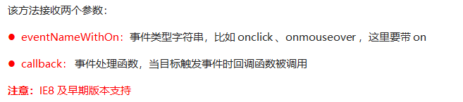
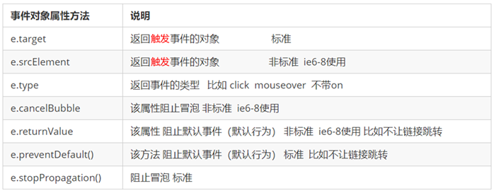
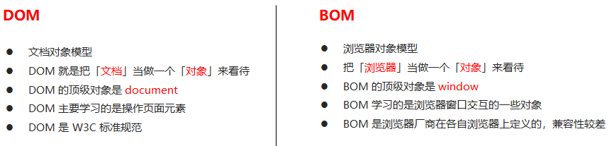
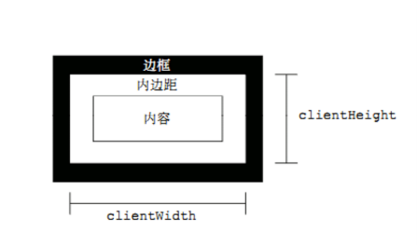

# 1.1. Web API介绍

### 1.1.1 API的概念

API（Application Programming Interface，应用程序编程接口）是一些预先定义的函数，目的是提供应用程序与开发人员基于某软件或硬件得以访问一组例程的能力，而又无需访问源码，无需理解其内部工作机制细节，只需直接调用使用即可。

> 举例解释什么是API。
>
> 例如，
>
> ​	C语言中有一个函数 fopen()可以打开硬盘上的文件，这个函数对于我们来说，就是一个C语言提供的打开文件的工具。
>
> ​	javascript中有一个函数alert()可以在页面弹一个提示框，这个函数就是js提供的一个弹框工具。
>
> 这些工具（函数）由编程语言提供，内部的实现已经封装好了，我们只要学会灵活的使用这些工具即可。

### 1.1.2 Web  API的概念

​	Web API 是浏览器提供的一套操作浏览器功能和页面元素的 API ( BOM 和 DOM )。

​	现阶段我们主要针对于浏览器讲解常用的 API , 主要针对浏览器做交互效果。比如我们想要浏览器弹出一个警示框， 直接使用 alert(‘弹出’)

​	MDN 详细 API : https://developer.mozilla.org/zh-CN/docs/Web/API

​	因为 Web API 很多，所以我们将这个阶段称为 Web APIs。

​	此处的 Web API 特指浏览器提供的一系列API(很多函数或对象方法)，即操作网页的一系列工具。例如：操作html标签、操作页面地址的方法。

### 1.1.3 API 和 Web  API 总结

1. API 是为我们程序员提供的一个接口，帮助我们实现某种功能，我们会使用就可以了，不必纠结内部如何实现

2. Web API 主要是针对于浏览器提供的接口，主要针对于浏览器做交互效果。

3. Web API 一般都有输入和输出（函数的传参和返回值），Web API 很多都是方法（函数）

4. 学习 Web API 可以结合前面学习内置对象方法的思路学习

## 1.2. DOM 介绍

### 1.2.1 什么是DOM

​	文档对象模型（Document Object Model，简称DOM），是 [W3C](https://baike.baidu.com/item/W3C) 组织推荐的处理[可扩展标记语言](https://baike.baidu.com/item/%E5%8F%AF%E6%89%A9%E5%B1%95%E7%BD%AE%E6%A0%87%E8%AF%AD%E8%A8%80)（html或者xhtml）的标准[编程接口](https://baike.baidu.com/item/%E7%BC%96%E7%A8%8B%E6%8E%A5%E5%8F%A3)。

​	W3C 已经定义了一系列的 DOM 接口，通过这些 DOM 接口可以改变网页的内容、结构和样式。

> DOM是W3C组织制定的一套处理 html和xml文档的规范，所有的浏览器都遵循了这套标准。

### 1.2.2. DOM树


DOM树 又称为文档树模型，把文档映射成树形结构，通过节点对象对其处理，处理的结果可以加入到当前的页面。

- 文档：一个页面就是一个文档，DOM中使用document表示
- 节点：网页中的所有内容，在文档树中都是节点（标签、属性、文本、注释等），使用node表示
- 标签节点：网页中的所有标签，通常称为元素节点，又简称为“元素”，使用element表示


# 1.3. 获取元素

为什么要获取页面元素？

例如：我们想要操作页面上的某部分(显示/隐藏，动画)，需要先获取到该部分对应的元素，再对其进行操作。

### 1.3.1. 根据ID获取

```js
语法：document.getElementById(id)
作用：根据ID获取元素对象
参数：id值，区分大小写的字符串
返回值：元素对象 或 null
```

**案例代码**

```js
<body>
    <p id="time">2019-12-28</p>
    <script>
        // 获取元素的id
        var timer = document.getElementById("time")
        console.log(timer);
        console.log(typeof timer);//object
        console.dir(timer);
    </script>
</body>
```

### 1.3.2. 根据标签名获取元素

```
语法：document.getElementsByTagName('标签名') 或者 element.getElementsByTagName('标签名') 
作用：根据标签名获取元素对象
参数：标签名
返回值：元素对象集合（伪数组，数组元素是元素对象）
```

**案例代码**

```javascript
<body>
    <ul>
        <li>全栈牛逼1</li>
        <li>全栈牛逼2</li>
        <li>全栈牛逼3</li>
        <li>全栈牛逼4</li>
        <li>全栈牛逼5</li>
    </ul>
    <ul id="nav">
        <li>全栈是真的牛逼</li>
        <li>全栈是真的牛逼</li>
        <li>全栈是真的牛逼</li>
        <li>全栈是真的牛逼</li>
        <li>全栈是真的牛逼</li>
    </ul>
    <script>
        // TagName = 标签
        // 获取document里面的所有的li TagName
        let lis = document.getElementsByTagName("li");
        console.log(lis);
        console.log(typeof lis)
        for (let i = 0; i < lis.length; i++) {
            console.log(lis[i]);
        }
        // 先获取id
        let nav = document.getElementById("nav");
        // 再通过id获得里面的id为nav里面的所有li的值
        let navlis = nav.getElementsByTagName('li')
        console.log(navlis)
        console.log(navlis[0])
    </script>
</body>
```


注意：getElementsByTagName()获取到是动态集合，即：当页面增加了标签，这个集合中也就增加了元素。

### 1.3.3. H5新增获取元素方式


**案例代码**

```js
    <script>
        // 获得页面中类名是box的标签
        let boxs = document.getElementsByClassName("box");
        console.log(boxs);
        console.log(boxs[0]);
        console.log(`===============================================================`)
        // 获取页面中id是nav的标签
        let nav = document.getElementById("nav");
        // 获取id是nav里面的li标签
        let lis = nav.getElementsByTagName("li");
        console.log(lis);
        console.log(lis[0]);

        console.log(`===============================================================`)
        // 获取页面中第一个类名是box 的标签
        let boxOne = document.querySelector(".box");
        console.log(boxOne);
        // 获得页面中类名是box的全部标签
        let boxAll = document.querySelectorAll(".box");
        console.log(boxAll);
        console.log(boxAll[0]);

        console.log(`===============================================================`)
        // 获取页面中第一个id是nav的标签
        let navs = document.querySelector("#nav");
        // 获取页面中id为nav中的所有li标签
        let liAll = navs.querySelectorAll("li");
        // 获取页面中的所有li标签
        let liAll2 = document.querySelectorAll("li");
        console.log(navs);
        console.log(liAll);
        console.log(liAll[0]);
        console.log(liAll2);
    </script>
</body>
```

### 1.3.4 获取特殊元素（body，html）


# 1.4. 事件基础

### 1.4.1. 事件概述

JavaScript 使我们有能力创建动态页面，而事件是可以被 JavaScript 侦测到的行为。

简单理解： **触发--- 响应机制**。

​	网页中的每个元素都可以产生某些可以触发 JavaScript 的事件，例如，我们可以在用户点击某按钮时产生一个 事件，然后去执行某些操作。

### 1.4.2. 事件三要素

- 事件源（谁）：触发事件的元素
- 事件类型（什么事件）： 例如 click 点击事件
- 事件处理程序（做啥）：事件触发后要执行的代码(函数形式)，事件处理函数

**案例代码**

```js
<body style="text-align: center;">
    <input type="button" value="点我啊" id="btn">
    <script>
        // 点击一个按钮，弹出对话框
        // 1. 事件是有三部分组成  事件源  事件类型  事件处理程序   我们也称为事件三要素
        //(1) 事件源 事件被触发的对象   谁  按钮
        let btn = document.getElementById("btn");
        //(2) 事件类型  如何触发 什么事件 比如鼠标点击(onclick) 还是鼠标经过 还是键盘按下
        //(3) 事件处理程序  通过一个函数赋值的方式 完成
        btn.onclick = function () {
            alert("你还真敢点");
        }
    </script>
</body>
```

### 1.4.3. 执行事件的步骤


**案例代码**

```js
<body>
    <p id="p">点我</p>

    <script>
        // 执行事件步骤
        // 点击P 控制台输出 1
        // 1. 获取事件源
        let p = document.getElementById("p");
        // 或者
        // let p = document.querySelector("p");
        console.log(p);
        console.log(typeof p);
        // 2.绑定事件 注册事件
        // div.onclick 
        // 3.添加事件处理程序 
        p.onclick = function () {
            console.log("1");
        }
    </script>
</body>
```

### 1.4.4. 常见的鼠标事件

| 鼠标事件                 | 触发条件         |
| ------------------------ | ---------------- |
| ondlick                  | 鼠标点击左键触发 |
| onmouseover              | 鼠标经过触发     |
| onmouseout   |          鼠标离开触发        |
| onfocus  |          获得鼠标焦点触发        |
| onblur   |     失去鼠标焦点触发             |
| onmousemove  |      鼠标移动触发            |
| onmouseup    |     鼠标弹起触发             |


### 1.4.5. 分析事件三要素

- 下拉菜单三要素

- 关闭广告三要素


# 1.5. 操作元素

​	JavaScript的 DOM 操作可以改变网页内容、结构和样式，我们可以利用 DOM 操作元素来改变元素里面的内容、属性等。（注意：这些操作都是通过元素对象的属性实现的）

### 1.5.1. 改变元素内容（获取或设置）


**innerText改变元素内容**

```js
<body>
    <button>显示当前系统时间</button>
    <div>某个时间</div>
    <p>1123</p>
    <script>
        // 当我们点击了按钮，  div里面的文字会发生变化
        // 1. 获取元素 
        var btn = document.querySelector('button');
        var div = document.querySelector('div');
        // 2.注册事件
        btn.onclick = function() {
            // div.innerText = '2019-6-6';
            div.innerHTML = getDate();
        }
        function getDate() {
            var date = new Date();
            // 我们写一个 2019年 5月 1日 星期三
            var year = date.getFullYear();
            var month = date.getMonth() + 1;
            var dates = date.getDate();
            var arr = ['星期日', '星期一', '星期二', '星期三', '星期四', '星期五', '星期六'];
            var day = date.getDay();
            return '今天是：' + year + '年' + month + '月' + dates + '日 ' + arr[day];
        }
    </script>
</body>
```

**innerText和innerHTML的区别**

- 获取内容时的区别：

​	innerText会去除空格和换行，而innerHTML会保留空格和换行	

- 设置内容时的区别：

​	innerText不会识别html，而innerHTML会识别

**案例代码**

```js
<body>
    <div></div>
    <p>
        我是文字
        <span>123</span>
    </p>
    <script>
        // innerText 和 innerHTML的区别 
        // 1. innerText 不识别html标签 非标准  去除空格和换行
        var div = document.querySelector('div');
        // div.innerText = '<strong>今天是：</strong> 2019';
        // 2. innerHTML 识别html标签 W3C标准 保留空格和换行的
        div.innerHTML = '<strong>今天是：</strong> 2019';
        // 这两个属性是可读写的  可以获取元素里面的内容
        var p = document.querySelector('p');
        console.log(p.innerText);
        console.log(p.innerHTML);
    </script>
</body>
```

### 1.5.2. 常用元素的属性操作


**获取属性的值**

> 元素对象.属性名

**设置属性的值**

> 元素对象.属性名 = 值

**案例代码**

```js
<body>
    <button id="ldh">刘德华</button>
    <button id="zxy">张学友</button> <br>
    
    <script>
        // 修改元素属性  src
        // 1. 获取元素
        var ldh = document.getElementById('ldh');
        var zxy = document.getElementById('zxy');
        var img = document.querySelector('img');
        // 2. 注册事件  处理程序
        zxy.onclick = function() {
            img.src = 'images/zxy.jpg';
            img.title = '张学友思密达';
        }
        ldh.onclick = function() {
            img.src = 'images/ldh.jpg';
            img.title = '刘德华';
        }
    </script>
</body>
```


### 1.5.3. 案例：分时问候


### 1.5.4. 表单元素的属性操作


**获取属性的值**

> 元素对象.属性名

**设置属性的值**

> 元素对象.属性名 = 值
>
> 表单元素中有一些属性如：disabled、checked、selected，元素对象的这些属性的值是布尔型。

**案例代码**

```js
<body>
    <button>按钮</button>
    <input type="text" value="输入内容">
    <script>
        // 1. 获取元素
        var btn = document.querySelector('button');
        var input = document.querySelector('input');
        // 2. 注册事件 处理程序
        btn.onclick = function() {
            // 表单里面的值 文字内容是通过 value 来修改的
            input.value = '被点击了';
            // 如果想要某个表单被禁用 不能再点击 disabled  我们想要这个按钮 button禁用
            // btn.disabled = true;
            this.disabled = true;
            // this 指向的是事件函数的调用者 btn
        }
    </script>
</body>
```

### 1.5.5. 案例：仿京东显示密码


### 1.5.6. 样式属性操作

我们可以通过 JS 修改元素的大小、颜色、位置等样式。

**常用方式**


#### 方式1：通过操作style属性

> 元素对象的style属性也是一个对象！
>
> 元素对象.style.样式属性 = 值;


**案例代码**

```js
<body>
    <div></div>
    <script>
        // 1. 获取元素
        var div = document.querySelector('div');
        // 2. 注册事件 处理程序
        div.onclick = function() {
            // div.style里面的属性 采取驼峰命名法 
            this.style.backgroundColor = 'purple';
            this.style.width = '250px';
        }
    </script>
</body>
```

#### 案例：淘宝点击关闭二维码


# 自定义元素

## 获取属性值

~~~html
<script>
    //element.属性:获取属性值   // element.属性只能获取内置属性值(元素本身自带的属性)
	//element.getAttribute("属性"); //// element.getAttribute("属性") 可以获取程序员自定义的属性(标准)
</script>
~~~

案例

~~~html
<!DOCTYPE html>
<html lang="en">

<head>
    <meta charset="UTF-8">
    <meta name="viewport" content="width=device-width, initial-scale=1.0">
    <meta http-equiv="X-UA-Compatible" content="ie=edge">
    <title>Document</title>
</head>

<body>
    <!-- long是自定义属性 -->
    <div id="demo" index="1" class="nav" long="66"></div>
    <script>
        let div = document.querySelector("#demo")
        // 获取元素的属性值
        //element.属性
        console.log(div.id) //demo
        // element.属性只能获取内置属性值(元素本身自带的属性)
        console.log(div.long) //undefined
        // element.getAttribute("属性")
        console.log(div.getAttribute("id"))
        // element.getAttribute("属性") 可以获取程序员自定义的属性(标准)
        console.log(div.getAttribute("long"))
    </script>
</body>

</html>
~~~

## 设置属性

~~~html
<script>
    //element.属性=”值"
	//element.className = "值"  //用于设置class比较特殊
	//element.setAttribute("属性","值");
</script>
~~~

案例

~~~html
<!DOCTYPE html>
<html lang="en">

<head>
    <meta charset="UTF-8">
    <meta name="viewport" content="width=device-width, initial-scale=1.0">
    <meta http-equiv="X-UA-Compatible" content="ie=edge">
    <title>Document</title>
</head>

<body>
    <!-- long是自定义属性 -->
    <div id="demo" index="1" class="nav" long="66"></div>
    <script>
        let div = document.querySelector("#demo")
        // 设置属性值
        // element.属性="值"
        div.id = "test";
        div.className = "name" //比较特殊
        console.log(div.id) //test
        // element.setAttribute("属性","值")
        div.setAttribute("long", 55);
        console.log(div.getAttribute("long")) //100

    </script>
</body>

</html>
~~~

## 移除属性

~~~html
<script>
    //element.removeAttribute("属性")
</script>
~~~

案例

~~~html
<!DOCTYPE html>
<html lang="en">

<head>
    <meta charset="UTF-8">
    <meta name="viewport" content="width=device-width, initial-scale=1.0">
    <meta http-equiv="X-UA-Compatible" content="ie=edge">
    <title>Document</title>
</head>

<body>
    <!-- long是自定义属性 -->
    <div id="demo" index="1" class="nav" long="66"></div>
    <script>
        let div = document.querySelector("#demo")
        // 移除属性
        //removeAttribute("属性");
        div.removeAttribute("long");
    </script>
</body>

</html>
~~~


# H5自定义属性

- 自定义属性目的:是为了保存并使用数据。有些数据可以保存到页面中而不用保存到数据库中。
- 自定义属性获取是通过getAttribute( \属性')获取。
- 但是有些自定义属性很容易引起歧义,不容易判断是元素的内置属性还是自定义属性。
- H5给我们新增了自定义属性:
  - `H5规定自定义属性data-开头做为属性名并且赋值`
    比如：`<div data-index="1"></div>`

## 获取自定义属性

语法:

~~~html
<script>
    element.attribute; //是无法使用的，这个只能获取内置属性
    element.getAttribute("attribute")//兼容性获取，可以获取自定义属性
    element.dataset;//获取data开头的属性集合
    element.dataset.-后的name;//获取date开头中某一个具体的值
</script>
~~~

案例:

~~~html
<!DOCTYPE html>
<html lang="en">

<head>
    <meta charset="UTF-8">
    <meta name="viewport" content="width=device-width, initial-scale=1.0">
    <meta http-equiv="X-UA-Compatible" content="ie=edge">
    <title>Document</title>
</head>

<body>
    <div getime="20" data-index="100" data-100-200="300" data-name-lida="500"></div>
    <script>
        let div = document.getElementsByTagName("div")[0];
        console.log(div.getAttribute("getime"));
        console.log(div.dataset.index);
        // 获取data开头的集合
        console.log(div.dataset);
        console.log(div.dataset["100-200"]);
        // 如果自定义属性里面有多个链接单词，获取的时候使用驼峰秘命名法
        console.log(div.dataset.nameLida);
    </script>
</body>

</html>
~~~


# 节点操作

## 概述

​	网页中的所有内容都是节点（标签、属性、文本、注释等），在DOM 中，节点使用 node 来表示。

​	HTML DOM 树中的所有节点均可通过 JavaScript 进行访问，所有 HTML 元素（节点）均可被修改，也可以创建或删除。


​	一般地，节点至少拥有nodeType（节点类型）、nodeName（节点名称）和nodeValue（节点值）这三个基本属性。


### 节点类型

- 元素节点 nodeType 1
- 属性节点 nodeType 2
- 文本节点 nodeType 3  (文本节点包含文字、空格、换行等)


## 节点层级

​	利用 DOM 树可以把节点划分为不同的层级关系，常见的是**父子兄层级关系**。


## 父级节点


~~~html
<!DOCTYPE html>
<html lang="en">

<head>
    <meta charset="UTF-8">
    <meta name="viewport" content="width=device-width, initial-scale=1.0">
    <meta http-equiv="X-UA-Compatible" content="ie=edge">
    <title>Document</title>
</head>

<body>
    <!-- 节点的优点 -->
    <div>我是div</div>
    <span>我是span</span>
    <ul>
        <li>我是li</li>
        <li>我是li</li>
        <li>我是li</li>
        <li>我是li</li>
    </ul>
    <div class="demo">
        <div class="box">
            <span class="erweima">×</span>
        </div>
    </div>

    <script>
        // 1. 父节点 parentNode
        var erweima = document.querySelector('.erweima');
        // var box = document.querySelector('.box');
        // 得到的是离元素最近的父级节点(亲爸爸) 如果找不到父节点就返回为 null
        console.log(erweima.parentNode); //返回的是html里面类名为box的节点
    </script>
</body>

</html>
~~~


## 子节点

**所有子节点**


**子元素节点**


~~~html
<!DOCTYPE html>
<html lang="en">

<head>
    <meta charset="UTF-8">
    <meta name="viewport" content="width=device-width, initial-scale=1.0">
    <meta http-equiv="X-UA-Compatible" content="ie=edge">
    <title>Document</title>
</head>

<body>
    <!-- 节点的优点 -->
    <div>我是div</div>
    <span>我是span</span>
    <ul>
        <li>我是li</li>
        <li>我是li</li>
        <li>我是li</li>
        <li>我是li</li>

    </ul>
    <ol>
        <li>我是li</li>
        <li>我是li</li>
        <li>我是li</li>
        <li>我是li</li>
    </ol>

    <div class="demo">
        <div class="box">
            <span class="erweima">×</span>
        </div>
    </div>

    <script>
        // DOM 提供的方法（API）获取
        var ul = document.querySelector('ul');
        var lis = ul.querySelectorAll('li');
        // 1. 子节点  childNodes 所有的子节点 包含 元素节点 文本节点等等
        console.log(ul.childNodes);
        console.log(ul.childNodes[0].nodeType); // 3
        console.log(ul.childNodes[1].nodeType); // 2
        // 2. children 获取所有的子元素节点 也是我们实际开发常用的
        console.log(ul.children);
    </script>
</body>

</html>
~~~

### 获取第一个和最后一个子节点


~~~html
<!DOCTYPE html>
<html lang="en">

<head>
    <meta charset="UTF-8">
    <meta name="viewport" content="width=device-width, initial-scale=1.0">
    <meta http-equiv="X-UA-Compatible" content="ie=edge">
    <title>Document</title>
</head>

<body>
    <ol>
        <li>我是li1</li>
        <li>我是li2</li>
        <li>我是li3</li>
        <li>我是li4</li>
        <li>我是li5</li>
    </ol>
    <script>
        var ol = document.querySelector('ol');
        // 1. firstChild 第一个子节点 不管是文本节点还是元素节点
        console.log(ol.firstChild);
        console.log(ol.lastChild);
        // 2. firstElementChild 返回第一个子元素节点 ie9才支持
        console.log(ol.firstElementChild);
        console.log(ol.lastElementChild);
        // 3. 实际开发的写法  既没有兼容性问题又返回第一个子元素
        console.log(ol.children[0]);
        console.log(ol.children[ol.children.length - 1]);
    </script>
</body>

</html>
~~~


## 兄弟节点

~~~html
<!DOCTYPE html>
<html lang="en">

<head>
    <meta charset="UTF-8">
    <meta name="viewport" content="width=device-width, initial-scale=1.0">
    <meta http-equiv="X-UA-Compatible" content="ie=edge">
    <title>Document</title>
</head>

<body>
    <div>我是div</div>
    <span>我是span</span>
    <script>
        var div = document.querySelector('div');
        // 1.nextSibling 下一个兄弟 节点 包含元素节点或者 文本节点等等
        console.log(div.nextSibling);
        /* 得到上一个兄弟节点 */
        console.log(div.previousSibling);
        // 2. nextElementSibling 得到下一个兄弟  元素  节点   (有兼容性问题)
        console.log(div.nextElementSibling);
        console.log(div.previousElementSibling);
    </script>
</body>

</html>
~~~


## 创建节点

**`Document.createElement()`** 方法用于创建一个由标签名称 tagName 指定的 HTML 元素

```js
var element = document.createElement(tagName[, options]);
var li = document.createElement('li');
```

## 添加节点


语法

```js
var insertedNode = parentNode.insertBefore(newNode, referenceNode);
node.insertBefore(你所创建的元素, 创建在谁的前面);
```

- `insertedNode` 已经经过插入`newNode`的新的节点
- `parentNode` 新插入节点的父节点
- `newNode` 用于插入的节点
- `referenceNode` `newNode` 将要插在这个节点之前

如果 `referenceNode` 为 `null` 则 `newNode` 将被插入到子节点的末尾*。*

~~~html
<!DOCTYPE html>
<html lang="en">

<head>
    <meta charset="UTF-8">
    <meta name="viewport" content="width=device-width, initial-scale=1.0">
    <meta http-equiv="X-UA-Compatible" content="ie=edge">
    <title>Document</title>
</head>

<body>
    <ul>
        <li>123</li>
    </ul>
    <script>
        // 1. 创建节点元素节点
        var li = document.createElement('li');
        var a = document.createElement('a');
        // 2. 添加节点 node.appendChild(child)  node 父级  child 是子级 后面追加元素  类似于数组中的push
        var ul = document.querySelector('ul');
        ul.appendChild(li);
        // 3. 添加节点 node.insertBefore(你所创建的元素, 创建在谁的前面);
        ul.insertBefore(a, ul.children[0]);
        // 4. 我们想要页面添加一个新的元素 ： 1. 创建元素 2. 添加元素
    </script>
</body>

</html>
~~~


## 删除节点

语法

​	

```js
let oldChild = node.removeChild(child);

//OR

element.removeChild(child);
```

- `child` 是要移除的那个子节点.
- `node` 是`child`的父节点.
- oldChild保存对删除的子节点的引用. `oldChild` === `child`.

例子

~~~html
<!DOCTYPE html>
<html lang="en">

<head>
    <meta charset="UTF-8">
    <meta name="viewport" content="width=device-width, initial-scale=1.0">
    <meta http-equiv="X-UA-Compatible" content="ie=edge">
    <title>Document</title>
</head>

<body>
    <button>删除</button>
    <ul>
        <li>熊大</li>
        <li>熊二</li>
        <li>光头强</li>
    </ul>
    <script>
        /* 获取元素 */
        let ul = document.querySelector("ul");
        let btn = document.querySelector("button");
        /* 点击删除按钮 */
        btn.onclick = function () {
            // 如果ul里面没有子元素了就把按钮禁用掉
            if (ul.children.length == 0) {
                this.disabled = true;
            } else {
                /* 移除ul里面的第一个子元素节点 */
                ul.removeChild(ul.children[0]);
            }
        }
    </script>
</body>

</html>
~~~


## 复制（克隆）节点


 语法

```
var dupNode = node.cloneNode(deep);
```

- `node`

  将要被克隆的节点

- `dupNode`

  克隆生成的副本节点

- `deep` 可选

  是否采用深度克隆`,如果为true,`则该节点的所有后代节点也都会被克隆,如果为`false,则只克隆该节点本身.`


~~~html
<!DOCTYPE html>
<html lang="en">

<head>
    <meta charset="UTF-8">
    <meta name="viewport" content="width=device-width, initial-scale=1.0">
    <meta http-equiv="X-UA-Compatible" content="ie=edge">
    <title>Document</title>
</head>

<body>
    <ul>
        <li>1111</li>
        <li>2</li>
        <li>3</li>
    </ul>
    <script>
        var ul = document.querySelector('ul');
        // node.cloneNode(deep);   deep=true复制ul里面的所有子元素    deep=false只复制标签本身
        let clone = ul.cloneNode(true);
        ul.appendChild(clone);
    </script>
</body>

</html>
~~~


## 创建元素的三种方式


~~~html
<!DOCTYPE html>
<html lang="en">

<head>
    <meta charset="UTF-8">
    <meta name="viewport" content="width=device-width, initial-scale=1.0">
    <meta http-equiv="X-UA-Compatible" content="ie=edge">
    <title>Document</title>
</head>

<body>
    <button>点击</button>
    <p>abc</p>
    <div class="inner"></div>
    <div class="create"></div>
    <script>
        // window.onload = function() {
        //         document.write('<div>123</div>');

        //     }
        // 三种创建元素方式区别 


        // 1. document.write() 创建元素  如果页面文档流加载完毕，再调用这句话会导致页面重绘
        var btn = document.querySelector('button');
        btn.onclick = function () {
            document.write('<div>123</div>');
        }

        // 2. innerHTML 创建元素
        var inner = document.querySelector('.inner');
        // for (var i = 0; i <= 100; i++) {
        //     inner.innerHTML += '<a href="#">百度</a>'
        // }
        var arr = [];
        for (var i = 0; i <= 100; i++) {
            arr.push('<a href="#">百度</a>');
        }
        inner.innerHTML = arr.join('');
        // 3. document.createElement() 创建元素
        var create = document.querySelector('.create');
        for (var i = 0; i <= 100; i++) {
            var a = document.createElement('a');
            a.innerHTML = "6"
            a.href = "javascript:;"
            create.appendChild(a);
        }
    </script>
</body>

</html>
~~~


### 效率的对比

**innerHTML字符串拼接方式（效率低）**

```js
<script>
    function fn() {
        var d1 = +new Date();
        var str = '';
        for (var i = 0; i < 1000; i++) {
            document.body.innerHTML += '<div style="width:100px; height:2px; border:1px solid blue;"></div>';
        }
        var d2 = +new Date();
        console.log(d2 - d1);
    }
    fn();
</script>
```

**createElement方式（效率一般）**

```js
<script>
    function fn() {
        var d1 = +new Date();

        for (var i = 0; i < 1000; i++) {
            var div = document.createElement('div');
            div.style.width = '100px';
            div.style.height = '2px';
            div.style.border = '1px solid red';
            document.body.appendChild(div);
        }
        var d2 = +new Date();
        console.log(d2 - d1);
    }
    fn();
</script>
```

**innerHTML数组方式（效率高）**

```js
<script>
    function fn() {
        var d1 = +new Date();
        var array = [];
        for (var i = 0; i < 1000; i++) {
            array.push('<div style="width:100px; height:2px; border:1px solid blue;"></div>');
        }
        document.body.innerHTML = array.join('');
        var d2 = +new Date();
        console.log(d2 - d1);
    }
    fn();
</script>
```


# DOM重点核心（总结）


关于dom操作，我们主要针对于元素的操作。主要有创建、增、删、改、查、属性操作、事件操作。

### 1.2.1. 创建

1. document.write
2. innerHTML
3. createElement

### 1.2.2. 增加

1. appendChild
2. insertBefore

### 1.2.3. 删

1. removeChild

### 1.2.4. 改

主要修改dom的元素属性，dom元素的内容、属性,表单的值等
1.修改元素属性: src、 href、 title等
2.修改普通元素内容: innerHTML、 innerText
3.修改表单元素: value、 type、 disabled等
4.修改元素样式: style、 className

### 1.2.5. 查

主要获取查询dom的元素

1. DOM提供的API 方法: getElementByld、 getElementsByTagName 古老用法不太推荐
2. H5提供的新方法: querySelector、 querySelectorAll 提倡
   3.利用节点操作获取元素: 父(parentNode) 子(children)、 兄(previousElementSibling、
   nextElementSibling)提倡

### 1.2.6. 属性操作

主要针对于自定义属性。

1. setAttribute:设置dom的属性值
2. getAttribute:得到dom的属性值
3. removeAttribute移除属性


# 事件高级

### 1.3.1. 注册事件（2种方式）

语法

```
target.addEventListener(type, listener, options);
target.addEventListener(type, listener, useCapture);
target.addEventListener(type, listener, useCapture, wantsUntrusted  );  // Gecko/Mozilla only
```

- 参数

- `type`

  表示监听[事件类型](https://developer.mozilla.org/zh-CN/docs/Web/Events)的字符串。

- `listener`

  当所监听的事件类型触发时，会接收到一个事件通知（实现了 [`Event`](https://developer.mozilla.org/zh-CN/docs/Web/API/Event) 接口的对象）对象。`listener` 必须是一个实现了 [`EventListener`](https://developer.mozilla.org/zh-CN/docs/Web/API/EventListener) 接口的对象，或者是一个[函数](https://developer.mozilla.org/zh-CN/docs/Web/JavaScript/Guide/Functions)。有关回调本身的详细信息，请参阅[The event listener callback](https://developer.mozilla.org/zh-CN/docs/Web/API/EventTarget/addEventListener#The_event_listener_callback) 

- options 可选

  一个指定有关 `listener `属性的可选参数**对象**。可用的选项如下：`capture`:  [`Boolean`](https://developer.mozilla.org/zh-CN/docs/Web/JavaScript/Reference/Boolean)，表示 `listener` 会在该类型的事件捕获阶段传播到该 `EventTarget` 时触发。`once`:  [`Boolean`](https://developer.mozilla.org/zh-CN/docs/Web/JavaScript/Reference/Boolean)，表示 `listener 在添加之后最多只调用一次。如果是` `true，` `listener` 会在其被调用之后自动移除。`passive`: [`Boolean`](https://developer.mozilla.org/zh-CN/docs/Web/JavaScript/Reference/Boolean)，设置为true时，表示 `listener` 永远不会调用 `preventDefault()。如果 listener 仍然调用了这个函数，客户端将会忽略它并抛出一个控制台警告。`` mozSystemGroup`: 只能在 XBL 或者是 Firefox' chrome 使用，这是个 [`Boolean`](https://developer.mozilla.org/zh-CN/docs/Web/JavaScript/Reference/Boolean)，表示 `listener `被添加到 system group。

- `useCapture` 可选

  [`Boolean`](https://developer.mozilla.org/zh-CN/docs/Web/JavaScript/Reference/Boolean)，在DOM树中，注册了listener的元素， 是否要先于它下面的EventTarget，调用该listener。 当useCapture(设为true) 时，沿着DOM树向上冒泡的事件，不会触发listener。当一个元素嵌套了另一个元素，并且两个元素都对同一事件注册了一个处理函数时，所发生的事件冒泡和事件捕获是两种不同的事件传播方式。事件传播模式决定了元素以哪个顺序接收事件。进一步的解释可以查看 [事件流](http://www.w3.org/TR/DOM-Level-3-Events/#event-flow) 及 [JavaScript Event order](http://www.quirksmode.org/js/events_order.html#link4) 文档。 如果没有指定， `useCapture` 默认为 false 。 

**注意:** 对于事件目标上的事件监听器来说，事件会处于“目标阶段”，而不是冒泡阶段或者捕获阶段。在目标阶段的事件会触发该元素（即事件目标）上的所有监听器，而不在乎这个监听器到底在注册时`useCapture` 参数值是true还是false。

**注意:** `useCapture` 仅仅在现代浏览器最近的几个版本中是可选的。 例如 Firefox 6以前的版本都不是可选的。为了能够提供更广泛的支持，你应该提供这个参数。

- `wantsUntrusted` 

  如果为 `true `, 则事件处理程序会接收网页自定义的事件。此参数只适用于 Gecko（[chrome](https://developer.mozilla.org/en-US/docs/Glossary/chrome)的默认值为true，其他常规网页的默认值为false），主要用于附加组件的代码和浏览器本身。

返回值

`undefined`.


### 1.3.2 事件监听

#### addEventListener()事件监听（IE9以后支持）


eventTarget.addEventListener()方法将指定的监听器注册到 eventTarget（目标对象）上，当该对象触发指定的事件时，就会执行事件处理函数。


#### attacheEvent()事件监听（IE678支持）


​	eventTarget.attachEvent()方法将指定的监听器注册到 eventTarget（目标对象） 上，当该对象触发指定的事件时，指定的回调函数就会被执行。



```js
<button>传统注册事件</button>
<button>方法监听注册事件</button>
<button>ie9 attachEvent</button>
<script>
    var btns = document.querySelectorAll('button');
    // 1. 传统方式注册事件
    btns[0].onclick = function() {
        alert('hi');
    }
    btns[0].onclick = function() {
            alert('hao a u');
        }
   // 2. 事件侦听注册事件 addEventListener 
   // (1) 里面的事件类型是字符串 必定加引号 而且不带on
   // (2) 同一个元素 同一个事件可以添加多个侦听器（事件处理程序）
    btns[1].addEventListener('click', function() {
        alert(22);
    })
    btns[1].addEventListener('click', function() {
            alert(33);
    })
    // 3. attachEvent ie9以前的版本支持
    btns[2].attachEvent('onclick', function() {
        alert(11);
    })
</script>
```

#### 事件监听兼容性解决方案

封装一个函数，函数中判断浏览器的类型：


### 1.3.3. 删除事件（解绑事件）


```js
    <div>1</div>
    <div>2</div>
    <div>3</div>
    <script>
        var divs = document.querySelectorAll('div');
        divs[0].onclick = function() {
            alert(11);
            // 1. 传统方式删除事件
            divs[0].onclick = null;
        }
        // 2. removeEventListener 删除事件
        divs[1].addEventListener('click', fn) // 里面的fn 不需要调用加小括号
        function fn() {
            alert(22);
            divs[1].removeEventListener('click', fn);
        }
        // 3. detachEvent
        divs[2].attachEvent('onclick', fn1);

        function fn1() {
            alert(33);
            divs[2].detachEvent('onclick', fn1);
        }
    </script>
```

**删除事件兼容性解决方案 **


### 1.3.4. DOM事件流

> ```
> html中的标签都是相互嵌套的，我们可以将元素想象成一个盒子装一个盒子，document是最外面的大盒子。
> 当你单击一个div时，同时你也单击了div的父元素，甚至整个页面。
> 
> 那么是先执行父元素的单击事件，还是先执行div的单击事件 ？？？
> ```


> 比如：我们给页面中的一个div注册了单击事件，当你单击了div时，也就单击了body，单击了html，单击了document。


> ```
> 当时的2大浏览器霸主谁也不服谁！
> IE 提出从目标元素开始，然后一层一层向外接收事件并响应，也就是冒泡型事件流。
> Netscape（网景公司）提出从最外层开始，然后一层一层向内接收事件并响应，也就是捕获型事件流。
> 
> 江湖纷争，武林盟主也脑壳疼！！！
> 
> 最终，w3c 采用折中的方式，平息了战火，制定了统一的标准 —--— 先捕获再冒泡。
> 现代浏览器都遵循了此标准，所以当事件发生时，会经历3个阶段。
> ```

DOM 事件流会经历3个阶段： 

1. 捕获阶段

2. 当前目标阶段

3. 冒泡阶段 


​	我们向水里面扔一块石头，首先它会有一个下降的过程，这个过程就可以理解为从最顶层向事件发生的最具体元素（目标点）的捕获过程；之后会产生泡泡，会在最低点（ 最具体元素）之后漂浮到水面上，这个过程相当于事件冒泡。 


**事件冒泡**

```js
    <div class="father">
        <div class="son">son盒子</div>
    </div>
    <script>
        // onclick 和 attachEvent（ie） 在冒泡阶段触发
        // 冒泡阶段 如果addEventListener 第三个参数是 false 或者 省略 
        // son -> father ->body -> html -> document
        var son = document.querySelector('.son');
		// 给son注册单击事件
        son.addEventListener('click', function() {
            alert('son');
        }, false);
		// 给father注册单击事件
        var father = document.querySelector('.father');
        father.addEventListener('click', function() {
            alert('father');
        }, false);
		// 给document注册单击事件，省略第3个参数
        document.addEventListener('click', function() {
            alert('document');
        })
    </script>
```

**事件捕获**

```js
    <div class="father">
        <div class="son">son盒子</div>
    </div>
    <script>
        // 如果addEventListener() 第三个参数是 true 那么在捕获阶段触发
        // document -> html -> body -> father -> son
         var son = document.querySelector('.son');
		// 给son注册单击事件，第3个参数为true
         son.addEventListener('click', function() {
             alert('son');
         }, true);
         var father = document.querySelector('.father');
		// 给father注册单击事件，第3个参数为true
         father.addEventListener('click', function() {
             alert('father');
         }, true);
		// 给document注册单击事件，第3个参数为true
        document.addEventListener('click', function() {
            alert('document');
        }, true)
    </script>
```

### 1.3.5. 事件对象e

#### 什么是事件对象

事件发生后，跟事件相关的一系列信息数据的集合都放到这个对象里面，这个对象就是事件对象。

比如：  

1. 谁绑定了这个事件。

2. 鼠标触发事件的话，会得到鼠标的相关信息，如鼠标位置。

3. 键盘触发事件的话，会得到键盘的相关信息，如按了哪个键。

#### 事件对象的使用

事件触发发生时就会产生事件对象，并且系统会以实参的形式传给事件处理函数。

所以，在事件处理函数中声明1个形参用来接收事件对象。


#### 事件对象的兼容性处理

事件对象本身的获取存在兼容问题：

1. 标准浏览器中是浏览器给方法传递的参数，只需要定义形参 e 就可以获取到。

2. 在 IE6~8 中，浏览器不会给方法传递参数，如果需要的话，需要到 window.event 中获取查找。


```
只要“||”前面为false, 不管“||”后面是true 还是 false，都返回 “||” 后面的值。
只要“||”前面为true, 不管“||”后面是true 还是 false，都返回 “||” 前面的值。
```

```js
    <div>123</div>
    <script>
        var div = document.querySelector('div');
        div.onclick = function(e) {
                // 事件对象
                e = e || window.event;
                console.log(e);
        }
    </script>
```

#### 事件对象的属性和方法



| 事件对象属性方法    | 说明    |
| ---- | ---- |
|  e.target    |   返回触发事件的对象 标准  |
|  e.srcElement  |    返回触发事件的对象 非标准ie6 - 8 使用 |
|   e.type   |   返回事件的类型比如click mouseover 不带on   |
|  e.cancelBubble  |   该属性阻止冒泡非标准ie6 - 8 使用   |
|    e.returnValue  |   该属性阻止默认事件(默认行为) 非标准ie6 - 8 使用比如不让链接跳转   |
|   e.preventDefault   |  该方法阻止默认事件(默认行为) 标准比如不让链接跳转    |
|    e.stopPropagation()  |    阻止冒泡标准  |


#### e.target 和 this 的区别

-  this 是事件绑定的元素（绑定这个事件处理函数的元素） 。

-  e.target 是事件触发的元素。

> ```
> 常情况下terget 和 this是一致的，
> 但有一种情况不同，那就是在事件冒泡时（父子元素有相同事件，单击子元素，父元素的事件处理函数也会被触发执行），
> 	这时候this指向的是父元素，因为它是绑定事件的元素对象，
> 	而target指向的是子元素，因为他是触发事件的那个具体元素对象。
> ```

```js
    <div>123</div>
    <script>
        var div = document.querySelector('div');
        div.addEventListener('click', function(e) {
            // e.target 和 this指向的都是div
            console.log(e.target);
            console.log(this);

        });
    </script>
```

事件冒泡下的e.target和this

```js
    <ul>
        <li>abc</li>
        <li>abc</li>
        <li>abc</li>
    </ul>
    <script>
        var ul = document.querySelector('ul');
        ul.addEventListener('click', function(e) {
              // 我们给ul 绑定了事件  那么this 就指向ul  
              console.log(this); // ul

              // e.target 触发了事件的对象 我们点击的是li e.target 指向的就是li
              console.log(e.target); // li
        });
    </script>
```

### 1.3.6 阻止默认行为

> html中一些标签有默认行为，例如a标签被单击后，默认会进行页面跳转。

```js
    <a href="http://www.baidu.com">百度</a>
    <script>
        // 2. 阻止默认行为 让链接不跳转 
        var a = document.querySelector('a');
        a.addEventListener('click', function(e) {
             e.preventDefault(); //  dom 标准写法
        });
        // 3. 传统的注册方式
        a.onclick = function(e) {
            // 普通浏览器 e.preventDefault();  方法
            e.preventDefault();
            // 低版本浏览器 ie678  returnValue  属性
            e.returnValue = false;
            // 我们可以利用return false 也能阻止默认行为 没有兼容性问题
            return false;
        }
    </script>
```

### 1.3.7 阻止事件冒泡

事件冒泡本身的特性，会带来的坏处，也会带来的好处。


```js
    <div class="father">
        <div class="son">son儿子</div>
    </div>
    <script>
        var son = document.querySelector('.son');
		// 给son注册单击事件
        son.addEventListener('click', function(e) {
            alert('son');
            e.stopPropagation(); // stop 停止  Propagation 传播
            window.event.cancelBubble = true; // 非标准 cancel 取消 bubble 泡泡
        }, false);

        var father = document.querySelector('.father');
		// 给father注册单击事件
        father.addEventListener('click', function() {
            alert('father');
        }, false);
		// 给document注册单击事件
        document.addEventListener('click', function() {
            alert('document');
        })
    </script>
```

**阻止事件冒泡的兼容性处理**


### 1.3.8 事件委托

事件冒泡本身的特性，会带来的坏处，也会带来的好处。

#### 什么是事件委托

```
把事情委托给别人，代为处理。
```

事件委托也称为事件代理，在 jQuery 里面称为事件委派。

> 说白了就是，不给子元素注册事件，给父元素注册事件，把处理代码在父元素的事件中执行。


**生活中的代理：**


**js事件中的代理：**


#### 事件委托的原理

​	给父元素注册事件，利用事件冒泡，当子元素的事件触发，会冒泡到父元素，然后去控制相应的子元素。

#### 事件委托的作用

- 我们只操作了一次 DOM ，提高了程序的性能。

- 动态新创建的子元素，也拥有事件。

```js
    <ul>
        <li>知否知否，点我应有弹框在手！</li>
        <li>知否知否，点我应有弹框在手！</li>
        <li>知否知否，点我应有弹框在手！</li>
        <li>知否知否，点我应有弹框在手！</li>
        <li>知否知否，点我应有弹框在手！</li>
    </ul>
    <script>
        // 事件委托的核心原理：给父节点添加侦听器， 利用事件冒泡影响每一个子节点
        var ul = document.querySelector('ul');
        ul.addEventListener('click', function(e) {
            // e.target 这个可以得到我们点击的对象
            e.target.style.backgroundColor = 'pink';
        })
    </script>
```

# 常用鼠标事件


### 1.4.1 案例：禁止选中文字和禁止右键菜单


```js
<body>
    我是一段不愿意分享的文字
    <script>
        // 1. contextmenu 我们可以禁用右键菜单
        document.addEventListener('contextmenu', function(e) {
                e.preventDefault();
        })
        // 2. 禁止选中文字 selectstart
        document.addEventListener('selectstart', function(e) {
            e.preventDefault();
        })
    </script>
</body>
```

### 1.4.2 鼠标事件对象


### 1.4.3 获取鼠标在页面的坐标

```js
    <script>
        // 鼠标事件对象 MouseEvent
        document.addEventListener('click', function(e) {
            // 1. client 鼠标在可视区的x和y坐标
            console.log(e.clientX);
            console.log(e.clientY);
            console.log('---------------------');

            // 2. page 鼠标在页面文档的x和y坐标
            console.log(e.pageX);
            console.log(e.pageY);
            console.log('---------------------');

            // 3. screen 鼠标在电脑屏幕的x和y坐标
            console.log(e.screenX);
            console.log(e.screenY);

        })
    </script>
```


#  常用的键盘事件

### 1.1.1 键盘事件


```js
    <script>
        // 常用的键盘事件
        //1. keyup 按键弹起的时候触发 
        document.addEventListener('keyup', function() {
            console.log('我弹起了');
        })

        //3. keypress 按键按下的时候触发  不能识别功能键 比如 ctrl shift 左右箭头啊
        document.addEventListener('keypress', function() {
                console.log('我按下了press');
        })
        //2. keydown 按键按下的时候触发  能识别功能键 比如 ctrl shift 左右箭头啊
        document.addEventListener('keydown', function() {
                console.log('我按下了down');
        })
        // 4. 三个事件的执行顺序  keydown -- keypress -- keyup
    </script>
```

### 1.1.2 键盘事件对象


**使用keyCode属性判断用户按下哪个键**

```js
    <script>
        // 键盘事件对象中的keyCode属性可以得到相应键的ASCII码值
        document.addEventListener('keyup', function(e) {
            console.log('up:' + e.keyCode);
            // 我们可以利用keycode返回的ASCII码值来判断用户按下了那个键
            if (e.keyCode === 65) {
                alert('您按下的a键');
            } else {
                alert('您没有按下a键')
            }
        })
        document.addEventListener('keypress', function(e) {
            // console.log(e);
            console.log('press:' + e.keyCode);
        })
    </script>
```

### 1.1.3 案例：模拟京东按键输入内容

当我们按下 s 键， 光标就定位到搜索框（文本框获得焦点）。


> 注意：触发获得焦点事件，可以使用 元素对象.focus()

```js
    <input type="text">
    <script>
        // 获取输入框
        var search = document.querySelector('input');
		// 给document注册keyup事件
        document.addEventListener('keyup', function(e) {
            // 判断keyCode的值
            if (e.keyCode === 83) {
                // 触发输入框的获得焦点事件
                search.focus();
            }
        })
    </script>
```

### 1.1.4 案例：模拟京东快递单号查询

要求：当我们在文本框中输入内容时，文本框上面自动显示大字号的内容。


```js
    <div class="search">
        <div class="con">123</div>
        <input type="text" placeholder="请输入您的快递单号" class="jd">
    </div>
    <script>
        // 获取要操作的元素
        var con = document.querySelector('.con');
        var jd_input = document.querySelector('.jd');
		// 给输入框注册keyup事件
        jd_input.addEventListener('keyup', function() {
				// 判断输入框内容是否为空
                if (this.value == '') {
                    // 为空，隐藏放大提示盒子
                    con.style.display = 'none';
                } else {
                    // 不为空，显示放大提示盒子，设置盒子的内容
                    con.style.display = 'block';
                    con.innerText = this.value;
                }
            })
        // 给输入框注册失去焦点事件，隐藏放大提示盒子
        jd_input.addEventListener('blur', function() {
                con.style.display = 'none';
            })
        // 给输入框注册获得焦点事件
        jd_input.addEventListener('focus', function() {
            // 判断输入框内容是否为空
            if (this.value !== '') {
                // 不为空则显示提示盒子
                con.style.display = 'block';
            }
        })
    </script>
```

# BOM

### 1.2.1. 什么是BOM

​	BOM（Browser Object Model）即浏览器对象模型，它提供了独立于内容而与浏览器窗口进行交互的对象，其核心对象是 window。

​	BOM 由一系列相关的对象构成，并且每个对象都提供了很多方法与属性。

​	BOM 缺乏标准，JavaScript 语法的标准化组织是 ECMA，DOM 的标准化组织是 W3C，BOM 最初是Netscape 浏览器标准的一部分。



### 1.2.2. BOM的构成

BOM 比 DOM 更大，它包含 DOM。


### 1.2.3. 顶级对象window


### 1.2.4. window对象的常见事件

#### 页面（窗口）加载事件（2种）

**第1种**


window.onload 是窗口 (页面）加载事件，**当文档内容完全加载完成**会触发该事件(包括图像、脚本文件、CSS 文件等), 就调用的处理函数。


> 注意:

1.有了window.onload就可以把JS代码写到页面元素的上方，因为onload是等页面内容全部加载完毕，
再去执行处理函数。

2.window.onload传统注册事件方式只能写一次，如果有多个，会以最后-个window.onload为准。
3.如果使用addEventlistener则没有限制

**第2种**

~~~js
document.addEventListener( 'DOMContentLoaded', function() {})
~~~


​	DOMContentLoaded 事件触发时，仅当DOM加载完成，不包括样式表，图片，flash等等。

​	IE9以上才支持！！！

​	如果页面的图片很多的话, 从用户访问到onload触发可能需要较长的时间, 交互效果就不能实现，必然影响用户的体验，此时用 DOMContentLoaded 事件比较合适。

```js
    <script>
        window.addEventListener('load', function() {
            var btn = document.querySelector('button');
            btn.addEventListener('click', function() {
                alert('点击我');
            })
        })
        window.addEventListener('load', function() {
            alert(22);
        })
        document.addEventListener('DOMContentLoaded', function() {
            alert(33);
        })
    </script>
```

#### 调整窗口大小事件


​	window.onresize 是调整窗口大小加载事件,  当触发时就调用的处理函数。

注意：

1. 只要窗口大小发生像素变化，就会触发这个事件。

2. 我们经常利用这个事件完成响应式布局。 window.innerWidth 当前屏幕的宽度

```js
    <script>
        // 注册页面加载事件
        window.addEventListener('load', function() {
            var div = document.querySelector('div');
        	// 注册调整窗口大小事件
            window.addEventListener('resize', function() {
                // window.innerWidth 获取窗口大小
                console.log('变化了');
                if (window.innerWidth <= 800) {
                    div.style.display = 'none';
                } else {
                    div.style.display = 'block';
                }
            })
        })
    </script>
    <div></div>
```


### 1.2.5. 定时器（两种）

window 对象给我们提供了 2 个非常好用的方法-定时器。

- setTimeout()   延迟一定时间执行一次

- setInterval()    延迟一定时间重复执行

#### setTimeout() 炸弹定时器

##### 开启定时器


> ```
> 普通函数是按照代码顺序直接调用。
> 
> 简单理解： 回调，就是回头调用的意思。上一件事干完，再回头再调用这个函数。
> 例如：定时器中的调用函数，事件处理函数，也是回调函数。
> 
> 以前我们讲的   element.onclick = function(){}   或者  element.addEventListener(“click”, fn);   里面的 函数也是回调函数。
> 
> ```


```js
    <script>
        // 回调函数是一个匿名函数
         setTimeout(function() {
             console.log('时间到了');

         }, 2000);
        function callback() {
            console.log('爆炸了');
        }
		// 回调函数是一个有名函数
        var timer1 = setTimeout(callback, 3000);
        var timer2 = setTimeout(callback, 5000);
    </script>
```


#### setInterval() 闹钟定时器

##### 开启定时器


```js
    <script>
        // 1. setInterval 
        setInterval(function() {
            console.log('继续输出');
        }, 1000);
    </script>
```


##### 停止定时器


#### 案例：发送短信倒计时

​	点击按钮后，该按钮60秒之内不能再次点击，防止重复发送短信。


```js
    手机号码： <input type="number"> <button>发送</button>
    <script>
        var btn = document.querySelector('button');
		// 全局变量，定义剩下的秒数
        var time = 3; 
		// 注册单击事件
        btn.addEventListener('click', function() {
            // 禁用按钮
            btn.disabled = true;
            // 开启定时器
            var timer = setInterval(function() {
                // 判断剩余秒数
                if (time == 0) {
                    // 清除定时器和复原按钮
                    clearInterval(timer);
                    btn.disabled = false;
                    btn.innerHTML = '发送';
                } else {
                    btn.innerHTML = '还剩下' + time + '秒';
                    time--;
                }
            }, 1000);
        });
    </script>
```


### 1.2.6. this指向问题

​	this的指向在函数定义的时候是确定不了的，只有函数执行的时候才能确定this到底指向谁，一般情况下this的最终指向的是那个调用它的对象。

现阶段，我们先了解一下几个this指向

1. 全局作用域或者普通函数中this指向全局对象window（注意定时器里面的this指向window）

2. 方法调用中谁调用this指向谁
3. 构造函数中this指向构造函数的实例

```js
    <button>点击</button>
    <script>
        // this 指向问题 一般情况下this的最终指向的是那个调用它的对象
        // 1. 全局作用域或者普通函数中this指向全局对象window（ 注意定时器里面的this指向window）
        console.log(this);
        function fn() {
            console.log(this);
        }
        window.fn();
        window.setTimeout(function() {
            console.log(this);
        }, 1000);
        // 2. 方法调用中谁调用this指向谁
        var o = {
            sayHi: function() {
                console.log(this); // this指向的是 o 这个对象
            }
        }
        o.sayHi();
        var btn = document.querySelector('button');
        btn.addEventListener('click', function() {
                console.log(this); // 事件处理函数中的this指向的是btn这个按钮对象
            })
        // 3. 构造函数中this指向构造函数的实例
        function Fun() {
            console.log(this); // this 指向的是fun 实例对象
        }
        var fun = new Fun();
    </script>
```


### 1.2.7. location对象

#### 什么是 location 对象

window对象给我们提供了-个location属性用于获取或设置窗体的URL，并且可以用于解析URL。因为
这个属性返回的是一个对象 ，所以我们将这个属性也称为location对象。

#### URL

统一资源定位符(Uniform Resource Locator, URL)是互联网上标准资源的地址。互联网上的每个文件都有
一个唯一的URL，它包含的信息指出文件的位置以及浏览器应该怎么处理它。
URL的一般语法格式为:
protocol:/ /host [:port]/path/ [?query]# fragment
http:/ /www. itcast. cn/ index .htm1 ?name=andy&age=18#link


| 组成 | 说明 |
| -------------- | ---- |
|          protocol   |          通信协议常用的http,ftp,maito等      |
|          host     |        主机(域名) www.itheima.com         |
|          port        |        端口号可选，省略时使用方案的默认端口如http的默认端口为80 |
|          path        |         路径由零或多个/符号隔开的字符串，一般用来表示主机上的一个目录或文件地址|
|          query        |         参数以键值对的形式通过&符号分隔开来|
|          fragment        |         片段#后面内容常见于链接锚点|


#### location 对象的属性


| location对象属性 | 返回值 |
| -------------- | ---- |
|    location.href    |          获取或者设置整个URL     |
|    location.host    |          返回主机 (域名) www.itheima.com     |
|    location.port    |          返回端口号如果未写返回空字符串     |
|    location.pathname    |          返回路径     |
|    location. search    |          返回参数     |
|    location. hash    |          返回片段#后面内容常见于链接锚点     |


#### location对象的常见方法


| location对象方法 | 返回值 |
| -------------- | ---- |
|    location.assign()     | 跟href一样，可以跳转页面(也称为重定向页面)    记录浏览历史，所以可以实现后退功能     |
|    location.replace()     |          替换当前页面，因为不记录历史，所以不能后退页面     |
|    location.reload()     |          重新加载页面，相当于刷新按钮或者f5 如果参数为true强制刷新ctrl+f5     |


```js
    <button>点击</button>
    <script>
        var btn = document.querySelector('button');
        btn.addEventListener('click', function() {
            // 记录浏览历史，所以可以实现后退功能
            // location.assign('http://www.itcast.cn');
            // 不记录浏览历史，所以不可以实现后退功能
            // location.replace('http://www.itcast.cn');
            location.reload(true);
        })
    </script>
```

### 1.2.8. navigator对象

​	navigator 对象包含有关浏览器的信息，它有很多属性，我们最常用的是 userAgent，该属性可以返回由客户机发送服务器的 user-agent 头部的值。

下面前端代码可以判断用户那个终端打开页面，实现跳转

```js
if((navigator.userAgent.match(/(phone|pad|pod|iPhone|iPod|ios|iPad|Android|Mobile|BlackBerry|IEMobile|MQQBrowser|JUC|Fennec|wOSBrowser|BrowserNG|WebOS|Symbian|Windows Phone)/i))) {
    window.location.href = "";     //手机
 } else {
    window.location.href = "";     //电脑
 }
```

### 1.2.9 history对象

​	window对象给我们提供了一个 history对象，与浏览器历史记录进行交互。该对象包含用户（在浏览器窗口中）访问过的URL。

| history对象方法 | 作用 |
| -------------- | ---- |
|    back()     |          可以后退功能     |
|    forward()     |          前进功能     |
|    go(参数)     |          前进后退功能参数如果是1前进1个页面如果是-1后退1个页面     |

history对象一般在实际开发中比较少用，但是会在一些 OA 办公系统中见到。


#  JS执行机制

以下代码执行的结果是什么？

```js
 console.log(1);
 
 setTimeout(function () {
     console.log(3);
 }, 1000);
 
 console.log(2);

// 1
// 2
// 3
```

以下代码执行的结果是什么？

```js
 console.log(1);
 
 setTimeout(function () {
     console.log(3);
 }, 0);
 
 console.log(2);

// 1
// 2
// 3
```


### 1.3.1 JS 是单线程


```js
	单线程就意味着，所有任务需要排队，前一个任务结束，才会执行后一个任务。如果前一个任务耗时很长，后一个任务就不得不一直等着。
	这样所导致的问题是： 如果 JS 执行的时间过长，这样就会造成页面的渲染不连贯，导致页面渲染加载阻塞的感觉。
```

### 1.3.2 同步任务和异步任务

​	单线程导致的问题就是后面的任务等待前面任务完成，如果前面任务很耗时（比如读取网络数据），后面任务不得不一直等待！！

​	为了解决这个问题，利用多核 CPU 的计算能力，HTML5 提出 Web Worker 标准，允许 JavaScript 脚本创建多个线程，但是子线程完全受主线程控制。于是，JS 中出现了**同步任务**和**异步任务**。

#### 同步

​	前一个任务结束后再执行后一个任务，程序的执行顺序与任务的排列顺序是一致的、同步的。比如做饭的同步做法：我们要烧水煮饭，等水开了（10分钟之后），再去切菜，炒菜。

#### 异步

​	你在做一件事情时，因为这件事情会花费很长时间，在做这件事的同时，你还可以去处理其他事情。比如做饭的异步做法，我们在烧水的同时，利用这10分钟，去切菜，炒菜。


> ```js
> JS中所有任务可以分成两种，一种是同步任务（synchronous），另一种是异步任务（asynchronous）。
> 
> 同步任务指的是：
> 	在主线程上排队执行的任务，只有前一个任务执行完毕，才能执行后一个任务；
> 异步任务指的是：
> 	不进入主线程、而进入”任务队列”的任务，当主线程中的任务运行完了，才会从”任务队列”取出异步任务放入主线程执行。
> ```


### 1.3.3 JS执行机制（事件循环）


### 1.3.4 代码思考题

```js
 console.log(1);
 document.onclick = function() {
   console.log('click');
 }

 setTimeout(function() {
   console.log(3)
 }, 3000)
 console.log(2);
```


#  offset、client、scroll

## **1.1. **元素偏移量 offset 系列

### 1.1.1 offset 概述 

offset 翻译过来就是偏移量， 我们使用 offset系列相关属性可以动态的得到该元素的位置（偏移）、大小等。

1. 获得元素距离带有定位父元素的位置

2. 获得元素自身的大小（宽度高度）

3. 注意：返回的数值都不带单位

   
   
| offset系列属性 | 作用 |
| -------------- | ---- |
|       element.offsetParent          | 返回作为该元素带有定位的父级元素如果父级都没有定位则返回body     |
|       element.offsetTop          |     返回元素相对带有定位父元素上方的偏移 |
|       element.offsetLeft          |   返回元素相对带有定位父元素左边框的偏移   |
|       elementoffsetWidth          |   返回自身包括padding、边框、 内容区的宽度，返回数值不带单位   |
|       element.offsetHeight          |   返回自身包括padding、边框、内容区的高度，返回数值不带单位   |

   

 

### 1.1.2 offset 与 style 区别 

#### offset

- offset 可以得到任意样式表中的样式值

- offset 系列获得的数值是没有单位的

- offsetWidth 包含padding+border+width

- offsetWidth 等属性是只读属性，只能获取不能赋值

- > 所以，我们想要获取元素大小位置，用offset更合适

#### style

- style 只能得到行内样式表中的样式值

- style.width 获得的是带有单位的字符串

- style.width 获得不包含padding和border 的值

- style.width 是可读写属性，可以获取也可以赋值

- > 所以，我们想要给元素更改值，则需要用style改变

> **因为平时我们都是给元素注册触摸事件，所以重点记住 targetTocuhes**


## 1.2. 元素可视区 client 系列

### 1.2.1 client概述

client 翻译过来就是客户端，我们使用 client 系列的相关属性来获取元素可视区的相关信息。通过 client
系列的相关属性可以动态的得到该元素的边框大小、元素大小等。


| client系列属性 | 作用 |
| -------------- | ---- |
|          element.clientTop       |   返回元素上边框的大小   |
|          element.clientLeft       |  返回元素左边框的大小    |
|          element.clientWidth       |  返回自身包括padding、内容区的宽度， 不含边框，返回数值不带单位    |
|          element.clientHeight       |  返回自身包括padding、内容区的高度，不含边框，返回数值不带单位    |




### 1.2.2. 淘宝 flexible.js 源码分析

立即执行函数 (function(){})()  或者 (function(){}())

主要作用： 创建一个独立的作用域。 避免了命名冲突问题

下面三种情况都会刷新页面都会触发 load 事件。

1.a标签的超链接

2.F5或者刷新按钮（强制刷新）

3.前进后退按钮

但是 火狐中，有个特点，有个“往返缓存”，这个缓存中不仅保存着页面数据，还保存了DOM和JavaScript的状态；实际上是将整个页面都保存在了内存里。

所以此时后退按钮不能刷新页面。

此时可以使用 pageshow事件来触发。，这个事件在页面显示时触发，无论页面是否来自缓存。在重新加载页面中，pageshow会在load事件触发后触发；根据事件对象中的persisted来判断是否是缓存中的页面触发的pageshow事件

`注意这个事件给window添加。`


## 1.3.元素滚动 scroll 系列

### 1.3.1. scroll 概述

scroll 翻译过来就是滚动的，我们使用 scroll 系列的相关属性可以动态的得到该元素的大小、滚动距离等。


| scroll系列属性 | 作用 |
| -------------- | ---- |
|         element.scrollTop     |   返回被卷去的上侧距离，返回数值不带单位   |
|          element.scrolleft      |  返回被卷去的左侧距离，返回数值不带单位    |
|          element.scrollWidth       |  返回自身实际的宽度，不含边框，返回数值不带单位    |
|          element.scrollHeight        |  返回自身实际的高度，不含边框，返回数值不带单位    |


### 1.3.2. 页面被卷去的头部

如果浏览器的高（或宽）度不足以显示整个页面时，会自动出现滚动条。当滚动条向下滚动时，页面上面被隐藏掉的高度，我们就称为页面被卷去的头部。滚动条在滚动时会触发 onscroll事件。


### 1.3.3.案例：仿淘宝固定右侧侧边栏

1. 原先侧边栏是绝对定位
2. 当页面滚动到一定位置，侧边栏改为固定定位
3. 页面继续滚动，会让 返回顶部显示出来

### 1.3.4.案例分析: 

1. 需要用到页面滚动事件 scroll  因为是页面滚动，所以事件源是document
2. 滚动到某个位置，就是判断页面被卷去的上部值。
3. 页面被卷去的头部：可以通过window.pageYOffset 获得  如果是被卷去的左侧window.pageXOffset
4. 注意，元素被卷去的头部是element.scrollTop  , 如果是页面被卷去的头部 则是 window.pageYOffset
5. 其实这个值 可以通过盒子的 offsetTop可以得到，如果大于等于这个值，就可以让盒子固定定位了

```javascript
  //1. 获取元素
        var sliderbar = document.querySelector('.slider-bar');
        var banner = document.querySelector('.banner');
        // banner.offestTop 就是被卷去头部的大小 一定要写到滚动的外面
        var bannerTop = banner.offsetTop
            // 当我们侧边栏固定定位之后应该变化的数值
        var sliderbarTop = sliderbar.offsetTop - bannerTop;
        // 获取main 主体元素
        var main = document.querySelector('.main');
        var goBack = document.querySelector('.goBack');
        var mainTop = main.offsetTop;
        // 2. 页面滚动事件 scroll
        document.addEventListener('scroll', function() {
            // console.log(11);
            // window.pageYOffset 页面被卷去的头部
            // console.log(window.pageYOffset);
            // 3 .当我们页面被卷去的头部大于等于了 172 此时 侧边栏就要改为固定定位
            if (window.pageYOffset >= bannerTop) {
                sliderbar.style.position = 'fixed';
                sliderbar.style.top = sliderbarTop + 'px';
            } else {
                sliderbar.style.position = 'absolute';
                sliderbar.style.top = '300px';
            }
            // 4. 当我们页面滚动到main盒子，就显示 goback模块
            if (window.pageYOffset >= mainTop) {
                goBack.style.display = 'block';
            } else {
                goBack.style.display = 'none';
            }

        })
```

### 1.3.5.页面被卷去的头部兼容性解决方案

需要注意的是，页面被卷去的头部，有兼容性问题，因此被卷去的头部通常有如下几种写法：

1. 声明了 DTD，使用 document.documentElement.scrollTop
2. 未声明 DTD，使用  document.body.scrollTop
3. 新方法 window.pageYOffset和 window.pageXOffset，IE9 开始支持

```javascript
function getScroll() {
    return {
      left: window.pageXOffset || document.documentElement.scrollLeft || document.body.scrollLeft||0,
      top: window.pageYOffset || document.documentElement.scrollTop || document.body.scrollTop || 0
    };
 } 
使用的时候  getScroll().left

```

## 1.4. 三大系列总结


| 三大系列大小对比 | 作用 |
| -------------- | ---- |
|          element.offsetWidth  |      返回自身包括padding、边框、 内容区的宽度，返回数值不带单位       |
|          element.clientWidth    |    返回自身包括padding、内容区的宽度，不含边框，返回数值不带单位         |
|          element.scrollWidth       |     返回自身实际的宽度，不含边框,返回数值不带单位           |


他们主要用法：

1.offset系列 经常用于获得元素位置    offsetLeft  offsetTop

2.client经常用于获取元素大小  clientWidth clientHeight

3.scroll 经常用于获取滚动距离 scrollTop  scrollLeft  

4.注意页面滚动的距离通过 window.pageXOffset  获得

## 1.5. mouseenter 和mouseover的区别

- 当鼠标移动到元素上时就会触发mouseenter 事件
- 类似 mouseover，它们两者之间的差别是
- mouseover 鼠标经过自身盒子会触发，经过子盒子还会触发。mouseenter  只会经过自身盒子触发
- 之所以这样，就是因为mouseenter不会冒泡
- 跟mouseenter搭配鼠标离开 mouseleave  同样不会冒泡


## 1.6. 动画函数封装

### 1.6.1. 动画实现原理 

> 核心原理：通过定时器 setInterval() 不断移动盒子位置。

实现步骤：

1. 获得盒子当前位置
2. 让盒子在当前位置加上1个移动距离
3. 利用定时器不断重复这个操作
4. 加一个结束定时器的条件
5. 注意此元素需要添加定位，才能使用element.style.left

### 1.6.2. 动画函数给不同元素记录不同定时器 

如果多个元素都使用这个动画函数，每次都要var 声明定时器。我们可以给不同的元素使用不同的定时器（自己专门用自己的定时器）。

> 核心原理：利用 JS 是一门动态语言，可以很方便的给当前对象添加属性。

```javascript
 function animate(obj, target) {
            // 当我们不断的点击按钮，这个元素的速度会越来越快，因为开启了太多的定时器
            // 解决方案就是 让我们元素只有一个定时器执行
            // 先清除以前的定时器，只保留当前的一个定时器执行
            clearInterval(obj.timer);
            obj.timer = setInterval(function() {
                if (obj.offsetLeft >= target) {
                    // 停止动画 本质是停止定时器
                    clearInterval(obj.timer);
                }
                obj.style.left = obj.offsetLeft + 1 + 'px';

            }, 30);
        }

```


#  触屏事件

### 触屏事件概述 

移动端浏览器兼容性较好，我们不需要考虑以前 JS 的兼容性问题，可以放心的使用原生 JS 书写效果，但是移动端也有自己独特的地方。比如触屏事件 touch（也称触摸事件），Android和 IOS 都有。

touch 对象代表一个触摸点。触摸点可能是一根手指，也可能是一根触摸笔。触屏事件可响应用户手指（或触控笔）对屏幕或者触控板操作。

常见的触屏事件如下：


###  触摸事件对象（TouchEvent）

TouchEvent 是一类描述手指在触摸平面（触摸屏、触摸板等）的状态变化的事件。这类事件用于描述一个或多个触点，使开发者可以检测触点的移动，触点的增加和减少，等等

touchstart、touchmove、touchend 三个事件都会各自有事件对象。

触摸事件对象重点我们看三个常见对象列表：


> `因为平时我们都是给元素注册触摸事件，所以重点记住 targetTocuhes`

### 1.3.3.案例：移动端拖动元素

1. touchstart、touchmove、touchend可以实现拖动元素

2. 但是拖动元素需要当前手指的坐标值 我们可以使用  targetTouches[0] 里面的pageX 和 pageY 

3. 移动端拖动的原理：    手指移动中，计算出手指移动的距离。然后用盒子原来的位置 + 手指移动的距离

4. 手指移动的距离：  手指滑动中的位置 减去  手指刚开始触摸的位置

   拖动元素三步曲：

   （1） 触摸元素 touchstart： 获取手指初始坐标，同时获得盒子原来的位置

   （2） 移动手指 touchmove： 计算手指的滑动距离，并且移动盒子

   （3） 离开手指 touchend:

   `注意： 手指移动也会触发滚动屏幕所以这里要阻止默认的屏幕滚动 e.preventDefault();`


#   本地存储

随着互联网的快速发展，基于网页的应用越来越普遍，同时也变的越来越复杂，为了满足各种各样的需求，会经常性在本地存储大量的数据，HTML5规范提出了相关解决方案。

### 1.7.1.本地存储特性

1、数据存储在用户浏览器中

2、设置、读取方便、甚至页面刷新不丢失数据

3、容量较大，sessionStorage约5M、localStorage约20M

4、只能存储字符串，可以将对象JSON.stringify() 编码后存储

### 1.7.2.window.sessionStorage

1、生命周期为关闭浏览器窗口

2、在同一个窗口(页面)下数据可以共享

3、以键值对的形式存储使用

存储数据：

```javascript
sessionStorage.setItem(key, value)
```

获取数据：

```javascript
sessionStorage.getItem(key)
```

删除数据：

```javascript
sessionStorage.removeItem(key)
```

清空数据：(所有都清除掉)

```javascript
sessionStorage.clear()
```

### 1.7.3.window.localStorage

1、声明周期永久生效，除非手动删除 否则关闭页面也会存在

2、可以多窗口（页面）共享（同一浏览器可以共享）

3.  以键值对的形式存储使用

存储数据：

```javascript
localStorage.setItem(key, value)
```

获取数据：

```javascript
localStorage.getItem(key)
```

删除数据：

```javascript
localStorage.removeItem(key)
```

清空数据：(所有都清除掉)

```javascript
localStorage.clear()
```

### 1.7.4.案例：记住用户名

如果勾选记住用户名， 下次用户打开浏览器，就在文本框里面自动显示上次登录的用户名

#### 案例分析

1. 把数据存起来，用到本地存储

2. 关闭页面，也可以显示用户名，所以用到localStorage

3. 打开页面，先判断是否有这个用户名，如果有，就在表单里面显示用户名，并且勾选复选框

4. 当复选框发生改变的时候change事件

5. 如果勾选，就存储，否则就移除

   .jpg)


# 常见案例

## 排他算法


如果有同一组元素，我们想要某一个元素实现某种样式， 需要用到循环的排他思想算法：

1. 所有元素全部清除样式（干掉其他人）

2. 给当前元素设置样式 （留下我自己）

3. 注意顺序不能颠倒，首先干掉其他人，再设置自己

~~~html
<!DOCTYPE html>
<html lang="en">

<head>
    <meta charset="UTF-8">
    <meta name="viewport" content="width=device-width, initial-scale=1.0">
    <meta http-equiv="X-UA-Compatible" content="ie=edge">
    <title>Document</title>
</head>

<body>
    <div class="div">
        <button>按钮1</button>
        <button>按钮2</button>
        <button>按钮3</button>
        <button>按钮4</button>
        <button>按钮5</button>
        <button>按钮6</button>
        <button>按钮7</button>
    </div>
    <script>
        // 获取元素
        let btns = document.getElementsByTagName("button");
        // 批量注册事件
        for (let i = 0; i < btns.length; i++) {
            // 注册为鼠标点击事件
            btns[i].onclick = function () {
                /* 每一次点击设置全部按钮没有颜色，然后再给点击的按钮一个颜色 */
                // 循环设置全部按钮为默认值，即没有颜色
                for (let j = 0; j < btns.length; j++) {
                    btns[j].style.backgroundColor = ""
                }
                // 点击按钮中的任意一个设置背景颜色为pink
                this.style.backgroundColor = "pink";
            }
        }
    </script>
</body>

</html>
~~~

## 百度换肤


- 案例分析
  - 这个案例练习给一组元素注册事件
  - 给4个小图片利用循环注册点击事件
  - 当我们点击了这个图片，让我们页面背景改为当前的图片
  - `核心算法:把当前图片的src路径去过来，给body做背景图片`

~~~html
<!DOCTYPE html>
<html lang="en">

<head>
    <meta charset="UTF-8">
    <meta name="viewport" content="width=device-width, initial-scale=1.0">
    <meta http-equiv="X-UA-Compatible" content="ie=edge">
    <title>Document</title>
    <style>
        * {
            margin: 0;
            padding: 0;
        }

        body {
            background: url(./images/1.jpg) no-repeat center top;
        }

        li {
            list-style: none;
        }

        .baidu {
            overflow: hidden;
            margin: 100px auto;
            background-color: #fff;
            width: 410px;
            padding-top: 3px;
        }

        .baidu li {
            float: left;
            margin: 0 1px;
            cursor: pointer;
        }

        .baidu img {
            width: 100px;
        }
    </style>
</head>

<body>
    <ul class="baidu">
        <li></li>
        <li></li>
        <li></li>
        <li></li>
    </ul>
    <script>
        // 获取class是baidi的第一个元素，里面的标签名字是img的标签
        let imgs = document.getElementsByClassName('baidu')[0].getElementsByTagName("img");
        /* 批量注册 */
        for (let i = 0; i < imgs.length; i++) {
            // 鼠标点击img
            imgs[i].onclick = () => {
                // 设置页面的body的style里面的backgroundImage的路径为点击的图片的路径
                document.body.style.backgroundImage = "url(" + imgs[i].src + ") ";
            }
        }
    </script>
</body>

</html>
~~~

## 表格隔行变色


- 案例分析
  - `核心思路:鼠标进过tr，当前的行变背景颜色，鼠标离开去掉当前的背景颜色`
  - 鼠标移入(onmouseover)、鼠标移出(onmouseout)

~~~html
<!DOCTYPE html>
<html lang="en">

<head>
    <meta charset="UTF-8">
    <meta name="viewport" content="width=device-width, initial-scale=1.0">
    <meta http-equiv="X-UA-Compatible" content="ie=edge">
    <title>Document</title>
    <style>
        table {
            width: 800px;
            margin: 100px auto;
            text-align: center;
            border-collapse: collapse;
            font-size: 14px;
        }

        thead tr {
            height: 30px;
            background-color: skyblue;
        }

        tbody tr {
            height: 30px;
        }

        tbody td {
            border-bottom: 1px solid #d7d7d7;
            font-size: 12px;
            color: blue;
        }

        .bg {
            background-color: pink;
        }
    </style>
</head>

<body>
    <table>
        <thead>
            <tr>
                <th>代码</th>
                <th>名称</th>
                <th>最新公布净值</th>
                <th>累计净值</th>
                <th>前单位净值</th>
                <th>净值增长率</th>
            </tr>
        </thead>
        <tbody>
            <tr>
                <td>003526</td>
                <td>农银金穗3个月定期开放债券</td>
                <td>1.075</td>
                <td>1.079</td>
                <td>1.074</td>
                <td>+0.047%</td>
            </tr>
            <tr>
                <td>003526</td>
                <td>农银金穗3个月定期开放债券</td>
                <td>1.075</td>
                <td>1.079</td>
                <td>1.074</td>
                <td>+0.047%</td>
            </tr>
            <tr>
                <td>003526</td>
                <td>农银金穗3个月定期开放债券</td>
                <td>1.075</td>
                <td>1.079</td>
                <td>1.074</td>
                <td>+0.047%</td>
            </tr>
            <tr>
                <td>003526</td>
                <td>农银金穗3个月定期开放债券</td>
                <td>1.075</td>
                <td>1.079</td>
                <td>1.074</td>
                <td>+0.047%</td>
            </tr>
            <tr>
                <td>003526</td>
                <td>农银金穗3个月定期开放债券</td>
                <td>1.075</td>
                <td>1.079</td>
                <td>1.074</td>
                <td>+0.047%</td>
            </tr>
            <tr>
                <td>003526</td>
                <td>农银金穗3个月定期开放债券</td>
                <td>1.075</td>
                <td>1.079</td>
                <td>1.074</td>
                <td>+0.047%</td>
            </tr>
        </tbody>
    </table>
    <script>
        let tr = document.querySelector("tbody").querySelectorAll("tr");
        //批量注册事件
        for (let i = 0; i < tr.length; i++) {
            // 鼠标移入让 tr 的样式修改成.bg里面的样式
            tr[i].onmouseover = function () {
                this.className = 'bg';
            }
            // 鼠标移出 tr 的样式修改成没有
            tr[i].onmouseout = function () {
                this.className = ""
            }
        }
    </script>
</body>

</html>
~~~

## 全选和反选


- 案例分析
  - 全选和反选：让下面所有复选框的checked属性（选中状态）跟随全选按钮。
  - 下面复选框需要全部选中，上面全选才能选中：给下面所有复选框绑定点击事件，每次点击，都要循环查看下面所有的复选框是否有没选中的，如果有一个没选中的，上面全选就不选中。
    设置一个变量来控制全选是否选中。

~~~html
<!DOCTYPE html>
<html>

<head lang="en">
    <meta charset="UTF-8">
    <title></title>
    <style>
        * {
            padding: 0;
            margin: 0;
        }

        .wrap {
            width: 300px;
            margin: 100px auto 0;
        }

        table {
            border-collapse: collapse;
            border-spacing: 0;
            border: 1px solid #c0c0c0;
            width: 300px;
        }

        th,
        td {
            border: 1px solid #d0d0d0;
            color: #404060;
            padding: 10px;
        }

        th {
            background-color: #09c;
            font: bold 16px "微软雅黑";
            color: #fff;
        }

        td {
            font: 14px "微软雅黑";
        }

        tbody tr {
            background-color: #f0f0f0;
        }

        tbody tr:hover {
            cursor: pointer;
            background-color: #fafafa;
        }
    </style>

</head>

<body>
    <div class="wrap">
        <table>
            <thead>
                <tr>
                    <th>
                        <input type="checkbox" id="j_cbAll" />
                    </th>
                    <th>商品</th>
                    <th>价钱</th>
                </tr>
            </thead>
            <tbody id="j_tb">
                <tr>
                    <td>
                        <input type="checkbox" />
                    </td>
                    <td>iPhone8</td>
                    <td>8000</td>
                </tr>
                <tr>
                    <td>
                        <input type="checkbox" />
                    </td>
                    <td>iPad Pro</td>
                    <td>5000</td>
                </tr>
                <tr>
                    <td>
                        <input type="checkbox" />
                    </td>
                    <td>iPad Air</td>
                    <td>2000</td>
                </tr>
                <tr>
                    <td>
                        <input type="checkbox" />
                    </td>
                    <td>Apple Watch</td>
                    <td>2000</td>
                </tr>

            </tbody>
        </table>
    </div>
    <script>
        // 全选按钮
        let j_cbAll = document.querySelector("#j_cbAll");
        // 单个按钮
        let j_tbs = document.querySelector("#j_tb").querySelectorAll("input");
        j_cbAll.onclick = function () {
            for (let i = 0; i < j_tbs.length; i++) {
                j_tbs[i].checked = this.checked;
                console.log(this.checked);

            }
        }
        // 已知选中是true，未选中是flase
        for (let i = 0; i < j_tbs.length; i++) {
            j_tbs[i].onclick = function () {
                let flag = true;
                // 每一次点击按钮都会检查一遍所有的按钮是否被勾选上，如果都勾选上了，就让flag等于true就行了；
                for (let i = 0; i < j_tbs.length; i++) {
                    if (j_tbs[i].checked == false) {
                        flag = false;
                        break;
                    }
                }
                j_cbAll.checked = flag;
            }
        }
    </script>
</body>

</html>
~~~

## Tab切换

- 业务需求

  每一次点击标签下面的内容跟着变化

  

- 案例分析

Tab栏切换有2个大的模块
上的模块选项卡，点击某-个，当前这一 个底色会是红色，其余不变(排他思想) 修改类
名的方式
下面的模块内容，会跟随上面的选项卡变化。所以下面模块变化写到点击事件里面。
规律:下面的模块显示内容和上面的选项卡一 对应，相匹配。
核心思路:给上面的tab_ list里面的所有小i添加自定义属性，属性值从0开始编号。
当我们点击tab_ list 里面的某个小i，让tab_ con里面对应序号的内容显示，其余隐藏(排他
思想)


方法一

~~~js
<!DOCTYPE html>
<html lang="en">

<head>
    <meta charset="UTF-8">
    <meta name="viewport" content="width=device-width, initial-scale=1.0">
    <meta http-equiv="X-UA-Compatible" content="ie=edge">
    <title>Document</title>
    <style>
        * {
            margin: 0;
            padding: 0;
        }

        li {
            list-style-type: none;
        }

        .tab {
            width: 978px;
            margin: 100px auto;
        }

        .tab_list {
            height: 39px;
            border: 1px solid #ccc;
            background-color: #f1f1f1;
        }

        .tab_list li {
            float: left;
            height: 39px;
            line-height: 39px;
            padding: 0 20px;
            text-align: center;
            cursor: pointer;
        }

        .tab_list .current {
            background-color: #c81623;
            color: #fff;
        }

        .item_info {
            padding: 20px 0 0 20px;
        }

        .item {
            display: none;
        }
    </style>
</head>

<body>
    <div class="tab">
        <div class="tab_list">
            <ul>
                <li class="current">商品介绍</li>
                <li>规格与包装</li>
                <li>售后保障</li>
                <li>商品评价（50000）</li>
                <li>手机社区</li>
            </ul>
        </div>
        <div class="tab_con">
            <div class="item" style="display: block;">
                商品介绍模块内容
            </div>
            <div class="item">
                规格与包装模块内容
            </div>
            <div class="item">
                售后保障模块内容
            </div>
            <div class="item">
                商品评价（50000）模块内容
            </div>
            <div class="item">
                手机社区模块内容
            </div>

        </div>
    </div>
    <script>
        // 获取切换栏
        let tab_lists = document.querySelector(".tab_list").querySelectorAll("li");

        // 获取切换内容
        let tab_cons = document.getElementsByClassName("tab_con")[0].getElementsByTagName("div");
        // 批量注册事件
        for (let i = 0; i < tab_lists.length; i++) {
            tab_lists[i].onclick = function () {
                // 排他算法开始
                for (let j = 0; j < tab_lists.length; j++) {
                    // 1 每一次点击都移除掉  li标签的 class属性
                    tab_lists[j].removeAttribute("class");
                }
                // 2 然后再添加css属性上去
                tab_lists[i].className = "current";
                // 排他算法结束

                // 内容显示模块开始,核心排他算法
                for (let p = 0; p < tab_cons.length; p++) {
                    // 1 每一次点击都清空div里面的style属性
                    tab_cons[p].removeAttribute("style");
                    // tab_cons[p].style.display = '';

                }
                // 2 然后再添加行内式上去
                tab_cons[i].style.display = 'block';
                // 内容显示模块结束

            }
        }
    </script>
</body>

</html>
~~~

方法二

~~~html
<!DOCTYPE html>
<html lang="en">

<head>
    <meta charset="UTF-8">
    <meta name="viewport" content="width=device-width, initial-scale=1.0">
    <meta http-equiv="X-UA-Compatible" content="ie=edge">
    <title>Document</title>
    <style>
        * {
            margin: 0;
            padding: 0;
        }

        li {
            list-style-type: none;
        }

        .tab {
            width: 978px;
            margin: 100px auto;
        }

        .tab_list {
            height: 39px;
            border: 1px solid #ccc;
            background-color: #f1f1f1;
        }

        .tab_list li {
            float: left;
            height: 39px;
            line-height: 39px;
            padding: 0 20px;
            text-align: center;
            cursor: pointer;
        }

        .tab_list .current {
            background-color: #c81623;
            color: #fff;
        }

        .item_info {
            padding: 20px 0 0 20px;
        }

        .item {
            display: none;
        }
    </style>
</head>

<body>
    <div class="tab">
        <div class="tab_list">
            <ul>
                <li class="current">商品介绍</li>
                <li>规格与包装</li>
                <li>售后保障</li>
                <li>商品评价（50000）</li>
                <li>手机社区</li>
            </ul>
        </div>
        <div class="tab_con">
            <div class="item" style="display: block;">
                商品介绍模块内容
            </div>
            <div class="item">
                规格与包装模块内容
            </div>
            <div class="item">
                售后保障模块内容
            </div>
            <div class="item">
                商品评价（50000）模块内容
            </div>
            <div class="item">
                手机社区模块内容
            </div>

        </div>
    </div>
    <script>
        // 获取切换栏
        let tab_lists = document.querySelector(".tab_list").querySelectorAll("li");

        // 获取切换内容
        let tab_cons = document.getElementsByClassName("tab_con")[0].getElementsByTagName("div");
        // 批量注册事件
        for (let i = 0; i < tab_lists.length; i++) {
            // 给5个li设置自定义属性
            tab_lists[i].setAttribute("index", i);
            tab_lists[i].onclick = function () {
                // 排他算法开始
                for (let j = 0; j < tab_lists.length; j++) {
                    // 1 每一次点击都移除掉  li标签的 class属性
                    tab_lists[j].removeAttribute("class");
                }
                // 2 然后再添加css属性上去
                tab_lists[i].className = "current";
                // 排他算法结束

                // 内容显示模块开始,核心排他算法
                let index = tab_lists[i].getAttribute("index");
                console.log(index);
                for (let i = 0; i < tab_cons.length; i++) {
                    // tab_cons[i].style.display = "";
                    tab_cons[i].removeAttribute("style");
                }
                tab_cons[index].style.display = "block";
                // 内容显示模块结束

            }
        }
    </script>
</body>

</html>
~~~

## 新浪下拉菜单

案例分析


核心代码

~~~html
    <script>
        // 1. 获取元素
        var nav = document.querySelector('.nav');
        var lis = nav.children; // 得到4个小li
        // 2.循环注册事件
        for (var i = 0; i < lis.length; i++) {
            lis[i].onmouseover = function() {
                this.children[1].style.display = 'block';
            }
            lis[i].onmouseout = function() {
                this.children[1].style.display = 'none';
            }
        }
    </script>
~~~

完整代码

~~~html
<!DOCTYPE html>
<html lang="en">

<head>
    <meta charset="UTF-8">
    <meta name="viewport" content="width=device-width, initial-scale=1.0">
    <meta http-equiv="X-UA-Compatible" content="ie=edge">
    <title>Document</title>
    <style>
        * {
            margin: 0;
            padding: 0;
        }

        li {
            list-style-type: none;
        }

        a {
            text-decoration: none;
            font-size: 14px;
        }

        .nav {
            margin: 100px;
        }

        .nav>li {
            position: relative;
            float: left;
            width: 80px;
            height: 41px;
            text-align: center;
        }

        .nav li a {
            display: block;
            width: 100%;
            height: 100%;
            line-height: 41px;
            color: #333;
        }

        .nav>li>a:hover {
            background-color: #eee;
        }

        .nav ul {
            display: none;
            position: absolute;
            top: 41px;
            left: 0;
            width: 100%;
            border-left: 1px solid #FECC5B;
            border-right: 1px solid #FECC5B;
        }

        .nav ul li {
            border-bottom: 1px solid #FECC5B;
        }

        .nav ul li a:hover {
            background-color: #FFF5DA;
        }
    </style>
</head>

<body>
    <ul class="nav">
        <li>
            <a href="#">微博</a>
            <ul>
                <li>
                    <a href="">私信</a>
                </li>
                <li>
                    <a href="">评论</a>
                </li>
                <li>
                    <a href="">@我</a>
                </li>
            </ul>
        </li>
        <li>
            <a href="#">微博</a>
            <ul>
                <li>
                    <a href="">私信</a>
                </li>
                <li>
                    <a href="">评论</a>
                </li>
                <li>
                    <a href="">@我</a>
                </li>
            </ul>
        </li>
        <li>
            <a href="#">微博</a>
            <ul>
                <li>
                    <a href="">私信</a>
                </li>
                <li>
                    <a href="">评论</a>
                </li>
                <li>
                    <a href="">@我</a>
                </li>
            </ul>
        </li>
        <li>
            <a href="#">微博</a>
            <ul>
                <li>
                    <a href="">私信</a>
                </li>
                <li>
                    <a href="">评论</a>
                </li>
                <li>
                    <a href="">@我</a>
                </li>
            </ul>
        </li>
    </ul>
    <script>
        /* 获取nav */
        let navs = document.getElementsByClassName('nav')[0];
        /* 获取nav里面所有的li */
        let lis = navs.children;

        for (let i = 0; i < lis.length; i++) {
            lis[i].onmouseover = function () {
                /* 获取li里面的所有子元素 a  和 ul   选择下标为1的ul进行显示 */
                this.children[1].style.display = "block";
            }
            lis[i].onmouseout = function () {
                this.children[1].style.display = "none";
            }
        }
    </script>
</body>

</html>
~~~

## 简单版留言发布

案例分析


~~~html
<!DOCTYPE html>
<html lang="en">

<head>
    <meta charset="UTF-8">
    <meta name="viewport" content="width=device-width, initial-scale=1.0">
    <meta http-equiv="X-UA-Compatible" content="ie=edge">
    <title>Document</title>
    <style>
        * {
            margin: 0;
            padding: 0;
        }

        body {
            padding: 100px;
        }

        textarea {
            width: 200px;
            height: 100px;
            border: 1px solid pink;
            outline: none;
            resize: none;
        }

        ul {
            margin-top: 50px;
        }

        li {
            width: 300px;
            padding: 5px;
            background-color: rgb(245, 209, 243);
            color: red;
            font-size: 14px;
            margin: 15px 0;
        }
    </style>
</head>

<body>
    <textarea name="" id=""></textarea>
    <button>发布</button>
    <ul>

    </ul>
    <script>
        /* 获取元素 */
        let btn = document.querySelector("button");
        let text = document.querySelector("textarea");
        let ul = document.querySelector("ul");
        /* 注册事件 */
        btn.onclick = function () {
            if (text.value == "") {
                alert("你没有输入内容");
                return false;
            } else {
                /* 创建元素 */
                let li = document.createElement("li");
                /* 添加textarer里面的内容到li里面 */
                li.innerHTML = text.value;
                /* 添加元素 */
                // ul.appendChild(li);
                ul.insertBefore(li, ul.children[0]);
            }
        }
    </script>
</body>

</html>
~~~


## 删除留言

案例分析


~~~html
    <textarea name="" id=""></textarea>
    <button>发布</button>
    <ul>

    </ul>
    <script>
        // 1. 获取元素
        var btn = document.querySelector('button');
        var text = document.querySelector('textarea');
        var ul = document.querySelector('ul');
        // 2. 注册事件
        btn.onclick = function() {
            if (text.value == '') {
                alert('您没有输入内容');
                return false;
            } else {
                // console.log(text.value);
                // (1) 创建元素
                var li = document.createElement('li');
                // 先有li 才能赋值
                li.innerHTML = text.value + "<a href='javascript:;'>删除</a>";
                // (2) 添加元素
                // ul.appendChild(li);
                ul.insertBefore(li, ul.children[0]);
                // (3) 删除元素 删除的是当前链接的li  它的父亲
                var as = document.querySelectorAll('a');
                for (var i = 0; i < as.length; i++) {
                    as[i].onclick = function() {
                        // 删除的是 li 当前a所在的li  this.parentNode;
                        ul.removeChild(this.parentNode);
                    }
                }
            }
        }
    </script>
~~~

## 动态生成表格创建学生数据

案例分析

​	

~~~html
<!DOCTYPE html>
<html lang="en">

<head>
    <meta charset="UTF-8">
    <meta name="viewport" content="width=device-width, initial-scale=1.0">
    <meta http-equiv="X-UA-Compatible" content="ie=edge">
    <title>Document</title>
    <style>
        table {
            width: 500px;
            margin: 100px auto;
            border-collapse: collapse;
            text-align: center;
        }

        td,
        th {
            border: 1px solid #333;
        }

        thead tr {
            height: 40px;
            background-color: #ccc;
        }
    </style>
</head>

<body>
    <table cellspacing="0">
        <thead>
            <tr>
                <th>姓名</th>
                <th>科目</th>
                <th>成绩</th>
                <th>操作</th>
            </tr>
        </thead>
        <tbody>

        </tbody>
    </table>
    <script>
        // 1.先去准备好学生的数据
        var datas = [{
                name: '魏璎珞',
                subject: 'JavaScript',
                score: 100
            }, {
                name: '弘历',
                subject: 'JavaScript',
                score: 98
            }, {
                name: '傅恒',
                subject: 'JavaScript',
                score: 99
            }, {
                name: '明玉',
                subject: 'JavaScript',
                score: 88
            }, {
                name: '大猪蹄子',
                subject: 'JavaScript',
                score: 0,
            },

        ];

        // 在tbody里面创建行
        let tbody = document.querySelector("tbody");
        /* 创建单元格 */
        for (let i = 0; i < datas.length; i++) {
            /* 创建tr行 */
            let tr = document.createElement("tr");
            /* 控制新添加的在前面 */
            tbody.insertBefore(tr, tbody.children[0]);
            /* 行里面创建单元格 */
            /* 行里面创建单元格td  单元格的数量取决于每个对象的属性个数 所以使用for循环遍历对象 */
            for (let k in datas[i]) {
                // 创建单元格
                let td = document.createElement("td");
                /* 把对象里面的属性值给td */
                td.innerHTML = datas[i][k];
                // console.log(datas[i][k]);     //至于为什么用append添加进去请打开我
                /* 在tr里面从创建td 始终创建在最后面 */
                tr.appendChild(td)
                // tr.insertBefore(td, tr.children[0]);
            }
            /* 创建有 删除单元格 */
            let td = document.createElement("td");
            tr.append(td);
            td.innerHTML = "<a href='javascript:;'>删除</a>"

        }
        /* 为什么删除操作要写在for循环外面，因为上面的for循环是创建单元格使用的，创建完成之后就是删除操作所以放外面 */
        // 删除操作
        let as = document.querySelectorAll("a");
        for (let i = 0; i < as.length; i++) {
            as[i].onclick = function () {
                /* 删除的是tbody里面的行     因为a标签在td里面  td在tr里面   所以删除的是a的爷爷 */
                tbody.removeChild(as[i].parentNode.parentNode);
            }
        }
    </script>
</body>

</html>
~~~

##  案例：禁止选中文字和禁止右键菜单


```js
<body>
    我是一段不愿意分享的文字
    <script>
        // 1. contextmenu 我们可以禁用右键菜单
        document.addEventListener('contextmenu', function(e) {
                e.preventDefault();
        })
        // 2. 禁止选中文字 selectstart
        document.addEventListener('selectstart', function(e) {
            e.preventDefault();
        })
    </script>
</body>
```

## 案例：跟随鼠标的天使


```js
    
    <script>
        var pic = document.querySelector('img');
        document.addEventListener('mousemove', function(e) {
        	// 1. mousemove只要我们鼠标移动1px 就会触发这个事件
        	// 2.核心原理： 每次鼠标移动，我们都会获得最新的鼠标坐标， 
            // 把这个x和y坐标做为图片的top和left 值就可以移动图片
        	var x = e.pageX;
        	var y = e.pageY;
        	console.log('x坐标是' + x, 'y坐标是' + y);
        	//3 . 千万不要忘记给left 和top 添加px 单位
        	pic.style.left = x - 50 + 'px';
        	pic.style.top = y - 40 + 'px';
    	});
    </script>
```


##  案例：5秒后关闭广告


```js
<body>
    
    <script>
        // 获取要操作的元素
        var ad = document.querySelector('.ad');
		// 开启定时器
        setTimeout(function() {
            ad.style.display = 'none';
        }, 5000);
    </script>
</body>
```

##  停止定时器


```js
    <button>点击停止定时器</button>
    <script>
        var btn = document.querySelector('button');
		// 开启定时器
        var timer = setTimeout(function() {
            console.log('爆炸了');
        }, 5000);
		// 给按钮注册单击事件
        btn.addEventListener('click', function() {
            // 停止定时器
            clearTimeout(timer);
        })
    </script>
```

##  案例：倒计时


```html
<!DOCTYPE html>
<html lang="en">

<head>
    <meta charset="UTF-8">
    <meta name="viewport" content="width=device-width, initial-scale=1.0">
    <meta http-equiv="X-UA-Compatible" content="ie=edge">
    <title>Document</title>
    <style>
        body {
            background-color: #000;
        }

        div {
            margin: 200px;
        }

        span {
            display: inline-block;
            width: 40px;
            height: 40px;
            background-color: #333;
            font-size: 20px;
            color: #fff;
            text-align: center;
            line-height: 40px;
        }
    </style>
</head>

<body>
    <div>
        <span class="hour">1</span>
        <span class="minute">2</span>
        <span class="second">3</span>
    </div>
    <script>
        // 1. 获取元素 
        var hour = document.querySelector('.hour'); // 小时的黑色盒子
        var minute = document.querySelector('.minute'); // 分钟的黑色盒子
        var second = document.querySelector('.second'); // 秒数的黑色盒子
        // 因为要延迟一秒才显示，所以先调用一次
        countTime();
        setInterval(() => {
            countTime();
        }, 1000);

        function countTime() {
            // 设定一个倒计时的时间
            var endTime = +new Date("2020-02-15 17:00:00");
            // var endTime = +new Date("2020-02-14 21:00:00");
            // console.log(endTime);
            // 获取当前时间
            var nowTime = +new Date();
            // console.log(nowTime);

            // 求两个时间的差的总秒数
            var times = parseInt((endTime - nowTime) / 1000);
            // console.log(times);
            // 求相差的小时
            var h = parseInt(times / 60 / 60 % 24);
            // console.log(h);
            h = h < 10 ? "0" + h : h;
            hour.innerHTML = h;
            // 求相差的分钟
            var f = parseInt(times / 60 % 60);
            f = f < 10 ? "0" + f : f;
            minute.innerHTML = f;
            // console.log(f);
            // 求相差的秒
            var m = parseInt(times % 60);
            m = m < 10 ? "0" + m : m;
            second.innerHTML = m;
            // console.log(m);
        }
    </script>
</body>

</html>
```


##  案例：5分钟自动跳转页面


```html
<!DOCTYPE html>
<html lang="en">

<head>
    <meta charset="UTF-8">
    <meta name="viewport" content="width=device-width, initial-scale=1.0">
    <meta http-equiv="X-UA-Compatible" content="ie=edge">
    <title>Document</title>
</head>

<body>
    <button>点击</button>
    <div></div>
    <script>
        var btn = document.querySelector('button');
        var div = document.querySelector('div');
        // btn.addEventListener('click', function () {
        //     // console.log(location.href);
        //     location.href = 'http://www.baidu.com';
        // })
        btn.addEventListener("click", function () {
            var timer = 5;
            setInterval(function () {
                if (timer === 0) {
                    location.href = "https://www.baidu.com";
                } else {
                    div.innerHTML = "还剩下" + timer + "秒跳转至百度";
                    timer--;
                }
            }, 1000)
        })
    </script>
</body>

</html>
```

##  案例：获取URL参数


```js
    <div></div>
	<script>
        console.log(location.search); // ?uname=andy
        // 1.先去掉？  substr('起始的位置'，截取几个字符);
        var params = location.search.substr(1); // uname=andy
        console.log(params);
        // 2. 利用=把字符串分割为数组 split('=');
        var arr = params.split('=');
        console.log(arr); // ["uname", "ANDY"]
        var div = document.querySelector('div');
        // 3.把数据写入div中
        div.innerHTML = arr[1] + '欢迎您';
    </script>
```


## 案例：获取鼠标在盒子内的坐标

1. 我们在盒子内点击，想要得到鼠标距离盒子左右的距离。
2. 首先得到鼠标在页面中的坐标（e.pageX, e.pageY）
3. 其次得到盒子在页面中的距离 ( box.offsetLeft, box.offsetTop)
4. 用鼠标距离页面的坐标减去盒子在页面中的距离，得到 鼠标在盒子内的坐标
5. 如果想要移动一下鼠标，就要获取最新的坐标，使用鼠标移动

```javascript
let box = document.getElementsByClassName("box")[0];
        box.addEventListener("mousemove", function (e) {
            console.log(e.pageX);
            console.log(e.pageY);
            // 页面文档的左边
            let dx = e.pageX;
            let dy = e.pageY;
            console.log(box.offsetTop)
            console.log(box.offsetLeft)
            // 盒子距离文档的距离
            let bx = box.offsetTop;
            let by = box.offsetTop;

            box.innerHTML = "鼠标距离盒子左边的距离是" + (dx - bx) + "</br>" + "鼠标距离盒子上边的距离是" + (dy - by);
        })
```

##   案例：模态框拖拽

弹出框，我们也称为模态框。

​	1.点击弹出层，会弹出模态框， 并且显示灰色半透明的遮挡层。

​	2.点击关闭按钮，可以关闭模态框，并且同时关闭灰色半透明遮挡层。

​	3.鼠标放到模态框最上面一行，可以按住鼠标拖拽模态框在页面中移动。

​	4.鼠标松开，可以停止拖动模态框移动

###  案例分析:


1. 点击弹出层， 模态框和遮挡层就会显示出来 display:block;
2. 点击关闭按钮，模态框和遮挡层就会隐藏起来 display:none;
3. 在页面中拖拽的原理：鼠标按下并且移动， 之后松开鼠标
4. 触发事件是鼠标按下mousedown，鼠标移动mousemove 鼠标松开 mouseup
5. 拖拽过程:  鼠标移动过程中，获得最新的值赋值给模态框的left和top值，这样模态框可以跟着鼠标走了
6. 鼠标按下触发的事件源是最上面一行，就是  id 为 title 
7. 鼠标的坐标减去 鼠标在盒子内的坐标， 才是模态框真正的位置。
8. 鼠标按下，我们要得到鼠标在盒子的坐标。
9. 鼠标移动，就让模态框的坐标  设置为  ：鼠标坐标 减去盒子坐标即可，注意移动事件写到按下事件里面。
10. 鼠标松开，就停止拖拽，就是可以让鼠标移动事件解除  

```html
<!DOCTYPE html>
<html>

<head lang="en">
    <meta charset="UTF-8">
    <title></title>
    <style>
        .login-header {
            width: 100%;
            text-align: center;
            height: 30px;
            font-size: 24px;
            line-height: 30px;
        }

        ul,
        li,
        ol,
        dl,
        dt,
        dd,
        div,
        p,
        span,
        h1,
        h2,
        h3,
        h4,
        h5,
        h6,
        a {
            padding: 0px;
            margin: 0px;
        }

        .login {
            display: none;
            width: 512px;
            height: 280px;
            position: fixed;
            border: #ebebeb solid 1px;
            left: 50%;
            top: 50%;
            background: #ffffff;
            box-shadow: 0px 0px 20px #ddd;
            z-index: 9999;
            transform: translate(-50%, -50%);
        }

        .login-title {
            width: 100%;
            margin: 10px 0px 0px 0px;
            text-align: center;
            line-height: 40px;
            height: 40px;
            font-size: 18px;
            position: relative;
            cursor: move;
        }

        .login-input-content {
            margin-top: 20px;
        }

        .login-button {
            width: 50%;
            margin: 30px auto 0px auto;
            line-height: 40px;
            font-size: 14px;
            border: #ebebeb 1px solid;
            text-align: center;
        }

        .login-bg {
            display: none;
            width: 100%;
            height: 100%;
            position: fixed;
            top: 0px;
            left: 0px;
            background: rgba(0, 0, 0, .3);
        }

        a {
            text-decoration: none;
            color: #000000;
        }

        .login-button a {
            display: block;
        }

        .login-input input.list-input {
            float: left;
            line-height: 35px;
            height: 35px;
            width: 350px;
            border: #ebebeb 1px solid;
            text-indent: 5px;
        }

        .login-input {
            overflow: hidden;
            margin: 0px 0px 20px 0px;
        }

        .login-input label {
            float: left;
            width: 90px;
            padding-right: 10px;
            text-align: right;
            line-height: 35px;
            height: 35px;
            font-size: 14px;
        }

        .login-title span {
            position: absolute;
            font-size: 12px;
            right: -20px;
            top: -30px;
            background: #ffffff;
            border: #ebebeb solid 1px;
            width: 40px;
            height: 40px;
            border-radius: 20px;
        }
    </style>
</head>

<body>
    <div class="login-header"><a id="link" href="javascript:;">点击，弹出登录框</a></div>
    <div id="login" class="login">
        <div id="title" class="login-title">登录会员
            <span><a id="closeBtn" href="javascript:void(0);" class="close-login">关闭</a></span>
        </div>
        <div class="login-input-content">
            <div class="login-input">
                <label>用户名：</label>
                <input type="text" placeholder="请输入用户名" name="info[username]" id="username" class="list-input">
            </div>
            <div class="login-input">
                <label>登录密码：</label>
                <input type="password" placeholder="请输入登录密码" name="info[password]" id="password" class="list-input">
            </div>
        </div>
        <div id="loginBtn" class="login-button"><a href="javascript:void(0);" id="login-button-submit">登录会员</a></div>
    </div>
    <!-- 遮盖层 -->
    <div id="bg" class="login-bg"></div>
    <script>
        // 1. 获取元素
        var login = document.querySelector('.login');
        var mask = document.querySelector('.login-bg');
        var link = document.querySelector('#link');
        var closeBtn = document.querySelector('#closeBtn');
        var title = document.querySelector('#title');
        // 2. 点击弹出层这个链接 link  让mask 和login 显示出来
        link.addEventListener("click", () => {
            mask.style.display = "block";
            login.style.display = "block";
        })
        // 3. 点击 closeBtn 就隐藏 mask 和 login 
        closeBtn.addEventListener("click", function () {
            mask.style.display = "none";
            login.style.display = "none";
        })
        // 4. 开始拖拽
        // (1) 当我们鼠标按下， 就获得鼠标在盒子内的坐标
        title.addEventListener("mousedown", function (e) {
            console.log(e.pageX)
            console.log(e.pageY)
            // console.log(login.offsetLeft)
            // console.log(login.offsetTop)
            // 获得鼠标在盒子内的坐标
            let x = e.pageX - login.offsetLeft;
            let y = e.pageY - login.offsetTop;

            // page减去鼠标在盒子内的坐标就得到了我们要移动的数值
            // 鼠标移动的时候不断的把page-x的值给模态框
            document.addEventListener("mousemove", move)

            function move(e) {
                login.style.left = e.pageX - x + "px";
                login.style.top = e.pageY - y + "px";
            }

            // 鼠标松开的时候就给定数值了,及移除事件
            document.addEventListener("mouseup", function () {
                document.removeEventListener("mousemove", move);
            })
        })
    </script>
</body>

</html>
```

##  案例：仿京东放大镜

1. 整个案例可以分为三个功能模块
2. 鼠标经过小图片盒子， 黄色的遮挡层 和 大图片盒子显示，离开隐藏2个盒子功能
3. 黄色的遮挡层跟随鼠标功能。 
4. 移动黄色遮挡层，大图片跟随移动功能。

### 1.1.7. 案例分析:

1. 黄色的遮挡层跟随鼠标功能。
2. 把鼠标坐标给遮挡层不合适。因为遮挡层坐标以父盒子为准。
3. 首先是获得鼠标在盒子的坐标。 
4. 之后把数值给遮挡层做为left 和top值。
5. 此时用到鼠标移动事件，但是还是在小图片盒子内移动。
6. 发现，遮挡层位置不对，需要再减去盒子自身高度和宽度的一半。
7. 遮挡层不能超出小图片盒子范围。
8. 如果小于零，就把坐标设置为0
9. 如果大于遮挡层最大的移动距离，就把坐标设置为最大的移动距离
10. 遮挡层的最大移动距离：小图片盒子宽度 减去 遮挡层盒子宽度


```javascript
window.addEventListener('load', function() {
    var preview_img = document.querySelector('.preview_img');
    var mask = document.querySelector('.mask');
    var big = document.querySelector('.big');
    // 1. 当我们鼠标经过 preview_img 就显示和隐藏 mask 遮挡层 和 big 大盒子
    preview_img.addEventListener('mouseover', function() {
        mask.style.display = 'block';
        big.style.display = 'block';
    })
    preview_img.addEventListener('mouseout', function() {
            mask.style.display = 'none';
            big.style.display = 'none';
        })
        // 2. 鼠标移动的时候，让黄色的盒子跟着鼠标来走
    preview_img.addEventListener('mousemove', function(e) {
        // (1). 先计算出鼠标在盒子内的坐标
        var x = e.pageX - this.offsetLeft;
        var y = e.pageY - this.offsetTop;
        // console.log(x, y);
        // (2) 减去盒子高度 300的一半 是 150 就是我们mask 的最终 left 和top值了
        // (3) 我们mask 移动的距离
        var maskX = x - mask.offsetWidth / 2;
        var maskY = y - mask.offsetHeight / 2;
        // (4) 如果x 坐标小于了0 就让他停在0 的位置
        // 遮挡层的最大移动距离
        var maskMax = preview_img.offsetWidth - mask.offsetWidth;
        if (maskX <= 0) {
            maskX = 0;
        } else if (maskX >= maskMax) {
            maskX = maskMax;
        }
        if (maskY <= 0) {
            maskY = 0;
        } else if (maskY >= maskMax) {
            maskY = maskMax;
        }
        mask.style.left = maskX + 'px';
        mask.style.top = maskY + 'px';
        // 3. 大图片的移动距离 = 遮挡层移动距离 * 大图片最大移动距离 / 遮挡层的最大移动距离
        // 大图
        var bigIMg = document.querySelector('.bigImg');
        // 大图片最大移动距离
        var bigMax = bigIMg.offsetWidth - big.offsetWidth;
        // 大图片的移动距离 X Y
        var bigX = maskX * bigMax / maskMax;
        var bigY = maskY * bigMax / maskMax;
        bigIMg.style.left = -bigX + 'px';
        bigIMg.style.top = -bigY + 'px';

    })

})
```