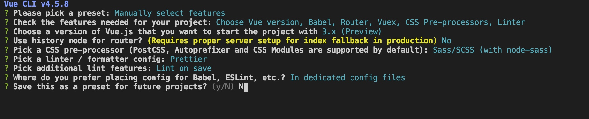

# happy anwser

## 项目初始化

```shell
  vue create happy-answer
```



## 项目准备工作

### 删除内容

1.删除掉Vue-CLI创建的views文件夹
2.删除掉components中的HelloWorld.vue文件
3.删除router文件夹index.js的2-19行代码
4.删除App.vue中的第2-6行代码
5.删除App.vue中的第14-25行代码

### 外部资源

**public放别人家js文件（也就是不会变动），assets放自己写的js文件（需要改动的文件）**
1.在public中添加data文件夹，在其中放置quesition.json
2.在public中添加css文件夹，在其中放置common.scss
3.在public中添加image文件夹，在其中放置项目用到的图片
4.在public中添加js文件夹，在其中放置rem.js

## 项目功能

### 显示首页

#### 创建组件

1.在components中创建Home文件夹,在该文件夹下创建index.vue

```vue
<template>
  <div class="home_container">
    <section>
      <!-- 头部标签 -->
      <header class="top_tips">
        <span class="num_tip">{{ level }}</span>
      </header>
      <!-- 首页内容 -->
      <div>
        <div class="home_logo item_container_style"></div>
        <router-link to="/item" class="start button_style"></router-link>
      </div>
    </section>
  </div>
</template>

<script>
import { mapState } from "vuex";
export default {
  computed: {
    ...mapState(["level"])
  }
};
</script>

<style lang="scss">
.top_tips {
  position: absolute;
  height: 7.35rem;
  width: 3.25rem;
  top: -1.3rem;
  right: 1.6rem;
  background: url("/images/WechatIMG2.png") no-repeat;
  background-size: 100% 100%;
  z-index: 10;
  .num_tip {
    position: absolute;
    left: 0.48rem;
    bottom: 1.1rem;
    height: 0.7rem;
    width: 2.5rem;
    font-size: 0.6rem;
    font-family: "黑体";
    font-weight: 600;
    color: #a57c50;
    text-align: center;
  }
}

.item_container_style {
  height: 11.625rem;
  width: 13.15rem;
  background-repeat: no-repeat;
  position: absolute;
  top: 4.1rem;
  left: 1rem;
}
.home_logo {
  background-image: url("/images/1-2.png");
  background-size: 13.142rem 100%;
  background-position: right center;
}

.button_style {
  display: block;
  height: 2.1rem;
  width: 4.35rem;
  background-size: 100% 100%;
  position: absolute;
  top: 16.5rem;
  left: 50%;
  margin-left: -2.4rem;
  background-repeat: no-repeat;
}
.start {
  background-image: url("/images/1-4.png");
}
</style>


```

#### 设置路由

2.在router文件夹index.js中引入Home组件

```js
import Home from "@/components/Home"
```

3.在router文件夹index.js中

```js
let routes = [{
  // 当用户进入页面加载Home组件
    {
    path: "/",
    component: Home
  }
}];
```

4.在src中的App.vue中

```html
<template>
  <router-view />
</template>
```

#### 请求数据

1.在store文件夹中index.js

```js
import { createStore } from "vuex";
import axios from "axios";
export default createStore({
  state() {
    return {
      // 活动周数
      level: "第一周"
    };
  },
});

```

### 显示题目

### 显示分数
