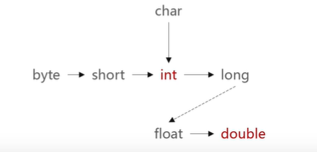

### 数据类型
#### 基本类型的存储

| 数据类型       | 大小/字节 | 封装类    | 默认值(零值)                    | 可表示数据范围                           |
| -------------- | --------- | --------- | ------------------------------- | ---------------------------------------- |
| byte(字节)     | 1-Byte    | Byte      | (byte)0                         | -128~127                                 |
| short(短整数)  | 2-Byte    | Short     | (short)0                        | -32768~32767                             |
| int(整数)      | 4-Byte    | Integer   | 0                               | -2147483648~2147483647                   |
| long(长整数)   | 8-Byte    | Long      | 0L                              | -9223372036854775808~9223372036854775807 |
| float(单精度)  | 4-Byte    | Float     | 0.0F                            | 1.4E-45~3.4028235E38                     |
| double(双精度) | 8-Byte    | Double    | 0.0D                            | 4.9E-324~1.7976931348623157E308          |
| char(字符)     | 4-Byte    | Character | '\u0000'（对应数字0，输出为空） | 0~65535                                  |
| boolean(布尔)  | 1-Byte    | Boolean   | flase                           | true或false                              |

## 数据类型转换

-   自动（隐式）类型转换
    -   小转大
-   强制（显式）类型转换
    -   大转小
    -   转换格式 : 小类型 变量名 = (小类型) 大类型数据;

-   数据类型从小到大

## 关于

[Java Web基础入门 ](https://www.cnblogs.com/woshimrf/p/java-web-springboot.html)

[哔哩哔哩大学](https://www.bilibili.com/video/BV1Wx411f7qN?p=21)