:::tip

Algorithm + Data Structures = Programs

  ( 算 法 +  数 据 结 构  = 程 序 ）

:::

## 什么是数据结构

- 数据结构(data structure)
  - 问题的数学模型，它反映数据及其之间关系。（存储结构和逻辑结构）
- 算  法
  - 处理问题的策略（是对数据运算的描述，是程序的逻辑抽象）
- 程  序
  - 为计算机处理问题而编制的一组指令集


数据结构分为三大类

一、线性表：

线性表是为了解决单线存储而出现的。

数组：就是最简单粗暴的存储方法。就是直接拉出一大块数据存在那里。数组的快速存取其实只是一个副作用，因为所有的数据都在一起，可以直接算出来数据的地址。

链表：则是为了解决可以无线增长的需求的。因为找不到一大块可以连续的存入数据，甚至也不知道程序可能使用的数据总量，所以就没办法划分一块数据来使用，划小了不够用，划大了浪费（这在早年是非常大的事情）。所以必须想办法解决问题。最后采用的方法就是从入口开始，**每一个数据块不仅仅有数据，还会有指向下一个数据块的线索，用来寻找下一个数据。**这就是链表。

所谓的双向链表，只是加了一个向前的线索的链表而已。不仅如此，队列，栈，都是线性表的特殊形态。进行了操作上的限制罢了。既可以是数组，也可以是链表。

二、树：

树是为了解决单一入口下的非线性关联性的数据存储或者排序这样的功能而来的。

最常见的应用是编程时候的map，就是利用了二叉树的可排序和可以快速插入并且保持序列完整的特性来构建键值数据对，来实现数据的插入增加以及快速查找的能力的。

还有做语法解析，文字处理等等很多场景也会用到树。这就不一一赘述了。当然在吃透线性表的基础上，再去理解树也并不难。因为在本质上，树相对于链表，就是**每个节点不止有一个后续节点但是只有一个前置节点。**

三 图：

图是数据结构里最难的一部分，但是很多学校并不作为重点，因为确实大部分人不会用到。

图的本质其实就是把线性表进一步扩展，**每个节点会有不止一个前置和后缀节点，而且前置和后缀的概念也不再明晰，变成了关联节点**。


作者：赛博铁犁
链接：https://www.zhihu.com/question/21318658/answer/154739001
来源：知乎

## 线性表

### 线性表的基本概念

所谓的线性表，就是将数据排成像一条长线一样的结构，数组，链表，栈，队列都 是线性表结构，线性表上的数据最多只有前后两个方向，下面以一幅图的形式来展现一下线性表结构


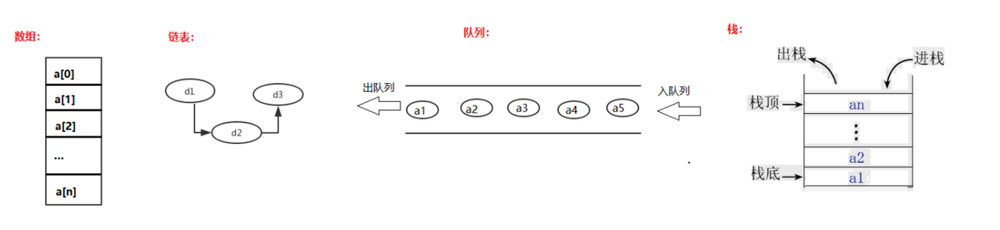


非线性数据结构：树、图等

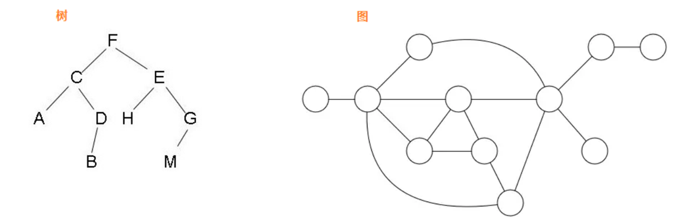


#### 线性表的特点

1. 它由n个同类型的元素组成；

2. 每个元素除第一个元素和最后一个元素之外,有且仅有一个前驱和一个后继；

3. 其长度可以动态的增长或减少

4. 可以对线性表中任何数据元素进行访问

5. 数据元素的插入和删除操作可以在线性表中的任何位置进行

6. 可以求线性表中指定元素的前驱和后继。

:::tip

前驱的话就是前面一个元素,后继就是后面一个元素

:::

#### 线性表存储结构

- 顺序存储结构：使用数组
  - 顺序存储结构表示的线性表称为顺序表
- 线性表的线性存储结构：物理空间上采用连续的区域存储
  
- 链式存储结构：链表
  - 链式存储结构表示的线性表称为链表，链表又分为单链表、双向链表、循环链表

### 线性表的基本操作

1. 线性表的置空操作：clear()

2. 线性表判空操作：isEmpty()

3. 求线性表元素的个数：length()、getSize()

4. 求线性表的容量：getCapacity()

5. 取元素操作：get(i)

6. 插入操作：insert(i,x)

7. 删除操作：remove(i)

8. 查找操作：indexOf(i)

9. 输出操作：toString()

```java

```

## 时间复杂度

- 抛开算法运行的软硬件环境，只考虑算法与问题规模之间的关系。

- 算法的时间复杂度反映了程序执行时间随输入规模增长而增长的量级，在很大程度上能很好反映出算法的优劣与否。

- 算法执行时间需通过依据该算法编制的程序在计算机上运行时所消耗的时间来度量。

- 一般使用O 表示时间复杂度，O(1)、O(n)、O(n^2)、O(n^3)、O(log2n)

```
T = 2*n + 2                          O(n)
T = 2000*n + 10000            		 O(n)
T = 1*n*n  + 0                       O(n^2)
T = 2*n*n + 300*n + 10     			 O(N^2)
```

### 分析动态数组的时间复杂度

```
addLast(e)		O(1)
add First(e)	O(n)
add (index, e)	O(n/2)=0(n)

removeLast(e)	O(1)
remove First(e)	O(n)
remove(index,e) O(n/2)=o(n)

set(index, e) O(1)

get(index)	O(1)
contains(e) O(n)
find(e)		O(n)
```

### 时间复杂度分析

- O(1)的时间复杂度只能代表算法的执行，不受任何变量的影响，他的复杂度是常量级别的

```java
public void show(){   
    sout("name");    
    sout("age");    
    sout("sex"); 
}
```

- O(n):算法的执行效率跟n的大小呈线性关系

```java
public  void  sum(int[]  arr1){ 
    int  sum  =  0;
	for(int  i=0;i<arr1.length;i++){ 
        sum  +=  arr1[i];
	}
	sout(sum);
}//O(n)

public  void  sum(int[]  arr1,int[]  arr2){ 
    int  sum  =  0;
	for(int  i=0;i<arr1.length;i++){ 
        sum  +=  arr1[i];
	}
	sout(sum);

	int  sum2  =  0;
	for(int  j=0;j<arr1.length;j++){ 
        sum  +=  arr1[j];
	}
	sout(sum);
```

- 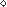O(n^2)：嵌套for循环

### 空间复杂度分析

- O(1)

```java
void  print(int  n)  { 
    int  i  =  0;
	int[]  a  =  {1,2,3,34,5,6,7};
	for  (i;  i  <n;  ++i)  { 
        a[i]  =  i  *  i;
	for  (i  =  n-1;  i  >=  0;  --i) 					System.out.println(a[i]);
}

```

- O(n)

```java
void  print(int  n)  { 
    int  i  =  0;
	int[]  a  =  new  int[n]; 
    for  (i;  i  <n;  ++i)  {
		a[i]  =  i  *  i;
	for  (i  =  n-1;  i  >=  0;  --i) 					System.out.println(a[i]);
}
```

- O(n^2)

```java
void  print(int  n)  { 
    int  i  =  0;
	int  z  =  0;
	int[]  a  =  new  int[n]; 
    for  (i;  i  <n;  ++i)  {
		for  (j  =  n-1;  j  >=  0;  --j){ 
       	 z = i * j; System.out.println(z);
		}
	}
}
```


## 图

### 图的基本概念

图中的每一个元素我们称之为顶点（Vertex），并且图中的一个顶点可以与其他任意顶点建立连接关系，我们把这种建立的关系叫做边(Edge)

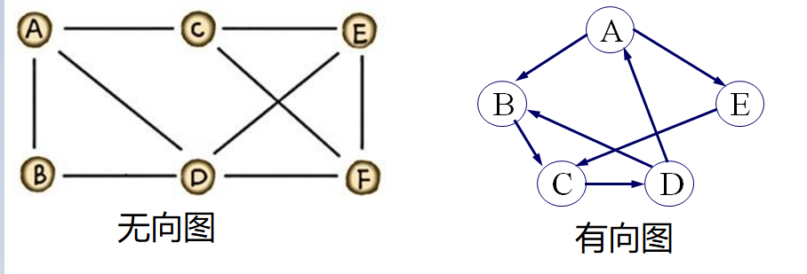

由顶点（Vertex）集和边( Edge）集组成，  

记为 *G*＝（*V*，*E*）,其中*V* 是有穷非空集合，称为顶点集，*v* ∈ *V* 称为顶点。*E* 是有穷集合，称为边集， *e*∈ *E* 称为边.

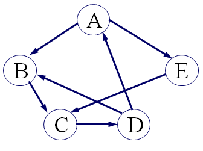

- 例如
  - G = (*V*, *E*)

- 其中
  - *V*={A, B, C, D, E}

  - *E*={<A,B>, <A,E>,<B,C>, <C,D>, <D,B>,<D,A>, <E,C> }


### 总结

#### 无向图

由无向边构成的图 

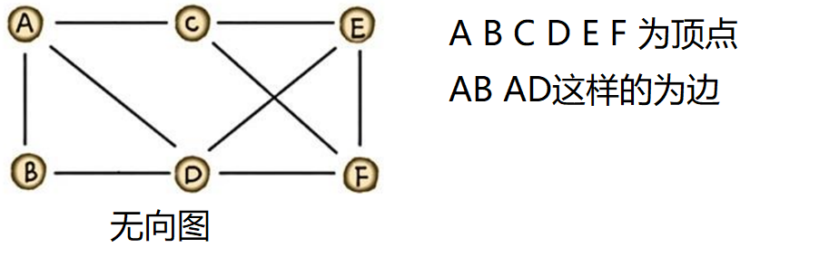

#### 有向图

由有向边构成的图 

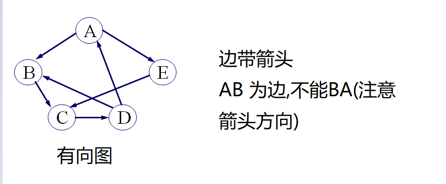

#### 权和网

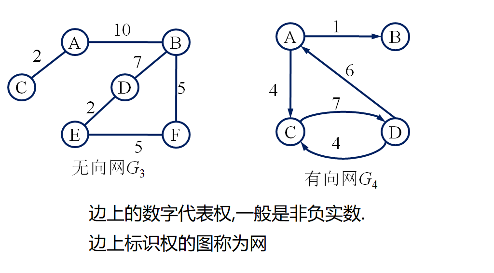

#### 完全图

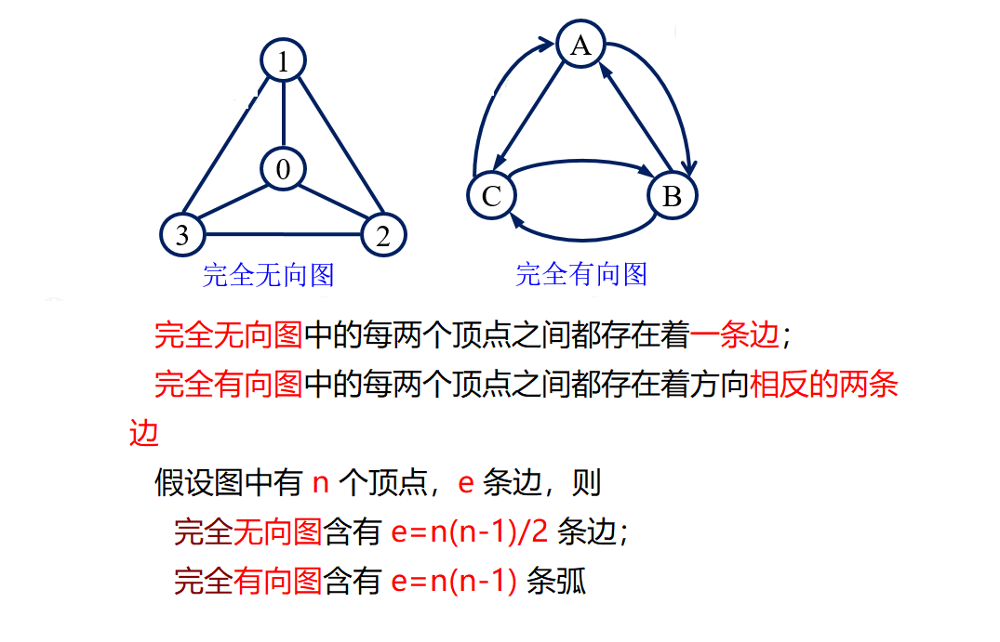

#### 稠密图

若边或弧的个数
$$
e< n log_2 10
$$
，则称作稀疏图，否则称作稠密图。

n：代表顶点数量

e：代表边的数量


#### 子图

子图（Subgraph）
设有两个图G＝(V,  E)和G’＝(V ’,  E ’) ，若 V ’是V 的子集，即V ’ ⊆ V ，并且E ’是E 的子集，即E ’ ⊆ E ，则称G’为G的子图，记为G’ ⊆ G 。
生成子图（Spanning Subgraph)
若G’为G的子图，并且V ’ ＝ V ，则称G’为G的生成子图，即包含原图中所有顶点的子图。

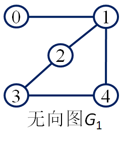

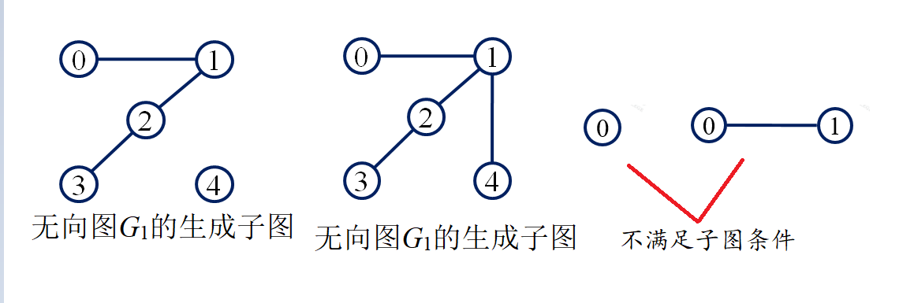

#### 邻接点(Adjacent)

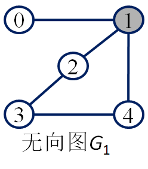

- 在一个无向图中，若存在一条边(*u*,*v*)，则称顶点*u*与*v*互为邻接点。边(*u*,*v*)是顶点*u*和*v*关联的边，顶点*u*和*v*是边(*u*,*v*)关联的顶点。
- 以顶点1为端点的3条边是(0,1),(1,2),(1,4),顶点1的3个邻接点分别为0,2,4；

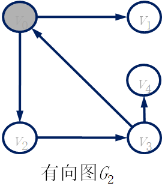

- 在一个有向图中,若存在一条弧< *u*,*v* >，则称顶点*u*邻接到*v*,顶点*v*邻接自*u*。弧< *u*,*v* >和顶点*u*、*v*关联。

- 顶点*v*0有2条出边<*v*0, *v*1>，< *v*0, *v*2>，1条入边< *v*3, *v*0 >,顶点*v*0邻接到*v*1和*v*2 ，顶点*v*0邻接自*v*3.

#### 顶点的度(Degree)

- 顶点的度是图中与该顶点相关联边的数目，记为*D*(*v*) 。

- 若一个图有*n*个顶点和*e*条边，则该图所有顶点的度之和与边数满足如下关系

- $$
  e = \frac{1}{2} \sum_{i=0}^{n-1} D(v_i)
  $$

  

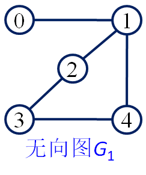

- 求顶点的度 
- e=5;n=5
  D(0)=1; 
  D(1)=3;
  D(2)=2; 
  D(3)=2; 
  D(4)=2;


$$
\frac {1}{2} \sum_{i=0}^{n-1} D(v_i) = \frac 12	(1+3+2+2+2)=5=e
$$
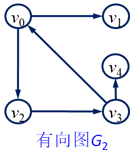


- 有向图顶点的度
  - 顶点v的入边数目是该顶点的入度(indegree)，记为*ID*(*v*)；
  - 顶点v的出边数目是该顶点的出度(outdegree)，记为*OD*(*v*)；
  - 顶点v的度等于它的入度和出度之和，即
  - *D*(*v*)=*ID*(*v*)+*OD*(*v*)


- 计算
- e=5 ; n=5
  ID(v0)=1; OD(v0)=2; =>D(v0)=3
  ID(v1)=1; OD(v1)=0; =>D(v1)=1
  ID(v2)=1; OD(v2)=1; =>D(v2)=2
  ID(v3)=1; OD(v3)=2; =>D(v3)=3
  ID(v4)=1; OD(v4)=0; =>D(v4)=1

$$
\frac {1}{2} \sum_{i=0}^{n-1} D(v_i) = \frac 12	(3+1+2+3+1)=5=e
$$

#### 路径(path)和回路

- 路径(Path)
  - 在一个图中，路径是从顶点u到顶点v所经过的顶点序列，即(u=vi0, vi1, …, vim=v)。
  - 路径长度是指该路径上边的数目。

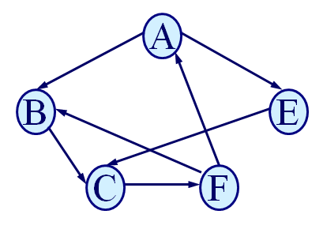

- 回路
  - 第一个顶点和最后一个顶点相同的路径称为回路或环


- 初等路径
  - 序列中顶点不重复出现的路径称为初等路径
- 初等回路
  - 除了第一个顶点和最后一个顶点之外，其余顶点不重复出现的回路

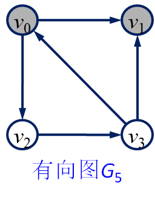

- 从顶点v0到顶点v1的一条路径 (v0, v2, v3, v1)是初等路径，其路径长度为3
- 从顶点v0到顶点v1的另一条路径(v0, v2, v3, v0, v1)，不是初等路径，其路径长度为4
- 路径(v0, v2, v3, v0)是初等回路其路径长度为3


#### 网中的路径长度

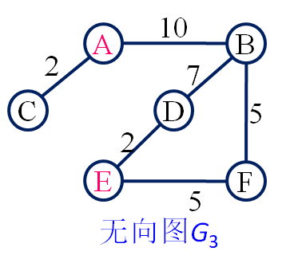

- 在网中，从始点到终点的路径上各边的权值之和，称为路径长度

- 从顶点A到顶点E的一条路径 ：( A,  B , D, E ) 
  路径长度为10+7+2=19

#### 连通图和连通分量

- 若无向图G中任意两个顶点之间都有路径相通，则称此图为**连通图**；

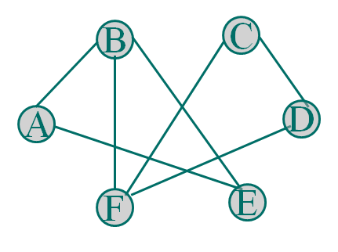

- 若无向图为非连通图，则图中各个极大连通子图称作此图的连通分量

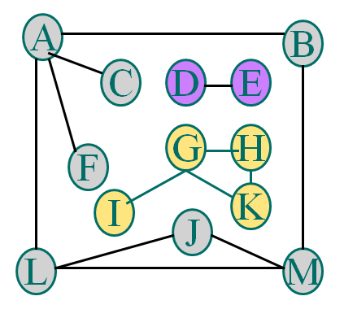

- 若有向图中任意两个顶点之间都存在一条有向路径，则称此有向图为**强连通图**
- 否则，其各个极大强连通子图称作它的**强连通分量**。

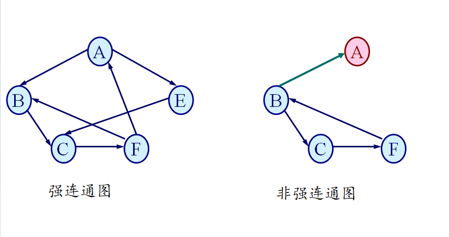

#### 生成树

- 假设一个连通图有 n 个顶点和 e 条边，其中 n-1 条边和 n 个顶点构成一个极小连通子图，称该极小连通子图为此连通图的生成树

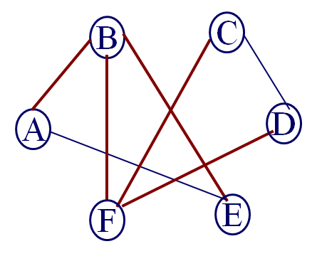