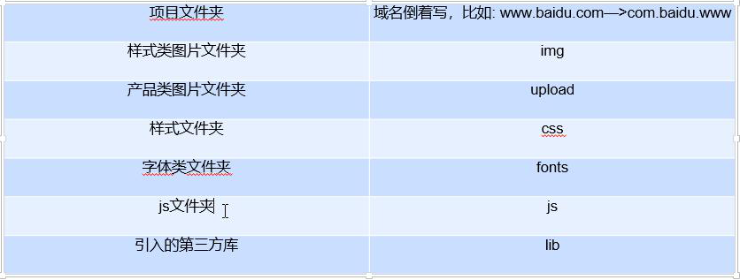
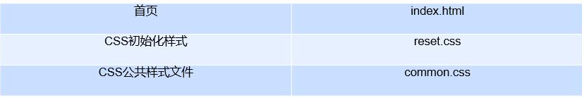

# 项目命名规范

# 项目名词

| 项目名词     | 解释                                                         |
| ------------ | ------------------------------------------------------------ |
| index.html   | 固定写法，只要是首页就写index.html                           |
| css文件夹    | 放的是css文件，必须是自己写的                                |
| lib文件夹    | 意思是library 库，只要是第三方库都放在这里无论是css库还是js库 |
| img文件夹    | 意思是image图片，是要是很长时间在网页中不变的图片都放在这里  |
| upload文件夹 | 意思是上传的图片，这里的图片一定是用户上传的。               |
| fonts文件夹  | 是放新字体的，还有字体图标库里的字体文库(ttf eot woff woff2 svg) |

# TDK搜索引擎优化

- title
- description 网址说明:简要说明网站是做什么的
  `<meta name="description" content="这里写网站是干什么的">`
- keywords 关键词:keywords是页面关键词，是搜索引擎的关注点之一。一般写6-8个关键词。
  `<meta name="keywords" content="关键词1,关键词2,..."`