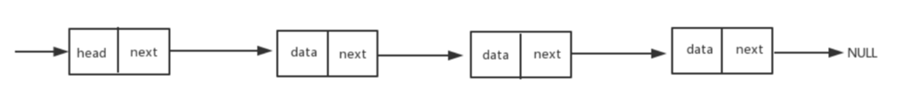
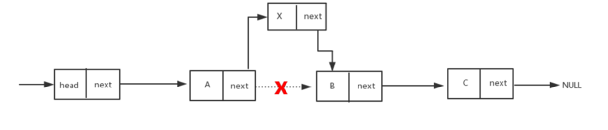
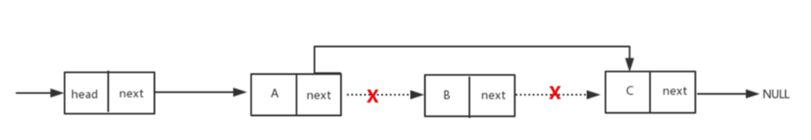

## 什么是链表?

链表是顺序存储数据,每一个节点里存到下一个节点的指针(Pointer).由于不必须按顺序存储，链表的插入和删除操作可以达到 O(1)的复杂度。

线性表的链式存储结构：物理空间上可以不采用连续的区域存储，通过指针的指向，连接前后元素。

## 单向链表




- 特点：

- 1 第一个节点叫做头结点，头结点用来记录链表的基地址,有了它，我们就可以遍历得到整条链表。

- 2 最后一个节点叫做尾节点，尾结点特殊的地方是：指针不是指向下一个结点，而是指向一个空地址 NULL，表示这是链表上最后一个结点。

新增元素



删除元素




一个简单的链表结构

```ts
// 链表数据结构 [1, 2, 3 ]
let linkedList = {
  value: 1,
  next: {
    value: 2,
    next: {
      value: 3,
      next: null
    }
  }
}
```

思考:

单向链表肯定有长度 size 还有头节点 head 所以我们先定义一个 class

```ts
class LinkedList {
  head: null;
  next: null;
  constructor() {
    this.head = null;
    this.next = null;
  }
}
```

然后我们需要链表里面元素的 class 元素包含 值和指向下一个节点

```ts
class Node<E> {
  value: E;
  next: null;
  constructor(value: E) {
    this.value = value;
    this.next = null;
  }
}
```


## 双向链表

